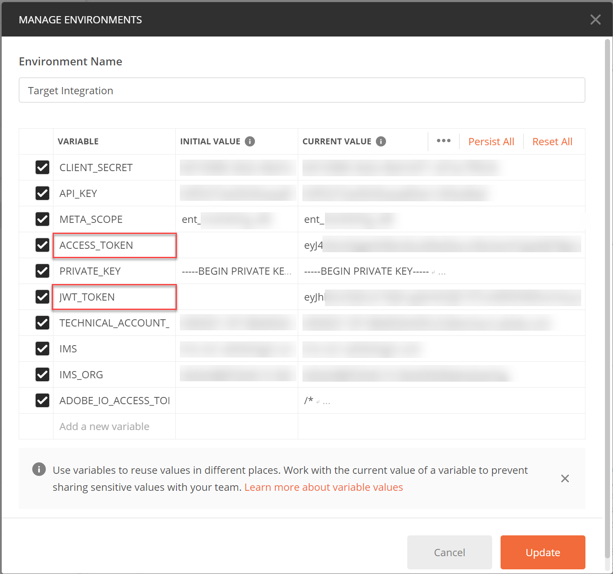
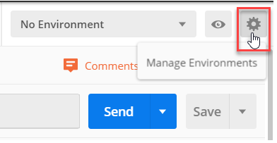

# Configure Authentication

The Adobe Target Admin APIs, including [!DNL Recommendations] Admin APIs, are secured by authentication to ensure only authorized users use them to access Adobe Target. Use the [Adobe Developer Console](https://console.adobe.io/) to manage this authentication for all Adobe Experience Cloud solutions, including [!DNL Target].

This lesson walks through the preliminary steps required to generate authentication tokens that will be needed to successfully interact with Adobe Target APIs. In the sections that follow, you will:

1. Create a project (previously called integration) in Adobe Developer Console.
2. Export Project Details and Generate a Bearer Access Token.
3. Test the bearer access token.

## Create an Adobe I/O Target project

In this section, you will access the Adobe Developer Console and create an project for [!DNL Adobe Target]. For more information on projects, reference the [documentation on projects](https://www.adobe.io/apis/experienceplatform/console/docs.html#!AdobeDocs/adobeio-console/master/projects.md).

<!--1. Generate your private key and public certificate, per the [documentation on authentication](https://www.adobe.io/authentication/auth-methods.html#!AdobeDocs/adobeio-auth/master/JWT/JWTCertificate.md). //<!--as described in **Step 1** of [How to set up Adobe IO: Authentication - Step by Step](https://helpx.adobe.com/marketing-cloud-core/kb/adobe-io-authentication-step-by-step.html). After completing Step 1, return to this tutorial and resume with Step 2, below. // The outcome of this step should be the creation of a `private.key` file and a `certificate_pub.crt` file. Return to this tutorial once you have generated these two files.-->

2. In the [Adobe Admin Console](https://adminconsole.adobe.com/), ensure your Adobe user account has been granted both [Product Admin](https://helpx.adobe.com/enterprise/using/admin-roles.html) and [Developer](https://helpx.adobe.com/enterprise/using/manage-developers.html) level access to [!DNL Target].

3. In the [Adobe Developer Console](https://console.adobe.io/), select the Experience Cloud Organization for which you want to create this integration. (Note it is likely you may only have access to a single Experience Cloud Organization.) 

   

4. Click **[!UICONTROL Create new project]**.

   

5. Click **[!UICONTROL Add API]** to add a REST API to your project to access Adobe services and products.

   

6. Select **[!DNL Adobe Target]** as the Adobe service you wish to integrate with. Click the **[!UICONTROL Next]** button that appears. 

   

7. Select either **[!UICONTROL Option 1: Generate a key pair]**, or **[!UICONTROL Option 2: Upload your public key]**. For this tutorial, we choose Option 1. Click to generate the key pair.
   
8. Note the results! As instructed, make sure to save the automatically downloaded configuration file, which contains your private key. You will need this private key, later. Click **[!UICONTROL Next]**.
   
<!-- 9.  Type a **name** and **description** for your project, add your **public key**, created earlier, and -->
9. Select the [product profile(s)](https://helpx.adobe.com/enterprise/using/manage-products-and-profiles.html) corresponding to the properties in which you are using [!DNL Recommendations]. (If you are not using properties, select the Default Workspace option.) Click **[!UICONTROL Save configured API]**.

   

10. Click **[!UICONTROL Create Integration]**. You should receive a message indicating your API was successfully configured.

11. As a final step, rename your project to a name more meaningful than the original `Project 1`. To do this, navigate to the project and access the **[!UICONROL Edit Project]** modal.

   

   >[!NOTE]
   > 
   >In this tutorial, we name our project "Target Integration." If you anticipate using your project for more than just Adobe Target, you may want to name it accordingly. For example, you might choose to name it "Adobe APIs" or "Experience Cloud APIs," since it may be used with other solutions in the Adobe Experience Cloud.

## Export Integration Details and Generate the Bearer Access Token

Now that you have an Adobe project you can use for accessing [!DNL Target], you will need to make sure to send details of that integration along with your Adobe API requests. These details are required in order to interact with several Adobe APIs, including several [!DNL Target] APIs. For example, the integration details include authorization and authentication information required by the [!DNL Target] Admin APIs. Therefore, to use the APIs with Postman, you will need to get the details of your Adobe integration into Postman.

There are many ways to specify the details of your integration in Postman, but in this section, we take advantage of some pre-built features and collections. First, you will export the details of your integration into a Postman environment. Next, you will generate a bearer access token to grant you access to the necessary Adobe resources.

>[!NOTE]
>
>For video instructions applicable for any Experience Cloud solution, including [!DNL Target], see [Use Postman with Experience Platform APIs](https://docs.adobe.com/content/help/en/platform-learn/tutorials/apis/postman.html). The following sections of [Use Postman with Experience Platform APIs](https://docs.adobe.com/content/help/en/platform-learn/tutorials/apis/postman.html) are relevant to the [!DNL Target] APIs:
>
> 1. Export Adobe I/O Integration Details to Postman
> 2. Generate an Access Token with Postman
>
> A summary of these steps is shown below.

1. Still in the [Adobe Developer Console](https://console.adobe.io/), navigate to view your new project's **[!UICONTROL Service Account (JWT)]** credentials.
   
2. Note you may view your **Public key(s)**, **Client ID**, and other information here.
   
3. Click to navigate to information about the **[!UICONTROL Adobe Target]** API.
   
4. Click **[!UICONTROL Download for Postman]** > **[!UICONTROL Service Account (JWT)]**  to create a JSON file capturing your authentication information for a Postman environment.
   
5. In Postman, click to import the JSON file (environment).
   
6. Choose your file.
   
7. In the Postman **Manage Environments** modal, click the name of the newly imported environment to inspect it. (Your environment name may be different from the one shown here. Edit the name as desired.)
   
8. Note `CLIENT_SECRET` and `API_KEY` (along with other variables) have their values pre-populated, taken from your integration as defined in the Adobe Developer Console. (The Postman `CLIENT_SECRET` variable should match the `CLIENT SECRET` Adobe credential as displayed in the Developer Console, and `API_KEY` in Postman should likewise match `CLIENT ID` in the Developer Console.) By contrast, note `PRIVATE_KEY`, `JWT_TOKEN`, and `ACCESS_TOKEN` are blank.
   
9.  Copy and paste your private key value, generated earlier in the tutorial, into the **INITIAL VALUE** and **CURRENT VALUE** fields.
   
10. Generate your access token using the **[!UICONTROL IMS: JWT Generate + Auth via User Token]** request in the Adobe I/O Access Token Generation Postman collection. (To do this, save the raw JSON for the [Adobe I/O Access Token Generation Postman collection](https://github.com/adobe/experience-platform-postman-samples/tree/master/apis/ims), then import it into Postman.) Click **Send** to generate the token.
   

   >[!NOTE]
   >
   >This bearer access token will be valid for 24 hours. Send the request again whenever you need to generate a new token.
11. Open the Manage Environments modal again, and select your environment.
   
12. Note the `ACCESS_TOKEN` and `JWT_TOKEN` values are now populated.
   

>[!NOTE]
>
>Q: Do I have to use the Adobe I/O Access Token Generation Postman collection to generate the JSON Web Token (JWT) and bearer access token?
>
>A: Nope! The Adobe I/O Access Token Generation Postman collection is available as a convenience to more easily generate the JWT and bearer access token in Postman. Alternatively, you can use capabilities within the Adobe Developer Console to manually generate the bearer access token.

## Test the bearer access token

In this exercise, you will use your new bearer access token by sending an API request that retrieves a list of activities from your [!DNL Target] account. A successful response indicates your Adobe project and authentication are operating as expected in order to use the API.

1. Import the [Adobe Target Admin APIs Postman Collection](https://developers.adobetarget.com/api/#admin-postman-collection). Note the **[!UICONTROL List activities]** request.
   
2. Note that variables such as `{{access_token}}` are initially unresolved. You could resolve this in several different ways—for example, you could define a new collection variable called `{{access_token}}`—but in this tutorial, you will instead change the API request to leverage the Postman environment you were previously using. This will enable the environment to continue to serve as a single, consistent consolidation of all variables common across Adobe APIs.
   
3. Type to replace `{{access_token}}` with `{{ACCESS_TOKEN}}`.
   
4. Type to replace `{{api_key}}` with `{{API_KEY}}`.
   
5. Type to replace `{{tenant}}` with `{{TENANT_ID}}`. Note `{{TENANT_ID}}` is not yet recognized.
   
6. Open the Manage Environments modal, and select your environment.
   
7. Type to add a new `{{TENANT_ID}}` environment variable. Copy and paste your Tenant ID value into the **INITIAL VALUE** and **CURRENT VALUE** fields for your new `TENANT_ID` environment variable.
   
      >[!NOTE]
   >
   >The Tenant ID is different from your [!DNL Target] `clientcode`. The Tenant ID exists in the URL when you are logged in to [!DNL Target]. To obtain your Tenant ID, log in to the [!DNL Adobe Experience Cloud], open [!DNL Target], and click the [!DNL Target] card. Use the Tenant ID value as noted in the URL subdomain.
   >
   >For example, if your URL when logged in to Adobe Target is
   >https://mycompany.experiencecloud.adobe.com/...
   >then your Tenant ID is "mycompany."

8. Send your request, after ensuring you have selected the correct environment. You should receive a response containing your list of activities.
   

Congratulations! Now that you have verified your Adobe authentication, you may use it to interact with Adobe Target APIs (as well as other Adobe APIs). For example, you can [Use Recommendations APIs](https://docs.adobe.com/content/help/en/target-learn/recommendations-api-tutorial/recs-api-overview.html) to create or manage recommendations.
