# Adobe Target Videos and Tutorials

## Implementation

<table>
<tr>
  <td><a href="https://docs.adobe.com/content/help/en/experience-cloud/implementing-in-websites-with-launch/implement-solutions/target.html">Implement Target with Launch, by Adobe</a></td>
  <td><a href="implementation/atjs2-single-page-application-technical-video-implement.md">Implement at.js 2.0 in a Single Page Application (SPA)</a></td>
  <td><a href="implementation/atjs20-diagram-technical-video-understand.md">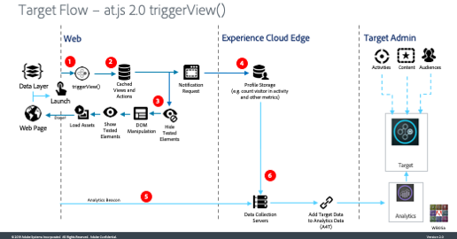How at.js 2.0 Works</a></td>
  <td><a href="implementation/mbox-parameters-in-dtm-technical-video-implement.md">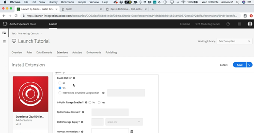Using Opt-in to Control Experience Cloud Solutions Based on User Consent</a></td>
</tr>
</table>

## Activities

<table>
<tr>
  <td><a href="activities/activity-types-feature-video-understand.md">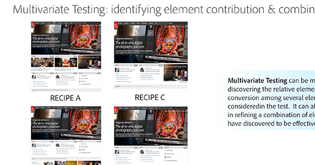Understand the Types of Activities in Adobe Target</a></td>
  <td><a href="activities/ab-tests-feature-video-setup.md">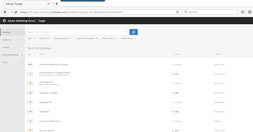Create A/B Tests</a></td>
  <td><a href="activities/experience-targeting-feature-video-use.md">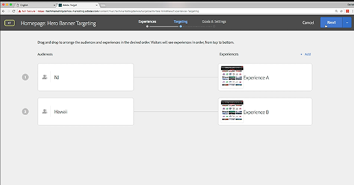Create Experience Targeting Activities</a></td>
  <td><a href="activities/multivariate-tests-feature-video-setup.md">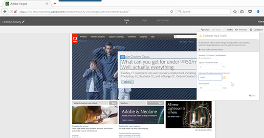Create Multivariate Tests</a></td>
</tr>
<tr>
  <td><a href="activities/activity-targeting-feature-video-use.md">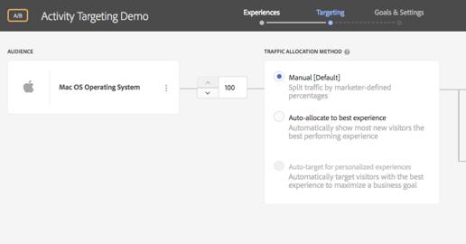</a><a href="activities/activity-targeting-feature-video-use.md">Use Activity Targeting</a> (02:13)</td>
  <td> <a href="activities/activity-settings-feature-video-use.md">Use Activity Settings in Adobe Target</a> (3:01)</td>
  <td><a href="activities/metrics-feature-video-use.md">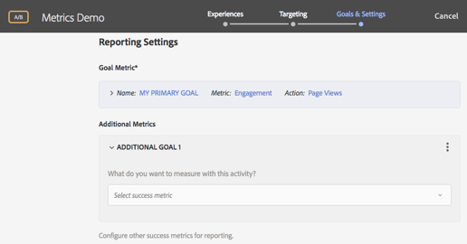Use Metrics in Activities</a></td>
  <td> </td>
</tr>
</table>

## Audiences

<table>
<tr>
  <td><a href="audiences/audiences-feature-video-use.md">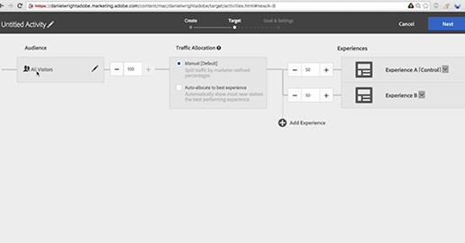Use Audiences</a></td>
  <td><a href="audiences/profile-scripts-feature-video-use.md">Create Profile Scripts</a></td>
  <td><a href="audiences/profile-comparison-feature-video-use.md">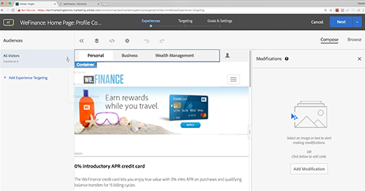Use Profile Comparison to Build Audiences</a></td>
  <td> </td>
</tr>
</table>

## Experiences and Offers

<table>
<tr>
  <td><a href="experiences/visual-experience-composer-feature-video-use.md">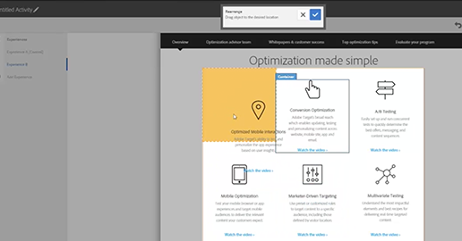Use the Visual Experience Composer</a></td>
  <td><a href="experiences/ab-tests-feature-video-setup.md">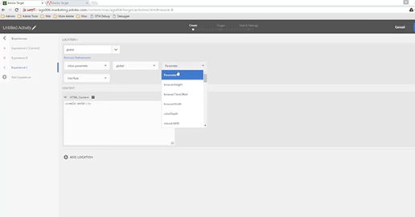Use the Form-Based Experience Composer</a></td>
  <td><a href="experiences/visual-experience-composer-for-single-page-applications-feature-video-use.md">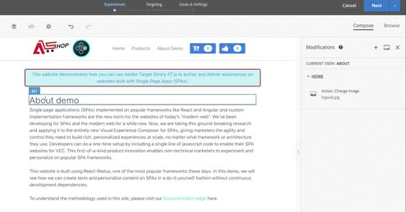Use the Visual Experience Composer for Single Page Apps</a></td>
  <td><a href="https://helpx.adobe.com/experience-manager/kt/sites/using/experience-fragment-target-offer-feature-video-use.html">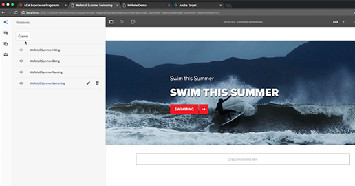Use AEM Experience Fragments in Adobe Target</a></td>
</tr>
</table>

## Reports

<table>
<tr>
  <td><a href="reports/personalization-insights-report-feature-video-use.md">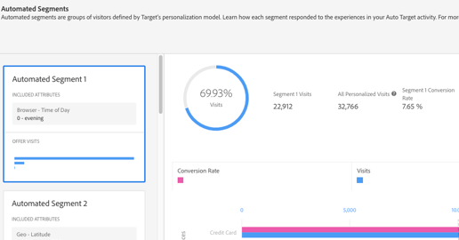Using the Personalization Insights Reports</a></td>
  <td> </td>
  <td> </td>
  <td> </td>
</tr>
</table>

## Integrations

<table>
<tr>
  <td><a href="integrations/a4t-analytics-as-a-datasource-for-target-feature-video-use.md">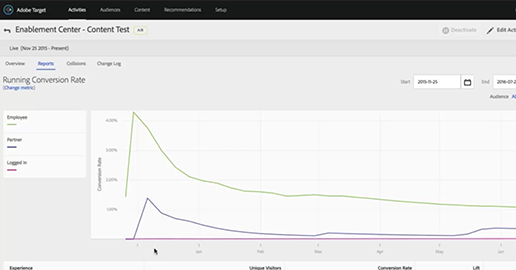Use Analytics as a Data Source for Target (A4T)</a></td>
  <td><a href="integrations/data-providers-atjs-feature-video-use.md">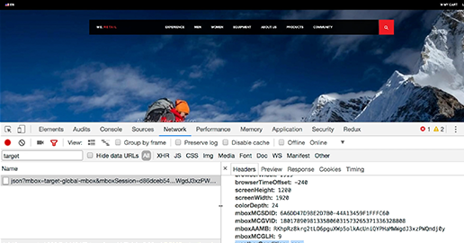Data In: Use Data Providers to integrate third-party data</a></td>
  <td><a href="integrations/data-providers-atjs-technical-video-implement.md">Data In: Implement Data Providers to integrate third-party data</a></td>
  <td><a href="integrations/response-tokens-atjs-custom-events-technical-video-use.md">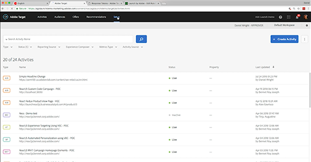Data Out: Use Response Tokens and at.js Custom Events</a></td>
</tr>
<tr>
  <td><a href="https://helpx.adobe.com/experience-manager/kt/sites/using/experience-fragment-target-offer-feature-video-use.html">Use AEM Experience Fragments in Adobe Target</a></td>
  <td> </td>
  <td> </td>
  <td> </td>
</tr>
</table>

## Administration

<table>
<tr>
  <td><a href="administration/account-preferences-feature-video-setup.md">Set up Account Preferences</a></td>
  <td><a href="administration/enterprise-user-permissions-feature-video-understand.md">Understand Enterprise User Permissions</a></td>
  <td><a href="administration/workspaces-feature-video-setup.md">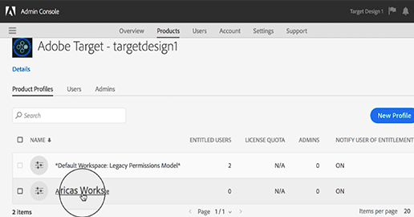Set up Workspaces</a></td>
  <td><a href="administration/properties-feature-video-setup.md">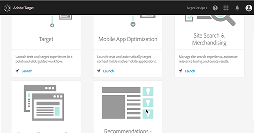Set up Properties</a></td>
</tr>
</table>

## Troubleshooting

<table>
<tr>
  <td><a href="troubleshooting/experience-cloud-debugger-target-feature-video-use.md">Troubleshoot Target with the Experience Cloud Debugger</a></td>
  <td> </td>
  <td> </td>
  <td> </td>
</tr>
</table>