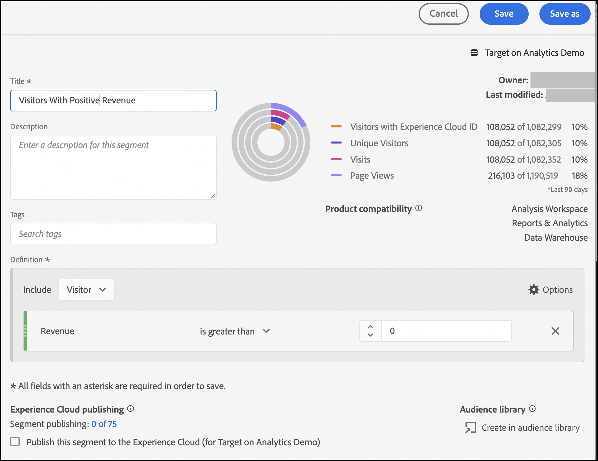

# Setting up A4T reports in Analysis Workspace for [!DNL Auto-Allocate] activities

An [!DNL Auto-Allocate] activity identifies a winner among two or more experiences and automatically reallocates more traffic to the winner while the test continues to run and learn. The Analytics for Target (A4T) integration for [!DNL Auto-Allocate] allows you to see your reporting data in Adobe Analytics, and you can even optimize for custom events or metrics defined in Adobe Analytics. 

While rich analysis capabilities are available in Adobe Analytics Analysis Workspace, a few modifications to the default **[!UICONTROL Analytics for Target]** panel are required to correctly interpret [!DNL Auto-Allocate] activities, due to the nuances in [optimization criteria](https://experienceleague.adobe.com/docs/target/using/integrate/a4t/a4t-at-aa.html?lang=en#supported). 

This tutorial walks through the recommended modifications for analyzing [!DNL Auto-Allocate] activities in Workspace. The key concepts are: 

* Visitors should always be used as the normalizing metric in [!DNL Auto-Allocate] activities.
* When the metric is an Adobe Analytics Metric, the appropriate numerator for the conversion rate depends on the type of optimization criteria chosen during activity setup.
  * The "maximize unique visitor conversion rate" optimization criterion has a conversion rate whose numerator is a count of the unique visitors with a positive value of the metric. 
  * The "maximize metric value per visitor* has a conversion rate whose numerator is the regular metric value in Adobe Analytics. This is provided by default in the **[!UICONTROL Analytics for Target]** panel in Workspace.
* When your optimization metric is a Target defined conversion metric, the default **[!UICONTROL Analytics for Target]** panel in Workspace handles configuring your panel. 
* The Confidence numbers seen in Workspace do not reflect the [more conservative statistics used by Auto-Allocate](https://experienceleague.adobe.com/docs/target/using/activities/auto-allocate/automated-traffic-allocation.html?lang=en#section_98388996F0584E15BF3A99C57EEB7629), and so should be removed. 

## Create the A4T for [!DNL Auto-Allocate] panel in Workspace

To create an A4T for [!DNL Auto-Allocate] report start with the **[!UICONTROL Analytics for Target]** panel in Workspace, as shown below. Then make the following selections:

1. **[!UICONTROL Control Experience]**: You may choose any experience
2. **[!UICONTROL Normalizing Metric]**: Select Visitors - Auto-Allocate always normalizes conversion rates by unique visitors.
3. **[!UICONTROL Success Metrics]**: Select the same metric that you used during activity creation - if this was a Target defined Conversion metric, select **Activity Conversion**. Otherwise, select the Adobe Analytics metric that you used.

*Figure 1: Analytics for Target  panel setup for [!DNL Auto-Allocate] activities.*

>[!NOTE]
>
> You may also arrive at a pre-built **[!UICONTROL Analytics for Target]** panel if you click the link from the report screen in Adobe Target.

## Target Conversion Metrics or Analytics metrics with "Maximize Metric Value Per Visitor" optimization criteria

The default A4T panel handles [!DNL Auto-Allocate] activities where the goal metric is either a Target Conversion, or an Analytics metric with optimization criterion "Maximize Metric Value Per Visitor." 

One example of this panel is shown for the Revenue metric, where "Maximize Metric Value Per Visitor" was selected as the optimization criteria at activity creation time. As previously mentioned, [!DNL Auto-Allocate] uses more conservative confidence calculations compared to the ones used by the **[!UICONTROL Analytics for Target]** panel. It is therefore recommended that you remove the confidence metric, as well as the related lower and upper lift metrics.  

*Figure 2: The recommended report for [!DNL Auto-Allocate] activities with an Analytics metric Maximize Metric Value Per Visitor optimization criteria. For these types of metrics, as well as Target defined conversion metrics, the default  **[!UICONTROL Analytics for Target]** panel in workspace can be used.* 

## Analytics metrics with "Maximize Unique Visitor Conversion Rate" optimization criteria

When an Adobe Analytics metric is used with an optimization criterion of *Maximize Unique Visitor Conversion Rate*, the default **[!UICONTROL Analytics for Target]** panel in workspace must be modified. 

The success metric is now a count of unique visitors for whom the conversion metric was positive. This can be achieved by creating a segment that filters to hits with a positive value of the metric. Create this segment as follows:

1. Select the **Components** > **Create Segment** option in the Workspace toolbar.
1. Drag the metric used at activity creation time from the left hand panel to the **Definition** box of the segment.
1. Select values of the metric that are **greater than** a numeric value of 0. 
1. From the **Include** dropdown, select **Visitors**
1. Give your segment an appropriate name

An example of the segment creation is shown in the figure below, where we select vistors for whom the Revenue is positive. 

*Figure 3: Segment creation for Adobe Analytics metrics with optimization criteria equal to Maximize Unique Visitor Conversion Rate. In this example, the metric is Revenue, and the optimization goal is to maximize the number of visitors with positive revenue.*

Once the appropriate segment has been created, the default  **[!UICONTROL Analytics for Target]** panel in workspace can be modified. 

1. Add a second **Unique Visitors** metric alongside the existing visitors metric column
2. Drag the just-created segment under the first column, to produce a panel that resembles Figure 4. Notice the difference - the number of unique visitors with positive revenue is a fraction of the total number of unique visitors assigned to each experience.

*Figure 4: Filtering Unique Visitors by the newly created segment*
3. A conversion rate can be [quickly calculated](https://experienceleague.adobe.com/docs/analytics-learn/tutorials/components/calculated-metrics/quick-calculated-metrics-in-analysis-workspace.html?lang=en) by higlighting both the first and second columns, right clicking, selecting **Create Metric from selection** > **Divide**. The default conversion rate should be removed, and replaced with this new calculated metric, as shown in the image below. You may have to edit the newly created calculated metric to display as a **Format** > **Percent** up to two decimal places as shown. 

*Figure 4: The final Auto-Allocate panel showing the conversion rates for a binarized revenue conversion metric*

## Conclusion

The steps above have demonstrated how to correctly configure [!DNL Workspace] to display Auto-Allocate reporting data. To summarize:

* When the metric is a Target defined conversion metric, or an Adobe Analytics Metric with optimization criterion *Maximize Metric Value Per Visitor*, the default workspace panel configured with visitors as a normalizing metric should be used.
* When the metric is an Adobe Analytics metric with optimization criterion "Maximize Unique Visitor Conversion Rate", you must use a conversion rate that is defined as the fraction of visitors for whom the metric is positive. This is done by creating a corresponding segment, that filters the unique visitor metric.
