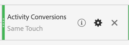
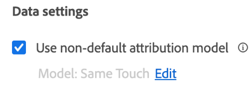
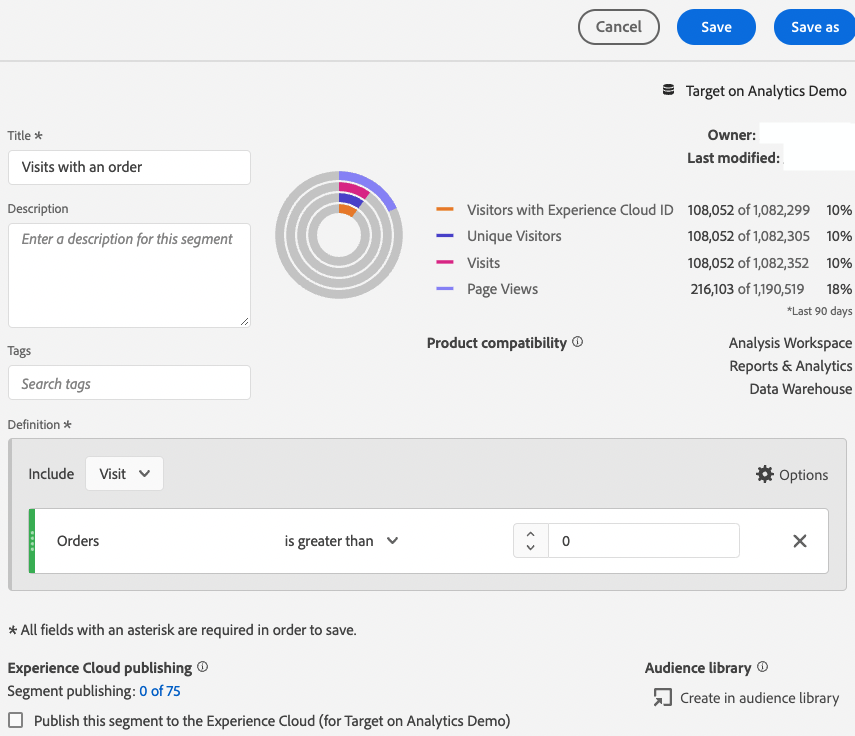

# Setting up A4T reports in [!DNL Analysis Workspace] for [!DNL Auto-Target] activities

>[!NOTE]
>
>This functionality is currently in Beta and will be available to all [Target Premium](https://experienceleague.adobe.com/docs/target/using/introduction/intro.html?lang=en#premium){target=_blank} customers in an upcoming release.

>[!IMPORTANT]
>
>For [!UICONTROL Auto-Target] activities, you must check the reporting in [!DNL Analytics Workspace] and manually create an A4T panel.

The [!UICONTROL Analytics for Target] (A4T) integration for [!DNL Auto-Target] activities uses the [!DNL Adobe Target] ensemble machine learning (ML) algorithms to choose the best experience for each visitor based on their profile, behavior, and context, all while using an [!DNL Adobe Analytics] goal metric.

Although rich analysis capabilities are available in [!DNL Adobe Analytics] [!DNL Analysis Workspace], a few modifications to the default **[!UICONTROL Analytics for Target]** panel are required to correctly interpret [!DNL Auto-Target] activities, due to differences between experimentation activities (manual [!UICONTROL A/B Test] and [!UICONTROL Auto-Allocate]) and personalization activities ([!UICONTROL [!UICONTROL Auto-Target]]).

This tutorial walks through the recommended modifications for analyzing [!UICONTROL Auto-Target] activities in [!DNL Analysis Workspace], which are based on the following key concepts:

* The **[!UICONTROL Control vs Targeted]** dimension can be used to distinguish between [!UICONTROL Control] experiences versus those served by the [!UICONTROL Auto-Target] ensemble ML algorithm.
* Visits should be used as the normalizing metric when viewing experience-level breakdowns of performance. In addition, [Adobe Analytics' default counting methodology might include visits where the user does not actually see activity content](https://experienceleague.adobe.com/docs/target/using/integrate/a4t/a4t-faq/a4t-faq-viewing-reports.html?lang=en#metrics), but this default behavior can be modified by using an appropriately scoped segment (details below).
* Visit-lookback scoped attribution, also known as the "visit lookback window" on the prescribed attribution model, is used by the [!DNL Adobe Target] ML models during their training phases, and the same (non-default) attribution model should be used when breaking down the goal metric.  

## Create the A4T for [!UICONTROL Auto-Target] panel in [!DNL Analysis Workspace]

To create an A4T for [!UICONTROL Auto-Target] report, either start with the **[!UICONTROL Analytics for Target]** panel in [!DNL Analysis Workspace], as shown below, or begin with a freeform table. Then make the following selections:

1. **[!UICONTROL Control Experience]**: You can choose any experience; however, you will override this choice later. Note that for [!UICONTROL Auto-Target] activities, the control experience is really a control strategy, which is either to a) Randomly serve among all experiences, or b) Serve a single experience (this choice is made at activity creation time in [!DNL Adobe Target]). Even if you opted for choice (b), your [!UICONTROL Auto-Target] activity designated a specific experience as the control. You should still follow the approach outlined in this tutorial for analyzing A4T for [!UICONTROL Auto-Target] activities.
2. **[!UICONTROL Normalizing Metric]**: Select [!UICONTROL Visits].
3. **[!UICONTROL Success Metrics]**: Although you can select any metrics on which to report, you should generally view reports on the same metric that was chosen for optimization during activity creation in [!DNL Target].

   ![[!UICONTROL Analytics for Target] panel setup for [!UICONTROL Auto-Target] activities.](integrations/assets/Figure1.png)

   *Figure 1: [!UICONTROL Analytics for Target] panel setup for [!UICONTROL Auto-Target] activities.*

>[!TIP]
>
>To set up your [!UICONTROL Analytics for Target] panel for [!UICONTROL Auto-Target] activities, choose any control experience, choose [!UICONTROL Visits] as the normalizing metric, and choose the same goal metric that was chosen for optimization during [!DNL Target] activity creation.

## Use the [!UICONTROL Control vs.Targeted] dimension to compare the [!DNL Target] ensemble ML model to your control

The default A4T panel is designed for classic (manual) [!UICONTROL A/B Test] or [!UICONTROL Auto-Allocate] activities where the goal is to compare the performance of individual experiences against the control experience. In [!UICONTROL Auto-Target] activities, however, the first order comparison should be between the control *strategy* and the targeted *strategy*. In other words, determining the lift of the overall performance of the [!UICONTROL Auto-Target] ensemble ML model over the control strategy). 

To perform this comparison, use the **[!UICONTROL Control vs Targeted (Analytics for Target)]** dimension. Drag and drop to replace the **[!UICONTROL Target Experiences]** dimension in the default A4T report.

Note this replacement invalidates the default [!UICONTROL Lift and Confidence] calculations on the A4T panel. To avoid confusion, you can remove these metrics from the default panel, leaving the following report:

![[!UICONTROL Experiences by Activity Conversions] panel in [!DNL Analysis Workspace]](assets/Figure2.png)

*Figure 2: The recommended baseline report for [!DNL Auto-Target] activities. This report has been configured to compare targeted traffic (served by the ensemble ML model) against your control traffic.*

>[!NOTE]
>
>Currently, [!UICONTROL Lift and Confidence] numbers are not available for [!UICONTROL Control vs Targeted] dimensions for A4T reports for [!UICONTROL Auto-Target]. Until support is added, [!UICONTROL Lift and Confidence] can be computed manually by downloading the [confidence calculator](https://experienceleague.adobe.com/docs/target/assets/complete_confidence_calculator.xlsx?lang=en).

## Add experience-level breakdowns of metrics

To gain further insight into how the ensemble ML model is performing, you can examine experience-level breakdowns of the **[!UICONTROL Control vs Targeted]** dimension. In [!DNL Analysis Workspace], drag the **[!UICONTROL Target Experiences]** dimension onto your report, then break down each of the control and targeted dimensions separately. 

![[!UICONTROL Experiences by Activity Conversions] panel in [!DNL Analysis Workspace]](assets/Figure3.png)

*Figure 3: Breaking down the Targeted dimension by Target Experiences*

An example of the resulting report is shown here.

![[!UICONTROL Experiences by Activity Conversions] panel in [!DNL Analysis Workspace]](assets/Figure4.png)

*Figure 4: A standard [!UICONTROL Auto-Target] report with experience-level breakdowns. Note that your goal metric might be different, and your control strategy might have a single experience.*

>[!TIP]
>
>In [!DNL Analysis Workspace], click the gear icon to hide the percentages in the [!UICONTROL Conversion Rate] column to help keep the focus on the experience conversion rates. The conversion rates will then be formatted as decimals, but interpret them as percentages accordingly.

## Why "[!UICONTROL Visits]" is the correct normalizing metric for [!UICONTROL Auto-Target] activities

When analyzing an [!UICONTROL Auto-Target] activity, always choose [!UICONTROL Visits] as the default normalizing metric. [!UICONTROL Auto-Target] personalization selects an experience for a visitor once per visit (formally, once per [!DNL Target] session), which means that the experience shown to a visitor can change on every single visit. Thus, if you use [!UICONTROL Unique Visitors] as the normalizing metric, the fact that a single user might end up seeing multiple experiences (across different visits) would lead to confusing conversion rates. 

A simple example demonstrates this point: consider a scenario in which two visitors enter a campaign that has only two experiences. The first visitor visits twice. They are assigned to Experience A on the first visit, but Experience B on the second visit (due to their profile state changing on that second visit). After the second visit, the visitor converts by placing an order. The conversion is attributed to the most recently shown experience (Experience B). The second visitor also visits twice, and is shown Experience B both times, but never converts. 

Let us compare visitor-level and visit-level reports:

|Experience|Unique Visitors|Visits|Conversions|Visitor-normalized Conversion Rate|Visit-normalized Conversion Rate|
| --- | --- | --- | --- | --- | --- |
|A|1|1|-|0%|0%|
|B|2|3|1|50%|33.3%|
|Totals|2|4|1|50%|25%|

*Table 1: Example comparing visitor-normalized and visit-normalized reports for a scenario in which decisions are sticky to a visit (and not visitor, as with regular A/B testing). Visitor-normalized metrics are confusing in this scenario.*

As shown in the table, there is a clear incongruence of visitor-level numbers. Despite the fact there are two total unique visitors, this is not a sum of individual unique visitors to each experience. Although the visitor-level conversion rate is not necessarily wrong, when one compares individual experiences, visit-level conversion rates arguably make much more sense. Formally, the unit of analysis ("visits") is the same as the unit of decision stickiness, which means that experience-level breakdowns of metrics can be added and compared. 

## Filter for actual visits to the activity

The [!DNL Adobe Analytics] default counting methodology for visits to a [!DNL Target] activity might include visits in which the user did not interact with the [!DNL Target] activity. This is due to the way [!DNL Target] activity assignments are persisted in the [!DNL Analytics] visitor context. As a result, the number of visits to the [!DNL Target] activity can sometimes be inflated, resulting in a depression of conversion rates. 

If you would prefer to report on visits in which the user actually interacted with the [!UICONTROL Auto-Target] activity (either through entry to the activity, a display or visit event, or a conversion), you can:

1. Create a specific segment that includes hits from the [!DNL Target] activity in question, and then
1. Filter the [!UICONTROL Visits] metric using this segment. 

**To create the segment:**

1. Select the **[!UICONTROL Components > Create Segment]** option in the [!DNL Analysis Workspace] toolbar.
2. Specify a **[!UICONTROL Title]** for your segment. In the example shown below, the segment is named [!DNL "Hit with specific Auto-Target activity"].
3. Drag the **[!UICONTROL Target Activities]** dimension to the segment **[!UICONTROL Definition]** section.
4. Use the **[!UICONTROL equals]** operator.
5. Search for your specific [!DNL Target] activity.
6. Click the gear icon, then select **[!UICONTROL Attribution model > Instance]** as shown in the figure below.
7. Click **[!UICONTROL Save]**.

![Segment in [!DNL Analysis Workspace]](assets/Figure5.png)

*Figure 5: Use a segment such as the one shown here to filter the [!UICONTROL Visits] metric in your A4T for [!UICONTROL Auto-Target] report*

Once the segment has been created, use it to filter the [!UICONTROL Visits] metric, so the [!UICONTROL Visits] metric includes only visits where the user interacted with the [!DNL Target] activity.  

**To filter [!UICONTROL Visits] using this segment:**

1. Drag the newly created segment from the components toolbar, and hover over the base of the **[!UICONTROL Visits]** metric label until a blue **[!UICONTROL Filter by]** prompt appears.
2. Release the segment. The filter is applied to that metric.

The final panel appears as follows:

![[!UICONTROL Experiences by Activity Conversions] panel in [!DNL Analysis Workspace]](assets/Figure6.png)

*Figure 6: Reporting panel with the "Hit with specific Auto-Target Activity" segment applied to the [!UICONTROL Visits] metric. This segment ensures that only visits in which a user actually interacted with the [!DNL Target] activity in question are included in the report.*

## Align the attribution between ML model training and goal metric generation

The A4T integration allows the [!UICONTROL Auto-Target] ML model to be *trained* using the same conversion event data that [!DNL Adobe Analytics] uses to *generate performance reports*. However, there are certain assumptions that must be employed in interpreting this data when training the ML models, which differ from the default assumptions made during the reporting phase in [!DNL Adobe Analytics].

Specifically, the [!DNL Adobe Target] ML models use a visit-scoped attribution model. That is, the ML models assume a conversion must happen in the same visit as a display of content for the activity in order for the conversion to be "attributed" to the decision made by the ML model. This is required for [!DNL Target] to guarantee timely training of its models; [!DNL Target] cannot wait for up to 30 days for a conversion (the default attribution window for reports in [!DNL Adobe Analytics]) before including it in the training data for its models. 

Thus, the difference between the attribution used by the [!DNL Target] models (during training) versus the default attribution used in querying data (during report generation) might lead to discrepancies. It might even appear that the ML models are performing poorly, when in fact the issue lies with attribution.

>[!TIP]
>
>If the ML models are optimizing for a metric that is attributed differently from that of the metrics you are viewing in a report, the models might not perform as expected. To avoid this situation, ensure that the goal metrics on your report use the same attribution used by the [!DNL Target] ML models.

To view goal metrics that have the same attribution methodology used by the [!DNL Target] ML models, follow these steps:

  1. Hover over the goal metric's gear icon:

     

  1. From the resulting menu, scroll to **[!UICONTROL Data settings]**.
  1. Select **[!UICONTROL Use non-default  attribution model]** (if not already selected).

     

  1. Click **[!UICONTROL Edit]**.
  1. Select **[!UICONTROL Model]**: **[!UICONTROL Participation]**, and **[!UICONTROL Lookback window]**: **[!UICONTROL Visit]**.

     

  1. Click **[!UICONTROL Apply]**.
 
These steps ensure that your report attribute the goal metric to the display of the experience, if the goal metric event happened *any time* ("participation") in the same visit that an experience was shown. 

## Final Step: Create a conversion rate that captures the magic above

With the modifications to the [!UICONTROL Visit] and goal metrics in preceding sections, the final modification you should make to your default A4T for [!UICONTROL Auto-Target] reporting panel is to create conversion rates that are the correct ratio (that of a goal metric with the right attribution), to an appropriately filtered [!UICONTROL Visits] metric. 

Do this by creating a [!UICONTROL Calculated Metric] using the following steps:

1. Select the **[!UICONTROL Components > Create Metric]** option in the [!DNL Analysis Workspace] toolbar. 
1. Specify a **[!UICONTROL Title]** for your metric. For example, "Visit-corrected Conversion Rate for Activity XXX."
1. Select **[!UICONTROL Format]** = Percent and **[!UICONTROL Decimal Places]** = 2.
1. Drag the relevant goal metric for your activity (for example, [!UICONTROL Activity Conversions]) into the definition, and use the gear icon on this goal metric to adjust the attribution model to (Participation|Visit), as described earlier.
1. Select **[!UICONTROL Add > Container]** from the upper right of the **[!UICONTROL Definition]** section.
1. Select the division (&#247;) operator between the two containers.
1. Drag your previously created segment—named "Hit with specific [!UICONTROL Auto-Target] activity" in this tutorial for this specific [!DNL Auto-Target] activity.
1. Drag the **[!UICONTROL Visits]** metric into the segment container.
1. Click **[!UICONTROL Save]**.

The complete calculated metric definition is shown here.

*Figure 7: The visit-corrected and attribution-corrected model conversion rate metric definition. (Note this metric is dependent on your goal metric and activity. In other words, this metric definition is not re-usable across activities.)*

>[!IMPORTANT]
>
>The [!UICONTROL Conversion] rate metric from the A4T panel is not linked to the conversion event or the normalizing metric in the table. When you make the modifications suggested in this tutorial, the [!UICONTROL Conversion] rate does not automatically adapt to the changes. Therefore, if you make the modification to the conversion event attribution or the normalizing metric (or both), you must remember as a final step to also modify the [!UICONTROL Conversion] rate, as shown above.

## Summary: Final sample [!DNL Analysis Workspace] panel for [!UICONTROL Auto-Target] reports

Combining all of the steps above into a single panel, the figure below shows a complete view of the recommended report for [!UICONTROL Auto-Target] A4T activities. This report is the same as that used by the [!DNL Target] ML models to optimize your goal metric. The report incorporates all the nuances and recommendations discussed in this tutorial. This report is also closest to the counting methodologies used in traditional [!DNL Target]-reporting driven [!UICONTROL Auto-Target] activities.

![Final A4T report in [!DNL Analysis Workspace]](integrations/assets/Figure8.png "A4T report in Analysis Workspace"){width="600" zoomable="yes"}

*Figure 8: The final A4T [!UICONTROL Auto-Target] report in [!DNL Adobe Analytics] [!DNL Workspace], which combines all the adjustments to metric definitions described in the previous sections of this tutorial.*
