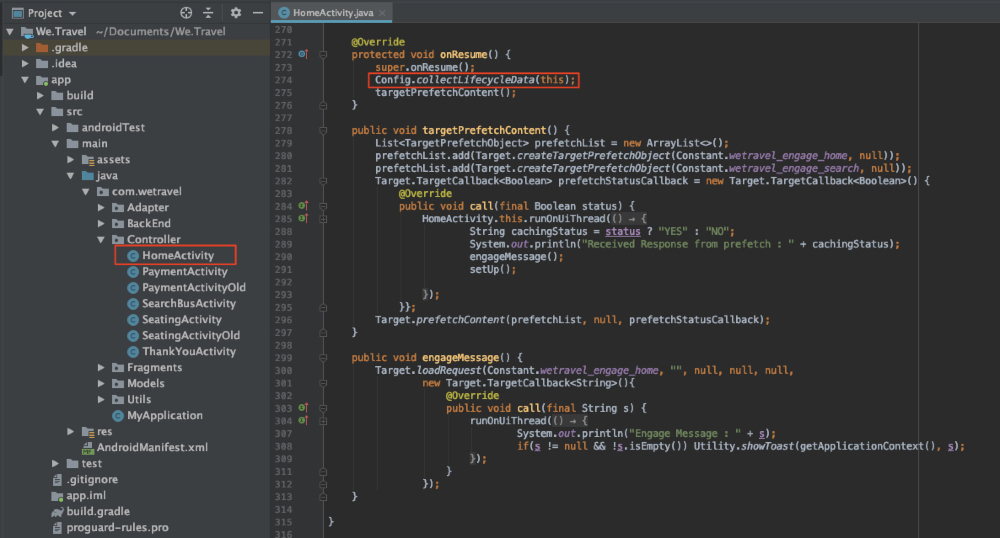
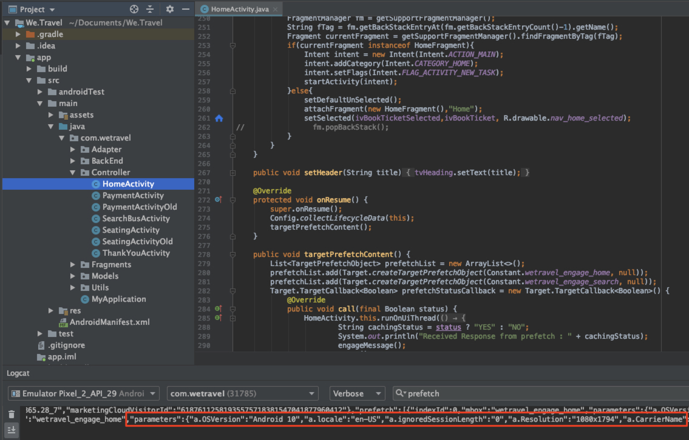
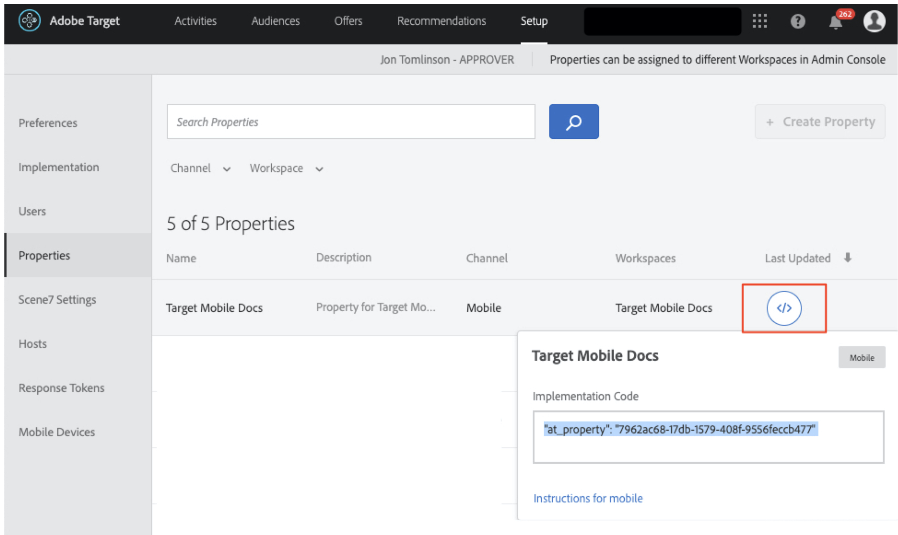
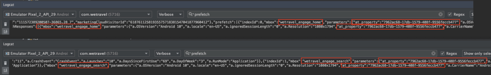
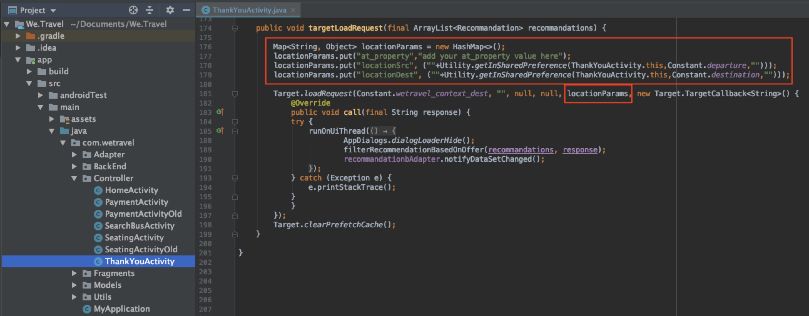
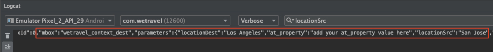

# Add Parameters to the Requests

In this lesson we will add Adobe lifecycle metrics and custom parameters to the Target requests added in the previous lesson. These metrics and parameters will be used for creating personalized audiences later in the tutorial.

## Learning Objectives

At the end of this lesson, you will be able to:

* Add the Adobe mobile lifecycle metrics
* Add parameters to a prefetch request
* Add parameters to a live location
* Validate the parameters for both requests

## Add the Lifecycle Parameters

Let's enable the [Adobe mobile lifecycle metrics](https://docs.adobe.com/content/help/en/mobile-services/android/metrics.html). This will add parameters to location requests containing rich information about the user's device and engagement with the app. We'll build audiences in the next lesson using data that the lifecycle request provides.

To enable lifecycle metrics, open the HomeActivity controller again and add `Config.collectLifecycleData(this);` to the onResume() function:



### Validate the Lifecycle Parameters for the Prefetch Request

Run the Emulator and use Logcat to validate the lifecycle parameters. Filter for "prefetch" to find the prefetch response and look for the new parameters:


Even though we've only added `Config.collectLifecycleData()` to the HomeActivity controller, you should see the lifecycle metrics sent with the Target request on your ThankYou screen, too.

## Add the at_property Parameter to the Prefetch Request

Adobe Target Properties are defined in the Target interface and are used to establish boundaries for personalizing apps and websites. The at_property parameter identifies the specific property where your offers and activities are accessed and maintained. We'll add a property to the prefetch and live location requests.

>[!NOTE] You may or may not see the Properties options in the Target interface, depending on your license. If you don't have these options, or if you don't use Properties in your company, just skip ahead to the next section of this lesson.

You can retrieve your at_property value in the Target interface under Setup > Properties.  Hover over the property, select the code snippet icon and copy the at_property value:



Add it as a parameter for each location in the prefetch request like this:

Here is the updated code for the targetPrefetchContent() function (be sure to update the "your at_property value goes here" placeholder text!):

```java
public void targetPrefetchContent() {
        List<TargetPrefetchObject> prefetchList = new ArrayList<>();

        Map<String, Object> params1;
        params1 = new HashMap<String, Object>();
        params1.put("at_property", "your at_property value goes here");

        prefetchList.add(Target.createTargetPrefetchObject(Constant.wetravel_engage_home, params1));
        prefetchList.add(Target.createTargetPrefetchObject(Constant.wetravel_engage_search, params1));
        Target.TargetCallback<Boolean> prefetchStatusCallback = new Target.TargetCallback<Boolean>() {
            @Override
            public void call(final Boolean status) {
                HomeActivity.this.runOnUiThread(new Runnable() {
                    @Override
                    public void run() {
                        String cachingStatus = status ? "YES" : "NO";
                        System.out.println("Received Response from prefetch : " + cachingStatus);
                        engageMessage();
                        setUp();

                    }
                });
            }};
        Target.prefetchContent(prefetchList, null, prefetchStatusCallback);
    }
```

### Note About Parameters

For future projects, you may want to implement additional parameters. The createTargetPrefetchObject() method allows three types of parameters: locationParams, orderParams, and productParams. See the documentation for [more details on adding these parameters to the prefetch request](https://docs.adobe.com/content/help/en/mobile-services/android/target-android/c-mob-target-prefetch-android.html).

Also note that different location parameters can be added to each location in the prefetch request. For example, you could create another Map called param2, put a new parameter in it, then set param2 in one location and param1 with the other location. Here's an example:

```java
prefetchList.add(Target.createTargetPrefetchObject(location1_name, params1);
prefetchList.add(Target.createTargetPrefetchObject(location2_name, params2);
```

## Validate the at_property Parameter in the Prefetch Request

Now run the emulator and use Logcat to verify that the at_property is showing on the prefetch request and response for both locations:


## Add Custom Parameters to the Live Location Request

The live location request (wetravel_context_dest) was added in the previous lesson so we could display a relevant promotion on the final confirmation screen of the booking process. We'd like to personalize the promotion based on the user's destination and to do that we will add that as a parameter to the request. We'll add a parameter for the trop origin and at_property value, as well.

Add the following parameters to the targetLoadRequest() function in the ThankYouActivity controller:

Here is the updated code for the targetLoadRequest() function (be sure to update the "add your at_property value here" placeholder text!):

```java
public void targetLoadRequest(final ArrayList<Recommandation> recommandations) {
    Map<String, Object> locationParams = new HashMap<>();
    locationParams.put("at_property","add your at_property value here");
    locationParams.put("locationSrc", (""+Utility.getInSharedPreference(ThankYouActivity.this,Constant.departure,"")));
    locationParams.put("locationDest", (""+Utility.getInSharedPreference(ThankYouActivity.this,Constant.destination,"")));

    Target.loadRequest(Constant.wetravel_context_dest, "", null, null, locationParams, new Target.TargetCallback<String>() {
        @Override
        public void call(final String response) {
        try {
            runOnUiThread(new Runnable() {
                @Override
                public void run() {
                    AppDialogs.dialogLoaderHide();
                    filterRecommendationBasedOnOffer(recommandations, response);
                    recommandationbAdapter.notifyDataSetChanged();
                }
            });
        } catch (Exception e) {
            e.printStackTrace();
        }
        }
    });
    Target.clearPrefetchCache();
}
```

### Validate the Custom Parameters in the Live Location Request

Run the emulator and open Logcat. Filter for one of the parameters to verify that the request contains the needed parameters:


>[!NOTE] Order Confirmation Requests and Parameters: Although not used in this demo project, order details are usually captured in a real implementation so Target can use order details as metrics/dimensions. Please refer to the documentation for instructions on how to [implement the order confirmation request and parameters](https://docs.adobe.com/content/help/en/mobile-services/android/target-android/c-target-methods.html).

>[!NOTE] Analytics for Target (A4T): Adobe Analytics can be configured as the reporting source for Target. This allows all metrics/dimensions collected by the Target SDK to be viewed in Adobe Analytics. See the [A4T Overview](https://docs.adobe.com/content/help/en/target/using/integrate/a4t/a4t.html) for more details.

Nice work! Now that parameters are in place, we're ready to use those parameters to create audiences and offers in Adobe Target.

**[NEXT : "Create Audiences and Offers" >](create-audiences-and-offers.md)**
