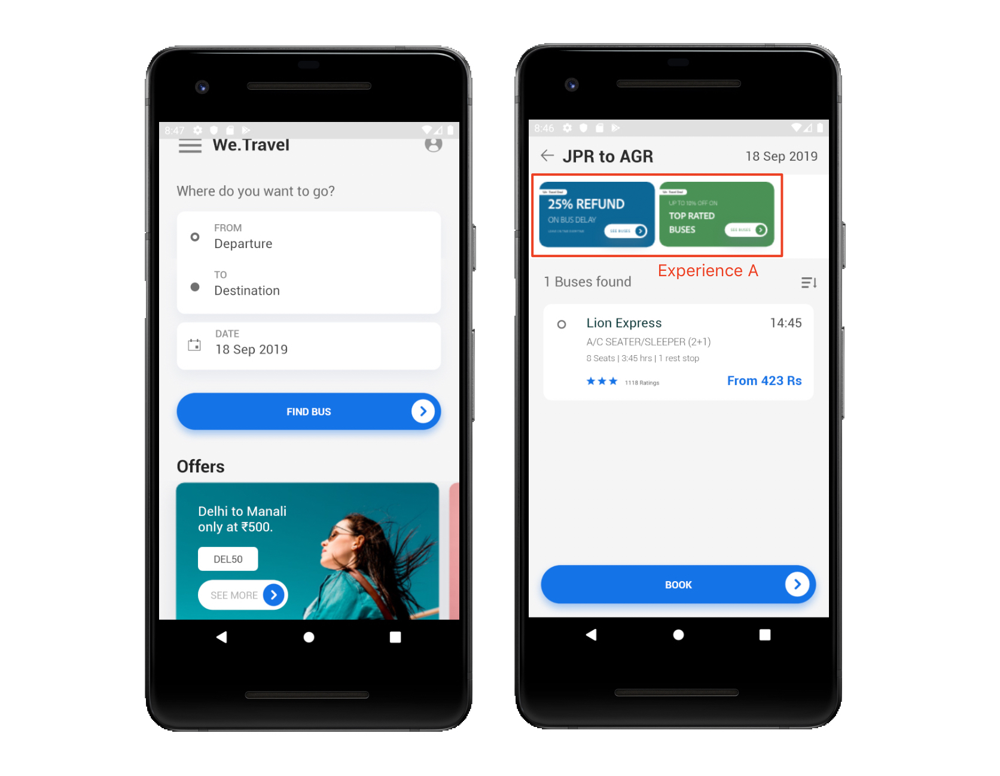
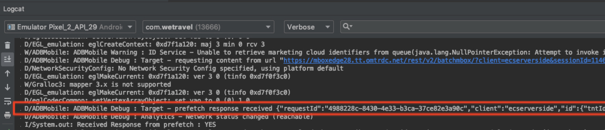
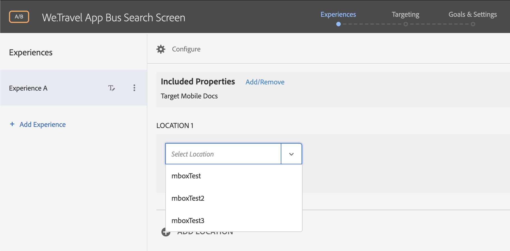
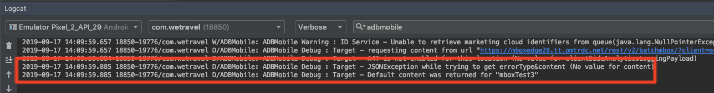
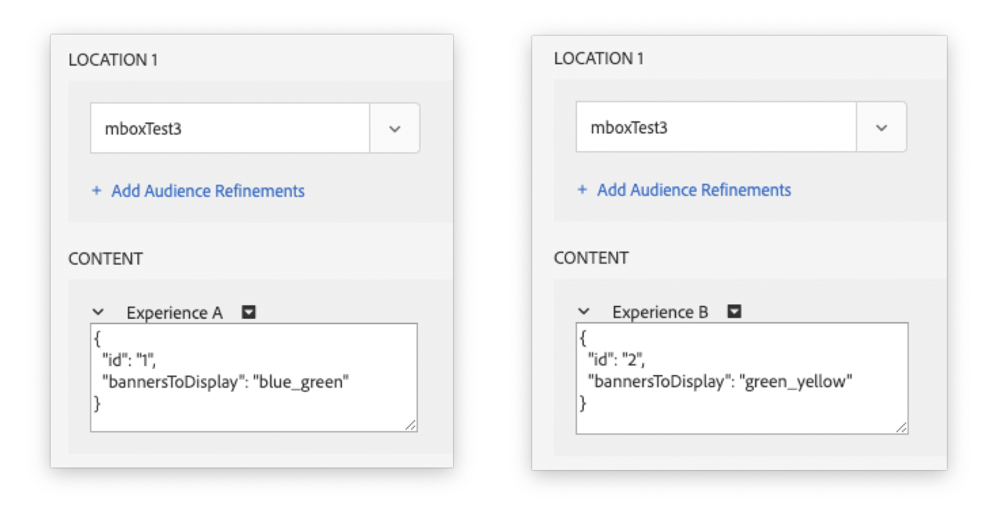
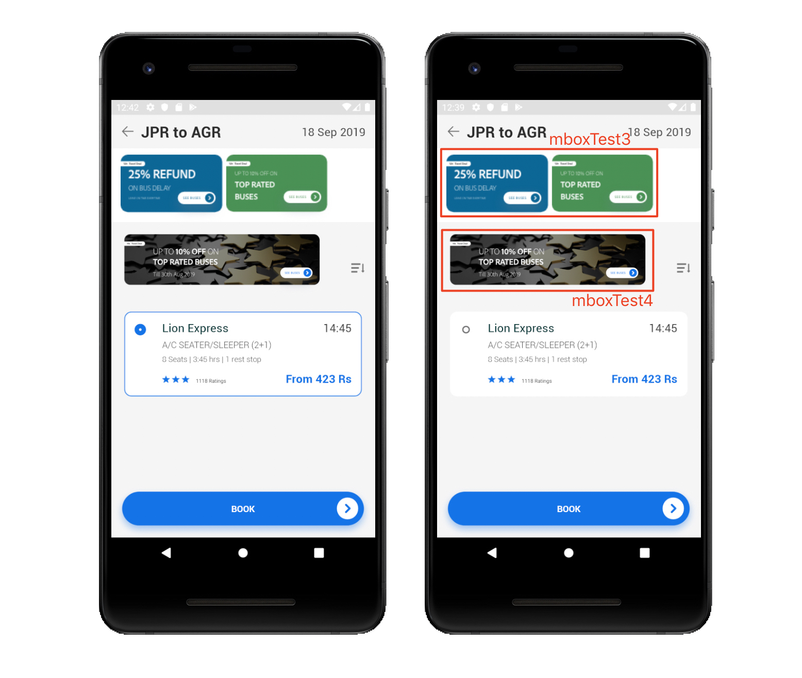

# Add Adobe Target Requests

The Adobe Mobile Services SDK (v4) provides Adobe Target methods & functionality that enable personalize your app with different experiences for different users.

In this lesson, you will implement

## Learning Objectives

At the end of this lesson, you will be able to:

* **Implement and Use a Prefetch Request**
* **Implement and Use a Prefetch "Blocking" Request**
* **Implement and Use a Live Location Request**
* **Implement and Use a Batch Request with Multiple Target Locations in one Call**
* **Combine Prefetch & Live Locations**
* **Clear Prefetched offers from Cache**

## We.Travel App

This article discusses multiple scenarios using a sample travel app. The app has a search feature that finds available bus routes. The app will be used for demonstration purposes.

* Target locations are prefetched on the home screen, so no Target content appears, but locations are cached in the device behind the scene
* The search results screen loads a Target location and displays banners based off a JSON offer loaded from the Target server.


## Implement a Prefetch Request

A prefetch request uses the Android Mobile SDKs to fetch offer content as few times as possible by caching the server responses. Creating a prefetch request with an array of locations can be configured to call the Target server and retrieve content for many locations at once.  All content will be retrieved and cached, and will then be retrievable from the cache by all future calls for this content for the specified location names.  Additional location names can be added to this array, as appropriate, to support the increased scope and sophistication of the install.

Additional details - [Prefetch offer content in Android](https://docs.adobe.com/content/help/en/mobile-services/android/target-android/c-mob-target-prefetch-android.html)

### prefetchContent() Code

Here is the syntax of the Target.prefetchContent() Java request to be installed: <!--where should this be added to the sample app? need a screenshot showing the code in context-->
<!--shouldn't this start really simple without any querystring parameters? why is the at_property parameter included? because it is needed for the account Nimit gave them access to? Pare this down-->

```java
public void targetPrefetchContent() {
    List<TargetPrefetchObject> prefetchList = new ArrayList<>();
    Map<String, Object> profileParameters;
    profileParameters = new HashMap<String, Object>();
    profileParameters.put("ProfileParam18Sep", "1");
    Map<String, Object> travelParameters1 = new HashMap<String, Object>();
    travelParameters1.put("travelParam18Sep", "1");
    travelParameters1.put("at_property", "7962ac68-17db-1579-408f-9556feccb477");
    prefetchList.add(Target.createTargetPrefetchObject("travelTest3", travelParameters1));
    Target.TargetCallback<Boolean> prefetchStatusCallback = new Target.TargetCallback<Boolean>() {
        @Override
        public void call(final Boolean status) {
            HomeActivity.this.runOnUiThread(new Runnable() {
                @Override
                public void run() {
                    String cachingStatus = status ? "YES" : "NO";
                    System.out.println("Received Response from prefetch : " + cachingStatus);
                    setUp();
                }
            });
        }};
    Target.prefetchContent(prefetchList, profileParameters, prefetchStatusCallback);
}
```

### Validate the prefetch request

Now that the SDK is implemented and our initial globalprefetch location call has been setup, let's validate the requests & responses from the Adobe Target Servers.  The Adobe Target SDK can be validated on your mobile app by using an Android Emulator & reviewing verbose logging in your Android IDE environment. This article demonstrates how to use the Android Studio IDE to debug Target server calls for the Adobe Mobile Services SDK version 4.  

Android Studio's Android Emulator & Logcat feature can be used to validate requests & responses from the Adobe Target servers. If you're using a different IDE such as Eclipse, logging should follow a similar process. Importing your own Android app into Android Studio to use the Logcat feature will allow the same validation.  

* In Android Studio, select the Logcat console (View > Tool Windows > Logcat OR select the Logcat tab @ the bottom of the screen)
* On the Logcat filter bar, select "Verbose" and set the filter keyword to "adbmobile" (note: if the filter menu doesn't show, try setting the console to a floating window: Window > Active Tool Window > Floating Mode)
* Run the Android Emulator and look for the Target request and response. "Response received" indicates that the server connection and response was successful:

  

* Remove the "adbmobile" filter and note any connection errors. Most errors are likely caused from incorrect request syntax or configuration. Proxy settings in the Emulator settings can also cause connection errors.  

#### Verify the Target Activity in the UI

If an Activity is already created in the Target UI, the location requested in the Target SDK call (if successful) can be seen in the location drop-down menu under Activities > (Select Activity Name) > Edit Activity > Experiences:

If no Activity has not yet created, create a new one:

* Select Activities > Create Activity
* Select the Activity Type (such as A/B Test)
* Select Mobile App
* Select "Form" as the Experience Composer
* Select the Workspace & Property
* The location drop-down on a selected Experience shows the locations that are registered:



#### Response Details Example

Here are the details of the response from the Logcat console (expanded JSON view for readability):

```java
{
"requestId":"4988228c-8430-4e33-b3ca-37ce82e3a90c",
"client":"ecserverside",
"id":
  {
  "tntId":"111568817282645-907045.28_29",
  "marketingCloudVisitorId":"34552764763276759957814173181896264559"
  },
"edgeHost":"mboxedge28.tt.omtrdc.net",
"contentAsJson":false,
"prefetchResponses":
  [{
  "mbox":"travelTest3",
  "parameters":  
    {
    "a.ltv.amount":"0",
    "MboxParam18Sep":"1",
    "at_property":"7962ac68-17db-1579-408f-9556feccb477"
    },
  "content":"{\"id\":\"1\",\"bannersToDisplay\":\"blue_green\"}",
  "eventTokens":["iuniIAuYUHON1jhC+7UzfmqipfsIHvVzTQxHolz2IpSCnQ9Y9OaLL2gsdrWQTvE54PwSz67rmXWmSnkXpSSS2Q=="],
  "clientSideAnalyticsLoggingPayload":{"pe":"tnt","tnta":"308228:0:0|2"}
  }]
}
```

The main key/value pairs to validate and check for accuracy are listed below:

| Key | Value |
|--- |--- |
| client | your Adobe Target clientCode value - unique to your environment  |
| tntId | primary identifier in Target for an individual user |
| prefetchResponses | for prefetch requests: this object list locations (mboxes) that are prefetched and cached into device memory and any profile parameters included in the request |
| at_property | the Target property from which mboxes (locations) are served. This value is found in the Target interface under Setup > Properties > (select the property of the offer) > (code box) |
| mbox | the location identifier used in Activities in Adobe Target  |
| content | for prefetch requests:  content delivered to the specified mbox |

##### JSON Offers: Common Errors

For JSON Offers:  If the request appears to be sending properly, but continues to return default content, check all the parameters in the Target.loadRequest call. If the "targetParameters" value is empty for a JSON offer request, default content will be returned:



To correct this, make sure the at_property is defined and set in the loadRequest. This ensures the offer is being served from the correct Target property.


The correct Target property is found in the target property is found in the Target interface under Setup > Properties > select the property of the offer.

##### JSON Offer Conversion

The Target.loadRequest method returns an offer in String format. If you're displaying a JSON offer, it needs to be converted from String to JSON after a response is returned in order to parse or reference items within the JSON object.

## Use a Prefetch "Blocking" Location Call

Configuring Target methods as prefetch "blocking" requests provides two main benefits:

* The prefetch method call Target in the "background". It caches locations (mboxes) in device memory for quick access later in the session. This avoids excessive requests to the server & results in a faster app experience.
* A "Blocking" request enables Target content to load into the app before other app content is loaded.

In the code examples below, the changes were made to the main activity of the We.Travel app. The result is an app launch with Target prefetching before any other content loads.

A prefetch blocking request can be set up in an Android Activity by moving the app's content layout methods from the onCreate() method to a separate method that Target calls after a location request.

### Code Example:  Move app layout logic to a new method

```java
// Move the setContentView() method (and other app layout logic) from
// onCreate() into a new setUp() function:

private void setUp() {
  setContentView(R.layout.activity_home);
  
  // add other logic for app setup
}
```

### Code Example:  Call setUp() AFTER Target callback  

```java
// Add a call to setUp() at the end of the Target location or prefetch call.
// This example loads a prefetch request and then calls setUp():

public void targetPrefetchContent() {
    List<TargetPrefetchObject> prefetchList = new ArrayList<>();
    Map<String, Object> profileParameters;
    profileParameters = new HashMap<String, Object>();
    profileParameters.put("ProfileParam18Sep", "1");
    Map<String, Object> travelParameters1 = new HashMap<String, Object>();
    travelParameters1.put("travelParam18Sep", "1");
    travelParameters1.put("at_property", "7962ac68-17db-1579-408f-9556feccb477");
    prefetchList.add(Target.createTargetPrefetchObject("travelTest3", travelParameters1));
    Target.TargetCallback<Boolean> prefetchStatusCallback = new Target.TargetCallback<Boolean>() {
        @Override
        public void call(final Boolean status) {
            HomeActivity.this.runOnUiThread(new Runnable() {
                @Override
                public void run() {
                    String cachingStatus = status ? "YES" : "NO";
                    System.out.println("Received Response from prefetch : " + cachingStatus);
                    setUp();
                }
            });
        }};
    Target.prefetchContent(prefetchList, profileParameters, prefetchStatusCallback);
}

```

## Use a Live Location Request

On the bus results screen, if we wanted to display an offer related to the bus destination, a live location request should be called for that offer instead of a prefetched location. This is because the offer needs to be changed depending on where the user wants to travel to. Prefetched locations could be used with other elements on the screen not related to the destination (like general discounts or promotions).

### JSON Offers

This demo uses JSON offers to determine which banners to display. In the Target interface, create JSON offers for each experience:



### Code Example: Live Location Request

A live location request is called with the **Target.loadRequest()** method. This request below calls the JSON offer, retrieves an ID element from the JSON object, and uses that ID to determine the right assets to display.

```java
// SINGLE Location SCENARIO - JSON OFFER
public void targetLoadRequest() {
    Map<String, Object> mboxParam;
    mboxParam = new HashMap<String, Object>();
    mboxParam.put("at_property", "7962ac68-17db-1579-408f-9556feccb477");
    Target.loadRequest("travelTest3", "----default_mbox----", null, null, mboxParam, new Target.TargetCallback<String>() {
        @Override
        public void call(final String s) {
            SearchBusActivity.this.runOnUiThread(new Runnable() {
                @Override
                public void run() {
                    try {
                        JSONObject obj = new JSONObject(s);
                        banner_id = obj.getInt("id");
                    } catch (
                            Throwable t) {
                        Log.e("My App", "Could not parse malformed JSON: \"" + s + "\"");
                    }

                    setUpSearch();
                    getSearchData();

                }
            });
        }
    });
}

```

In the demo app's getSearchData() method, add the returned banner_id (and the next banner if desired):

```java
// FIND BANNER DETERMINED BY ADOBE TARGET OFFER
searchOffersList.add(offerList.get(banner_id));
searchOffersList.add(offerList.get(banner_id+1));
//searchOffersList.addAll(offerList);
searchOffersAdapter.notifyDataSetChanged();
```

## Request Multiple Target Locations in one Call

To display multiple mboxes on the Bus Results Screen, multiple target locations can be requested in a single call. In this example, we'll display one mbox in the top offer area of the screen, and another mbox just above the bus search results.

Multiple mboxes are built & displayed as follows:

* Create a TargetRequestObject for each location
* Add each TargetRequestObject to an Array
* Add the Array to the **Target.loadRequests()** method and call the locations

### Code Example: Multiple Locations

Here is an example from the Bus Results activity. The code is called from the activity's onResume() method. Note that the parameters for the createTargetRequestObject() method are in a different order than the targetLoadRequest() method.

```java
// MULTIPLE MBOX SCENARIOS- 2 JSON OFFERS
public void targetLoadRequests() {

// Create Multiple Target Location Requests & send in one loadRequests() call

// 1st Location
Map<String, Object> mboxParam;
mboxParam = new HashMap<String, Object>();
mboxParam.put("at_property", "7962ac68-17db-1579-408f-9556feccb477");
TargetRequestObject request1 = Target.createTargetRequestObject("mboxTest3", "--mboxTest3_default--", mboxParam, null, null, new Target.TargetCallback<String>() {
    @Override
    public void call(final String s) {
        SearchBusActivity.this.runOnUiThread(new Runnable() {
            @Override
            public void run() {
                try {
                    JSONObject obj = new JSONObject(s);
                    banner_id = obj.getInt("id");
                } catch (
                        Throwable t) {
                    Log.e("My App", "Could not parse malformed JSON: \"" + s + "\"");
                }
            }
        });
    }
});

// 2nd Location
TargetRequestObject request2 = Target.createTargetRequestObject("mboxTest4", "--mboxTest4_default--", mboxParam, null, null, new Target.TargetCallback<String>() {
@Override
public void call(final String s) {
    SearchBusActivity.this.runOnUiThread(new Runnable() {
        @Override
        public void run() {
            try {
                // Get JSON Offer name
                JSONObject obj2 = new JSONObject(s);
                String offer2_name = obj2.getString("offer2_name");
                Log.d("Sent:", s);

                // Get 2nd banner based on JSON offer name & display above Bus results
                ImageView target_banner = findViewById(R.id.target_banner);
                int offer2_id = getResources().getIdentifier(offer2_name, "drawable", getPackageName());
                target_banner.setImageResource(offer2_id);
            } catch (
                    Throwable t) {
                Log.e("My App", "Could not parse malformed JSON: \"" + s + "\"");
            }
        }
    });
}
});

// Create Array of both requests
List<TargetRequestObject> locationRequests = new ArrayList<>();
locationRequests.add(request1);
locationRequests.add(request2);

// Send Location Requests
Target.loadRequests(locationRequests, null);
setUpSearch();

}

```

### Result

2 Target locations are displayed on the screen:


