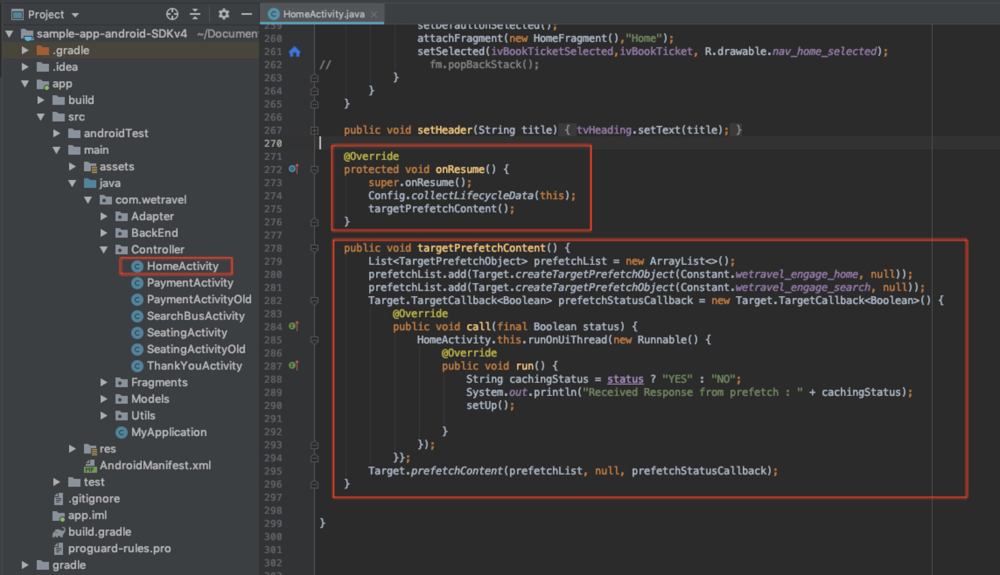
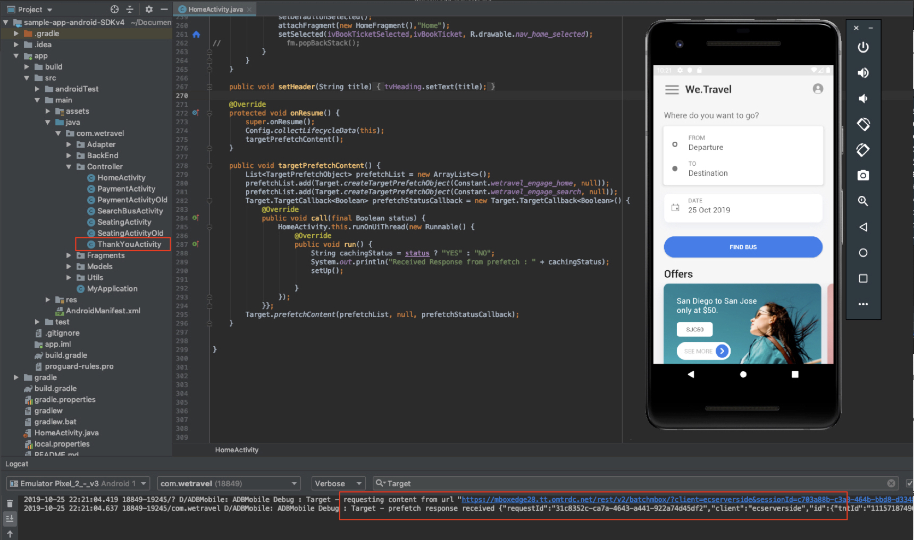
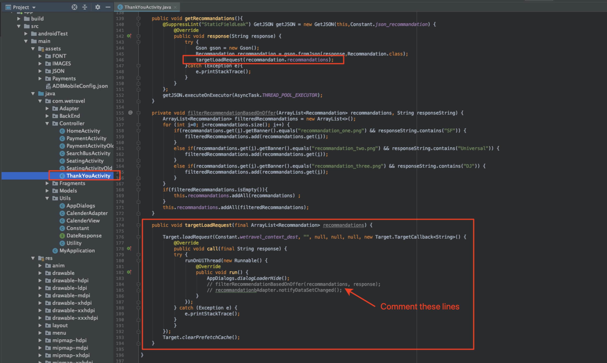
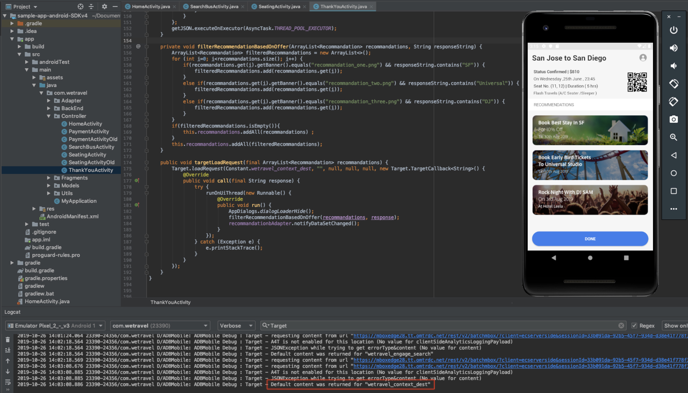

# Add Adobe Target Requests

The Adobe Mobile Services SDK (v4) provides Adobe Target methods & functionality that enable you to personalize your app with different experiences for different users.

In this lesson, you will prepare the We.Travel app for personalization by implementing multiple Target requests.

## Before You Begin

Be sure to [download and update the We.Travel app](download-and-update-the-sample-app.md).

### Definitions

**Request:**  a network request to the Adobe Target servers

**Location:**  a placeholder for Target Offers

**Offer:**  a snippet of code, defined in the Target user interface (or with API), which is delivered in the response. Usually JSON when Target is used in native mobile apps.

**Batch Request:**  a single Request that includes multiple Locations

**Prefetch Request:**  a single Request that retrieves Offers and caches them into memory for future use in the app

**Batch Prefetch Request:**  a single Request that prefetches Offers for multiple Locations

**Audience:**  a group of visitors defined in the Target interface or shared to Target from other Adobe applications (e.g. “iPhone X visitors”, “visitors in the California”, “First App Open”

**Activity:**  a Target construct, defined in the Target user interface (or with API) which links Locations, Offers and Audiences to create a personalized experience.

## Learning Objectives

At the end of this lesson, you will be able to:

* **Cache Multiple Target Locations Using a Batch Prefetch Request**
* **Load and Display Prefetched Target Locations**
* **Load and Display Target Locations in Real-Time (non-prefetched)**
* **Clear Prefetched Locations from Cache**
* **Validate Prefetched Locations & Live Locations in Android Studio**

## Prefetched Target Locations

A prefetch request fetches Target Locations as minimally as possible by caching Adobe Target server responses. A batch prefetch request retrieves and caches multiple Locations. All prefetched Locations are cached on the device for future use in the user session. Refer to the [prefetch documentation](https://docs.adobe.com/content/help/en/mobile-services/android/target-android/c-mob-target-prefetch-android.html) for more details on prefetch methods.

## Add a Batch Prefetch Request to the Home Screen

Our first scenario on We.Travel is a batch prefetch request with two Target Locations. In a later lesson, we'll configure Offers for these Locations that display messages to help guide new users through the booking process. For now, we'll use the Locations as placeholders for the Offers.

We'll start with the HomeActivity controller (the Home Screen's source code), which is located under app > main > java > com.wetravel > Controller. We'll add the two code blocks shown in red:



Scroll down to the end of the HomeActivity's code and add the code provided below after the setHeader() function:

```java
@Override
protected void onResume() {
    super.onResume();
    Config.collectLifecycleData(this);
    targetPrefetchContent();
}

public void targetPrefetchContent() {
    List<TargetPrefetchObject> prefetchList = new ArrayList<>();
    prefetchList.add(Target.createTargetPrefetchObject(Constant.wetravel_engage_home, null));
    prefetchList.add(Target.createTargetPrefetchObject(Constant.wetravel_engage_search, null));
    Target.TargetCallback<Boolean> prefetchStatusCallback = new Target.TargetCallback<Boolean>() {
        @Override
        public void call(final Boolean status) {
            HomeActivity.this.runOnUiThread(new Runnable() {
                @Override
                public void run() {
                    String cachingStatus = status ? "YES" : "NO";
                    System.out.println("Received Response from prefetch : " + cachingStatus);
                    setUp();

                }
            });
        }};
    Target.prefetchContent(prefetchList, null, prefetchStatusCallback);
}
```

### Batch Prefetch Request Code Explanation

| Code | Description |
|--- |--- |
| Config.collectLifecycleData(this) | Enables collection of [mobile lifecycle metrics](https://docs.adobe.com/content/help/en/mobile-services/android/metrics.html). We will use lifecycle metrics in the next lesson. |
| targetPrefetchContent() | Retrieves and caches two Target Locations. The first time a request is sent, the Target Server will create a Location name which we will use later in the Target interface. |
| Constant.wetravel\_engage\_home | Prefetched Target Location which will later be loaded & display its Offer content on the Home Screen |
| Constant.wetravel\_engage\_search | Prefetched Target Location which will later be loaded & display its Offer content on the Search Results Screen. Since this is a second Location in the prefetch, this prefetch request is called a "Prefetch Batch Request". |
| setUp() | Renders the app's home screen after the Target offers are prefetched |

### About Asynchronous vs. Synchronous

In this scenario, the prefetch request runs synchronously as a blocking call, just before the app's home screen renders. Note how setUp() is called after the prefetch request. This can be beneficial in many scenarios because it ensures that Target offers are available before the app's screen renders. To allow the requests load asynchronously (in the background), just call setUp() within the onCreate() function instead.

## Validate the Batch Prefetch Request

Open the Android Emulator in Android Studio. The following examples use the Pixel 2 on Android Q (version 9+, API level 29).

When the Home screen renders, the prefetch request should be loaded. With Logcat, filter for "Target" to see the request & response:



* The prefetch response should read "prefetch response received".

If you are not seeing a successful response, verify settings in the ADBMobileConfig.json file and code syntax in the HomeActivity file.

Two Locations are now cached to the device. The location names are also created on the Target server which will make them visible in the Target interface.

Now we'll load the two Locations to act as placeholders for our future Offers. The first Location will load on the home screen and the second will load on the Search Results screen. No Offer will be visible at this stage since we haven't created Offer content yet (we'll create Offer content in a later lesson).

## Add a Real-Time Target Request

Our next scenario is to load a live Location placeholder on the Thank You screen. The Request that we add here will serve an Offer that depends on the user's trip destination, so this will need to be a real-time Location. Target will needs to determine the right Offer at the time of the booking, so a prefetched cached offer won't work here since the decision needs to be made real-time.

## Add a Real-Time Request on the Thank You Screen

Now let's add a real-time Location placeholder on the Thank You screen. In the ThankYouActivity file, we'll add the code shown in red:



Scroll to the end of the ThankYouActivity file and add this code below as shown above:

```java
// Add this line to the getRecommandations() function:
targetLoadRequest(recommandation.recommandations);

// Add this code block after the filterRecommendationBasedOnOffer() function:
public void targetLoadRequest(final ArrayList<Recommandation> recommandations) {
    Target.loadRequest(Constant.wetravel_context_dest, "", null, null, null, new Target.TargetCallback<String>() {
        @Override
        public void call(final String response) {
            try {
                runOnUiThread(new Runnable() {
                    @Override
                    public void run() {
                        AppDialogs.dialogLoaderHide();
                        filterRecommendationBasedOnOffer(recommandations, response);
                        recommandationbAdapter.notifyDataSetChanged();
                    }
                });
            } catch (Exception e) {
                e.printStackTrace();
            }
        }
    });
}

```

### targetLoadRequest() Code Explanation

| Code | Description |
|--- |--- |
| targetLoadRequest() | This function fires Target.loadRequest() which loads & displays the wetravel\_context\_dest Location |
| Constant.wetravel\_context\_dest | This is the Location that will display Offers to the user (we'll configure the Offer content in a later lesson) |

## Validate the Real-time Request

Open the Android Emulator and go through all the steps to book a trip: Home > Bus Search Results > Seat Selection, Payment Options (any payment option with blank data will work).

On the final Thank You screen, watch Logcat for the response. The response should read "Default content was returned for "wetravel\_context\_dest":



## Clear Prefetched Locations from Cache

There may be situations where prefetched Locations need to be cleared during a session. For example, when a booking occurs, it makes sense to clear the cached Locations since the user is now "engaged" and understands the booking process. If they book another trip during their session, they won't need the original Locations on the home screen & search results screen to guide their booking. It would make more sense to clear the Locations from cache and prefetch new Locations for perhaps a discounted second booking or another relevant scenario. Logic could be added to the home screen & search results screen to prefetch new Locations if a booking has taken place during the session.

For this example, we'll just clear prefetched Locations for the session when a booking takes place. This is done by calling the Target.clearPrefetchCache() function. Set the function inside the targetLoadRequest() function as shown below:


Congratulations! Your app now has the framework for personalization. In the next lesson, you'll be adding parameters to these Locations. This will enhance the Locations and provide more data-driven insights to optimize the app.

### [NEXT : "Add Parameters" >](add-parameters.md)
