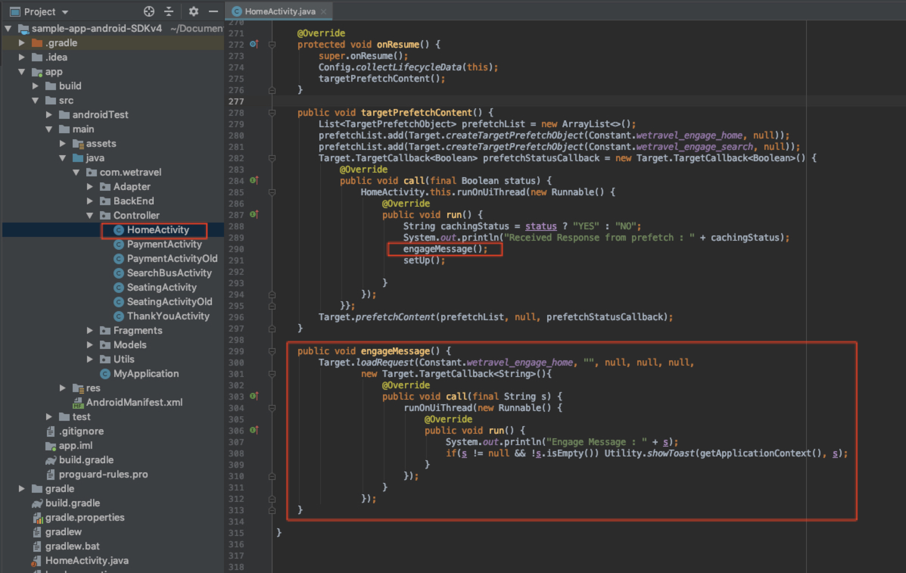
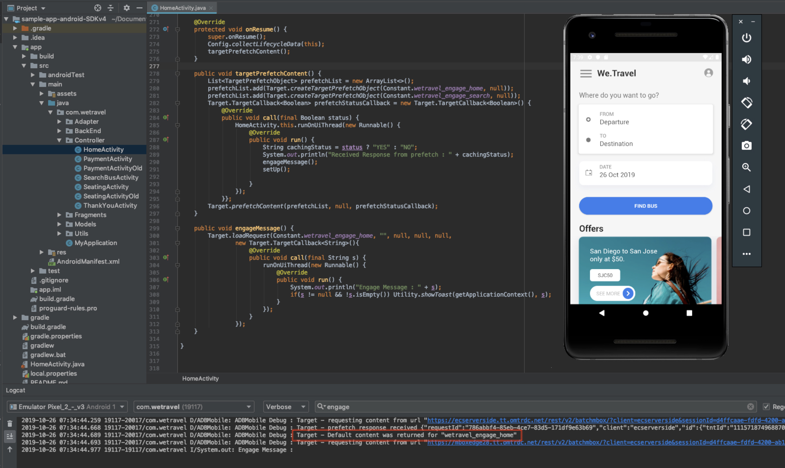
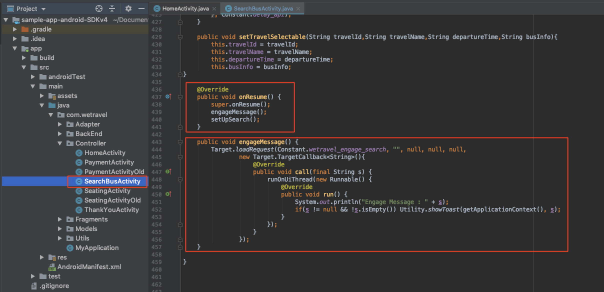
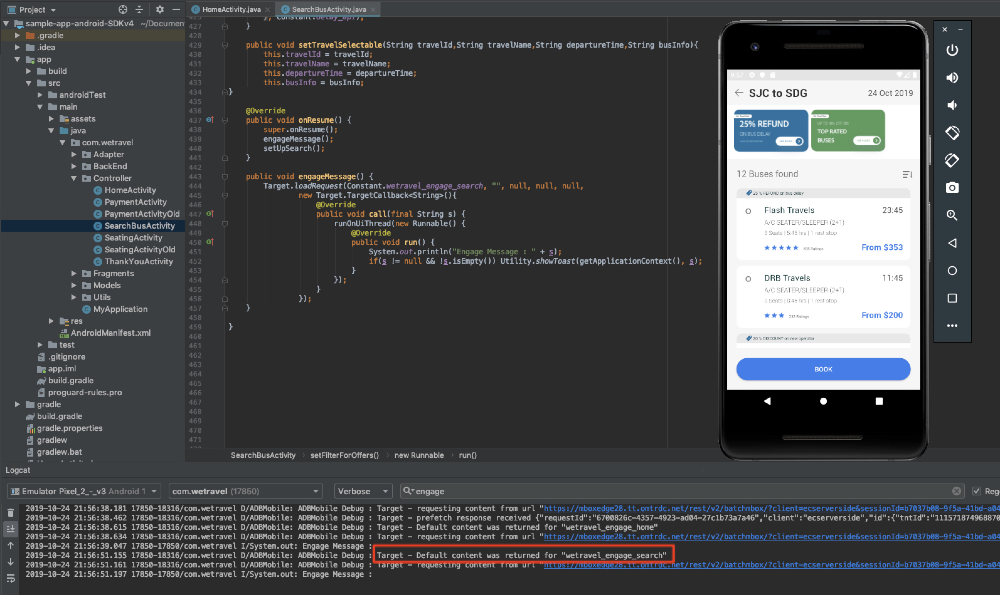

# Add Adobe Target Offers

The Adobe Mobile Services SDK (v4) provides Adobe Target methods & functionality that enable you to personalize your app with different experiences for different users.

In this lesson, you will prepare the We.Travel app for personalization by implementing multiple Target offers. 

## Before You Begin

Be sure to [download and update the We.Travel app](download-and-update-the-sample-app.md).

## Learning Objectives

At the end of this lesson, you will be able to:

* **Cache Multiple Target Offers Using a Batch Prefetch Request**
* **Load and Display Prefetched Target Offers**
* **Load and Display Target Offers in Real-Time (non-prefetched)**
* **Clear Prefetched Offers from Cache**
* **Validate Prefetched Offers & Live Offers in Android Studio**

# Prefetched Target Offers
A prefetch request fetches offer content as minimally as possible by caching Adobe Target server responses. A batch prefetch request retrieves and caches multiple offers. All prefetched offers are cached on the device for future use in the user session. Refer to the [prefetch documentation](https://docs.adobe.com/content/help/en/mobile-services/android/target-android/c-mob-target-prefetch-android.html) for more details on prefetch methods.

## Add a Batch Prefetch Request to the Home Screen
Our first scenario on We.Travel is a batch prefetch request with two Target offers. In a later lesson, we'll configure these offers with messages to help guide new users through the booking process. For now, we'll build placeholders for the offer content. 

We'll start with the HomeActivity controller (the Home Screen's source code), which is located under app > main > java > com.wetravel > Controller. We'll add the two code blocks shown in red:


Scroll down to the end of the HomeActivity's code and add the code provided below after the setHeader() function:

```
@Override
protected void onResume() {
    super.onResume();
    Config.collectLifecycleData(this);
    targetPrefetchContent();
}

public void targetPrefetchContent() {
    List<TargetPrefetchObject> prefetchList = new ArrayList<>();
    prefetchList.add(Target.createTargetPrefetchObject(Constant.wetravel_engage_home, null));
    prefetchList.add(Target.createTargetPrefetchObject(Constant.wetravel_engage_search, null));
    Target.TargetCallback<Boolean> prefetchStatusCallback = new Target.TargetCallback<Boolean>() {
        @Override
        public void call(final Boolean status) {
            HomeActivity.this.runOnUiThread(new Runnable() {
                @Override
                public void run() {
                    String cachingStatus = status ? "YES" : "NO";
                    System.out.println("Received Response from prefetch : " + cachingStatus);
                    setUp();

                }
            });
        }};
    Target.prefetchContent(prefetchList, null, prefetchStatusCallback);
}
``` 

### Code Explanation:

| Code | Description |
|--- |--- |
| Config.collectLifecycleData(this) | Enables collection of mobile lifecycle metrics  |
| targetPrefetchContent() | Retrieves and caches two Target offers. The first time a request is sent, the Target Server will create a location name which can be used in the Target interface. |
| Constant.wetravel\_engage\_home | Cached Target offer which will later be loaded & display its content on the Home Screen |
| Constant.wetravel\_engage\_search | Cached Target offer which will later be loaded & display its content on the Search Results Screen | 
| setUp() | Renders the app's home screen after the Target offers are prefeteched |

### About Asyncronous vs. Syncronous: 
In this scenario, the prefetch request runs syncronously as a blocking call, just before the app's home screen renders. Note how setUp() is called after the prefetch request. This can be beneficial in many scenarios because it ensures that Target offers are available before the app's screen renders. To allow the requests load asyncronously (in the background), just call setUp() within the onCreate() function instead.

## Validate the Batch Prefetch Request
Fire up the Android Emulator in Android Studio. When the Home screen renders, the prefetch request should be loaded. With Logcat, filter for "Target" to see the request & response:


* The prefetch response should read "prefetch response received". 

If you are not seeing a successful response, verify settings in the ADBMobileConfig.json file and code syntax in the HomeActivity file.

Two offers are now cached to the device. They are also created on the Target server which will make them visible in the Target interface.

Now we'll load & display the two offers. The first will display on the home screen and the second will display on the Search Results screen. No offer content will be visible at this stage since we haven't created offer content yet (we'll create offer content in another lesson later). These two offers will act as placeholders for now.

## Load & Display the First Offer on the Home Screen
The first offer will be displayed on the home screen. In the HomeActivity file, we'll add the code shown in red:



Add the engageMessage() function to the targetPrefetchContent() function as shown above. Add the code below at the end of the file as shown above:

```
public void engageMessage() {
    Target.loadRequest(Constant.wetravel_engage_home, "", null, null, null,
            new Target.TargetCallback<String>(){
                @Override
                public void call(final String s) {
                    runOnUiThread(new Runnable() {
                        @Override
                        public void run() {
                            System.out.println("Engage Message : " + s);
                            if(s != null && !s.isEmpty()) Utility.showToast(getApplicationContext(), s);
                        }
                    });
                }
            });
}
```
### Code Explanation:

| Code | Description |
|--- |--- |
| engageMessage() | This function fires Target.loadRequest() which loads & displays the wetravel\_engage\_home offer |

## Validate the First Offer
Now let's make sure the offer is loading & displaying. Fire up the emulator open Logcat & filter for "engage", then watch the logs for the response. It should read "Default content was returned for "wetravel_engage_home":



If you are not seeing a successful response, verify settings in the ADBMobileConfig.json file and code syntax in the HomeActivity file.

## Load & Display the Second Offer on the Search Results Screen
Now we'll load the second offer from cache on the Search Results Screen. We'll add the code blocks in red to the SearchBusActivity file: 
 


Scroll down to the end of the SearchBusActivity file and add the code below after the setTravelSelectable() function:

```
@Override
public void onResume() {
    super.onResume();
    engageMessage();
}

public void engageMessage() {
    Target.loadRequest(Constant.wetravel_engage_search, "", null, null, null,
            new Target.TargetCallback<String>(){
                @Override
                public void call(final String s) {
                    runOnUiThread(new Runnable() {
                        @Override
                        public void run() {
                            System.out.println("Engage Message : " + s);
                            if(s != null && !s.isEmpty()) Utility.showToast(getApplicationContext(), s);
                        }
                    });
                }
            });
}
``` 

## Validate the Second Offer
With the Emulator, select a departure & destination on the Home Screen and tap "Find Bus". Watch Logcat for the Target response when the Search Results Screen renders:



* The "wetravel\_engage\_search" response should read "Default content was returned for "wetravel\_engage\_search" (default content is returned since this is the first request to the server & there is no offer content configured yet).

If you are not seeing success responses, verify settings in the ADBMobileConfig.json file and code syntax in the SearchBusActivity file.


# Real-Time Target Offers
Our next scenario is to display a relevant offer on the Thank You screen. The content of the offer will depend on the user's trip destination, so this will need to be a real-time offer. Target needs to determine the right offer at the time of the booking, so a prefetched cached offer won't work here.


## Add a Real-Time Offer on the Thank You Screen
Now let's add a real-time offer on the Thank You screen. In the ThankYouActivity file, we'll add the code shown in red: 


Scroll to the end of the ThankYouActivity file and add this code below as shown above:

```
// Add this line to the getRecommandations() function:
targetLoadRequest(recommandation.recommandations);

// Add this code block after the filterRecommendationBasedOnOffer() function:
public void targetLoadRequest(final ArrayList<Recommandation> recommandations) {
    Target.loadRequest(Constant.wetravel_context_dest, "", null, null, null, new Target.TargetCallback<String>() {
        @Override
        public void call(final String response) {
            try {
                runOnUiThread(new Runnable() {
                    @Override
                    public void run() {
                        AppDialogs.dialogLoaderHide();
                        filterRecommendationBasedOnOffer(recommandations, response);
                        recommandationbAdapter.notifyDataSetChanged();
                    }
                });
            } catch (Exception e) {
                e.printStackTrace();
            }
        }
    });
}

```

### Code Explanation
| Code | Description |
|--- |--- |
| targetLoadRequest() | This function fires Target.loadRequest() which loads & displays the wetravel\_context\_dest offer |
| Constant.wetravel\_context\_dest | This is the offer that will display relevant content to the user (we'll configure the content in a later lesson) |

## Validate the Real-time Offer
Fire up the emulator and go through all the steps to book a trip:  Home > Bus Search Results > Seat Selection, Payment Options (any payment option with blank data will work). 

On the final Thank You screen, watch Logcat for the response. The response should read "Default content was returned for "wetravel\_context\_dest":


## Clear Prefetched Offers from Cache
There may be situations where prefetched offers need to be cleared during a session. For example, when a booking occurs, it makes sense to clear the cached offers since the user is now "engaged" and understands the booking process. If they book another trip during their session, they won't need the original offers on the home screen & search results screen to guide their booking. It would make more sense to clear the offers from cache and prefetch new offers for perhaps a discounted second booking or another relevant scenario. Logic could be added to the home screen & search results screen to prefetch new offers if a booking has taken place during the session.

For this example, we'll just clear prefetched offers for the session when a booking takes place. This is done by calling the Target.clearPrefetchCache() function. Set the function inside the targetLoadRequest() function as shown below:


Congratulations! Your app now has the framework for personalization. In the next lesson, you'll be adding parameters to these offers. This will enhance the offers and provide more data-driven insights.

###[NEXT "Add Parameters" >](add-parameters.md)


