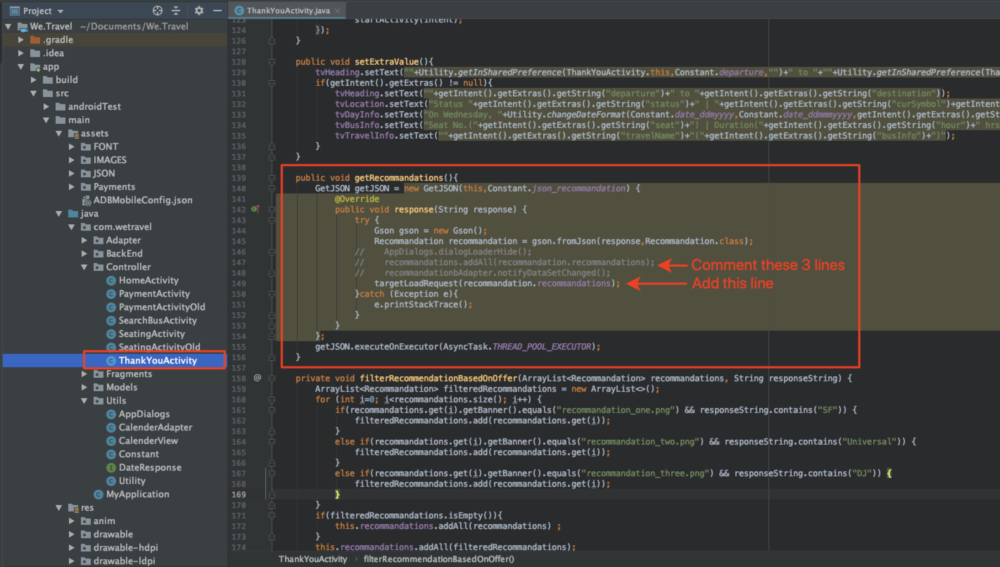

# Add Adobe Target Requests

The Adobe Mobile Services SDK (v4) provides Adobe Target methods and functionality that enable you to personalize your app with different experiences for different users. Typically, one or more requests are made from the app to the Adobe Target to retrieve the personalized content and measure the impact of that content.

In this lesson, you will prepare the We.Travel app for personalization by implementing [!DNL Target] requests.

## Prerequisites

Be sure to [download and update the sample app](download-and-update-the-sample-app.md).

## Learning Objectives

At the end of this lesson, you will be able to:

* Cache multiple [!DNL Target] offers (i.e. personalized content) using a batch prefetch request
* Load prefetched [!DNL Target] locations
* Load a [!DNL Target] location in real-time (non-prefetched)
* Clear prefetched locations from cache
* Validate prefetched and real-time requests

## Terminology

Below is some of key Target terminology that we will use in the remainder of this tutorial.

* **Request:**  a network request to the Adobe Target servers
* **Offer:**  a snippet of code or other text-based content, defined in the [!DNL Target] user interface (or with API), which is delivered in the response. Usually JSON when [!DNL Target] is used in native mobile apps.
* **Location:**  a user-defined name given to a request, used in the [!DNL Target] interface to associate offers with specific requests
* **Batch Request:**  a single request that includes multiple locations
* **Prefetch Request:**  a single request that retrieves offers and caches them into memory for future use in the app
* **Batch Prefetch Request:**  a single request that prefetches offers for multiple locations
* **Audience:**  a group of visitors defined in the [!DNL Target] interface or shared to [!DNL Target] from other Adobe applications (e.g. “iPhone X visitors”, “visitors in the California”, “First App Open”)
* **Activity:**  a [!DNL Target] construct, defined in the [!DNL Target] user interface (or with API) which links locations, offers and Audiences to create a personalized experience

## Add a Batch Prefetch Request

The first request we will implement in We.Travel is a batch prefetch request with two [!DNL Target] locations on the Home Screen. In a later lesson, we'll configure offers for these locations that display messages to help guide new users through the booking process.

A prefetch request fetches [!DNL Target] content as minimally as possible by caching the Adobe Target server response (offer). A batch prefetch request retrieves and caches multiple offers, each associated with a different location. All prefetched locations are cached on the device for future use in the user session. By prefetching multiple locations on the Home Screen, we can retrieve offers to use later as the visitor navigates through the app. Refer to the [prefetch documentation](https://docs.adobe.com/content/help/en/mobile-services/android/target-android/c-mob-target-prefetch-android.html) for more details on prefetch methods.

### Add the Batch Prefetch Request

Let's update the HomeActivity controller (the Home Screen's source code), which is located under app > main > java > com.wetravel > Controller. We'll add the two code blocks shown in red:

We'll start with the HomeActivity controller (the Home Screen's source code), which is located under app > main > java > com.wetravel > Controller.

We'll add the two code blocks shown in red:


Scroll down to the end of the HomeActivity's code and add the code provided below after the `setHeader()` function and *replacing* the current `onResume()` function:

```java
@Override
protected void onResume() {
    super.onResume();
    targetPrefetchContent();
}

public void targetPrefetchContent() {
    List<TargetPrefetchObject> prefetchList = new ArrayList<>();
    prefetchList.add(Target.createTargetPrefetchObject(Constant.wetravel_engage_home, null));
    prefetchList.add(Target.createTargetPrefetchObject(Constant.wetravel_engage_search, null));
    Target.TargetCallback<Boolean> prefetchStatusCallback = new Target.TargetCallback<Boolean>() {
        @Override
        public void call(final Boolean status) {
            HomeActivity.this.runOnUiThread(new Runnable() {
                @Override
                public void run() {
                    String cachingStatus = status ? "YES" : "NO";
                    System.out.println("Received Response from prefetch : " + cachingStatus);
                    setUp();

                }
            });
        }};
    Target.prefetchContent(prefetchList, null, prefetchStatusCallback);
}
```

Your IDE will probably warn you that you do not have the [!DNL Target] classes imported in the file. Be sure to import the [!DNL Target] classes at the top of the HomeActivity controller as shown in red below:

```java
import com.adobe.mobile.Target;
import com.adobe.mobile.TargetPrefetchObject;
```


You will probably also see errors for "cannot find symbol variable wetravel_engage_home" and "cannot find symbol variable wetravel_engage_search". Add these to the `Constant.java` file (in app > src > main > java > com > wetravel > Utils):

```java
public static final String wetravel_engage_home = "wetravel_engage_home";
public static final String wetravel_engage_search = "wetravel_engage_search";
```


### Batch Prefetch Request Code Explanation

| Code | Description |
|--- |--- |
| `targetPrefetchContent()` | A user-defined function (not part of the SDK)  which uses [!DNL Target] methods to retrieve and cache two [!DNL Target] locations. |
| `prefetchContent()` | The [!DNL Target] SDK method that sends the prefetch request |
| `Constant.wetravel_engage_home` | Prefetched [!DNL Target] location name which will display its offer content on the Home Screen |
| `Constant.wetravel_engage_search` | Prefetched [!DNL Target] location name which will display its offer content on the Search Results Screen. Since this is a second location in the prefetch, this prefetch request is called a "prefetch batch request". |
| setUp() | A user-defined function which renders the app's home screen after the [!DNL Target] offers are prefetched |

### About Asynchronous vs. Synchronous

With the code we have just implemented, the prefetch request is made as a synchronous, blocking call, just before the home screen renders. When we pasted the new code into the HomeActivity controller, we moved the `setUp()` function execution from the `onResume()` function until after the Target request. This can be beneficial in scenarios where you want to personalize content when the app first opens because it ensures that personalized content from the Target servers has returned (or timed out) before the first screen renders. To allow the requests to load asynchronously (in the background), just call `setUp()` within the `onCreate()` function instead.

### Validate the Batch Prefetch Request

Re-build the app and open the Android Emulator. (The following screenshots use the Pixel 2 on Android Q version 9+, API level 29). The prefetch response should read "prefetch response received":

When the Home screen renders, the prefetch request should be loaded. With Logcat, filter for [!DNL "Target"] to see the request and response:


If you are not seeing a successful response, verify settings in the `ADBMobileConfig.json` file and code syntax in the HomeActivity file.

Two locations are now cached to the device. The location names will shortly lazy-load into the [!DNL Target] interface, where they can be selected in various drop-down menus when you use them in an activity.

### Add Load Requests for Each Cached Location

Now that the locations are prefetched and their responses cached to the device, let's add the `Target.loadRequest()` method which retrieves the offer content from the cache so you can use it to update your application. We'll add a new custom method called `engageMessage()` that will run with the prefetch request. `engageMessage()` will call `Target.loadRequest()`. `engageMessage()` runs before `setUp()` to ensure that the load request is called before the screen is set up.

First, add the `engageMessage()` call & method for the wetravel_engage_home location in the HomeActivity:


Here is the updated code:

```java
    public void targetPrefetchContent() {
        List<TargetPrefetchObject> prefetchList = new ArrayList<>();
        Map<String, Object> params1;
        params1 = new HashMap<String, Object>();
        params1.put("at_property", "your at_property value goes here");
        prefetchList.add(Target.createTargetPrefetchObject(Constant.wetravel_engage_home, params1));
        prefetchList.add(Target.createTargetPrefetchObject(Constant.wetravel_engage_search, params1));
        Target.TargetCallback<Boolean> prefetchStatusCallback = new Target.TargetCallback<Boolean>() {
            @Override
            public void call(final Boolean status) {
                HomeActivity.this.runOnUiThread(new Runnable() {
                    @Override
                    public void run() {
                        String cachingStatus = status ? "YES" : "NO";
                        System.out.println("Received Response from prefetch : " + cachingStatus);
                        engageMessage();
                        setUp();
                    }
                });
            }};
        Target.prefetchContent(prefetchList, null, prefetchStatusCallback);
    }
    public void engageMessage() {
        Target.loadRequest(Constant.wetravel_engage_home, "", null, null, null,
            new Target.TargetCallback<String>(){
                @Override
                public void call(final String s) {
                    runOnUiThread(new Runnable() {
                        @Override
                        public void run() {
                            System.out.println("Engage Message : " + s);
                            if(s != null && !s.isEmpty()) Utility.showToast(getApplicationContext(), s);
                        }
                    });
                }
            });
    }
```

Now add the `engageMessage()` call & method for the wetravel_engage_search location in the SearchBusActivity. Notice that the `engageMessage()` call is set in the `onResume()` method before the call to `setUpSearch()` so it runs before the screen is set up:


Here is the updated code:

```java
    @Override
    public void onResume() {
        super.onResume();
        engageMessage();
        setUpSearch();
    }
    public void engageMessage() {
        Target.loadRequest(Constant.wetravel_engage_search, "", null, null, null,
                new Target.TargetCallback<String>(){
                    @Override
                    public void call(final String s) {
                        runOnUiThread(new Runnable() {
                            @Override
                            public void run() {
                                System.out.println("Engage Message : " + s);
                                if(s != null && !s.isEmpty()) Utility.showToast(getApplicationContext(), s);
                            }
                        });
                    }
                });
    }
```

Since you have just added Target methods to the SearchBusActivity, be sure to import the [!DNL Target] classes:

```java
import com.adobe.mobile.Target;
import com.adobe.mobile.TargetPrefetchObject;
```

## Add a Real-time Request

The next request we will add to the app will be a real-time request on the Thank You screen. By "real-time" we mean that both the request will be made and the response will be applied immediately (not cached for later). In a later lesson, we will be build an experience using this request, that is personalized to the user's trip destination.  

So let's add a real-time request on the Thank You screen. In the ThankYouActivity file, we'll make the changes shown in red:


Scroll to the end of the ThankYouActivity file. Comment out the three lines in the `getRecommandations()` function and add the invocation of the `targetLoadRequest()` function:

```java
// AppDialogs.dialogLoaderHide();
// recommandations.addAll(recommandation.recommandations);
// recommandationbAdapter.notifyDataSetChanged();
```

Add this line of code to the `getRecommandations()` function:

```java
targetLoadRequest(recommandation.recommandations);
```

Now, we need to define the `targetLoadRequest()` function:


Add this code block after the `filterRecommendationBasedOnOffer()` function:

```java
public void targetLoadRequest(final ArrayList<Recommandation> recommandations) {
    Target.loadRequest(Constant.wetravel_context_dest, "", null, null, null, new Target.TargetCallback<String>() {
        @Override
        public void call(final String response) {
            try {
                runOnUiThread(new Runnable() {
                    @Override
                    public void run() {
                        AppDialogs.dialogLoaderHide();
                        filterRecommendationBasedOnOffer(recommandations, response);
                        recommandationbAdapter.notifyDataSetChanged();
                    }
                });
            } catch (Exception e) {
                e.printStackTrace();
            }
        }
    });
}
```

Since you have just added Target methods to the ThankYouActivity, be sure to import the Target classes:

```java
import com.adobe.mobile.Target;
import com.adobe.mobile.TargetPrefetchObject;
```

### targetLoadRequest() Code Explanation

| Code | Description |
|--- |--- |
| `targetLoadRequest()` | A user-defined function (not part of the SDK) which fires `Target.loadRequest()` which loads and displays the wetravel_context_dest location |
| `Target.loadRequest()` | The SDK method which makes the request to the Target server |
| Constant.wetravel_context_dest | The location name assigned to the request that we will use later on when we build the activity in the [!DNL Target] interface |
| `filterRecommendationBasedOnOffer()` | A user-defined function in the app that takes the location's offer from the Target response and decides how the app should change based on the content of the offer |
| `recommandations.addAll()` | A user-defined function in the app that used to execute by default when the ThankYou screen loaded, but now executes after the Target response has been received and parsed by `filterRecommendationBasedOnOffer()` |

This was a more sophisticated update that we made to the app then with the request we added to the home screen, so let's just take a moment to review what we did:

1. We interrupted the app's previous behavior of showing three default promotions, by commenting out the lines of code
1. We told the app instead to execute a new function, which we arbitrarily named targetLoadRequest
1. We defined the `targetLoadRequest` function to make a request to Target using the Target.loadRequest method and immediately execute the `filterRecommendationBasedOnOffer()` function when the [!DNL Target] offer response is received
1. The `filterRecommendationBasedOnOffer()` function interprets the response and decides which promotions should be applied to the screen

This is a very common usage pattern when using [!DNL Target] in mobile apps.  It is both very powerful, in that you can personalize almost any aspect of your mobile app. It also requires coordination between the app code and the offers which we will define later in the [!DNL Target] interface. Because of this coordination, some personalization use cases may require you to update your app in the app store in order to launch the activity.

### Validate the Real-time Request

Open the Android Emulator and go through all the steps to book a trip: Home > Bus Search Results > Seat Selection, Payment Options (any payment option with blank data will work).

On the final Thank You screen, watch Logcat for the response. The response should read "Default content was returned for "wetravel_context_dest":


## Clearing Prefetched Locations from Cache

There may be situations where prefetched locations need to be cleared during a session. For example, when a booking occurs, it makes sense to clear the cached locations since the user is now "engaged" and understands the booking process. If they book another trip during their session, they won't need the original locations on the home screen and search results screen to guide their booking. It would make more sense to clear the locations from the cache and prefetch new offers for perhaps a discounted second booking or another relevant scenario. Logic could be added to the home screen and search results screen to prefetch new locations if a booking has taken place during the session.

For this example, we'll just clear prefetched locations for the session when a booking takes place. This is done by calling the `Target.clearPrefetchCache()` function. Set the function inside the `targetLoadRequest()` function as shown below:

```java
Target.clearPrefetchCache()
```


Congratulations! Your app now has the framework for personalization. In the next lesson, we'll enhance our personalization capabilities by adding parameters to these locations.

**[NEXT : "Add Parameters" >](add-parameters.md)**
