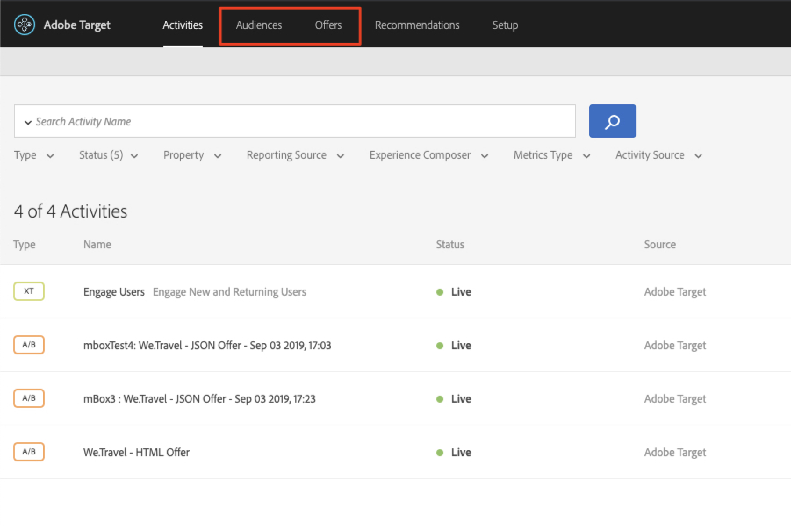
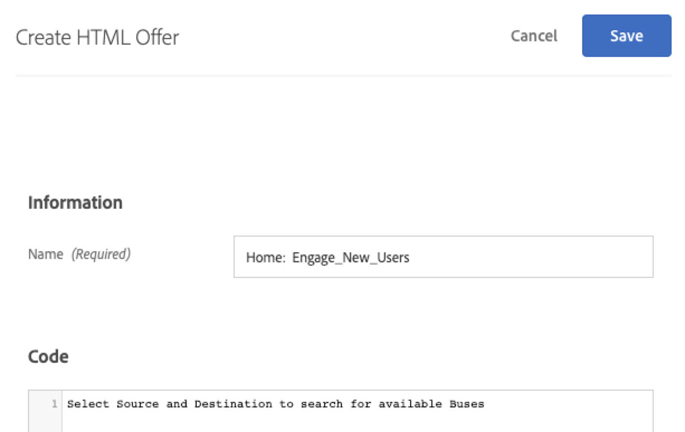

# Create Audiences and Offers in Adobe Target

In this lesson, we'll build audiences and offers in Adobe Target for the three locations we implemented in the previous lessons. These will be used to display personalized experiences in the next lesson.

## Learning Objectives

At the end of this lesson, you will be able to:

* **Create Audiences in Adobe Target**
* **Create Offers in Adobe Target for Each Location in your App**

## Verify Access to Adobe Target

This lesson will require access to Adobe Target. Before moving on through the next steps, ensure you have access to Adobe Target, which is accessed through the Adobe Experience Cloud here: [https://experience.adobe.com/](https://experience.adobe.com/). Contact your Adobe Administrator for access.

Select Adobe Target and you'll be logged in to the Target UI where you can create Audiences and Offers for this lesson:

## Create Audiences for New and Returning Users

Messages for the first 2 locations will be displayed in the app as follows:

| Audience | Location | Message |
| --- | --- | --- |
| New Users | wetravel_engage_home | "Select your Origin & Destination to search for available bus routes" |
| New Users | wetravel_engage_search | "Use filters to narrow down your search results" |
| Returning Users (after 30+ days) | wetravel_engage_home | "Welcome back! Use promo code BACK30 during checkout to get a 10% discount." |
| Returning Users (after 30+ days) | wetravel_engage_search | default content |

The "wetravel_engage_home" and "wetravel_engage_search" locations are located on the home and search results screens. They will be used to help engage users to search for bus trips. We'll need audience segments built that target new and returning users so we can display relevant messages to users. Let's use the lifecycle metric "a.DaysSinceFirstUse" to build those audiences. In Adobe Target, select Audiences > Create Audience and add a rule for new users:

>**Note about Lifecycle metrics:**
>All Lifecycle metrics and dimensions collected in the Target mobile SDK are prepended with "a" (a.DaysSinceFirstUse, a.DaySinceLastUse, etc.). These variables are available to use in Audiences.

Now create an audience for users who return after 30+ days:

## Create Offers for New and Returning Users

We'll create HTML offers to display these messages. As a reminder, offers are snippets of code/content, defined in the Target user interface (or with API), which are delivered in the Target response. In mobile apps, JSON offers are common. For this demo, we'll be using HTML offers, which display in plain text in the app.

First, let's create offers for the messages to New Users. In the Target interface, select Offers > Create HTML Offer:

Now add each offer:

Now let's create the one offer for returning users (the second offer will be default content, which will display as nothing):

## Create Audiences for Users That Book Specific Destinations

For this demo app, we'll focus on displaying offers for two trip destinations - San Diego and Los Angeles. The messages will be returned to the app as follows:

| Audience | Location | Message |
| --- | --- | --- |
| Destination: San Diego | wetravel_context_dest | "DJ" |
| Destination: Los Angeles | wetravel_context_dest | "Universal" |

When the "Universal" value is returned to the app, a banner for Universal Studios will display. When "DJ" is returned, a banner for "Rock Night with DJ SAM" will display. The idea is to display relevant recommendations based on destination after a booking. Let's first create two custom audiences in the Target interface:

## Create Offers for Destination Recommendations

Now we'll create HTML offers for these messages. In the Target UI, create two offers:

>Note: Our demo app contains custom logic that captures the destination value from the user's input. The logic then checks that value against the Target response and determines which banner to display. You may need to use similar logic in your own app in specific user scenarios.

## Conclusion

Now that Audiences and Offers are in place, we're ready to view the final experience. In the next lesson, we'll build activities and walk through the experience in the app.

**[NEXT : "Personalize Layouts" >](personalize-layouts.md)**
