# Create Audiences and Offers in Adobe Target

In this lesson, we'll go into the Target interface and build audiences and offers for the three locations we implemented in the previous lessons.

## Learning Objectives

At the end of this lesson, you will be able to:

* Create audiences in Adobe Target
* Create offers in Adobe Target

More specifically, in this lesson we will create audiences and offers needed to accomplish the personalization use cases defined at the beginning of the tutorial. We want to use the Home and Search screens to help app users book their trips, and we want to use the Thank You screen to display some relevant promotions based on the user's destination. Here is a table representing what we will build in this lesson for each location:

| Location | Audience | Offer |
| --- | --- | --- |
| wetravel_engage_home | New Users  | "Select your Origin & Destination to search for available bus routes" |
| wetravel_engage_search | New Users | "Use filters to narrow down your search results" |
| wetravel_engage_home | Returning Users (after 30+ days) | "Welcome back! Use promo code BACK30 during checkout to get a 10% discount." |
| wetravel_engage_search | Returning Users (after 30+ days) | default content |
| wetravel_context_dest | Destination: San Diego | "DJ" |
| wetravel_context_dest | Destination: Los Angeles | "Universal" |

## Create Audiences

 In Adobe Target, first make sure that the correct Workspace is selected. A workspace is used to separate Target projects into groups so that projects can be categorized or separated for different users. Select the Workspace that you used in the previous lesson to copy the at_property value:

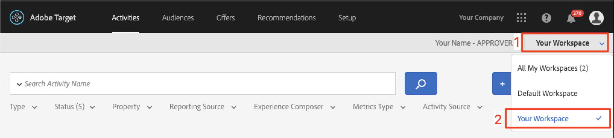

 Now select Audiences > Create Audience and add a rule for new users:

### Create an Audience for New Users

Adobe Target Audiences are used to identify specific groups of visitors. Offers can then be targeted to those specific groups. For the first two locations, we'll use a "New Users" audience:

1. Select Audiences
1. Select Create Audience
    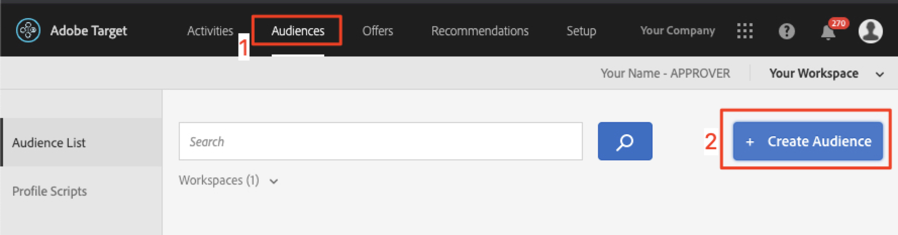

1. Enter "New Mobile App Users" as the audience name
1. Select "Add Rule"
1. Select a "Custom" rule
    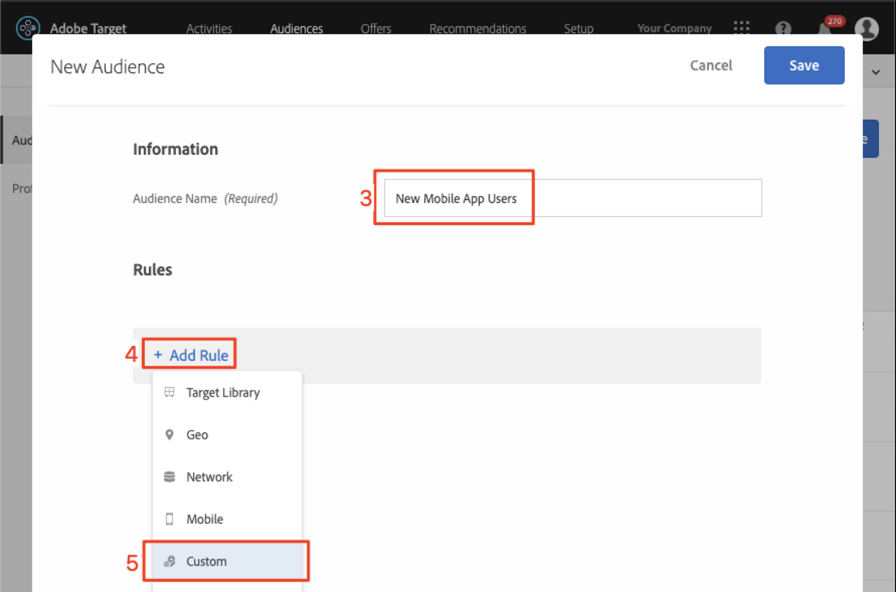

1. Select a.DaysSinceFirstUse
1. Select "is less than"
1. Enter "2"
1. Save the new audience

Now create an audience for users who return after 30+ days:

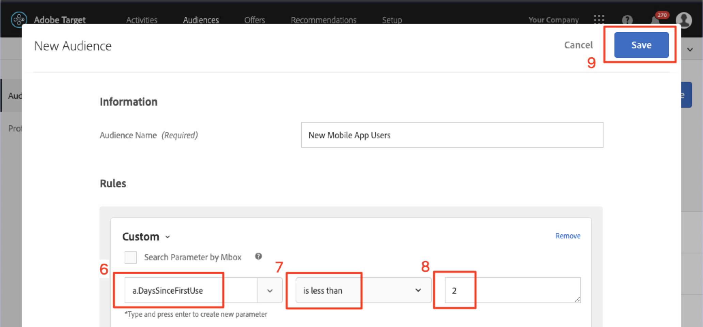

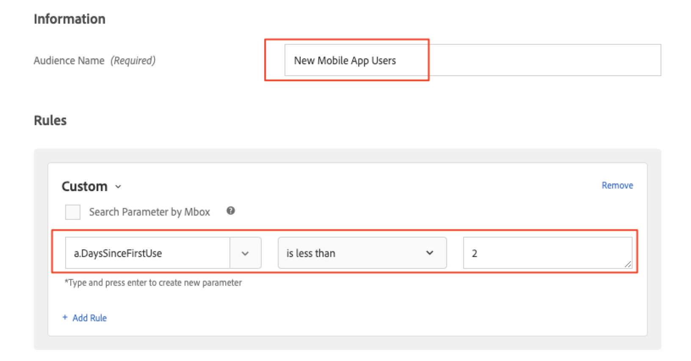

### Create an Audience for Returning Users

Follow the same steps listed above to create an audience for users who return after 30+ days.

1. Name the audience "Returning Mobile App Users (after 30+ days)
1. Use "a.DaysSinceLastUse is greater than 30" as the custom rule
1. Save the new audience

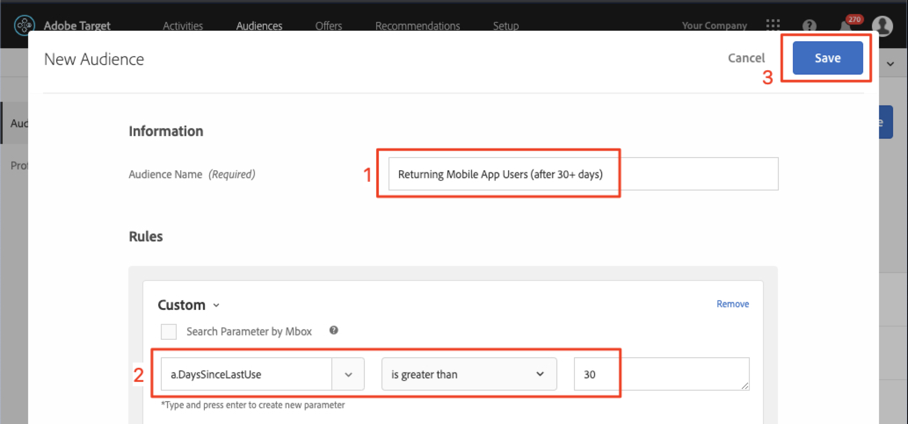

>[!NOTE]: All Lifecycle metrics and dimensions collected in the Target mobile SDK are prepended with "a" (a.DaysSinceFirstUse, a.DaySinceLastUse, etc.) and are available in the "Custom" option of the drop-down menu. These variables are available to use in Audiences.

Next we will create a few audiences for some of the destinations offered by the We.Travel app. In the last lesson we passed the destination as a location parameter in the wetravel_context_dest location request. That parameter is available in the "Custom" option of the drop-down menu.

### Create an Audience for Users Booking a Trip to San Diego

1. Name the audience "Destination : San Diego"
1. Use a custom rule with this definition: "locationDest contains San Diego"
1. Save the new audience

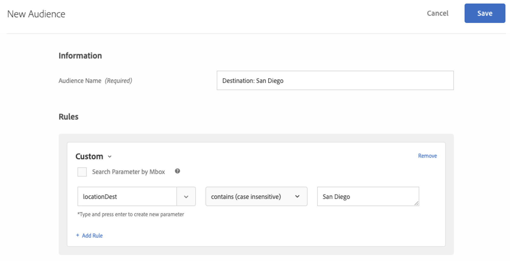

### Create an Audience for Users Booking a Trip to Los Angeles

1. Name the audience "Destination : Los Angeles"
1. Use a custom rule with this definition: "locationDest contains Los Angeles"
1. Save the new audience

## Create Offers

Now, let's create offers to display these messages. As a reminder, offers are snippets of code/content, which are delivered in the Target response. They are most often created in the Target user interface, but can also be created via API or using the Experience Fragments integration with Adobe Experience Manager. In mobile apps, JSON offers are common. For this demo, we'll be using HTML offers, which can be used to deliver any plaintext content (including JSON!) into the app.

First, let's create offers for the messages to New Users. In the Target interface, select Offers > Create HTML Offer:

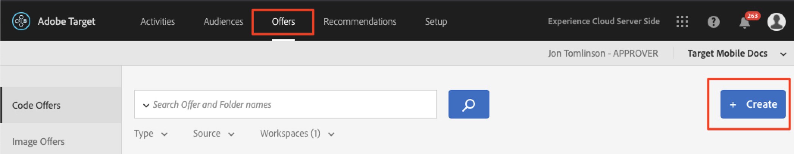

Now add each offer:

### Create the Offer for New Users

1. Select Offers
1. Select Create
1. Select "HTML Offer"

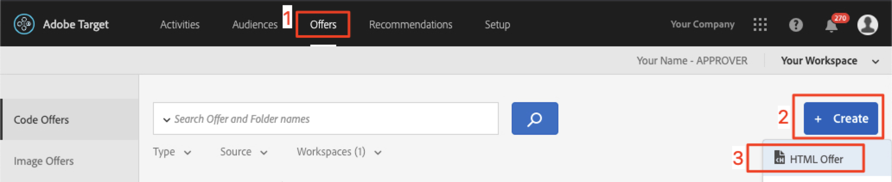

1. Name the offer "Home : Engage New Users"
1. Enter "Select Source and Destination to search for available buses" as the HTML code
1. Save the new offer

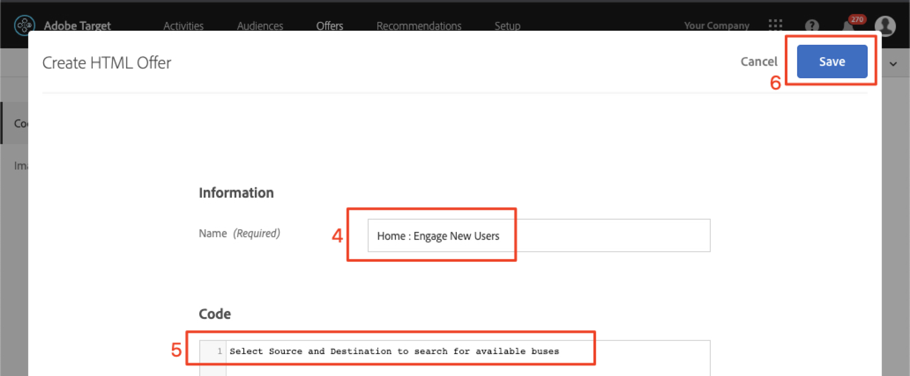

### Create the Offer for Returning Users

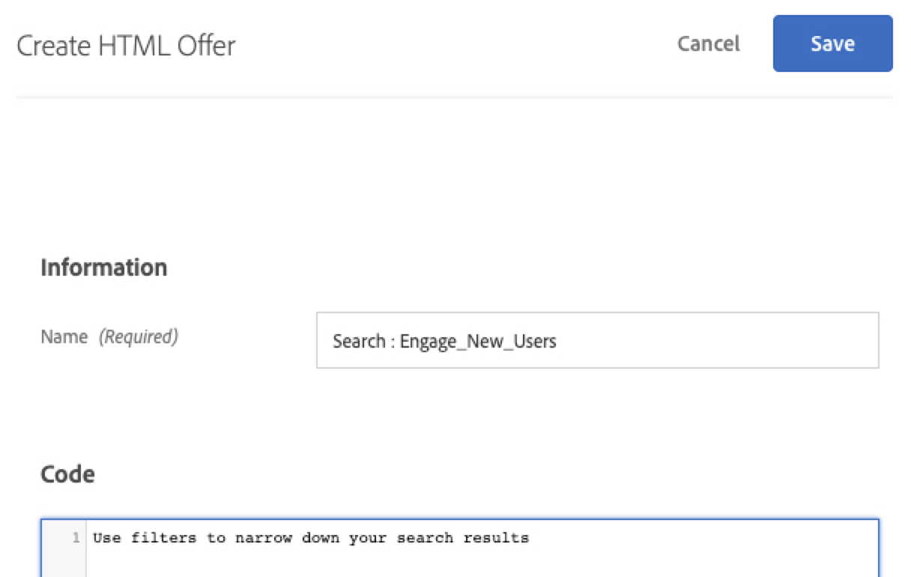

Now let's create the one offer for returning users (the second offer will be default content, which will display as nothing):

1. Name the offer "Home : Returning Users"
1. Enter "Welcome back! Use promo code BACK30 during checkout to get a 10% discount." as the HTML code
1. Save the new offer

The Search Screen offer for Returning Users will return default content (which is set to nothing), so there is no need to create an offer for Returning Users for the Search Screen.

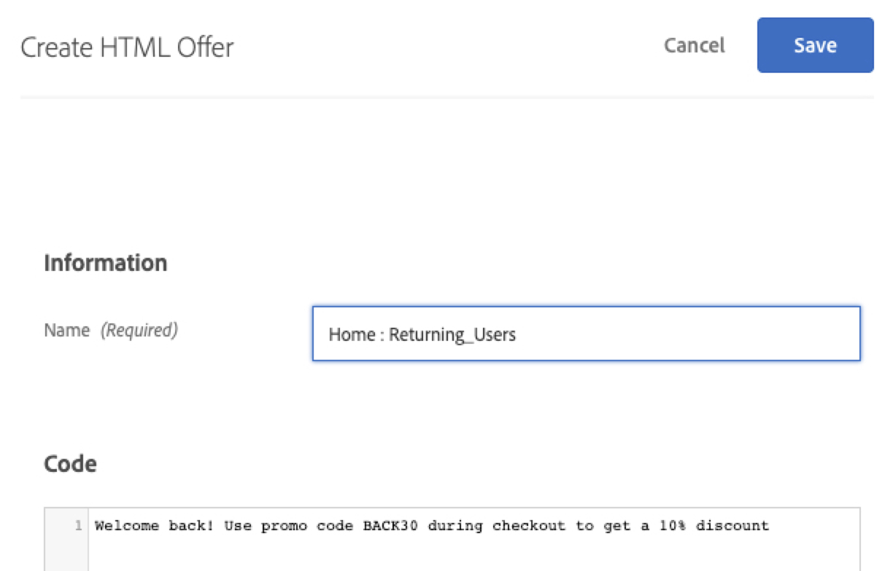

When the "Universal" value is returned to the app, a banner for Universal Studios will display. When "DJ" is returned, a banner for "Rock Night with DJ SAM" will display. The idea is to display relevant recommendations based on destination after a booking. Let's first create two custom audiences in the Target interface:

Now we'll create HTML offers for these messages. In the Target UI, create two offers:

### Create the San Diego Offer

1. Name the offer "Promotion for San Diego"
1. Enter "DJ" as the HTML code
1. Save the new offer

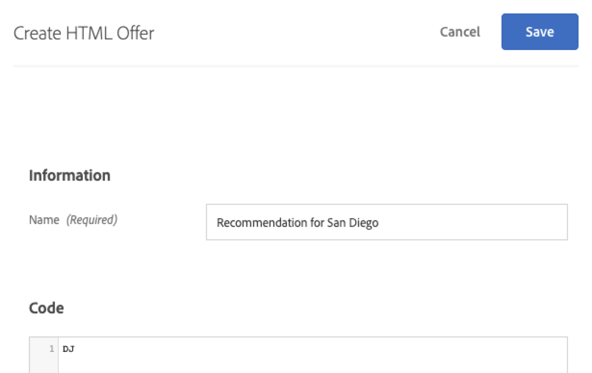

### Create Offer for Users going to Los Angeles

1. Name the offer "Promotion for Los Angeles"
1. Enter "Universal" as the HTML code
1. Save the new offer

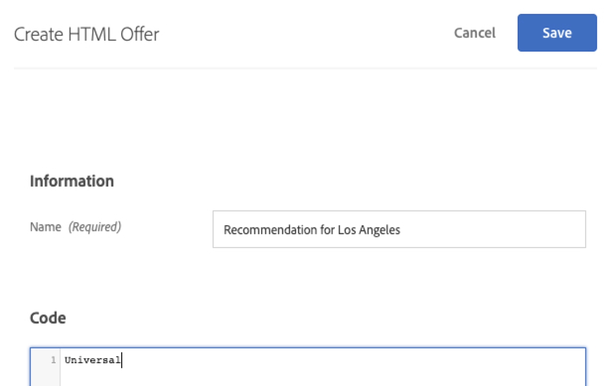

## Conclusion

Now we have our Audiences and Offers. In the next lesson, we'll build activities that tie the locations, audiences, and offers together to create the personalized experiences!

**[NEXT : "Personalize Layouts" >](personalize-layouts.md)**
