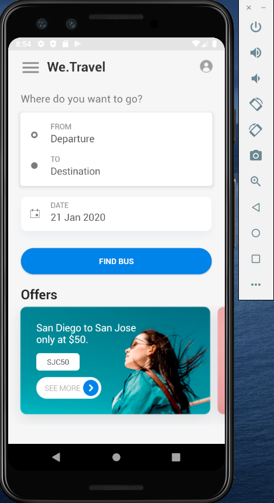
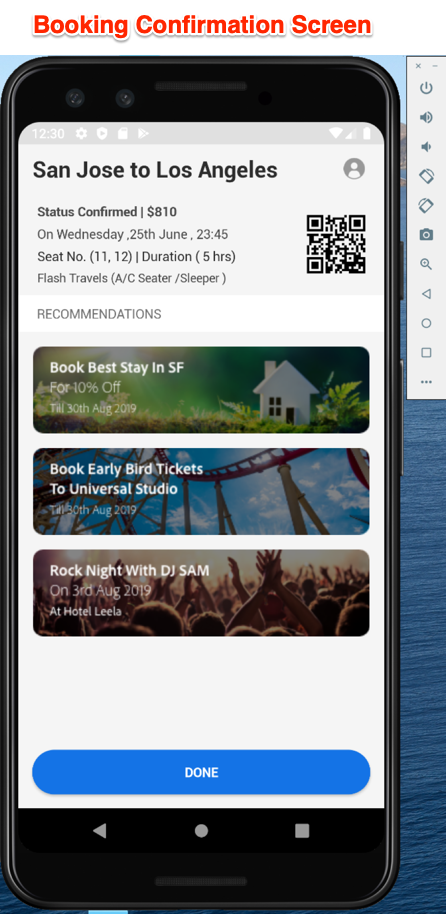
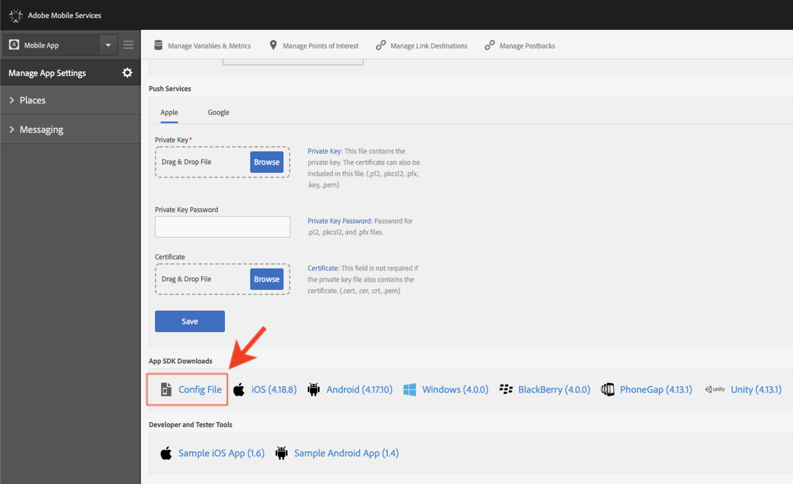
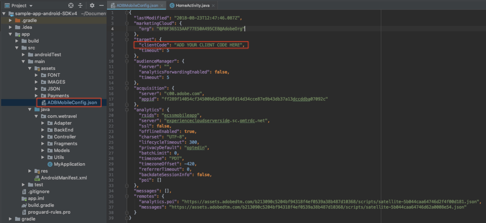

# Download and Update the We.Travel Sample App

The We.Travel sample app is pre-implemented with the Adobe Mobile Services SDK v4. You just need to update it, so that it points to your own Experience Cloud Org and solution accounts.

## Learning Objectives

At the end of this lesson, you will be able to:

* Download and Open the We.Travel sample app in Android Studio
* Verify & Update the Mobile Services SDK Settings for [!DNL Target]

## Download the We.Travel App

* Download the [sample-app-android-SDKv4-Base-Version.zip](assets/sample-app-android-SDKv4-Base-Version.zip)
* Decompress the zip file
* Open the app in Android Studio as an existing project (ignore any errors about "Invalid VCS root mapping")
* Run the app in an emulator to confirm that the app builds and you can see the home screen
* Browse the app and verify that you can complete the booking process (select any payment optin and just hit "Proceed" to skip over the billing screen!)

    

## Verify & Update the Mobile Services SDK Settings for [!DNL Target]

The Adobe Mobile Services SDK has been preinstalled within the We.Travel app [according to the documentation](https://experienceleague.adobe.com/docs/mobile-services/android/getting-started-android/requirements.html?lang=en). Now you will update the installation to point to your own [!DNL Target] account.

First, create a new App in the Mobile Services user interface:

1. Log in to the [Adobe Mobile Services interface](https://mobilemarketing.adobe.com/).
1. Go to the [!UICONTROL Manage Apps], then click **[!UICONTROL Add]** to add a new app to use with this tutorial (**[!UICONTROL Manage Apps]** > **[!UICONTROL Add]**).
1. Choose an an Analytics report suite with non-production data, give the app a name, select the **[!UICONTROL Standard]** type and click **[!UICONTROL Save]**.
1. Once the app has been added, add your [!DNL Target] Client Code on the next screen in the [!UICONTROL SDK Target Options] section (you can find your client code in the [!DNL Target] interface under **[!UICONTROL Setup]** > **[!UICONTROL Implementation]** > **[!UICONTROL Edit Settings]**, next to the Download `at.js` button).
1. The [!UICONTROL Request Timeout] setting determines how long the app waits for the response from the [!DNL Target] server before executing timeout instructions. Just leave the default setting.
1. Enable the [!UICONTROL Visitor ID Service] and make sure your [!UICONTROL Organization] is selected in the drop-down.
1. Save your changes by clicking **[!UICONTROL Save]** on the top right side of the window (not the one in the [!UICONTROL Universal Links], [!UICONTROL App Links] options, or [!UICONTROL Push Services] section).
1. Scroll to the App SDK Downloads section at the bottom of the page and download the Config File:

    

1. Replace the `ADBMobileConfig.json` file in your Android Studio project assets folder (app > src > main > assets).

1. Now open the `ADBMobileConfig.json` file and make sure it contains the expected changes such as your [!DNL Target] Client Code and your Analytics details:
    

If you don't see your settings, confirm that you clicked the right **[!UICONTROL Save]** button in the [!UICONTROL Mobile Services] interface and copied the file to the correct location.

Congratulations! You've updated the SDK with your [!DNL Target] account details! We will do additional validation of the configuration after we add [!DNL Target] requests in the next lesson.

**[NEXT : "Add Target Requests" >](add-requests.md)**
