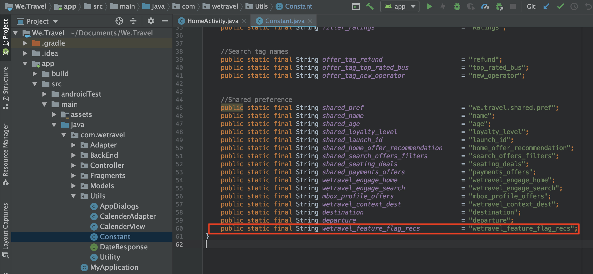
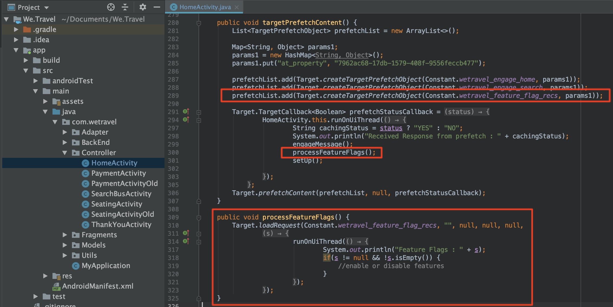
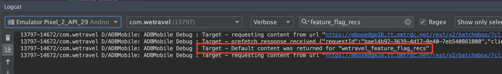
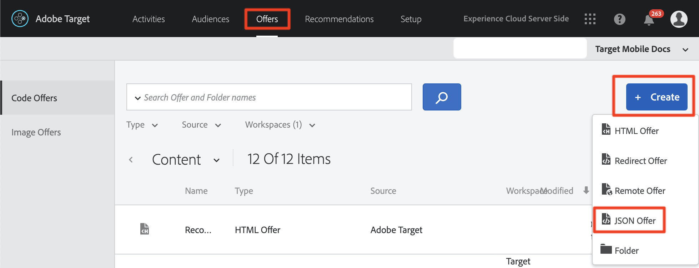
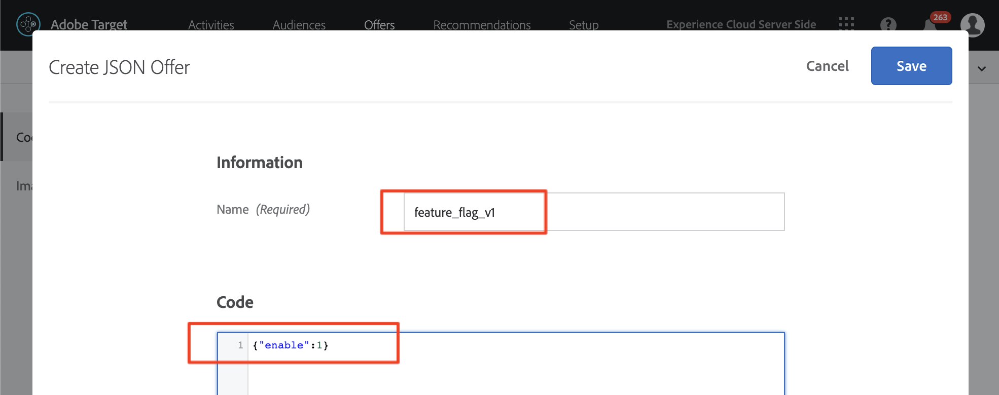
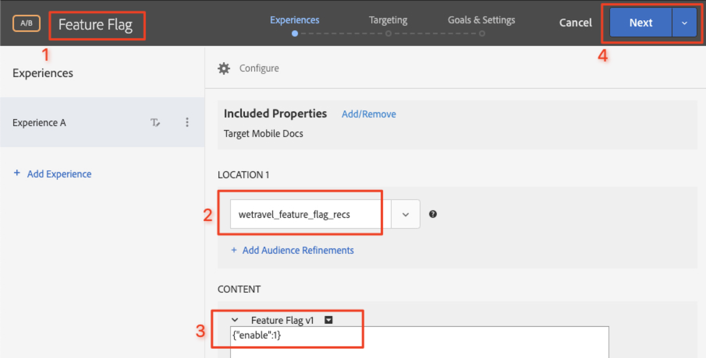
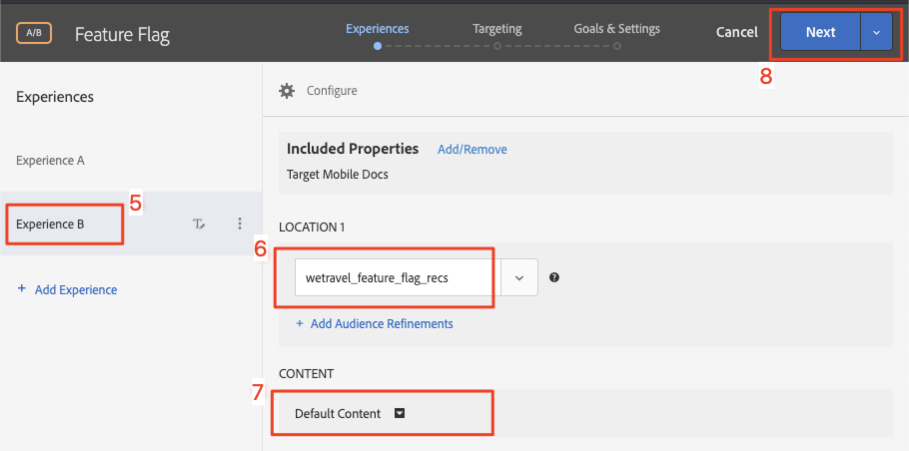
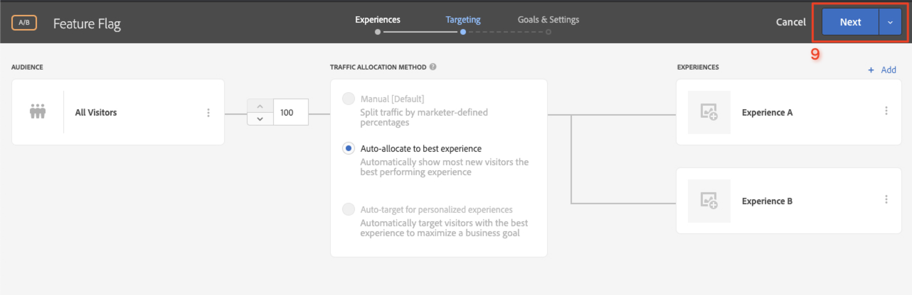
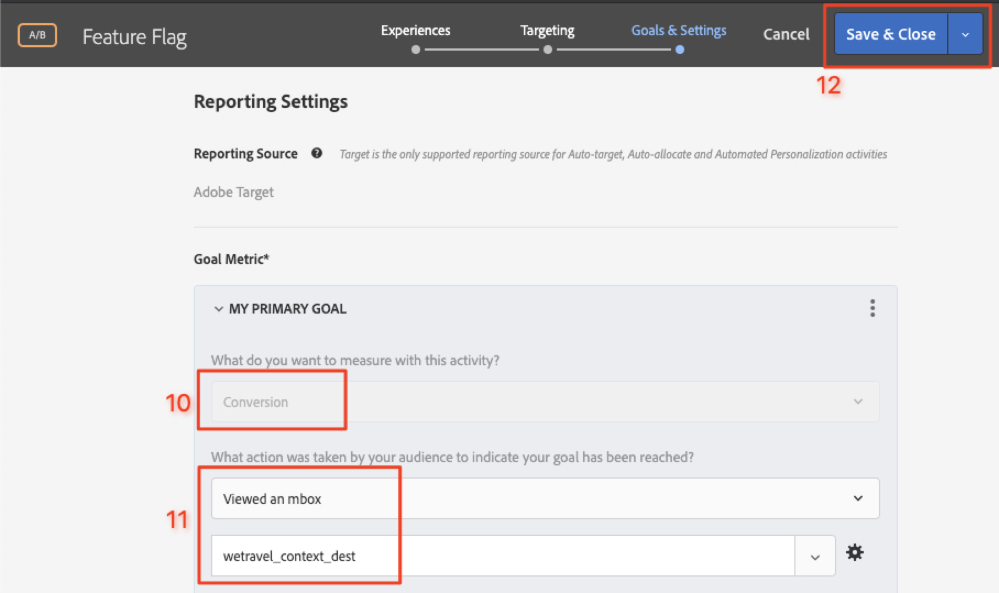
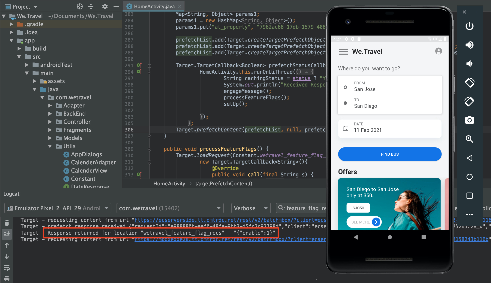

# Feature Flagging

Mobile app product owners need the flexibility to roll out new features in their app without having to invest in multiple app releases. They may also want to roll out features gradually to a percentage of the user base, to test effectiveness. Adobe Target can be used to experiment with UX features like color, copy, buttons, text & images and provide those features to specific audiences.

In this lesson, we'll create a "feature flag" offer which can be used as a trigger to enable specific app features.

## Learning Objectives

At the end of this lesson, you will be able to:

* Add a new location to the batch prefetch request
* Create a Target activity with an offer that will be used as a feature flag
* Load and validate the feature flag offer in your app

## Add a New Location to the Prefetch Request to the Home Activity

In the demo app from our previous lessons, we'll add a new location called "wetravel_feature_flag_recs" to the prefetch request in the Home Activity and load it to the screen with a new Java method.

>[!NOTE] One of the benefits of using a prefetch request is that adding a new request does not add any additional network overhead or cause additional load work since the request is packaged within the prefetch request

First, verify that the wetravel_feature_flag_recs constant is added in the Constant.java file:



Here is the code:

```java
public static final String wetravel_feature_flag_recs = "wetravel_feature_flag_recs";
```

Now add the location to the prefetch request and load a new function called processFeatureFlags():



Here is the full updated code:

```java
public void targetPrefetchContent() {
    List<TargetPrefetchObject> prefetchList = new ArrayList<>();

    Map<String, Object> params1;
    params1 = new HashMap<String, Object>();
    params1.put("at_property", "7962ac68-17db-1579-408f-9556feccb477");

    prefetchList.add(Target.createTargetPrefetchObject(Constant.wetravel_engage_home, params1));
    prefetchList.add(Target.createTargetPrefetchObject(Constant.wetravel_engage_search, params1));
    prefetchList.add(Target.createTargetPrefetchObject(Constant.wetravel_feature_flag_recs, params1));

    Target.TargetCallback<Boolean> prefetchStatusCallback = new Target.TargetCallback<Boolean>() {
        @Override
        public void call(final Boolean status) {
            HomeActivity.this.runOnUiThread(new Runnable() {
                @Override
                public void run() {
                    String cachingStatus = status ? "YES" : "NO";
                    System.out.println("Received Response from prefetch : " + cachingStatus);
                    engageMessage();
                    processFeatureFlags();
                    setUp();

                }
            });
        }};
    Target.prefetchContent(prefetchList, null, prefetchStatusCallback);
}

public void processFeatureFlags() {
    Target.loadRequest(Constant.wetravel_feature_flag_recs, "", null, null, null,
            new Target.TargetCallback<String>(){
                @Override
                public void call(final String s) {
                    runOnUiThread(new Runnable() {
                        @Override
                        public void run() {
                            System.out.println("Feature Flags : " + s);
                            if(s != null && !s.isEmpty()) {
                                //enable or disable features
                            }
                        }
                    });
                }
            });
}
```

### Validate the Feature Flag Request

Once the code is added, run the Emulator on the Home Activity and watch Logcat for the updated response:



## Create a Feature Flag JSON Offer

We'll now create a simple JSON offer that will act as a flag or trigger for a specific audience - the audience that would receive the feature roll-out in their app. In the Target interface, create a new offer:



Let's name it "Feature Flag v1" with the value {"enable":1}



## Create an Activity

Now let's create an A/B Test activity with that offer. For detailed steps on creating an activity see the previous lesson. The activity will only need one audience for this example. In a live scenario, you may want to build out specific custom audiences for specific feature roll-outs, then set the activity to use those audiences. In this example, we'll just allocate to a percentage of all users. Here is the configuration for the activity:

1. Name the Activity "Feature Flag"
1. Select the "wetravel_feature_flag_recs" location
1. Change the content to the "Feature Flag v1" JSON offer

    

1. Select "Add Experience" to add experience B
1. Leave "Default Content" for the content
1. Select "Next" to advance to the "Targeting" screen

    

1. On the Targeting screen, verify that the Traffic Allocation method is set to "Auto-allocate to best experience" setting.

1. Select "Next" to advance to "Goals & Settings"

    

1. Set the Primary Goal to Conversion
1. Set the action to "Viewed an Mbox". We'll use the "wetravel_context_dest" location (since this location is on the Confirmation screen, we can use it to see if the new feature leads to more conversions)
1. Select "Save & Close"

    

Activate the activity

## Validate the Feature Flag Request

Now use the emulator to watch for the request. Since we set the targeting to 50% of users, there's a 50% you'll see the feature flag response contain the "{enable:1}" value.



If you don't see the "{enable:1}" value, that means you weren't targeted for the experience. For a temporary test, to force the offer to show, you could deactivate the activity, then edit the activity and change the traffic allocation to 100%, then save and validate again with the emulator. The offer should now return the "{enable:1}" value.

In a live scenario, the "{enable:1}" response can be used to enable more custom logic in your app to display the specific feature set you want to show your target audience.

## Conclusion

Nice work! You now have the skills needed to roll-out features to specific user audiences.
