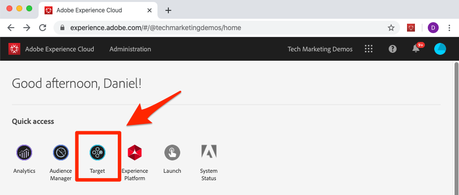
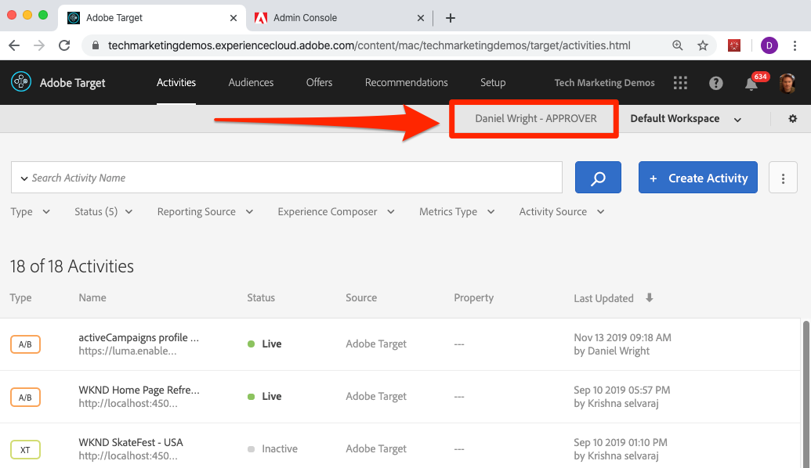
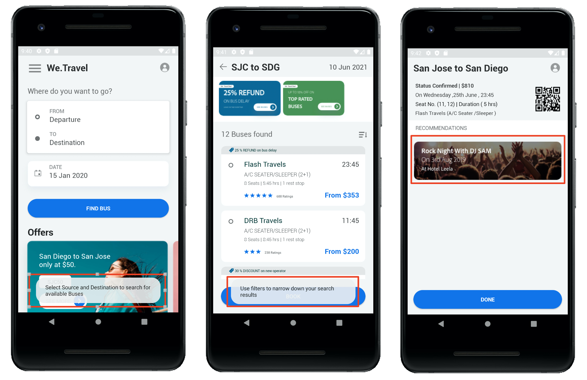

# Overview

_Adobe Target with Adobe Mobile Services SDK v4 for Android_ is the perfect starting point for Android developers who are already using Adobe Mobile Services SDK v4 and want to start personalizing app experiences with Adobe Target.

A demo Android app is provided for you to complete the lessons. After completing this tutorial, you should be ready to start implementing Target in your own Android app!

After completing this tutorial you will be able to:

* Validate the [Adobe Mobile Services SDK](https://docs.adobe.com/content/help/en/mobile-services/android/getting-started-android/requirements.html) setup
* Implement the following types of Target requests:
  * Prefetch of Target content
  * Batch multiple Target locations (mboxes) in a single requests
  * Blocking requests (runs before app display)
  * Non-Blocking requests (runs in the background)
  * Real-time (non-caching)
  * Cache Busting Refetch
* Add parameters to requests for enhanced personalization
* Create audiences and offers
* Personalize layouts
* Roll out new features with feature flagging

## Prerequisites

In these lessons, it is assumed that you:

* Have an Adobe Id and approver-level access to the Adobe Target interface (see verification steps below)
* Know your Adobe Target Client Code so you can make requests to your own account. The Client Code is shown in the Adobe Target interface on the   Setup > Implementation > Edit at.js settings screen
* Have access to and are familiar with the [Mobile Services user interface](https://mobilemarketing.adobe.com)
* Have an IDE for Android mobile app development. This tutorial features [Android Studio](https://developer.android.com/studio/install) in various steps and screenshots

If you do not have the required access to the Experience Cloud Solutions, reach out to your Experience Cloud Administrator.

Also, it is assumed that you are familiar with Android development in Java. You do not need to be a master of Java to complete the lessons, but you will get more out of them if you can comfortably read and understand code.

### Verify Access to Adobe Target

This lesson requires access to Adobe Target. Before moving on through the next steps, ensure you have access to Adobe Target by doing the following:

1. Log into the [Adobe Experience Cloud](https://experience.adobe.com/)
1. From the Experience Cloud home screen, click Target:
    
1. You should get to the Activities list in Adobe Target, as pictured below and you should see that your user has Approver-level access. If you unable to access Target or cannot verify the Approver-level access, please contact one of your company's Experience Cloud Administrators, request this access and resume this tutorial once it's been granted:

    

## About the Lessons

In these lessons, you will implement Adobe Target into a demo travel app called "We.Travel" using your own Adobe Target account. By the end of the tutorial, you will be delivering personalized messages to the user based on their usage of the app! The final personalization experiences  will look like this:

After walking through implementation within the We.Travel app you will use a simple, five-step process to guide your own app implementation requirement process.

Let's get started!

**[NEXT : "Download and Update the Sample App" >](download-and-update-the-sample-app.md)**
