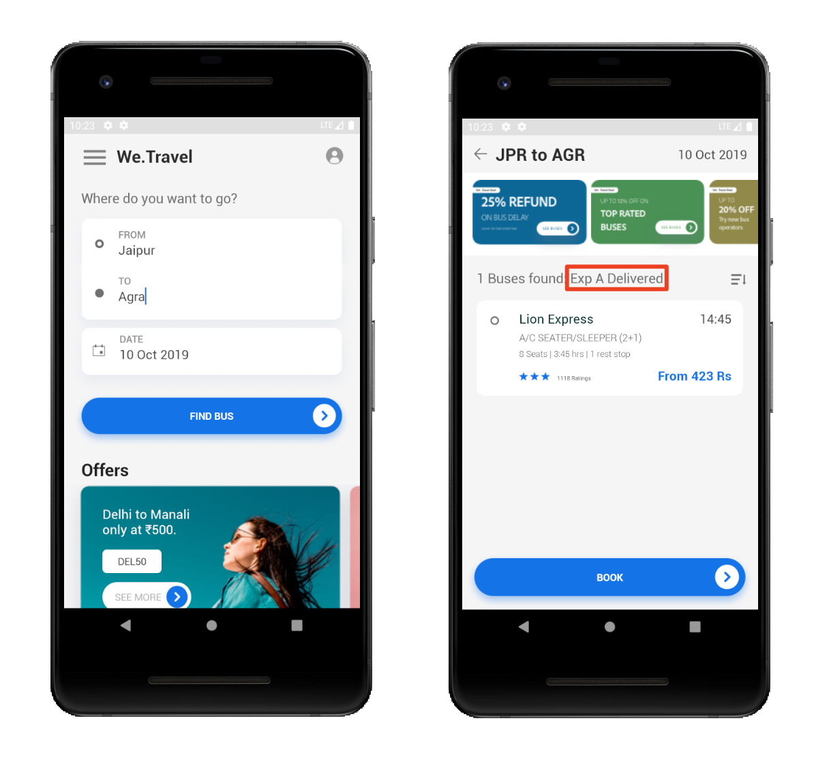

# Overview

_Implement and Use Adobe Target with Adobe Mobile Services SDK v4 for Android_ is the perfect starting point for Android developers who are already using Adobe Mobile Services SDK v4 and want to start personalizing app experiences with Adobe Target.

A demo Android app is provided for you to complete the tutorial, so you can learn the underlying techniques. After completing this tutorial, you should be ready to start implementing Target in your own Android app!

After completing this tutorial you will be able to:

* Validate the [Adobe Mobile Services SDK](https://docs.adobe.com/content/help/en/mobile-services/android/getting-started-android/requirements.html) setup
* Implement the following types of Target requests:
  * Global Pre-Fetch of all Target content
  * Blocking request (runs before App display)
  * Non-Blocking request (runs in the background)
  * Real-Time (non-caching)
  * Cache Busting Re-Fetch
* Add parameters to requests for enhanced personalization, including geo-location
* Build Feature Flagging Activities (Using Target to roll out new features)
* Personalize Layouts & Offers
* Use Adobe Target Recommendations

## Prerequisites

In these lessons, it is assumed that you:

* Have an Adobe Id and approver-level access to the Adobe Target interface
* Know your Adobe Target Client Code to direct Target calls to your own account. The Client Code is shown in the Adobe Target interface on the   Setup > Implementation > Edit at.js settings screen
* Know your Adobe Experience Cloud Org Id
* Have access to and are familiar with the [Mobile Services user interface](https://mobilemarketing.adobe.com)
* Know your Analytics tracking server and have a report suite id you can use for this tutorial
* POI references?
* Have an IDE for Android mobile app development. This tutorial features [Android Studio](https://developer.android.com/studio/install) in various steps and screenshots

If you do not have the required access to the Experience Cloud Solutions, reach out to your Experience Cloud Administrator.

<!-- Assume access to the Mobile Services UI? -->

Also, it is assumed that you are familiar with Android development in Java. You do not need to be a master of Java to complete the lessons, but you will get more out of them if you can comfortably read and understand code.

## About the Lessons

In these lessons, you will implement the Adobe Target into a demo app called "We.Travel" using your own Adobe Target account. The App has capabilities that will allow you to implement a variety of Adobe Target scenarios before you do so in your own app.

After walking through implementation within the We.Travel app you will use a simple 5 Step process to guide your own app implementation requirement process.

* Prepare your App & Configure the SDK settings
* Implement Locations within your app
* Validate Implemented Locations
* Configure a Mobile Activity in Adobe Target
* Validate the new Activity Experience within the App

Let's get started!

[Next "Download and Update the Sample App" >](download-and-update-the-sample-app.md)
