# Personalize Layouts

Now it's time to bring everything together and create the personalized experiences. An "Activity" is the Target mechanism that links the locations, audiences, and offers together, so that when the request is made from the app, Target responds with the personalized content. We'll build two personalization activities in Target and validate that personalized content is displays to the right user at the right time and in the right location.

## Learning Objectives

At the end of this lesson, you will be able to:

* Build Activities in Adobe Target
* Validate the Activities in the sample App

## Create Activities in Adobe Target

### First Activity - "Engage Users"

Here is a summary of the activity we'll build:

| Audience | Locations | Offers |
|---|---|---|
| New Mobile App Users | wetravel_engage_home, wetravel_engage_search | Home: Engage New Users, Search: Engage New Users |
| Returning Mobile App Users | wetravel_engage_home, wetravel_engage_search | Home: Returning Users, default_content |

In the Target interface do the following:

1. Select Activities > Create Activity > Experience Targeting

    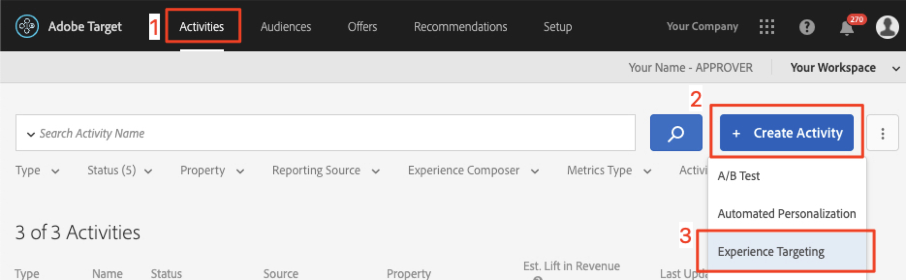

1. Click "Mobile App"
1. Select the "Form composer"
1. Select your workspace (the same workspace you used in previous lessons)
1. Select your Property  (the same property you used in previous lessons)
1. Click "Next"

    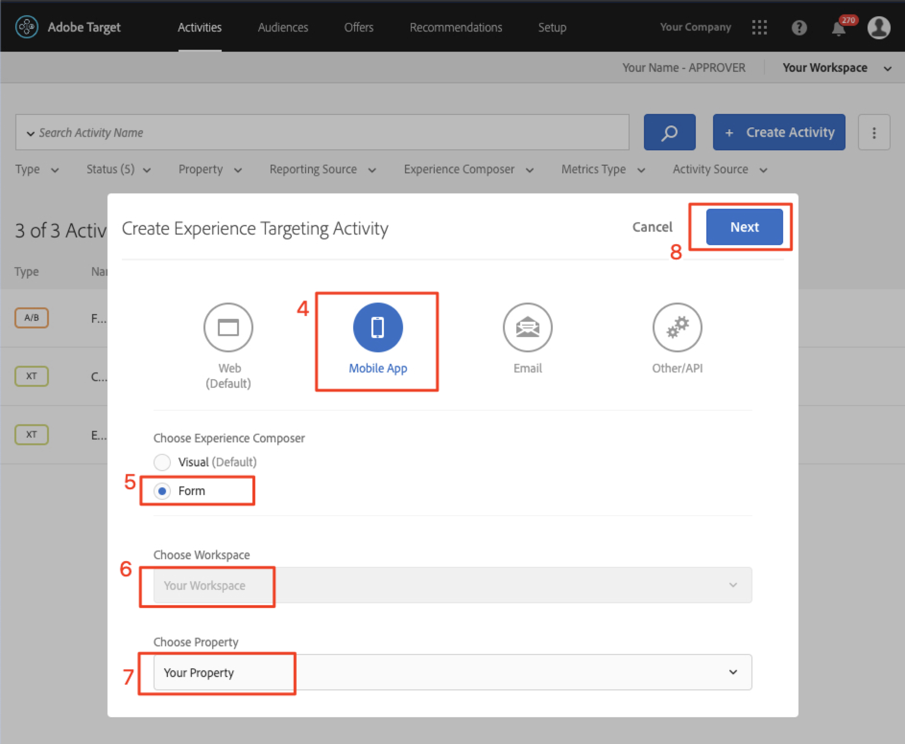

1. Change the activity title to "Engage Users"
1. Select the ellipsis > Change Audience
    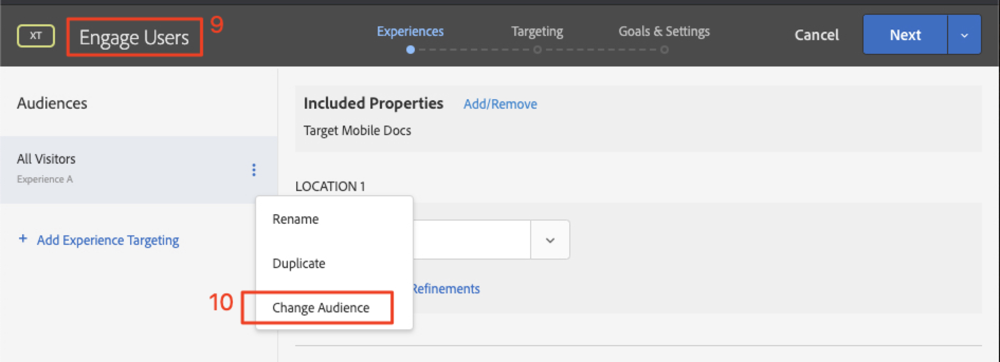
1. Set the audience to "New Mobile App Users"
1. Click "Done"
    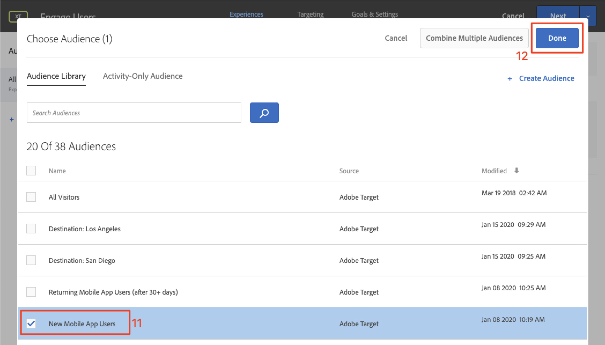

1. Change the location to "wetravel_engage_home"
1. Select the dropdown arrow next to Default Content and select "Change HTML Offer"

    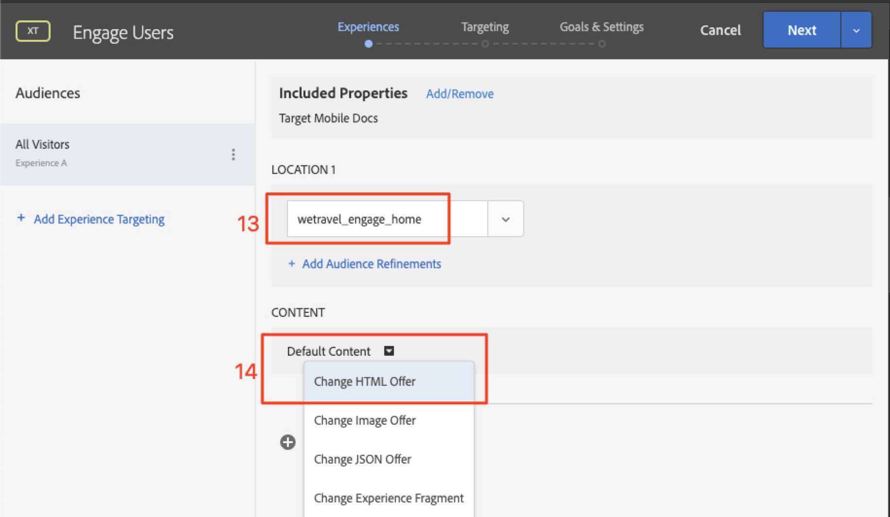

1. Select the "Home: Engage New Users" offer
1. Select "Done"

    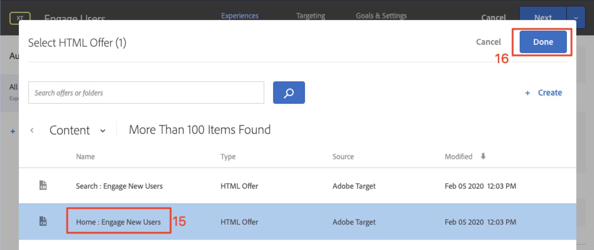

1. Select "Add Location"
    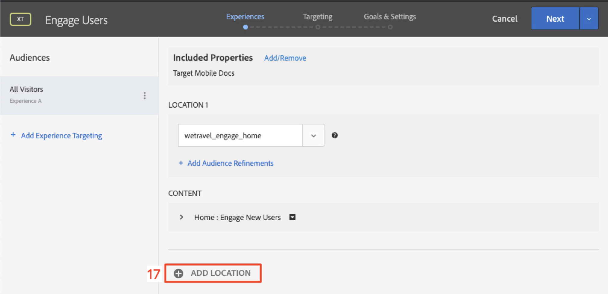

1. Select the "wetravel_engage_search" location
1. Change the HTML offer

    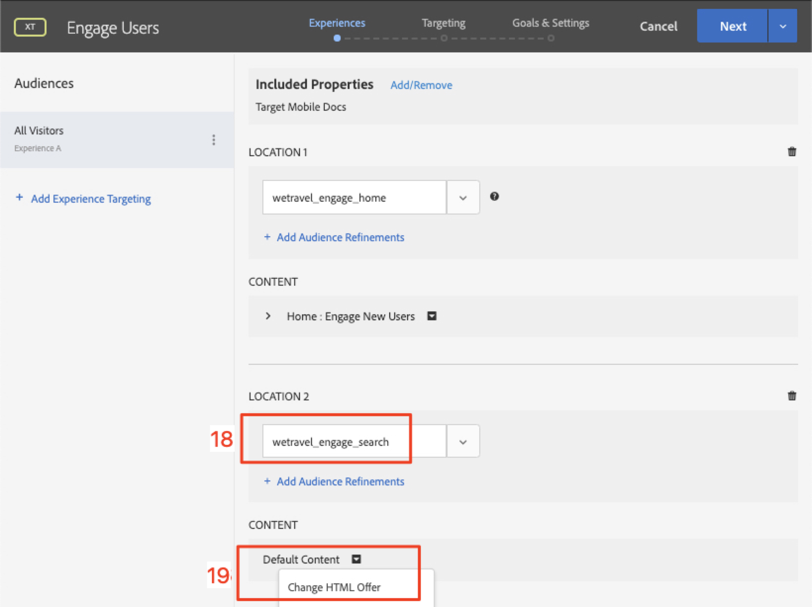

1. Select the "Search: Engage New Users" offer
1. Click "Done"

    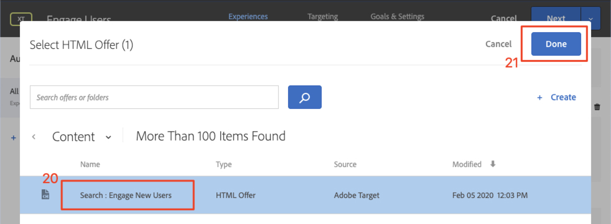

You've just connected an audience to locations and offers, creating the personalized experience for the New Mobile App Users! The experience  should now look like this:

Now create an experience for "Returning Mobile App Users":

1. Select "Add Experience Targeting" on the left
1. Select the Audience "Returning Mobile App Users"
1. Select "Done"
   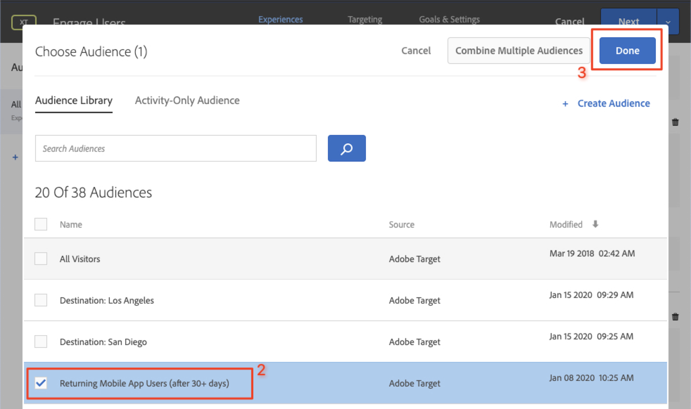

Now use the same process we used earlier to configure the new experience. The configuration for the "Returning Mobile App Users" experience  should look like this:

Let's continue to the next screen in the setu

1. Click "Next" to advance to the "Targeting" screen
1. Use the default settings for Targeting. If you had experiences for audiences that overlapped (e.g. "New York Users" and "First Time Users") you could arrange the priority order on this screen.
1. Click "Next" to advance to "Goals & Settings"

    

Now let's complete the activity setup:

1. Set the Primary Goal to "Conversion"
1. Set the action to "Viewed an mbox" > "wetravel_context_dest" (Since this location is on the confirmation screen, we can use it to measure conversions)

    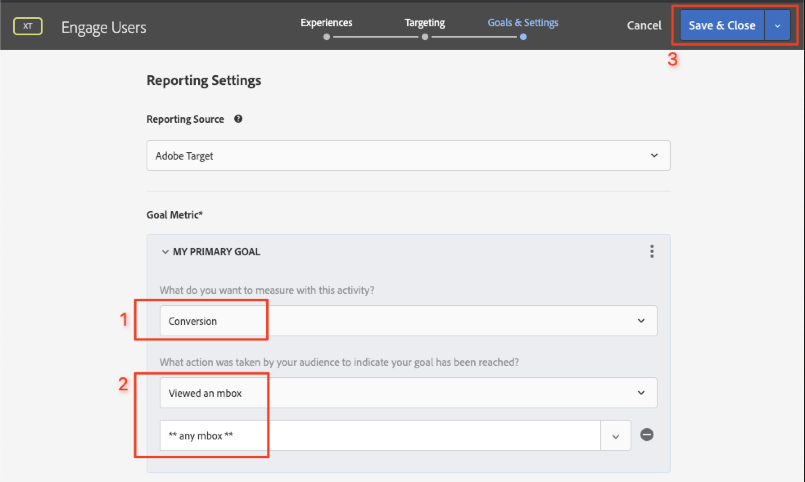

1. Keep all other settings on the screen to the defaults
1. Click "Save & Close" to save the Activity
1. Activate the Activity on the next screen

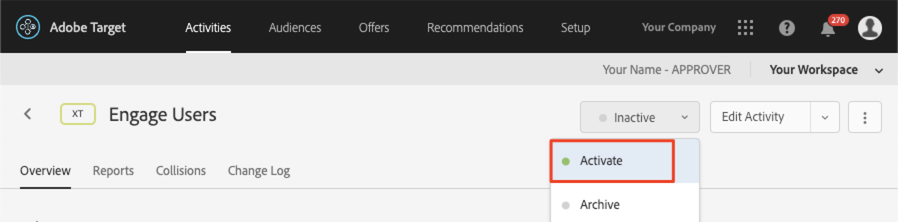

Our first activity is now live and ready to test!

### Second Activity - "Contextual Offers"

Here is a summary of the second activity we'll build:

| Audience | Location | Offers |
| --- | --- | --- |
| Destination: San Diego | wetravel_context_dest | Promotion for San Diego |
| Destination: Los Angeles | wetravel_context_dest | Promotion for Los Angeles |

Repeat the same process as above for the next Activity - "Contextual Offers". The Final configuration for both experiences are shown below:

#### San Diego

#### Los Angeles

On the Goals & Settings step, we'll change the Primary Goal to the location on booking confirmation screen:

1. Under the Reporting Settings, set the Primary Goal to "Conversion"
1. Set the action to "Viewed an mbox" > "wetravel_context_dest" (in this activity, this metric is basically meaningless since this is also the same location which delivers the experience)
1. Click "Save & Close"

Activate the Activity on the next screen.

Now our second activity is live and ready to test!

## Validate the Home Offer

Run the Emulator and watch for the first offer to display at the bottom of the home screen. If you're a returning user with 5 or more app launches, you would see the "welcome back" offer displayed. If you're a new user (less than 5 app launches), you should see the "new user" message:

If the new user offer doesn't display, try wiping the data for your emulator. That will reset the app launches to 1 the next time you launch. This is done under Tools > AVD Manager. You might need to restart Android Studio, too, if Logcat does not work properly:

You can also validate the response in Logcat by filtering for "wetravel_engage_home":

## Validate the Search Offer

Select "San Jose" as your "Departure" and "San Diego" as your "Destination" and click the "Find Bus" button to search for available buses. On the results screen, you should see the "use filters" message. If you're a returning user with 5 or more app launches, no message will appear here since default content is set for this location (which is blank):

## Validate the Contextual Offers on the Thank You Screen

Now continue through the booking process:

* Select a bus on the results screen
* Select a seat on the checkout screen
* Select "Credit Card" on the payment screen (leave the payment info blank - no actual booking will take place)

Since San Diego was selected as the destination, you should see the "DJ SAM" offer banner on the confirmation screen:

Now select "Done" and try another booking with Los Angeles as the destination. The confirmation screen should display the "Universal Studios" banner:

## Conclusion

Congratulations! This concludes the main portion of the Adobe Target SDK 4.x for Android Tutorial. You now have the skills to implement personalization in Android apps! You can refer to this documentation and demo app as a reference for your future projects.

Next: Feature Flagging is another feature that can be implemented with Adobe Target in Android. To learn about feature flagging, check out the next lesson.

**[NEXT : "Feature Flagging" >](feature-flagging.md)**
