# Personalize Layouts

Now it's time to bring everything together and create the personalized experiences. A Target "Activity" is the Target mechanism that links the locations, audiences, and offers together, so that when the request is made from the app, Target will respond with the personalized content. We'll build two personalization activities in Target and validate that personalized content is displaying in the app to the right user at the right time and in the right location.

## Learning Objectives

At the end of this lesson, you will be able to:

* Build Activities in Adobe Target for Our Audiences
* Validate the Activities in the Demo App

## Create Activities in Adobe Target

### First Activity - "Engage Users"

Here is a summary of the activity we'll build:

| Audience | Locations | Offers |
|---|---|---|
| New Mobile App Users | wetravel_engage_home, wetravel_engage_search | Home_Engage_New_Users, Search_Engage_New_Users |
| Returning Users (after 30+ days) | wetravel_engage_home, wetravel_engage_search | Home_Returning Users, default_content |

In the Target interface select the following:

* Activities > Create Activity > Experience Targeting
* Select Mobile App
* Select the Form composer
* Select your Workspace and Property
* Click Next

On the next screen, we'll add our first "Engage Users" experience:

* Change the activity title to "Engage Users"
* Select the ellipsis > Change Audience

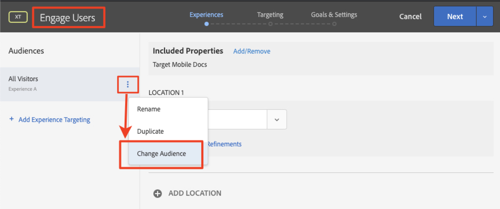

* Set the audience to "New Mobile App Users"

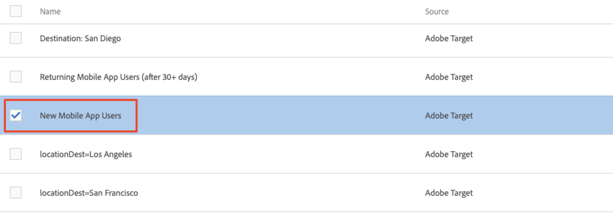

* Now set the first offer for the first location
* Select the wetravel_engage_home location
* Change the HTML Offer

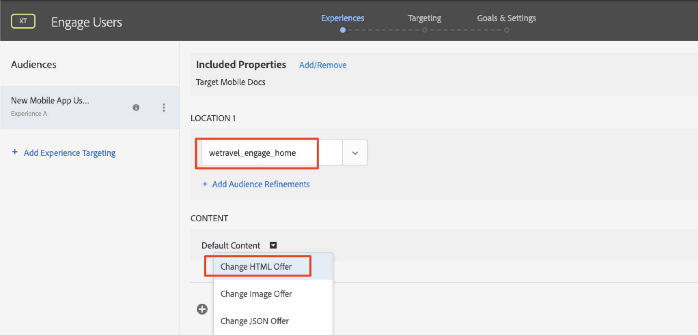

* Select the "Home_Engage_New_Users" offer

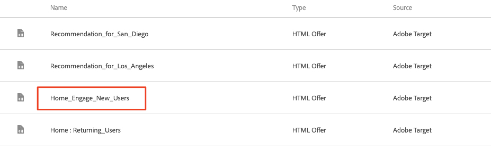

Now add the second offer for this same activity:

* Select the "wetravel_engage_search" location
* Change the HTML offer

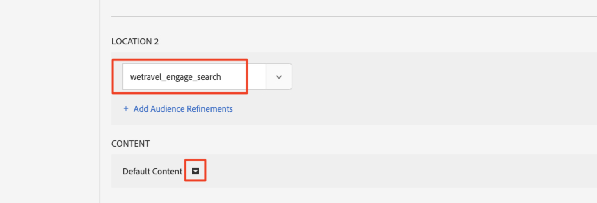

* Select the "Search : Engage_New_Users" HTML offer:

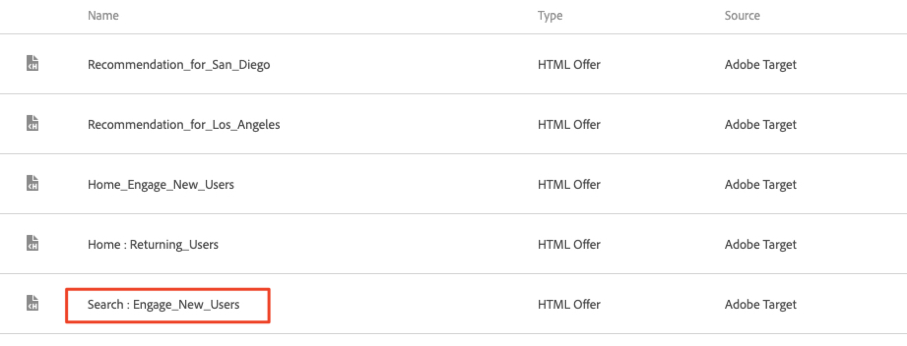

The configuration for the "New Mobile App Users" experience (Experience A) should now look like this:

#### Experience A Configuration

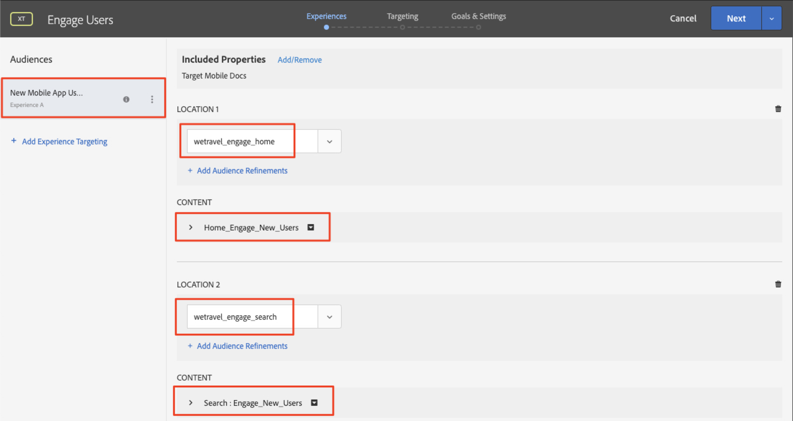

Now create an experience for "Returning Mobile App Users" (Experience B).

* Select "Add Experience Targeting" on the left
* Select the Audience "Returning Mobile App Users (after 30+ days)"
* Use the same process for Experience A to configure Experience B

The configuration for the "Returning Mobile App Users" experience (Experience B) should now look like this:

#### Experience B Configuration

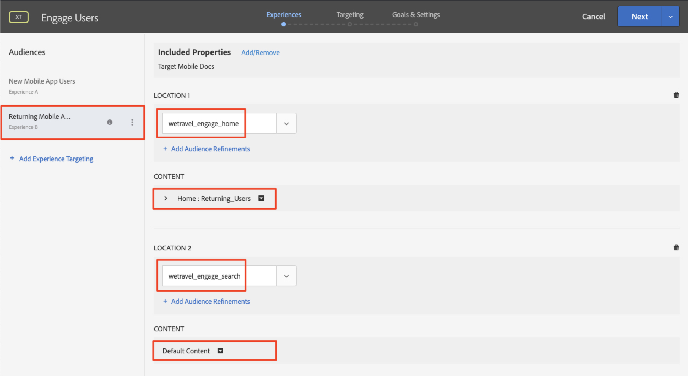

* Select "Next"
* Use the default settings for Targeting

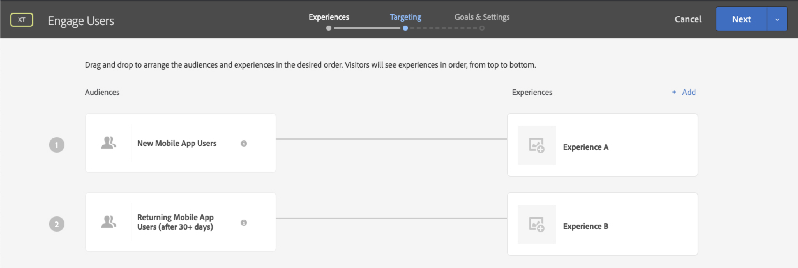

* Select "Next" to advance to "Goals & Settings"
* Set the Primary Goal to "Conversion"
* Set the action to "Viewed an mbox" > "any mbox"

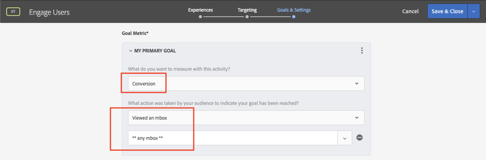

* Keep all other settings on the screen to the defaults
* Save & Close the Activity
* Activate the Activity on the next screen

Our first activity is now live and ready to test!

### Second Activity - "Contextual Offers"

Here is a summary of the second activity we'll build:

| Audience | Location | Offers |
| --- | --- | --- |
| Destination: San Diego | wetravel_context_dest | Recommendation_for_San_Diego |
| Destination: Los Angeles | wetravel_context_dest | Recommendation_for_Los_Angeles |

Repeat the same process as above for the next Activity - "Contextual Offers". The Final configuration for both experiences are shown below:

### Experience A

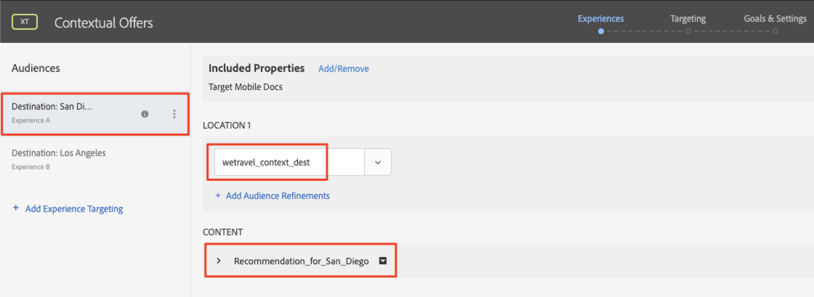

### Experience B

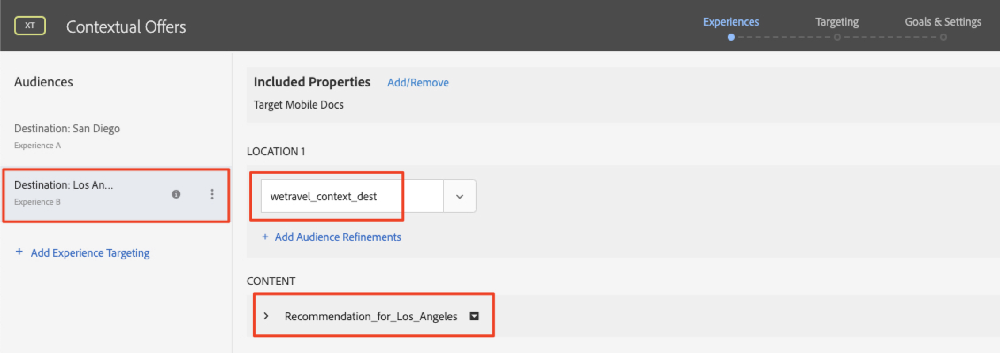

Use the same configurations we used in the first activity for the Targeting and Goals & Settings steps. Activate the activity.

Now our second activity is live and ready to test!

## Validate the Home Offer

Run the Emulator and watch for the first offer to display at the bottom of the home screen. If you're a returning user after 30 days of inactivity, you would see the "welcome back" offer displayed. Since you're likely a new user (less than 2 days of use), you should see the "new user" message:

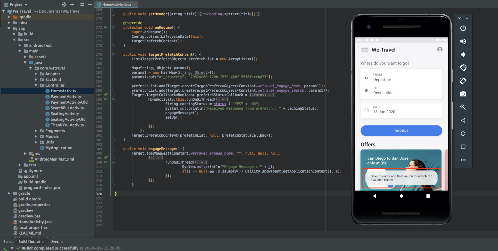

If the message doesn't display, try wiping the data for your emulator. This is done under Tools > AVD Manager:

You can also validate the response in Logcat by filtering for "wetravel_engage_home":

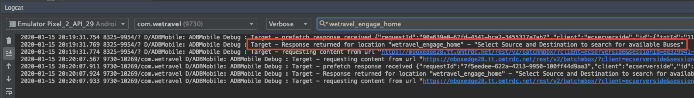

## Validate the Search Offer

Select San Diego as your destination and search for available buses. On the results screen, you should see the "use filters" message. If you're a returning user after 30 days of inactivity, no message will appear here since default content is set for this location (which is blank):

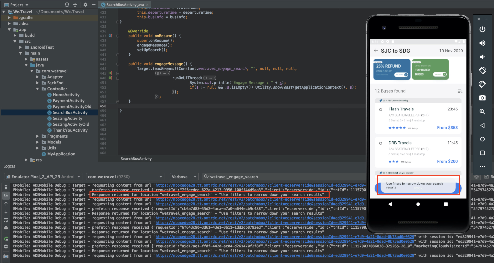

## Validate the Contextual Offers on the Thank You Screen

Now continue through the booking process:

* Select a bus on the results screen
* Select a seat on the checkout screen
* Select "Credit Card" on the payment screen (leave the payment info blank - no actual booking will take place)

Since San Diego was selected as the destination, you should see the "DJ SAM" offer banner on the confirmation screen:

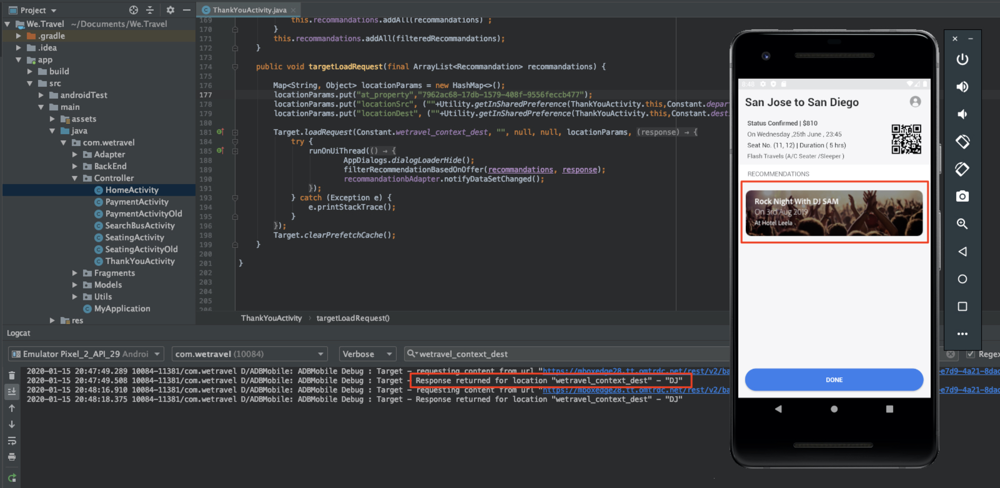

Now select "Done" and try another booking with Los Angeles as the destination. The confirmation screen should display the "Universal Studios" banner:

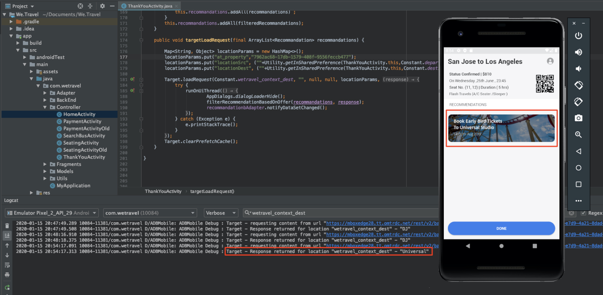

## Conclusion

Congratulations! This concludes the Adobe Target SDK 4.x for Android Tutorial. You now have the skills to implement personalization in Android apps! You can refer to this documentation and demo app as a reference for your future projects.

**Next: Feature Flagging is another feature that can be implemented with Adobe Target in Android. To learn about feature flagging, check out the next lesson.

**[NEXT : "Feature Flagging" >](feature-flagging.md)**
