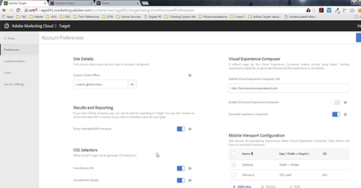
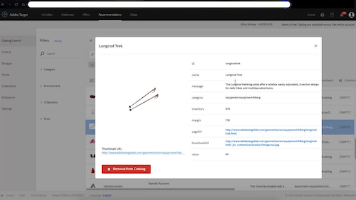
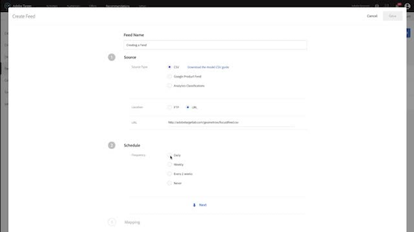
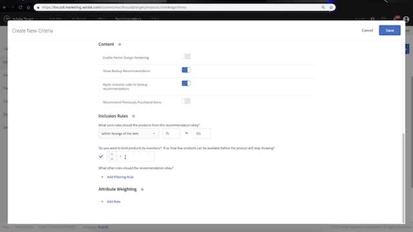
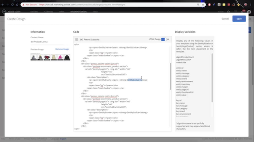

# Overview

A collection of how-to videos and tutorials to make you a power-user of Adobe Target

## What's New

<table>
<tr>
  <td> <a href="https://docs.adobe.com/content/help/en/experience-cloud/implementing-in-mobile-ios-swift-apps-with-launch/index.html">Implement Target in iOS Swift&trade; Apps</a></td>
  <td> <a href="https://docs.adobe.com/content/help/en/experience-cloud/implementing-in-mobile-ios-objective-c-apps-with-launch/index.html">Implement Target in iOS Objective-C Apps</a></td>
  <td> <a href="https://docs.adobe.com/content/help/en/experience-cloud/implementing-in-mobile-android-apps-with-launch/index.html">Implement Target in Android&trade; Apps</a></td>
  <td> </td>
</tr>
</table>

## Implementation

<table>
<tr>
  <td> <a href="https://docs.adobe.com/content/help/en/experience-cloud/implementing-in-websites-with-launch/implement-solutions/target.html">Implement Target with Adobe Experience Platform Launch</a></td>
  <td> <a href="implementation/implement-atjs-20-in-a-single-page-application.md">Implement at.js 2.0 in a Single Page Application (SPA)</a></td>
  <td> <a href="implementation/understanding-how-atjs-20-works.md">How at.js 2.0 Works</a></td>
  <td> <a href="https://docs.adobe.com/content/help/en/core-services-learn/tutorials/id-service/use-opt-in-to-control-experience-cloud-activities-based-on-user-consent.html">Using Opt-in to Control Experience Cloud Solutions Based on User Consent</a></td>
</tr>
<tr>
  <td> <a href="https://docs.adobe.com/content/help/en/experience-cloud/implementing-in-mobile-ios-swift-apps-with-launch/index.html">Implement Target in iOS Swift&trade; Apps</a></td>
  <td> <a href="https://docs.adobe.com/content/help/en/experience-cloud/implementing-in-mobile-ios-objective-c-apps-with-launch/index.html">Implement Target in iOS Objective-C Apps</a></td>
  <td> <a href="https://docs.adobe.com/content/help/en/experience-cloud/implementing-in-mobile-android-apps-with-launch/index.html">Implement Target in Android&trade; Apps</a></td>
  <td> </td>
</tr>
</table>

## Activities

<table>
<tr>
  <td> <a href="activities/understanding-the-types-of-activities.md">Understanding the Types of Activities in Adobe Target</a></td>
  <td> <a href="activities/create-ab-tests.md">Create A/B Tests</a></td>
  <td> <a href="activities/create-experience-targeting-activities.md">Create Experience Targeting Activities</a></td>
  <td> <a href="activities/create-multivariate-tests.md">Create Multivariate Tests</a></td>
</tr>
<tr>
  <td> <a href="activities/use-activity-targeting.md">Use Activity Targeting</a></td>
  <td> <a href="activities/use-activity-settings.md">Use Activity Settings</a></td>
  <td> <a href="activities/use-metrics-in-activities.md">Use Metrics in Activities</a></td>
  <td> </td>
</tr>
</table>

## Audiences

<table>
<tr>
  <td> <a href="audiences/use-audiences.md">Use Audiences</a></td>
  <td> <a href="audiences/create-profile-scripts.md">Create Profile Scripts</a></td>
  <td> <a href="audiences/use-profile-comparison-to-build-audiences.md">Use Profile Comparison to Build Audiences</a></td>
  <td> </td>
</tr>
</table>

## Experiences

<table>
<tr>
  <td> <a href="experiences/use-the-visual-experience-composer.md">Use the Visual Experience Composer</a></td>
  <td> <a href="experiences/use-the-form-based-experience-composer.md">Use the Form-Based Experience Composer</a></td>
  <td> <a href="experiences/use-the-visual-experience-composer-for-single-page-applications.md">Use the Visual Experience Composer for Single Page Apps</a></td>
  <td> <a href="https://helpx.adobe.com/experience-manager/kt/sites/using/experience-fragment-target-offer-feature-video-use.html">Use AEM Experience Fragments in Adobe Target</a></td>
</tr>
</table>

## Reports

<table>
<tr>
  <td> <a href="reports/use-the-personalization-insights-reports.md">Use the Personalization Insights Reports</a></td>
  <td> </td>
  <td> </td>
  <td> </td>
</tr>
</table>

## Integrations

<table>
<tr>
  <td> <a href="integrations/use-analytics-as-a-data-source-a4t.md">Use Analytics as a Data Source for Target (A4T)</a></td>
  <td> <a href="integrations/use-data-providers-to-integrate-third-party-data.md">Data In: Use Data Providers to integrate third-party data</a></td>
  <td> <a href="integrations/implement-data-providers-to-integrate-third-party-data.md">Data In: Implement Data Providers to integrate third-party data</a></td>
  <td> <a href="integrations/use-response-tokens-and-atjs-custom-events.md">Data Out: Use Response Tokens and at.js Custom Events</a></td>
</tr>
<tr>
    <td> <a href="https://helpx.adobe.com/experience-manager/kt/sites/using/experience-fragment-target-offer-feature-video-use.html">Use AEM Experience Fragments in Adobe Target</a></td>
  <td> </td>
  <td> </td>
  <td> </td>
</tr>
</table>

## Administration

<table>
<tr>
  <td> <a href="administration/set-up-account-preferences.md">Set up Account Preferences</a></td>
  <td> <a href="administration/understanding-enterprise-user-permissions.md">Understand Enterprise User Permissions</a></td>
  <td> <a href="administration/set-up-workspaces.md">Set up Workspaces</a></td>
  <td> <a href="administration/set-up-properties.md">Set up Properties</a></td>
</tr>
</table>

## Recommendations

<table>
<tr>
  <td> <a href="recommendations/create-a-recommendations-activity.md">Create a Recommendations Activity</a></td>
  <td> <a href="recommendations/understanding-feeds.md">Understanding Feeds</a></td>
  <td> <a href="recommendations/create-a-feed.md">Create a Feed</a></td>
  <td> <a href="recommendations/create-criteria.md">Create Criteria</a></td>
</tr>
<tr>
  <td> <a href="recommendations/create-custom-designs.md">Create Custom Designs</a></td>
  <td> <a href="recommendations/create-collections-and-exclusions.md">Create Collections and Exclusions</a></td>
  <td> </td>
  <td> </td>
</tr>
</table>

## Troubleshooting

<table>
<tr>
  <td> <a href="troubleshooting/troubleshoot-with-the-experience-cloud-debugger.md">Troubleshoot Target with the Experience Cloud Debugger</a></td>
  <td> </td>
  <td> </td>
  <td> </td>
</tr>
</table>

_Apple, the Apple logo, iPad, iPhone, iPod, and iPod touch are trademarks of Apple Inc., registered in the U.S. and other countries. Swift and the Swift logo are trademarks of Apple Inc. 
Android is a trademark of Google LLC._