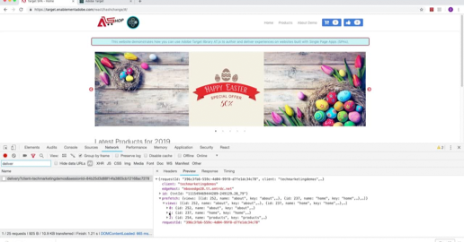

# Learn to use Adobe Target

Adobe Target is the Adobe Experience Cloud solution that provides everything you need to tailor and personalize your customers' experience so you can maximize revenue on your web and mobile sites, apps, social media, and other digital channels. Use these videos and tutorials to learn the many components of Adobe Target.

## What's New

* **[Setting up A4T reports in Analysis Workspace for Auto-Target activities](integrations/set-up-a4t-reports-in-analysis-workspace-for-auto-target-activities.md)**
    *For business practitioners: Are you using A4T for Auto-Target? Follow these steps to configure A4T reports in Analysis Workspace to make sure you get expected results when running Auto-Target activities.*
* **[On-Device Decisioning Overview](implementation/on-device-decisioning-overview.md)**
    *For architects: Get started with on-device decisioning to deliver near-zero latency experiences to your consumers!*
* **[Use the Recommendations API (Tutorial)](recommendations-api-tutorial/recs-api-overview.md)**
    *For developers: Get hands-on practice using the [!DNL Recommendations] APIs to configure and manage [!DNL Recommendations] catalogs and custom criteria, and more.*

<!--* **[Implement Adobe Target with Adobe Mobile Services SDK v4 for Android (Tutorial)](mobile-v4/overview.md)**
    *For developers who are already using Adobe Mobile Services SDK v4: learn how to start personalizing app experiences with Adobe Target. These steps are provided as legacy user support.*<!-- Concepts learned here are also applicable to Adobe Experience Platform Mobile SDK (v5).-->

<!--* **[Use Recommendations Offers (Video)](recommendations/use-recommendations-offers.md)**
    *For all Target Users: Learn how to use product recommendations in A/B and Experience Targeting Activities.*-->

<!--
* **[Create a Recommendations Activity (Video)](recommendations/create-a-recommendations-activity.md)**
     
    *Recommend products to your customers at scale with this Premium feature.* -->

## Staff Picks

<table>
<tr>
  <td>
    
    

      <a href="https://docs.adobe.com/content/help/en/experience-cloud/implementing-in-websites-with-launch/implement-solutions/target.html">
    <strong>Implement Target with Adobe Experience Platform Launch</strong>
    </a>
    

    

    <em>Accelerate web implementation with Launch</em>
    

  </td>
  <td>
    
    

      <a href="implementation/implement-atjs-20-in-a-single-page-application.md">
    <strong>Implement at.js 2.0 in a Single Page Application (SPA)</strong>
    </a>
    

    

    <em>See how at.js 2.x supports SPA</em>
    

  </td>
  <td>
    
    

      <a href="troubleshooting/troubleshoot-with-the-experience-cloud-debugger.md">
    <strong>Troubleshoot Target with the Experience Cloud Debugger</strong>
    </a>
    

    

    <em>Zoom in on your implementation</em>
    

  </td>
</tr>
</table>
