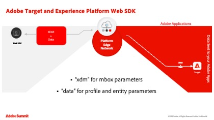
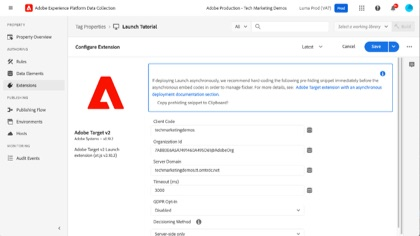
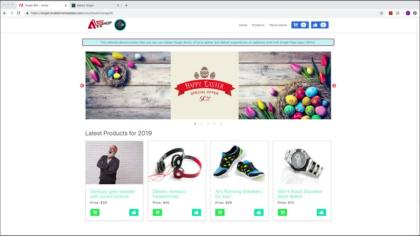

# Adobe Target tutorials

[!DNL Adobe Target] is the [!DNL Adobe Experience Cloud] solution that provides everything you need to tailor and personalize your customers' experience. [!DNL Target] helps you maximize revenue on your web and mobile sites, apps, social media, and other digital channels. Use these videos and tutorials to learn the many components of [!DNL Adobe Target].

>[!NOTE]
>
>In addition to this guide, the following [!DNL Adobe Target] guides are also available:
>
>* *[Adobe Target Business Practitioner Guide](https://experienceleague.adobe.com/docs/target/using/target-home.html){target=_blank}*
>
>* *[Adobe Target Developer Guide](https://experienceleague.adobe.com/docs/target-dev/developer/overview.html){target=_blank}*

## Staff picks

<table style="margin-top: 0 !important">
<tr>
  <td>
    
    

      <a href="https://experienceleague.adobe.com/docs/platform-learn/migrate-target-to-websdk/introduction.html">
    <strong>Migrate Target from at.js to Platform Web SDK</strong>
    </a>
    

    

    <em>Learn how to migrate your at.js implementation to Adobe Experience Platform Web SDK.</em>
    

  </td>
  <td>
    
    

      <a href="https://experienceleague.adobe.com/docs/platform-learn/implement-in-websites/implement-solutions/target.html">
    <strong>Implement Target with Adobe Experience Platform Tags</strong>
    </a>
    

    

    <em>Learn how to implement the Adobe Target extension with a page load request and custom parameters.</em>
    

  </td>
   <td>
    
    

    <a href="https://experienceleague.adobe.com/docs/target-learn/tutorials/implementation/implement-atjs-20-in-a-single-page-application.html">
    <strong>Implement at.js 2.0 in a SPA</strong>
    </a>
    

    

    <em> Learn how to implement Adobe Target's at.js 2.0 (and later) in Single Page Applications (SPA).</em>
    

  </td>
</tr>
</table>