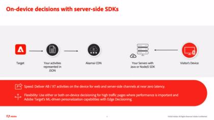
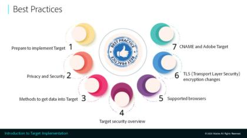
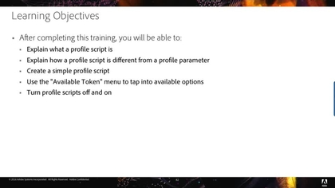
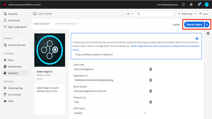
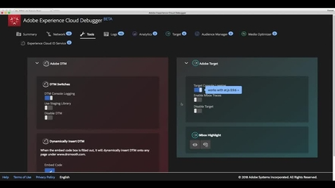

# Learn to use Adobe Target

[!DNL Adobe Target] is the [!DNL Adobe Experience Cloud] solution that provides everything you need to tailor and personalize your customers' experience. [!DNL Target] helps you maximize revenue on your web and mobile sites, apps, social media, and other digital channels. Use these videos and tutorials to learn the many components of [!DNL Adobe Target].

>[!NOTE]
>
>In addition to this guide, the following [!DNL Adobe Target] guides are also available:
>
>* *[Adobe Target Business Practitioner Guide](https://experienceleague.adobe.com/docs/target/using/target-home.html){target=_blank}*
>
>* *[Adobe Target Developer Guide](https://experienceleague.adobe.com/docs/target-dev/developer/overview.html){target=_blank}*

## What's new

The following resources are new:

* **[Setting up A4T reports in [!DNL Analysis Workspace] for [!DNL Auto-Allocate] activities](integrations/set-up-a4t-reports-in-analysis-workspace-for-auto-allocate-activities.md){target=_blank}**

    *For business practitioners: The [!UICONTROL Analytics for Target] (A4T) integration for [!UICONTROL Auto-Allocate] allows you to see your reporting data in [!DNL Adobe Analytics], and you can even optimize for custom events or metrics defined in [!DNL Analytics].*

* **[Setting up A4T reports in [!DNL Analysis Workspace] for [!UICONTROL Auto-Target] activities](integrations/set-up-a4t-reports-in-analysis-workspace-for-auto-target-activities.md){target=_blank}**

    *For business practitioners: Are you using A4T for [!UICONTROL Auto-Target]? Follow these steps to configure A4T reports in [!DNL Analysis Workspace] to make sure you get expected results when running [!UICONTROL Auto-Target] activities.*

* **[On-device decisioning](implementation/on-device-decisioning-overview.md)**

    *For architects: Get started with [!UICONTROL on-device decisioning] to deliver near-zero latency experiences to your consumers.*

* **[Migrate [!DNL Target] from at.js 2.x to [!DNL Platform Web SDK]](https://experienceleague.adobe.com/docs/platform-learn/migrate-target-to-websdk/introduction.html){target=_blank}**

    *Learn how to migrate a [!DNL Target] at.js implementation to [!DNL Adobe Experience Platform Web SDK].*

## Most-popular videos

<table>
<tr>
  <td>
    
    

      <a href="https://experienceleague.adobe.com/docs/target-dev/developer/server-side/on-device-decisioning/overview.html">
    <strong>On-device decisioning overview</strong>
    </a>
    

    <!--- 

    <em>Learn how to implement the Adobe Target extension with a page load request and custom parameters.</em>
    
 --->
  </td>
   <td>
    
    

    <a href="https://experienceleague.adobe.com/docs/target-learn/tutorials/implementation/2.1-intro-to-target-implementation.html">
    <strong>Introduction to Adobe Target implementation</strong>
    </a>
    

    <!--- 

    <em> Learn how to implement at.js 2.0 (and later) in SPAs.</em>
    
 --->
  </td>
  <td>
    
    

      <a href="https://experienceleague.adobe.com/docs/target-learn/tutorials/audiences/create-profile-scripts.html">
    <strong>Create profile scripts in Adobe Target</strong>
    </a>
    

    <!--- 

    <em>Learn how to use the Adobe Experience Cloud Debugger to understand your [!DNL Target] implementation. Learn how to quickly view your library configuration, examine requests to make sure that your custom parameters are being passed correctly, turn on console logging, and disable all [!DNL Target] requests, and use the Mbox Trace tool.</em>
    
 --->
  </td>
</tr>
</table>

## Staff picks

<table>
<tr>
  <td>
    
    

      <a href="https://experienceleague.adobe.com/docs/platform-learn/implement-in-websites/implement-solutions/target.html">
    <strong>Implement Target with Adobe Experience Platform Tags</strong>
    </a>
    

    

    <em>Learn how to implement the Adobe Target extension with a page load request and custom parameters.</em>
    

  </td>
   <td>
    
    

    <a href="https://experienceleague.adobe.com/docs/target-learn/tutorials/implementation/implement-atjs-20-in-a-single-page-application.html">
    <strong>Implement Adobe Target's at.js 2.0 in a Single Page Application (SPA)</strong>
    </a>
    

    

    <em> Learn how to implement at.js 2.0 (and later) in SPAs.</em>
    

  </td>
  <td>
    
    

      <a href="https://experienceleague.adobe.com/docs/target-learn/tutorials/troubleshooting/troubleshoot-with-the-experience-cloud-debugger.html">
    <strong>Troubleshoot Target with the Experience Cloud Debugger</strong>
    </a>
    

    

    <em>Learn how to use the Adobe Experience Cloud Debugger to understand your [!DNL Target] implementation. Learn how to quickly view your library configuration, examine requests to make sure that your custom parameters are being passed correctly, turn on console logging, and disable all [!DNL Target] requests, and use the Mbox Trace tool.</em>
    

  </td>
</tr>
</table>