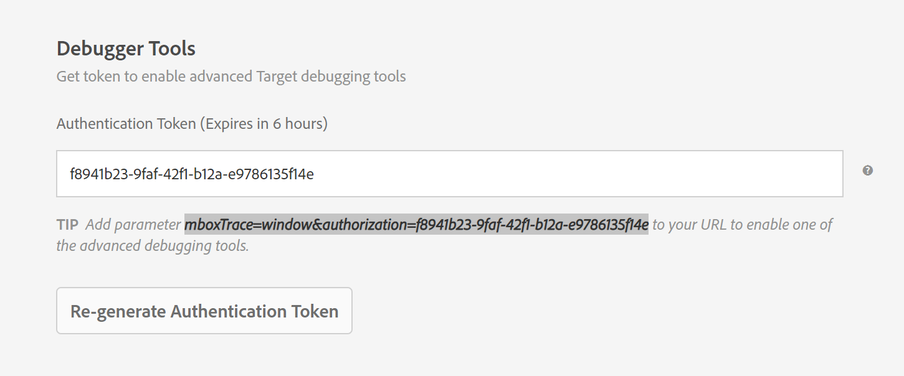
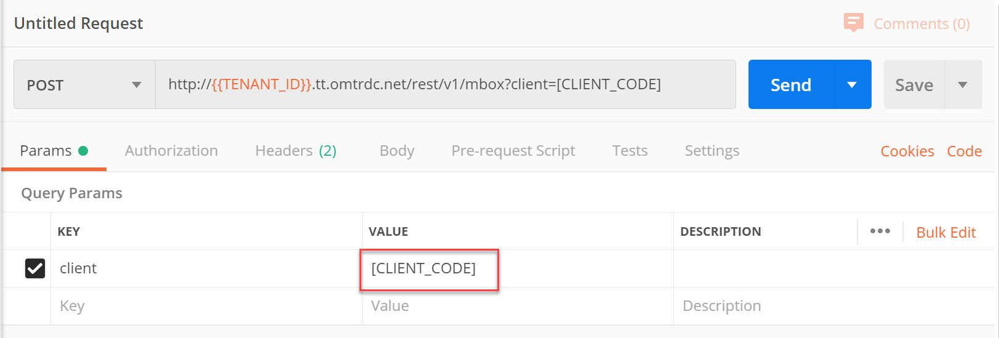
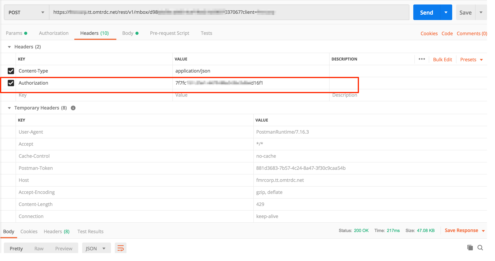
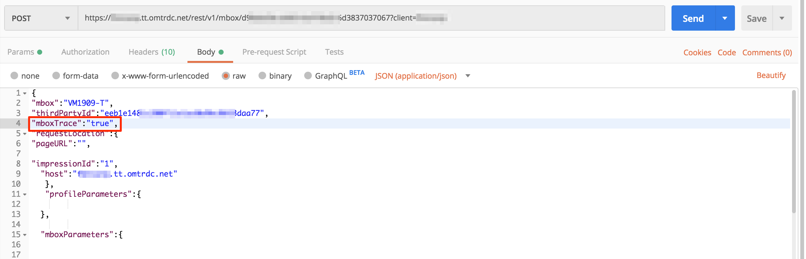
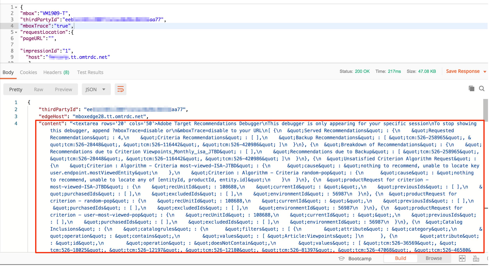

# Debugging API Calls

Adobe Target provides built-in [debugging functionality](https://docs.adobe.com/help/en/target/using/activities/troubleshoot-activities/content-trouble.html) to help assess issues that can arise when implementing a recommendation, such as a broken design template, recommendations not being returned, and so on.

Let's step through an example of using Adobe Target debugging functionality.

1. In Adobe Target, navigate to **Setup > Implementation > Debugger Tools**, and click **Generate Authentication Token**.
2. Copy the Authentication Token.
   
3. Navigate to **Recommendations > Settings > Recommendation API Token**, and note your **Client Code.**
4. In Postman, create a POST request <!-- Judy: Is this the correct syntax? Is there no accompanying developer documentation? -->

    `http://{{TENANT_ID}}.tt.omtrdc.net/rest/v1/mbox?client=[CLIENT_CODE]`
5. Substitute your client code in place of `[CLIENT_CODE]`. (If you have followed [previous steps](2configure-io-target-integration.md) in this tutorial, your `{{TENANT_ID}}` Postman environment variable should work, as written.)
   
6. Add your mbox name and other parameters to qualify for a recommendations activity and retrieve results. <!--JUDY: David: Missing body - Where can I get a working example of this? -->
7. Add [!UICONTROL Content-Type] and [!UICONTROL Authorization] headers. For the [!UICONTROL Authorization] value, paste your [!UICONTROL Authentication Token] (copied earlier from the [!DNL Target] UI).
   
8. Add the following to the body:  `"mboxTrace" : "true"`.<!-- JUDY: Where can I get this sample JSON for the body?? Ask John. Couple options: can say, this assumes you did something like tutorial #5, and we're running debug against that. Other option: We assume you have some existing recs activity you want to debug, so we won't explain the params you need to send in for that activity, we're just showing you how to add the debugging parameter. Option 1. Built out the entire activity, now applying trace to that activity. So in #5 tutorial, have them pick specific criteria, and specify which mbox/profile params based on the biz outcome trying to achieve. e.g. If trying to built a criteria that will retrieve similar items based on a content similarity alg, based on the currently viewed item. In which case, need to provide entity.id.-->
   
9. POST the API. Examine the debug response code in the response.
   

<!-- Judy: Rob: Need more info here. What do I need to do to set up an example of meaningful debug code? Answer: Copy the "content," and if you paste it in HTML to viewpretty. Examine the content to see what seems meaningful. e.g. Here's the items that were excluded, here's the logic, here's the criteria, etc. Intentional error: provide an entity id value that doesn't have recommendations available. Will need a site with recs running on it. CHeck out: https://docs.adobe.com/content/help/en/target/using/recommendations/recommendations-faq/recommendations-faq.html#what-does-the-no-content-response-sometimes-returned-in-the-recommendations-content-trace-mean-->

[Next "Downloading the Calculated Recommendations CSV" >](7download-calc-recs-csv.md)