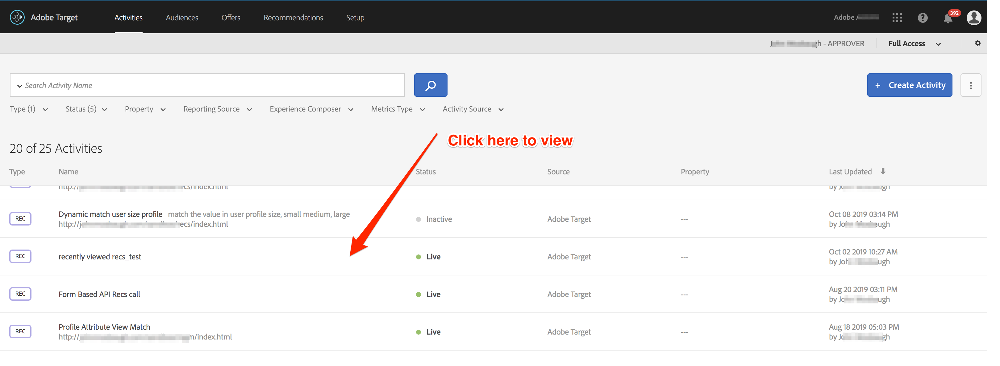
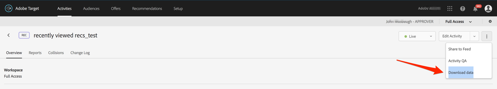

# Download the Calculated Recommendations CSV

The [!DNL Adobe Target Recommendations] calculated Recommendations CSV file shows a complete set of key entities, alongside the other entities recommended when a user views that key entity. The CSV shows recommendations calculated for each Criteria and Environment, for the given recommendation. This file can be useful when debugging or verifying the efficacy of recommendations. This may also be useful when integrating Recommendations with an external system in batch, such as email, or an offline channel. <!--Judy: fix wording in this paragraph --> You can retrieve all recommendations in your product catalog. <!-- Currently, customers can only download the generated CSV files for a specific recommendation by getting the download link from the Target Recommendations UI and storing it to re-use at a later time. This link does not expire. -->

1. In Adobe Target, navigate to **Activities**. Click on your recommendation (view the activity, as opposed to editing it).
   
2. Once you are viewing the recommendation details, click the More button (three vertical dots, upper right corner). Select [!DNL Download data] to download the CSV of calculated recommendations, using a browser.
   
3. Alternatively, to save the link for later re-use, right-click **Download data** and copy the link. The link will not expire, and will be in the following format:
   `https://recommendations.omniture.com/rest/?action=recommendations.file.download&recommendations={{RecsID}}&client={{clientcode}}&clientToken={{RecommendationsToken}}`
4. Store this URL. When you need to access it later, submit it in a browser, making the following substitutions.
   * RecsID = your recommendation name. The Recommendations ID is only accessible in this link and does not change. <!-- JUDY: Rob: What does that mean? And how does this work, since Recs names can have spaces in them...? this is an internal identifier required to use this API -->
   * clientcode = Client Code, found in Adobe Target by navigating to **Recommendations > Settings > Recommendation API Token**.
   * RecommendationsToken = API Token, found in Adobe Target by navigating to **Recommendations > Settings > Recommendation API Token**. Note this value does not change unless you reset it.

For example, 
   `https://recommendations.omniture.com/rest/?action=recommendations.file.download&recommendations={{MyRecommendation}}&client={{judykim}}&clientToken={{7c42b779-5fff-42b8-9fa5-18c1d6eec6dc}}`
<!-- JUDY: Rob: Help me fix this example? You'll need to generate this by walking through the steps. NOTE: Recently viewed will not return anything for this. Better to have Top Viewed. In fact, call out: Recently Viewed will not return anything for this, because that is not calculated offline, it just shows what you just recently viewed. We don't download this for every possible user.-->

## Summary and Review

Congratulations! By finishing this tutorial, you have learned how to:
* [Configure an Adobe.IO Target integration](2configure-io-target-integration.md)
* [Manage your catalog](3manage-catalog.md)
* [Manage custom criteria](4manage-custom-criteria.md)
* [Use the Delivery API with recommendations](5fetch-recs-server-side-delivery-api.md)
* [Debug](6debug.md)
* [Download the calculated Recommendations CSV](7download-calc-recs-csv.md)
