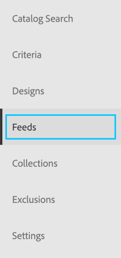
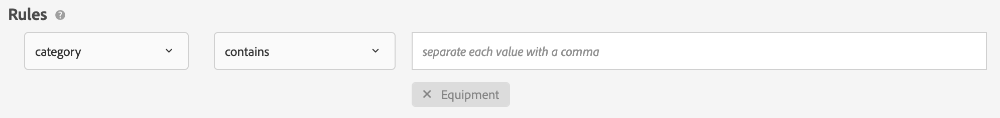
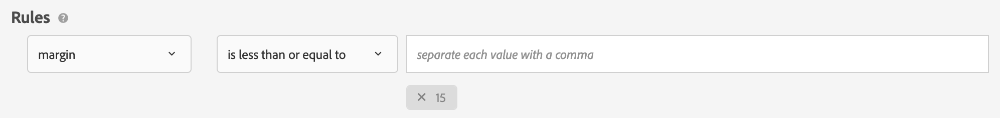
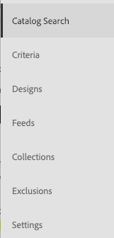
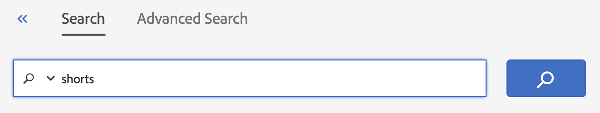
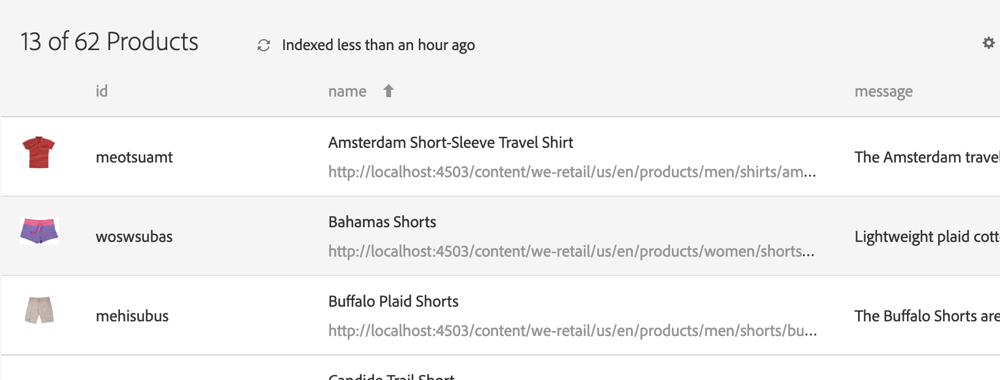
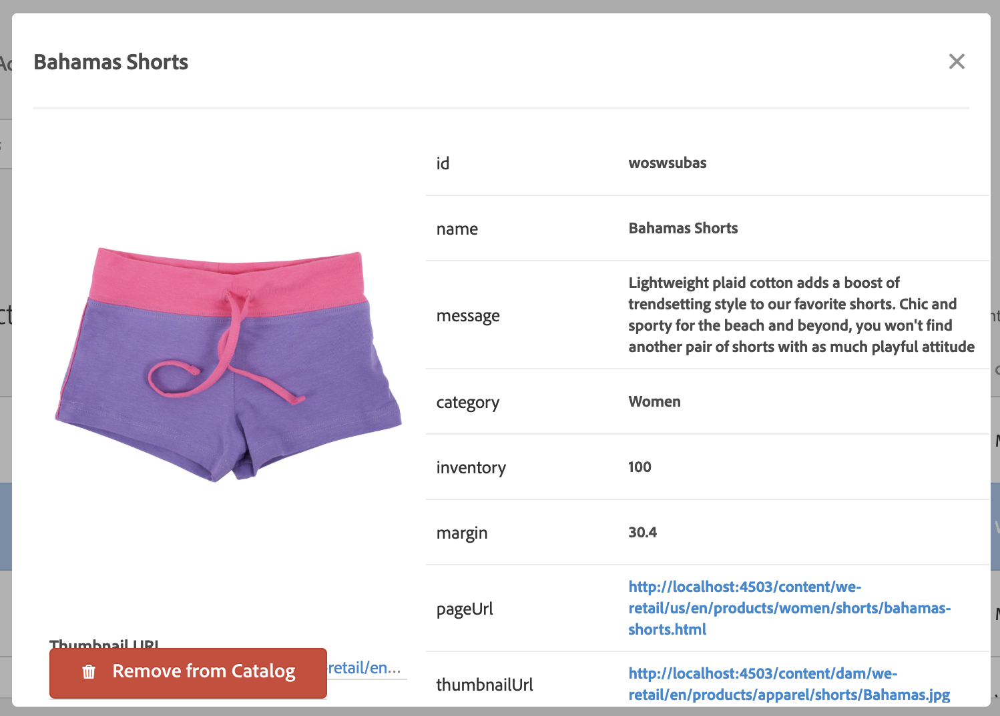
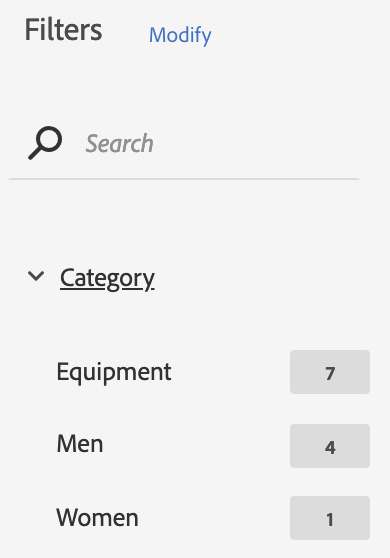
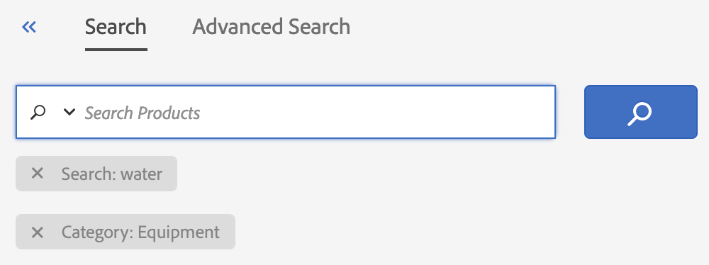

# Import your Product Catalog into Recommendations

Importing your Product Catalog into the Adobe Target Recommendations system is a major decision for your implementation. Adobe Target provides multiple methods to send this data to our servers so that you can display up-to-date product content on your site.

## Learning Objectives

In this section, we will cover the basics of creating and managing your product or content catalog for Adobe Target Recommendations. At the end of this lesson, you will be able to:

1. Explain the different types of methods you can use to import Product Catalogs into Recommendations
1. Import Catalog data via XYZ

1. Access the Target Recommendations interface
1. Choose the right attributes to include in your catalog
1. Send your catalog data to Target Recommendations
1. Manage your catalog in Target Recommendations
1. Send behavioral data is sent to Target Recommendations

## Prerequisites

You should have already completed the lessons in .

## Logging into Recommendations

### Strategy: Building Your Catalog

#### Choosing the right data

You should send Target three kinds of metadata about your catalog items:

1. Data that you want to display to the user receiving the recommendation – for example, the name of the product and a thumbnail image URL.

2. Data that is useful for applying marketing and merchandising controls – for example, the category of the product., the price of the product, and the stock level of the product.

3. Data that is useful for determining the similarity of items to other pieces of items – for example, the brand of the product.

#### Implementation methods

Target Recommendations offers multiple ways to send in your catalog data:

- **Feeds:** You can send a CSV file or Google Product Feed (XML file) on a daily, weekly or biweekly basis to Adobe Target. This is the easiest method to ensure your entire product catalog is imported and is good for making sure all of your attributes are present in the catalog. Feeds can be fetched from an HTTP or HTTPS URL, or on an FTP or FTPS server. If you use Adobe Analytics, you can also send Adobe Analytics Product Classifications as a feed.

- **Entities API:** You can use Target Recommendations’ RESTful Entities API to create or update items in the catalog whenever an item is updated in your Product Information Management (PIM) system or Content Management System (CMS). For more information, refer to the [Target Recommendations API documentation](http://developers.adobetarget.com/api/recommendations/) on the Adobe Target Developers portal.

- **Target Javascript (aka mbox):** You can send catalog updates via Adobe Target’s Javascript functions. Generally, this is done on your product detail page or equivalent (e.g. video view page, article view page, etc.) This is useful when paired with feeds to pass certain frequently-updated attributes that are crucial to update in a timely fashion: for example, inventory levels or price.

For most use cases, it’s best to start with a periodic feed file (daily or weekly) and fill in with either the Entities API or Target Javascript for updates that are necessary to make in between feed files.

> **Tip:** Whichever method you choose, be sure to send a record of your product at least on a monthly basis. Target Recommendations removes products from the catalog if they are not refreshed within a 60-day period.

### Using Feeds

Navigate to the **Feeds** section using the left-hand bar to see the configured feeds.

### Create a Feed

Click the **+ Create Feed** button in the upper right-hand corner to configure a new feed.

1. Type the name for your feed: **YOURNUMBER – Test Feed**

2. Select the feed **Source Type: CSV**.

3. Open the URL [**http://summit-demo.com/feeds/weretail_product_catalog.csv**](http://summit-demo.com/feeds/weretail_product_catalog.csv) in a spreadsheet program to examine a sample CSV feed.

4. Note that you can add additional columns to the right to add additional data attributes.

5. Return to Target Recommendations.

6. Select **URL** as the Source **Location** and enter the above URL.

7. **Click Next and select Never as the upload frequency. (We will use this option to avoid having several feeds running in the classroom.)**

8. **Leave the default Mapping settings and click Save in the upper right-hand corner.**

**Your feed is now created and you will return to the list of feeds.**

**Mouse over the feed in the list to see the available options on the right: Edit, Copy, Delete and Activate. Move on to the next section without activating your feed.**

### Using Collections

Collections allow you to create separated sets of items to be used in different types of recommendations across your site. This is useful when you have multiple types of items that are recommended in different contexts and do not want these items to appear together. For example, on a retail site, you might separately recommend **Products** and **Articles**. Or, on a news site, you might separately recommend **Articles** and **Videos**.

Navigate to the **Collections** tab using the left-hand navigation bar. Note that the **All Collections** collection is listed; this contains all items across your site and is the default option.

Click the Edit pencil icon () on the **Equipment** collection to view the definition of this collection and the items contained within it:

Scroll down further to see the products matching the search criteria; then click **Cancel** to leave the Collection without editing it.

**Tip:** Collections are best used to separate broad types of items, as in the examples above. Finer-grained filtering is best done in the Criteria, as we shall see later.

**Tip:** Collections are best used with product attributes that do not frequently change (e.g.: category or gender), not frequently-changed attributes (e.g. price or inventory level). This is because collection rules are applied only when a Recommendations algorithm executes, every 12-24 hours. Frequently-changed attributes can be used for filtering in Exclusions or Criteria filtering rules, which run in real time whenever a customer visits your site.

### Using Exclusions

Exclusions allow you to prevent sets items from ever being recommended on your site. This is useful when there are certain types of items you don’t ever want to recommend: for example, on a retail site, you may never want to recommend clearance items; or on a movie site, you may never want to recommend NC-17 rated films.

Navigate to the **Exclusions** tab using the left-hand navigation bar.

Click the Edit pencil icon () on the **Low Margin Items** collection to view the definition of this exclusion and the items contained within it:

Scroll down further to see the products matching the search criteria; then click **Cancel** to leave the Exclusion without editing it.

**Tip:** An item captured in an Exclusion will **never** be recommended in any location on your site. Keep this in mind in subsequent exercises – you won’t see these items recommended even if they otherwise would be, based on your browsing behavior.

**Tip:** Even if an item is excluded from recommendations (i.e. part of an Exclusion), it is still possible to produce recommendations for that item and display them on the product detail of that item – as long as all related products aren’t similarly excluded.

## Exercise 2.2 – Managing Your Catalog

You will now find yourself at a blank search page.

On the left-hand navigation bar, you can see the various elements of Target Recommendations that you can configure:

We’re going to start by using Catalog Search, the current page you are viewing.

### Using Catalog Search

Catalog Search allows you to inspect the contents of your Target Recommendations catalog. Your catalog contains all of the items (for example, products, articles, or videos) that you might want to recommend, along with relevant data points that describe each of these items.

These attributes might include:

**Sample Product Catalog Attributes**

- Product ID
- Product Name
- Product Category
- Brand
- Inventory
- Price
- Color
- Thumbnail Image URL
- Etc.

**Sample Video Catalog Attributes**

- Video ID
- Video Name
- Video Genre
- Director
- Length
- Rating
- Actors
- Thumbnail Image URL
- Etc.

In Target Recommendations, we call these items “entities” and these descriptive data points “attributes”.

Let’s look through the items we currently have in our catalog for our retail store.

First, in the search box, type **shorts** and press **Return/Enter** or click the **magnifying glass icon**.

You’ll see that 13 items containing “shorts” are present in the catalog. Note that some are actually pairs of shorts -- while others are “short-sleeved shirt”, “shorty” surfboard, etc.

To view an item’s details, click the item name in the list below.

You’ll see the full details for the item, including description, inventory, page URL, thumbnail image URL, etc.

> **Tip:** Note that items can be deleted from the catalog from this page. (Don’t remove any items during this lab!)

Close the detail view to return to your search results.

You can apply additional filters to the results from the list at left. Let's try a new search. Type **water** into the search box. Then, expand the Category filter and select **Equipment**.

You will see the results with the **Category: Equipment** filter applied. Go the tags listed below the search box and remove the **Search: water** tag to see all products in the **Equipment** category.

