# Implement Recommendations on Product Pages

## Exercise 2.3 – Tagging Your Site

### Strategy: Tagging Your Site

One common Recommendations implementation option uses both feeds and page parameters.

This method is often preferred by retailers, who tend to have relatively consistent product catalogs, but with frequent changes to a few product attributes (such as price and inventory) due to sales, seasonal promotions, or seasonal inventory changes.

Whether using a CSV file or Google product file, use a feed to provide all product attributes that stay fairly consistent over time.

Required:

* Item ID or SKU (entity.id)

Other static parameters:

* Category (entity.category)
* Brand (entity.brand)
* Description (entity.message)
* Other custom attributes

Attributes that are not consistent may be provided via feed, but often should also be provided on a more frequent basis via page parameters or API:

* Inventory level (entity.inventory)
* Price (entity.value)

Priority is given to whichever set of data is received most recently. If you pass the feed first and then update the page parameters, changes that are made in the page parameters will be shown, replacing item information passed in the feed.

#### Implementation According to Page Type

Page type will influence your Recommendations implementation. For example, the kinds of recommendations you want to present will differ between a product page, a category page, or your home page. For each page type, you should be sure to pass the appropriate key values for the right kind of recommendations.

The targetPageParams functions shown below is especially helpful if you are using a tag management solution to implement your pages. Adobe Launch or Adobe Dynamic Tag Manager (DTM) places the at.js/mbox.js reference and the targetPageParams function on your page and allows you to configure the values. You should either place that function before your at.js/mbox.js call, or put it in the Extra JavaScript section of your at.js/mbox.js.

#### Product Page

On a product page, you will want to recommend items that are related to the current item and/or the current item’s category. You also want to send any frequently changing attributes (such as value and inventory), in addition to the identifying key for the item.

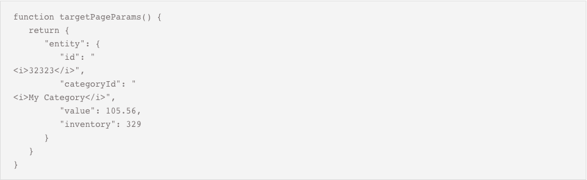

#### Category Page

On a category page, you probably want to restrict your recommendations to products or content within that category. To achieve this, be sure to pass the category ID of the page:

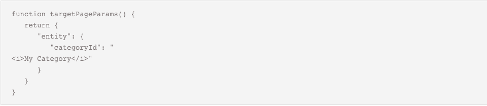

#### Cart Page

On a cart page, you likely want to exclude some items from your recommendations, such as the items that are already in the cart.

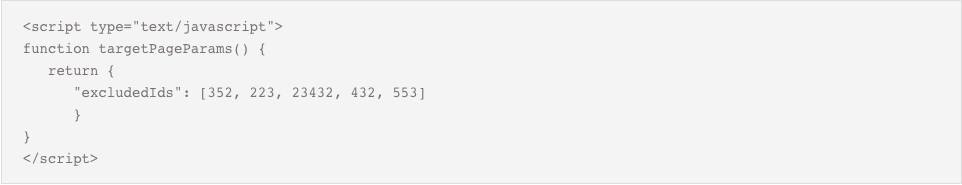

#### Order Confirmation Page

On an order confirmation page, you might want to show the order total, and the order ID, and show the products that were purchased, without recommending additional items. You can implement a second mbox to capture the order information.

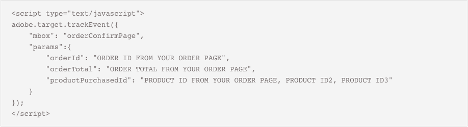

### Examine Adobe Target Call Using Developer Tools

Once your pages are properly tagged, you should review the Target server call to confirm if your implementation is working properly. By using native browser developer tools, we can inspect and evaluate components of the Target server request.

1. Navigate to a product detail page (e.g. <http://localhost:4503/content/we-retail/us/en/products/men/coats/el-gordo-down-jacket.html#meskwielt>)

2. In your Chrome browser window, open Developer Tools.

    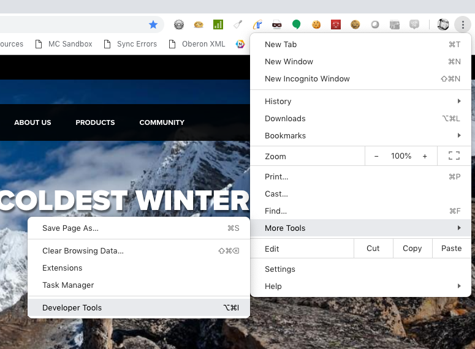

3. Select the Network tab and refresh the current page.

4. Type “mbox” in the search filter and select the request that appears.

5. After selecting the query at left, the **Headers** tab shows the information sent to Target, allowing you to confirm that the call is working as expected. Confirm that the **entity.id** and **entity.categoryId** are being sent to Target.

    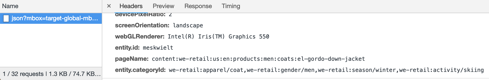

6. The **Preview** tab shows the actions returned from Target.

    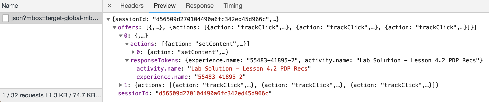

We’ll cover more advanced troubleshooting methods later which allow you to perform a deeper inspection of the Target Recommendations configuration.

## Add Entity Parameters for Recommendations (Target Premium)

Entity parameters are used in [Recommendations implementations](https://marketing.adobe.com/resources/help/en_US/target/recs/c_plan_implement.html) for three main reasons:

1. As a key to trigger product recommendations. For example, when using a recommendations algorithm like "People who viewed Product X, also viewed Y," "X" is the "key" of the recommendation. It is usually the product sku (`entity.id`) or category (`entity.categoryId`) that you are currently viewing.
1. To collect visitor behavior to power recommendations algorithms, such as "Recently Viewed Products" or "Most Viewed Products"
1. To populate the Recommendations catalog. Recommendations contains a database of all of the products or articles on your website, so they can be served in the recommendation offer. For example, when recommending products, you typically want to display attributes like the product name (`entity.name`) and image (`entity.thumbnailUrl`). Some customers populate their catalog using backend feeds, but they can also be populated using entity parameters in mbox calls.

Just give the parameter a name prefixed with "entity." and map it to the relevant data element. Note that some common entities have reserved names that must be used (e.g. entity.id for the product sku).


Below is an optional exercise for Target Premium customers to add the `entity.id` and `entity.categoryId` parameters to relevant pages in the global mbox request. In order to deliver recommendations without flicker, it is critical to pass the `entity.id` and `entity.categoryId` parameters at the top of the page, in the global mbox. If your data layer id defined before the Launch embed codes, you can pass the other catalog entities here, too. Since you have already created multiple data elements in this tutorial, screenshots are not included for every step.

>[!WARNING] If you have already implemented Recommendations in your Target account, completing the steps in this exercise add invalid products to your catalog. Create a new Host Group in Target and associate the `enablementadobe.com` domain with this new Group before proceeding. Alternatively, you can read through the instructions to understand the implementation

### Create Data Element for Product Id

You will use this to set the reserved `entity.id` parameter to key recommendations algorithms, collect visitor behavior, and populate the catalog

1. Click **[!UICONTROL Data Elements]** in the top navigation
1. Click **[!UICONTROL Add Data Element]**
1. Name the data element `Product ID`
1. Select **[!UICONTROL Data Element Type > JavaScript Variable]**
1. Use `digitalData.product.0.productInfo.sku` as the `Path to Variable`
1. Check the `Force lowercase value` option
1. Check the `Clean text` option
1. Click **[!UICONTROL Save to Library and Build]**

### Create Data Element for Product Category

You will use this to set the reserved `entity.categoryId` parameter to key recommendations algorithms, collect visitor behavior, and populate the catalog. It is possible to collect multiple category ids in a comma-separated list.

1. Click **[!UICONTROL Add Data Element]**
1. Name the data element `Product Category`
1. Select **[!UICONTROL Data Element Type > JavaScript Variable]**
1. Use `digitalData.product.0.productInfo.description` as the `Path to Variable`
1. Check the `Clean text` option
1. Click **[!UICONTROL Save to Library and Build]**

### Create Data Element for Product Name

You will use this to set the reserved `entity.name` parameter to populate the catalog with the product name

1. Click **[!UICONTROL Add Data Element]**
1. Name the data element `Product Name`
1. Select **[!UICONTROL Data Element Type > JavaScript Variable]**
1. Use `digitalData.product.0.productInfo.title` as the `Path to Variable`
1. Check the `Clean text` option
1. Click **[!UICONTROL Save to Library and Build]**

### Create Data Element for Product Path

You will use this to set the reserved `entity.pageUrl` parameter to populate the catalog with the URL path of the product detail page so you can create links in Recommendations offers

1. Click **[!UICONTROL Add Data Element]**
1. Name the data element `Product Path`
1. Select **[!UICONTROL Data Element Type > Page Info]**
1. Select  **[!UICONTROL Attribute > Pathname]**
1. Click **[!UICONTROL Save to Library and Build]**

### Create Data Element for Product Thumbnail Path

You will use this to set the reserved `entity.thumbnailUrl` parameter with the URL of a thumbnail image so you present visual product Recommendations

1. Click **[!UICONTROL Add Data Element]**
1. Name the data element `Product Thumbnail Path`
1. Select **[!UICONTROL Data Element Type > Custom Code]**
1. Use the following custom code:

   ```javascript
   var myStr = digitalData.page.pageInfo.pageName;
   var newStr = myStr.replace(/:/g, '/');
   return '/' + newStr + '/jcr:content/root/product/image.thumbnail.160.png';
   ```

1. Click **[!UICONTROL Save to Library and Build]**

## Add Entity Parameters to the Target request

### Add a Rule to Pass the Entity Parameters to the Global Mbox

Now that you have created all of the data elements you need to add them to the global mbox call. Most of these data elements only exist on the product detail pages, so you will need a new rule that will only fire on the product details page.

1. Go to the **[!UICONTROL Rules]** in the top navigation and then click **[!UICONTROL Add Rule]**

    

1. Name the rule `Product Details - Library Loaded - 40`

1. Click **[!UICONTROL Events > Add]** to open the `Event Configuration` screen

    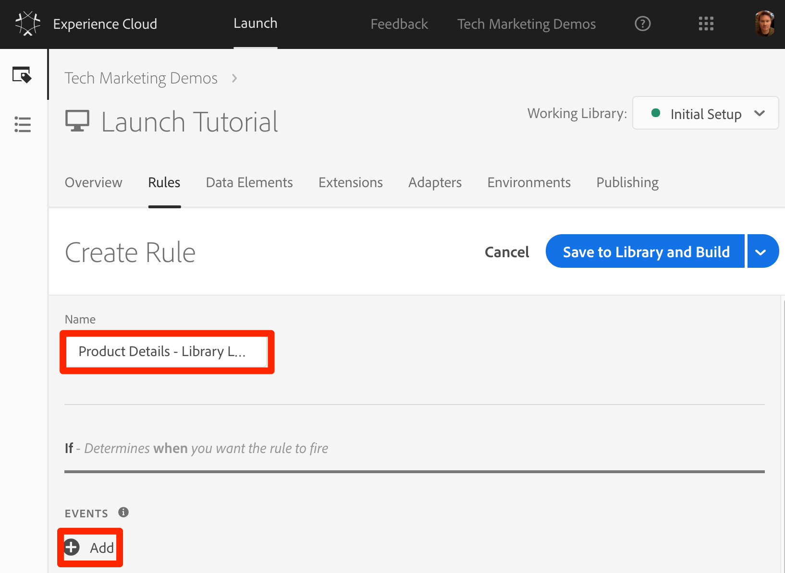

   1. Select **[!UICONTROL Event Type > Library Loaded]**

   1. Change the `Order` to `40`

   1. Click **[!UICONTROL Keep Changes]**
  
    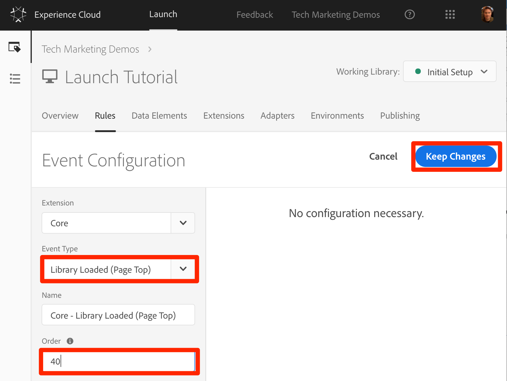

1. Click **[!UICONTROL Conditions > Add]** to open the `Condition Configuration` screen

    

   1. Select **[!UICONTROL Condition Type > Value Comparison]**
   1. Use the data element picker, choose `Product ID`
   1. Select  **[!UICONTROL Is Truthy]** from the comparison operator dropdown
   1. Click **[!UICONTROL Keep Changes]**

   

1. Click **[!UICONTROL Actions > Add]** to open the `Action Configuration` screen

   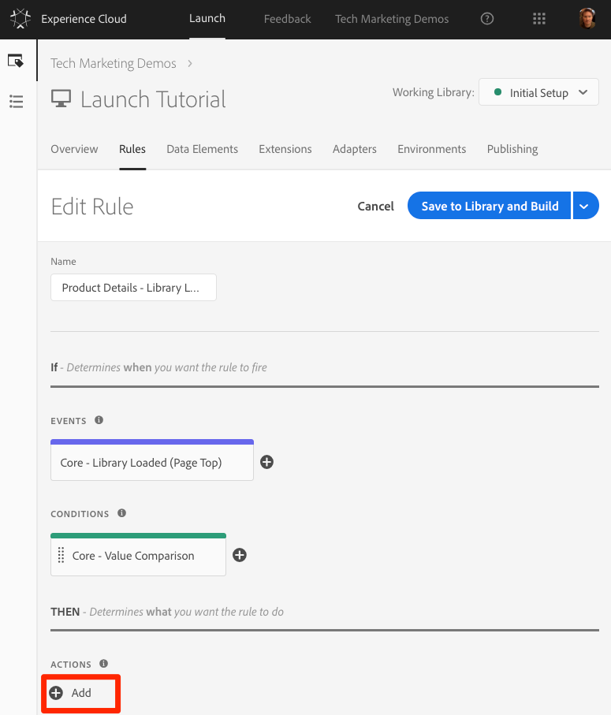

   1. Select **[!UICONTROL Extension > Adobe Target]**

   1. Select **[!UICONTROL Action Type > Add Params to Global Mbox]**

   1. Add the parameters for `entity.id`, `entity.name`, `entity.pageUrl`, `entity.categoryId`, `entity.thumbnailUrl`, assigning their values to the data elements created earlier

   1. Click  **[!UICONTROL Keep Changes]**

   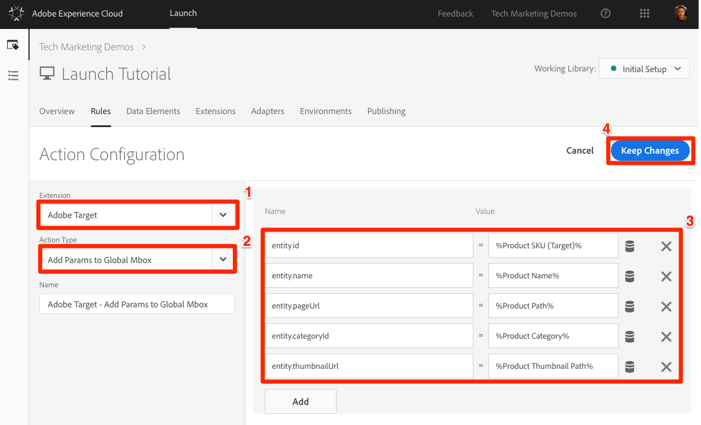

1. Click **[!UICONTROL Save to Library and Build]**

   

Typically, you would set up a similar rule on the product category pages that would that would pass the `entity.categoryId` to Target on the category pages. You could then deliver category-based recommendations to these pages.

### Validate the Entity Parameters

1. Open the We.Retail site to a [product details page](https://aem.enablementadobe.com/content/we-retail/us/en/products/men/coats/portland-hooded-jacket.html#meotwipot-S)
1. Make sure the Debugger is mapping the Launch property to *your* Development environment, as described in the earlier lesson

   
1. Open the Debugger
1. Go to the Target tab
1. Open your client code
1. You should see the entity parameters in every global mbox request on a product detail page:

   

1. Also, if you turn on console logging for Launch on the `Tools` tab

   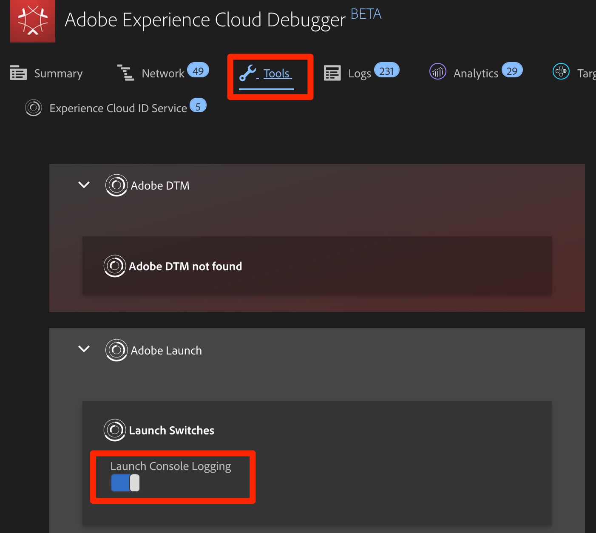

1. You should see that the rule fires

   

1. Now go to some pages that are not Product Detail pages. Do the Debugger logs show that the rule fires? Are the entity parameters added to the global mbox request?

## Optional: Add Custom Mboxes for Profile or Entity Values

Sometimes important data you would like to use for personalization is not defined on the page before the Launch embed codes. For example, it might be hardcoded on the bottom of the page or get returned from an asynchronous API request.

This data can still be sent to Target using an additional request. Although it will not be optimal to use this request for content delivery since the page will already visible, it can still be used to enrich the visitor profile for later use or to populate the Recommendations catalog.

Below is an optional exercise for Target Premium customers to add the `entity.value` and `entity.message` parameters to Product Detail pages to enrich the Recommendations catalog. The same technique can be used by Target Standard customers to pass profile parameters to enrich the visitor profile.

>[!WARNING] As mentioned in the earlier section `Add Entity Pararameters for Recommendations (Target Premium)`, if you have already implemented Recommendations in your Target account, completing the steps in this exercise add invalid products to your catalog. Create a new Host Group in Target and associate the `enablementadobe.com` domain with this new Group before proceeding. Alternatively, you can read through the instructions to understand the implementation

On the We.Retail site, for example, there are several attributes that would be useful to have in our Recommendations catalog for the `entity.value` and `entity.description` entities. However, the values are available in DOM elements below the Launch embed codes. Let's start by defining the data elements.

### Create Data Element for Product Price

You will use this to set the reserved `entity.value` parameter to populate the catalog with the price of the product

1. Click **[!UICONTROL Add Data Element]**
1. Name the data element `Product Price`
1. Select **[!UICONTROL Data Element Type > Custom Code]**
1. Use the following custom code:

    ```javascript
    return document.querySelectorAll(".we-Product-price")[0].textContent.slice(1);
    ```

1. Click **[!UICONTROL Save to Library and Build]**

### Create Data Element for Product Description

You will use this to set the reserved `entity.message` parameter to populate the catalog with a short description of the product

1. Click **[!UICONTROL Add Data Element]**
1. Name the data element `Product Description`
1. Select **[!UICONTROL Data Element Type > DOM Attribute]**
1. Use `.we-Product-description` as the **[!UICONTROL From the DOM element matching the CSS Selector]**
1. Select **[!UICONTROL Use the value of > text]**
1. Check the `Clean text` option
1. Click **[!UICONTROL Save to Library and Build]**

### Add a Rule to Pass the Entity Parameters in a Custom

1. Go to the **[!UICONTROL Rules]** in the top navigation and then click **[!UICONTROL Add Rule]**

    

1. Name the rule `Product Details - Window Loaded`

1. Click **[!UICONTROL Events > Add]** to open the `Event Configuration` screen

   

   1. Select **[!UICONTROL Event Type > Window Loaded]**

   1. Click **[!UICONTROL Keep Changes]**
  
       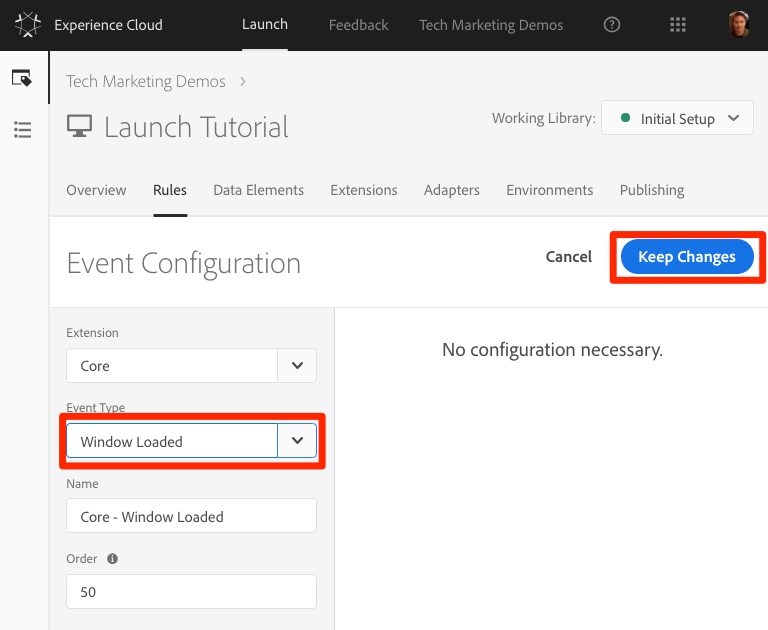

1. Click **[!UICONTROL Conditions > Add]** to open the `Condition Configuration` screen

    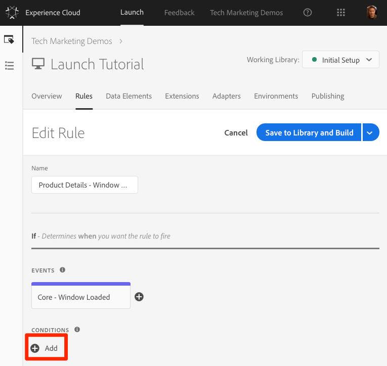

   1. Select **[!UICONTROL Condition Type > Value Comparison]**
   1. Use the data element picker, choose `Product ID`
   1. Select  **[!UICONTROL Is Truthy]** from the comparison operator dropdown
   1. Click **[!UICONTROL Keep Changes]**

      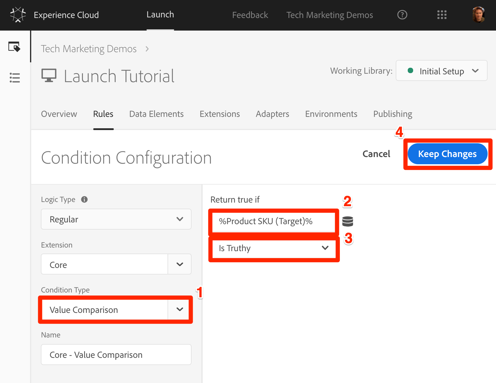

1. Click **[!UICONTROL Actions > Add]** to open the `Action Configuration` screen

   

   1. Select **[!UICONTROL Action Type > Custom Code]**

   1. Click the **[!UICONTROL </> Open Editor]** button to open the `Code Editor`

      

   1. Paste the following code into the `Code Editor`. Note that we are are going to add one more parameter `entity.event.detailsOnly:true` to indicate that this request is simply for the collection of catalog data and should not increment a view for the product in the Recommendations algorithms.

      ```javascript
      adobe.target.getOffer({
        "mbox": "recs-entities",
        "params": {
          "entity.id": _satellite.getVar('Product ID'),
          "entity.value": _satellite.getVar('Product Price'),
          "entity.message": _satellite.getVar('Product Description'),
          "entity.event.detailsOnly":"true"
        },
        "success": function(offer) {
      },
        "error": function(status, error) {
          console.log('Error', status, error);
        }
      });
      ```

   1. Click the **[!UICONTROL Save]** button

      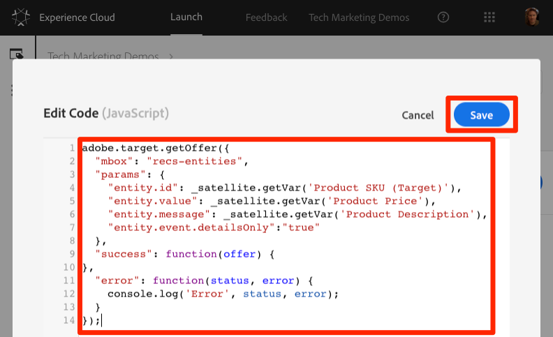

   1. Click  **[!UICONTROL Keep Changes]**

      

1. Click **[!UICONTROL Save to Library and Build]**

   

A few things to note:

* In the request, you also passed the `entity.id`. Since the `entity.id` is the key, this is required to make sure the other entities are attached to the correct catalog item.
* In order to avoid complications with the A4T integration, the custom mbox name `recs-entities` was used.

* Because the `applyOffer()` function was not used, this mbox cannot be used to apply offers to the page
  
* If your use case is to pass profile parameters instead of entity parameters, you would just update the parameter names and data elements in the code above.

### Validate the Custom Mbox and Parameters

1. Open the We.Retail site to a [product details page](https://aem.enablementadobe.com/content/we-retail/us/en/products/men/coats/portland-hooded-jacket.html#meotwipot-S)
1. Make sure the Debugger is mapping the Launch property to *your* Development environment, as described in the earlier lesson

   
1. Open the Debugger
1. Go to the Target tab
1. Open your client code
1. You should see the new `recs-entities` request with the `entity.id`, `entity.value`, and `entity.message` parameters fire on all product detail pages:

   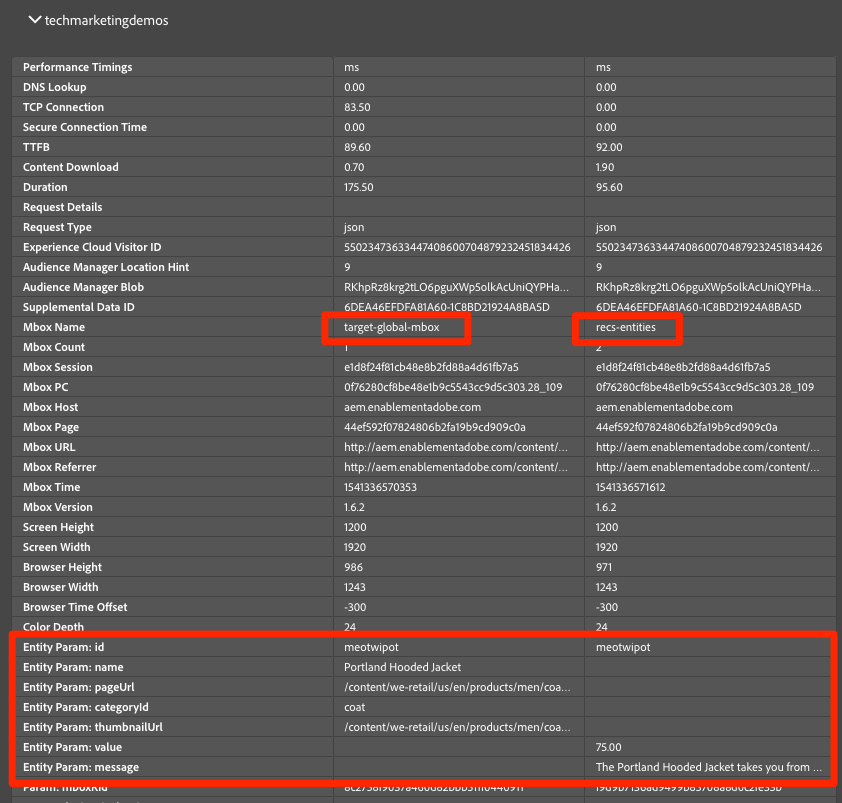
