# Recommend Products on a Home Page

In this lesson, you will learn effective techniques to recommend products on a Home Page. Our goal for this lesson is to recommend items that users have recently viewed on our site’s homepage. This will allow shoppers to quickly return to items they have previously considered purchasing.

## Learning Objectives

At the end of this lesson, you will be able to:

1. do this

## Prerequisites

You should have already completed the lessons in .

Get started by following these steps:

1. Click the **Activities** tab on the top navigation bar to see a list of existing Activities.

2. Click **+ Create Activity**, then choose **Recommendations** from the drop-down menu that appears, to create a new Recommendations Activity.

3. Here you have the choice of selecting a channel for the activity (Web, Mobile, Email or API), a choice of using the Visual Experience Composer or Form-Based Experience Composer, a choice of Workspace and can enter the Activity URL. Leave the default selections of **Web** and **Visual** Experience Composer. Enter the following URL for your Activity:

    [**http://localhost:4503/content/we-retail/us/en.html**](http://localhost:4503/content/we-retail/us/en.html)

4. Click **Next** to create the activity.

### Using the Visual Experience Composer

You will now see the homepage of our site. The Visual Experience Composer (VEC) allows you to quickly select the areas of our site that we want to modify, then change the content that appears in those areas.

By default, you enter the VEC in the **Compose** mode. In this mode, clicking page content allows you to select an area to insert recommendations into the page. If you need to use the page’s navigation to expose the area of the page where recommendation should be inserted, you’ll want to switch to the **Browse** mode, which allows you to interact with page elements, before switching back to **Compose**. Additional information about the VEC is available in the Target help documentation at: <https://marketing.adobe.com/resources/help/en_US/target/target/c_visual-experience-composer.html>

We want to replace static content on our homepage with our Recently Viewed Items, so we need to use the VEC to identify the area of our site where we want recommendations to display.

1. Scroll the homepage so that you see the **Featured Products** section:

    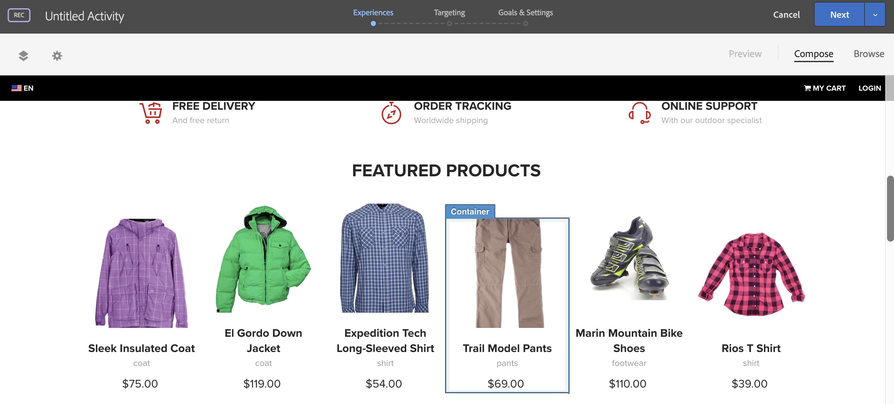

2. Mouseover a single product image and note that the HTML container containing that item is highlighted. Then, click the item. Note that you have the following options:

    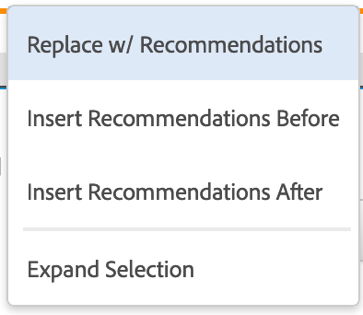

3. Click **Expand Selection** and observe that the container element size is increased to include all of the items.

4. Experiment with clicking containers and then Expand Selection until you have selected a container which contains only the horizontal items and no other page content. Then, click **Replace w/Recommendations**.

5. In order to narrow down the list of available recommendations, you will be asked to identify the type of page this is. Select **Home Page** from the dropdown list that appears:

    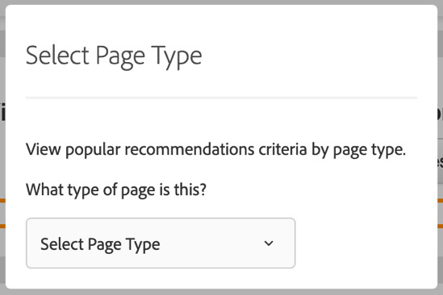

### Selecting a Criteria

After selecting a Page Type, you are taken to select a Criteria.

Criteria are sets of rules that tell Target Recommendations how to choose the items to be recommended from the items in your catalog. Let’s start by choosing a built-in Criteria to see how it works; later, we’ll return to see how to create our own Criteria.

Type **recently viewed** in the Search box, find the Criteria labeled **Recently Viewed Items** and select the criteria by clicking anywhere in the card.

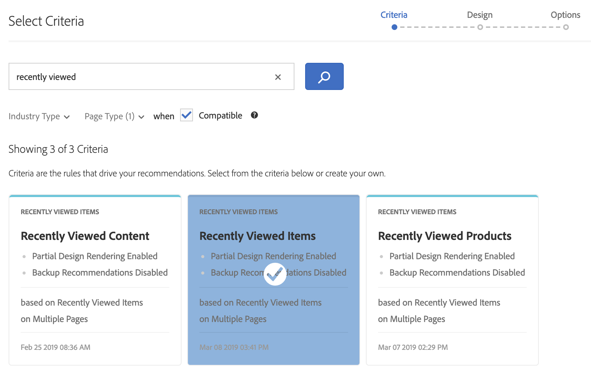

You can click the **Info** icon to view more information about the Criteria or click the **Edit** (pencil) icon to modify the criteria. We will practice customizing Criteria in **Section 4**. For now, just click the **Next** button in the upper right-hand corner.

### Selecting a Design

After selecting a Criteria, you are taken to choose a Design.

A Design is an HTML or JSON template that tells Target Recommendations how to format its response containing recommended products.

Select the **WeRetail 4 x 1 Design** criteria by clicking anywhere on the card.

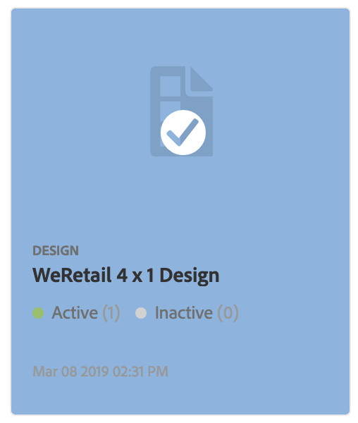

We will explore customizing Designs in **Section 5**. For now, just click the **Next** button in the upper right-hand corner.

### Selecting Collections and Promotions

You now have the option to choose a **Collection** – recall that we examined the available Collections earlier. Leave the default “**All Collections**” option selected.

You can also set up **Front Promotions** and **Back Promotions** here. Front Promotions allow you to set up a list of items you want to promote in front of any algorithmic results; Back Promotions allow you to set up a list of items you want to promote behind any algorithmic results. Toggle the **Front Promotions** slider to see the available options. Note that you can control the number of slots allocated to promotions, time-bound promotions, and promote either a list of IDs, a collection, or results of a filtering rule. After exploring the options, **turn Front Promotions off** again, then click **Save** in the upper right-hand corner.

> **Tip:** Promotions are useful for time-limited marketing campaigns: for example, when you want to promote a certain category or brand of items even when it is not algorithmically “best” for a customer, or during new product releases, where algorithms based on historical data will not recommend a brand new product until traffic related to that product is present.

Note now that you have selected a Criteria and Design, the site layout updates to show sample products inserted into your page.

> **Tip:** The products inserted here are randomly selected illustrative examples and are not necessarily representative of the products that will appear on this page on your live site.

Click **Next** in the upper right-hand corner to continue.

### Using the Activity Diagram

You are now viewing an Activity diagram. You may already be familiar with the Activity diagram concept from creating A/B Test or Experience Targeting activities. For Recommendations activities, the Activity diagram displays your Recommendations activity’s selected **Location** (i.e., URL), **Audience**, **Collection**, **Criteria**, and **Design**. It allows you to set up an A/B test between multiple Criteria or Designs and set up a control group receiving no recommendations.

We previously configured the Location, Collection, Criteria and Design.

We need to change the **Audience** so that each lab user sees the only the Recommendations he or she has configured. Click the **menu icon** on the **All Visitors audience**, then select **Replace Audience**.

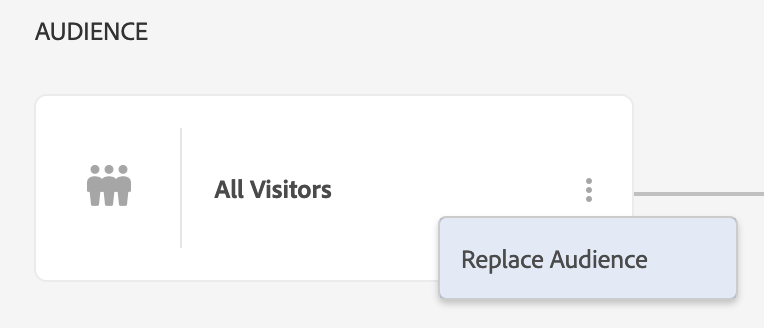

Type **YOURNUMBER** into the search box, select the **“Lab User YOURNUMBER”** audience, and click **Done**.

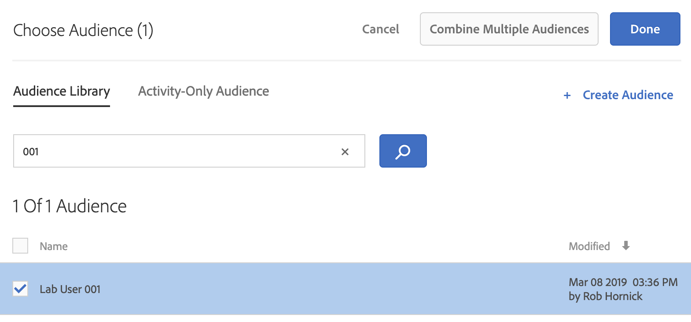

The Audience in the diagram updates to reflect your selection. We’ll further explore using Audiences in **Lesson 3.3.**

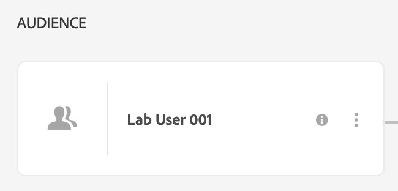

For the purposes of this lab, we want all visitors to see the Recently Viewed Items recommendation, so adjust the Control Group percentage from the default setting of 10 to 0, then click **Next** in the upper right-hand corner to continue.

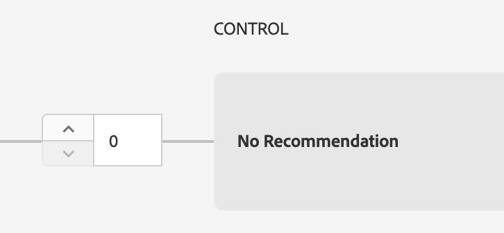

### Goals and Settings

If you have previously created an A/B Test or Experience Targeting activity, you should be familiar with the Goals and Settings page. For Recommendations activities, generally the most important settings to be aware of are the **Reporting Source** and **Goal Metric**.

Your **Reporting Source** specifies whether the success of your Recommendations activity should be measured via Adobe Analytics conversion data or Adobe Target conversion data. The default value of Adobe Target is selected and cannot be changed as we have not configured Adobe Analytics for this lab.

Your **Goal Metric** specifies how Adobe Target should measure lift (i.e. success) for this Recommendations activity. Note that Conversion, Revenue and Engagement metrics are available. For this lab, select **Conversion**. Note the actions available as proxy metrics for Conversion. Choose **Clicked on recommendation** as your Goal Metric, then click **Save & Close** in the upper right-hand corner.

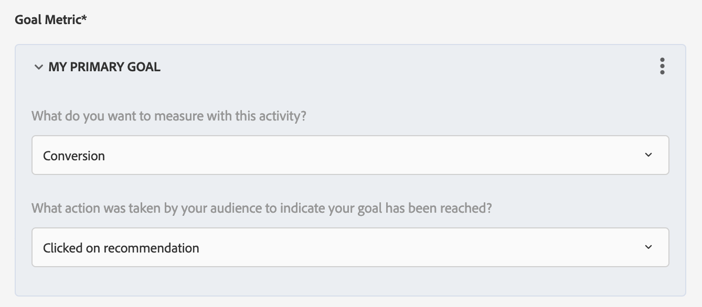

Name your Activity **YOURNUMBER - Homepage Recently Viewed Items**, then click **Save & Close**.

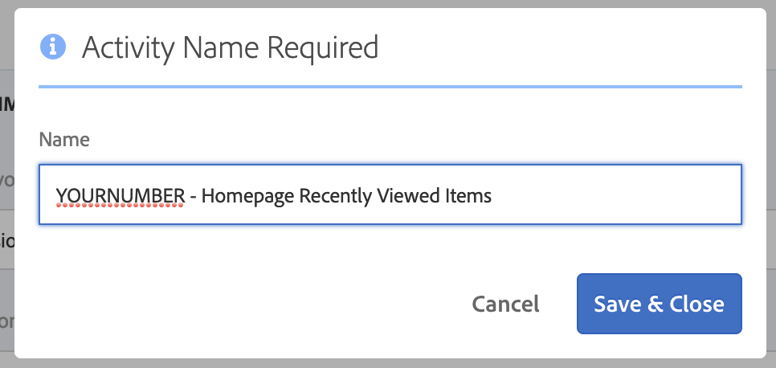

## Exercise 3.2 - Launch your Activity

Now that you have saved your activity, let’s check to make sure it’s working correctly before it goes live on our site.

### Checking the Criteria Status

First, observe that in the upper-right hand corner that the activity’s status is listed as **Inactive**. This means our activity is not yet visible on our site. Before we change the activity’s status to Active, we should make sure that recommendations are available and displayed correctly.

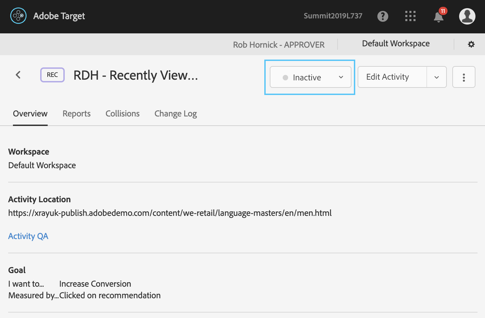

Scroll down to view the Activity Diagram. Observe that underneath the Criteria, the **Results Ready** status is listed:

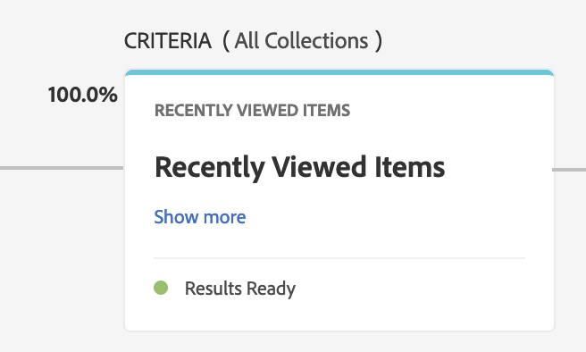

This means that recommendations are available. The Recently Viewed Items criteria will always have results ready since it is simply based on the user’s browsing behavior, but other algorithms, like People Who Viewed This, Viewed That, take some time to get ready as results are computed. For these algorithms, the status will first show as “Results Not Ready”.

Since the Results Ready status is displayed, we can proceed to quality assurance of our activity.

> **Tip:** Getting results ready can take as little as 15 minutes for simple algorithms like Top Sellers and Top Viewed or can take several hours for advanced algorithms if you have a large catalog size, high site traffic (many views/purchases), or have selected a long lookback window (2 days’ data will take less time to process than 60 days’ data.)

### Activity QA Testing

Before we start QA, let’s ensure that we have some recently viewed items to test against. Use the top navigation to open the **Products** page ([**http://localhost:4503/content/we-retail/us/en/products.html**](http://localhost:4503/content/we-retail/us/en/products.html)) and click on a few products that interest you:

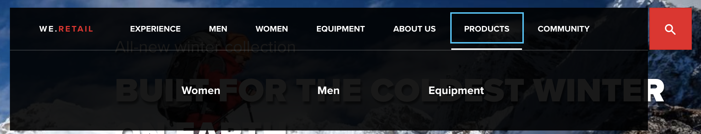

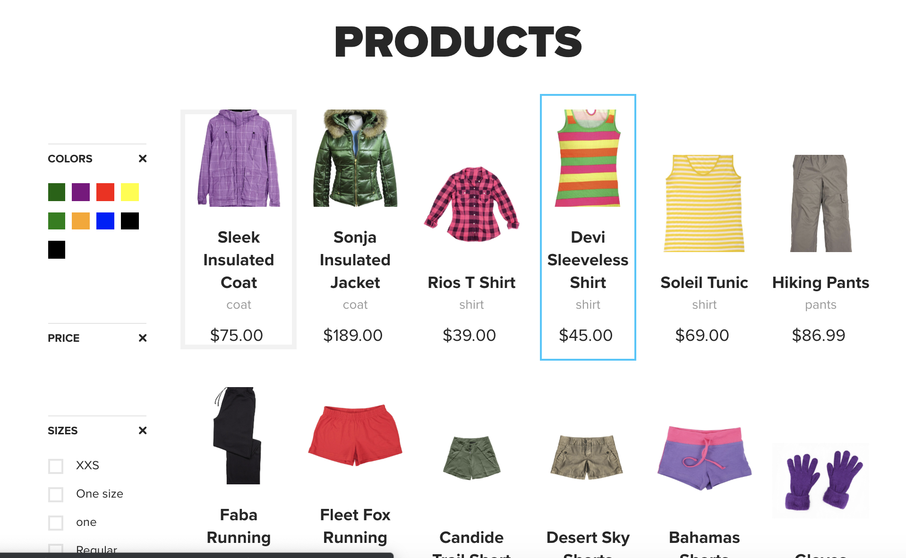

Return to your **Activity Overview** in Adobe Target, scroll to the top of the page and find the **Activity QA** link under the Activity Location.

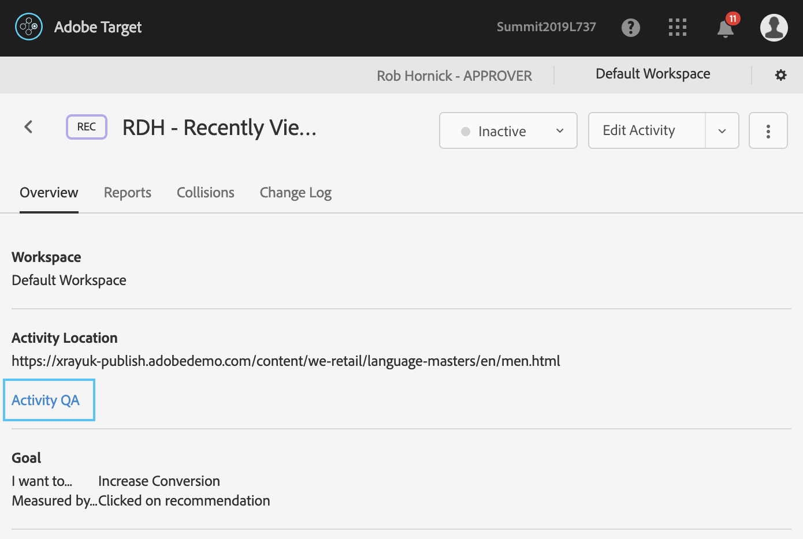

Click the link and scroll to observe that two QA URLs are provided:

1. A QA link with no recommendations displayed.

2. A QA link with the selected Design and Criteria displayed.

> **Tip:** By default, Adobe Target will automatically add you to the required audience for the QA link. This setting can be turned off, but will be useful to leave on for this lab.

Click the first link, **No Recommendation**, and observe that the Featured Products section appears as it did initially with a static list of 6 products:

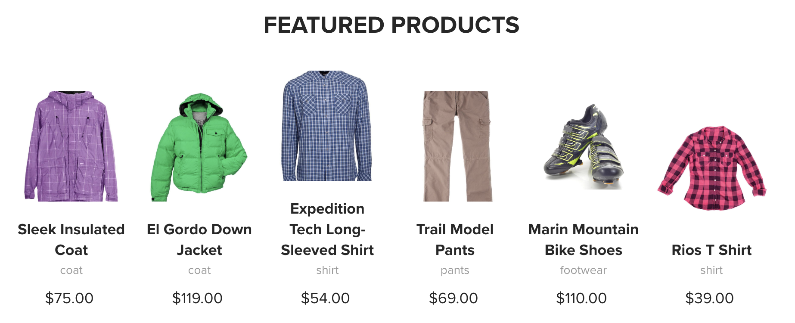

Close the tab and then click the second link, **Recently Viewed Items + WeRetail 4 x 1 Design**.

Note that up to 4 items you viewed earlier now appear:

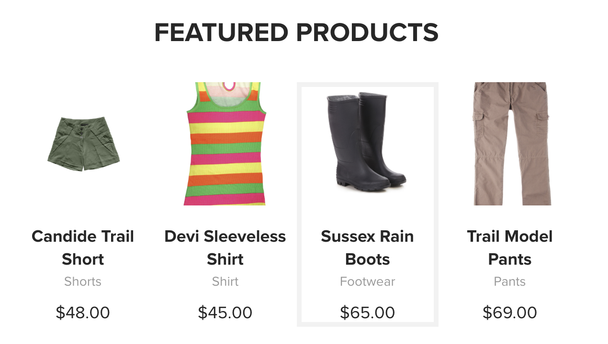

Target QA mode is “sticky” and saved in a cookie. Now that you have proven the recommendations are working as expected, you’re ready to exit QA mode. If you miss this step, you’ll keep seeing the QA results throughout the site! To exit QA mode, visit the homepage and pass an empty Target QA cookie parameter: [**http://localhost:4503/content/we-retail/us/en.html?user=YOURNUMBER&at_preview_token=**](http://localhost:4503/content/we-retail/us/en.html?user=YOURNUMBER&at_preview_token=)

> **Tip:** You can add a bookmarklet so you don’t have to manually pass the blank token; see <https://marketing.adobe.com/resources/help/en_US/target/target/c_activity-qa-bookmark.html>.

### Activating your Activity

Close the preview tab and return to the Activity page. Click on the dropdown arrow next to the status and choose **Activate** from the options.

Note that the status becomes **Activating:**

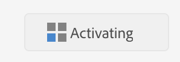

After a few seconds to a couple of minutes, the status switches to **Live**:

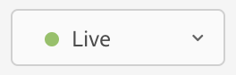

> **Tip:** You can also deactivate or archive the activity using the same dropdown selector.

Open a new tab to <http://localhost:4503/content/we-retail/us/en.html?user=YOURNUMBER> and observe the Recently Viewed Items recommendations are active. Navigate around, returning to the URL above using the Back button, to see the recommended items change as you view new products.

> **Note:** Remember that you must have the user=YOURNUMBER parameter on the homepage URL to see your recommendations.

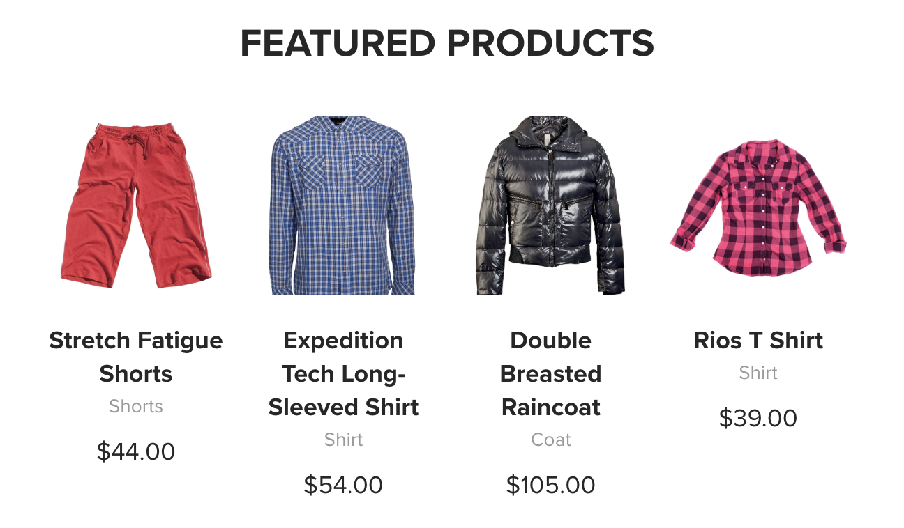

Congratulations! You’ve just set up your first Recommendations activity.

In the next lesson, we’ll explore using Audience Targeting to further personalize your recommendations.

### Create a Second Activity

Let’s continue to create another activity which shows **Most Viewed Items** to only **First Pageview** visitors.

Leave this Activity and return to the Activities list page by clicking the **Activities** link in the top navigation bar. Find your Activity, mouse over it, and click **Copy** to create a copy of the activity.

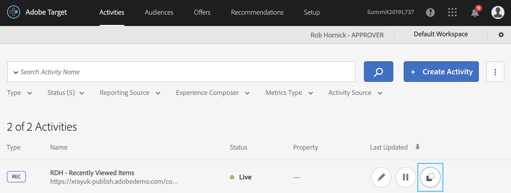

First, let’s change the name of the activity from the default (which simply appends “Copy” to the name of the activity we copied.). Click the name of the activity in the upper left-hand corner, then rename the activity to **YOURNUMBER – Most Viewed Items**.

Scroll to the area of the page that we replaced with recommendations, click on the sample recommendations and choose **Change Criteria** from the menu.

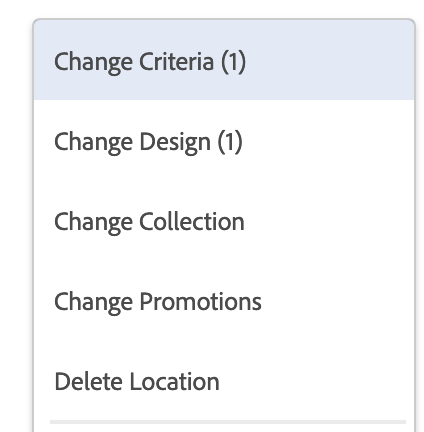

De-select **Recently Viewed Items** by clicking on it, then select **Most Viewed Items Across the Site** by clicking on it.

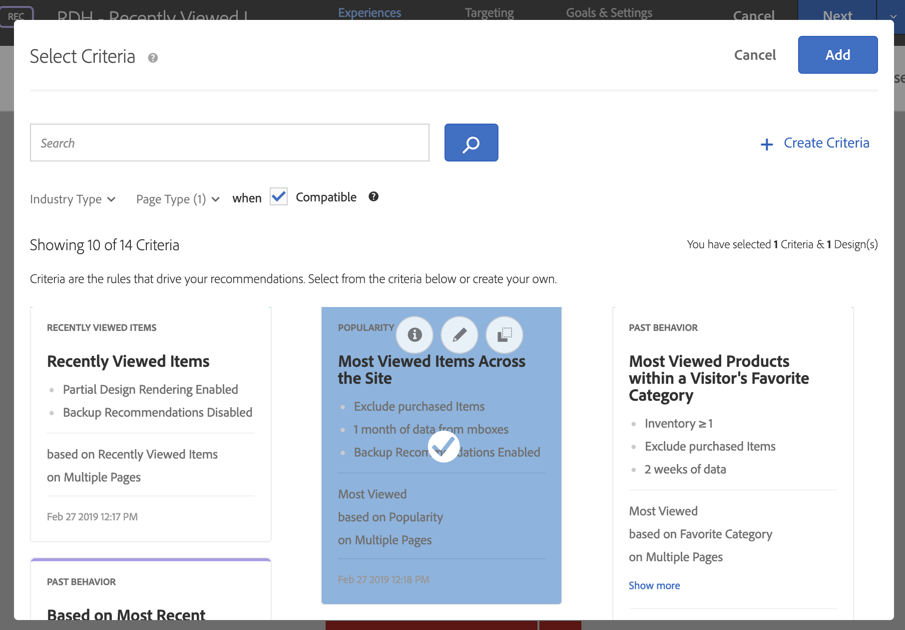

Click **Add** to swap the criteria, then click **Next** to modify the targeted Audience.

Use the **Replace Audience** function to swap the **YOURNUMBER** **Repeat Visitors** audience out. Create a **YOURNUMBER First Pageview** audience using the **Combine Multiple Audiences** feature that we just used.

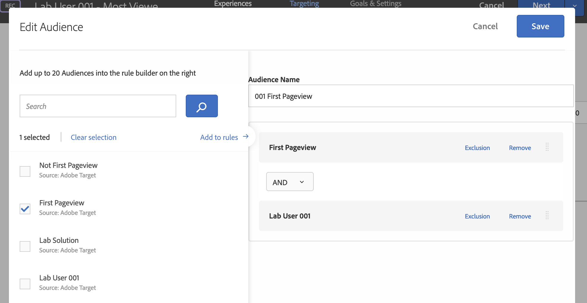

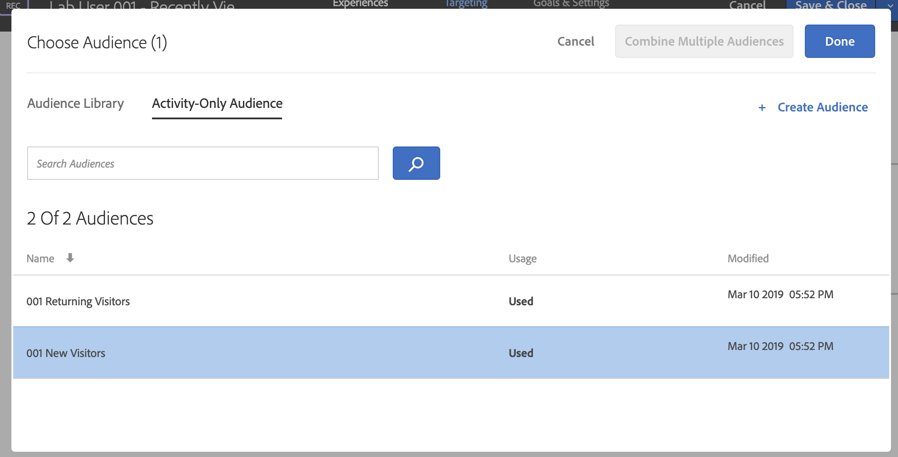

Check that the targeted audience is updated:

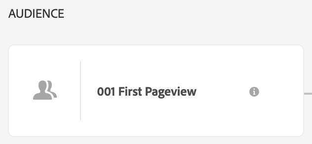

Click **Next** to reach the Goals & Settings. We can keep the same Goals & Settings as we previously had, so click **Save & Close**.

### Previewing Recommendations with CSV Download

Again, we need to check that the activity is ready to go before we put it live on our site.

In some cases, you may wish to audit the specific items that are recommended. This is particularly helpful when using algorithms like People Who Viewed This, Viewed That, where a different set of items are recommended depending on the item the user is currently viewing, and you may have thousands or millions of different items in your catalog.

For Most Viewed Items Across The Site, we’ll only have a single list of recommendations, but let’s check out how we can perform this audit.

First, check that your criteria results are ready by scrolling down and checking the status. If results are not ready, you may see:

When results are ready, you will instead see:

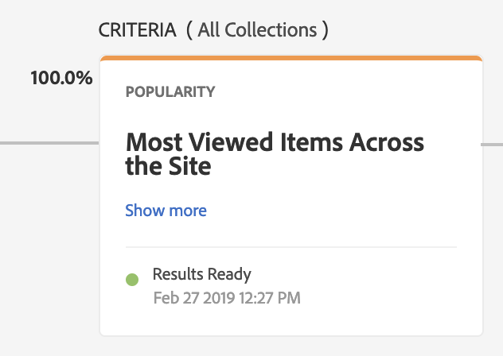

Then, scroll back up, click the menu icon in the upper-right hand corner, and then choose **Download data**.

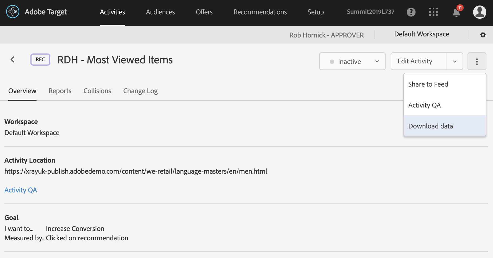

A CSV file will download: open it to see the recommended items:

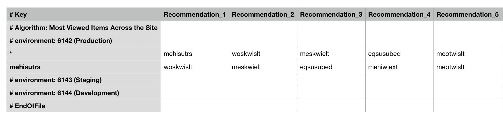

Note that from left to right are a list of recommended items – in this case the most frequently viewed. The recommendations are separated by environment – in this case only the Production environment has recommendations. For this algorithm, we have not applied any restrictions based on key value and so the row labeled with an asterisk (*) contains the complete set of recommendations. For other algorithm types based on a key value, such as “People Who Viewed This, Viewed That”, the key values (i.e. the “This” items) are listed in the left-most column and the recommended items (i.e. the “That” items) are listed left-to-right in the Recommendation_X columns.

Now that you’ve confirmed items are ready, activate the activity.

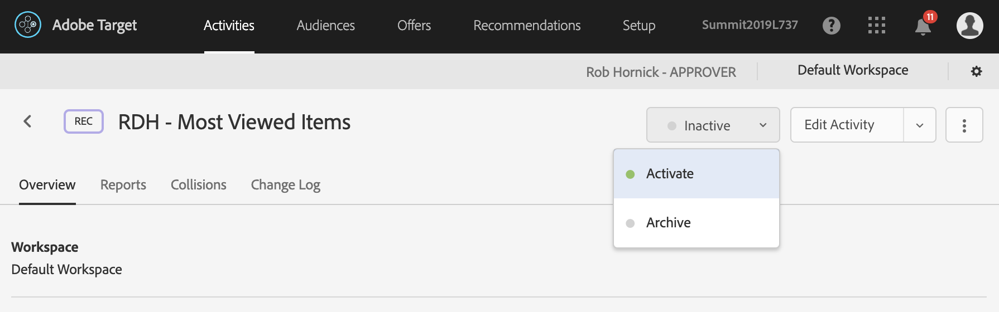

#### Testing your Targeted Activities

Confirm that both of your activities are **Live** in the Activity list view:

Open a new tab to the [**http://localhost:4503/content/we-retail/us/en.html?user=001**](http://localhost:4503/content/we-retail/us/en.html?user=001) page and verify that as a **repeat visitor,** you still see **Recently Viewed Items** – browse around the site as needed to confirm this is true, returning to the homepage with the Back button to avoid losing your query parameter.

Then, open an incognito window to the same URL and verify that as a **brand** **new visitor**, you now see a different set of recommendations - **Most Viewed Items**. (Results may differ from the below screenshot based on changing pageviews!)

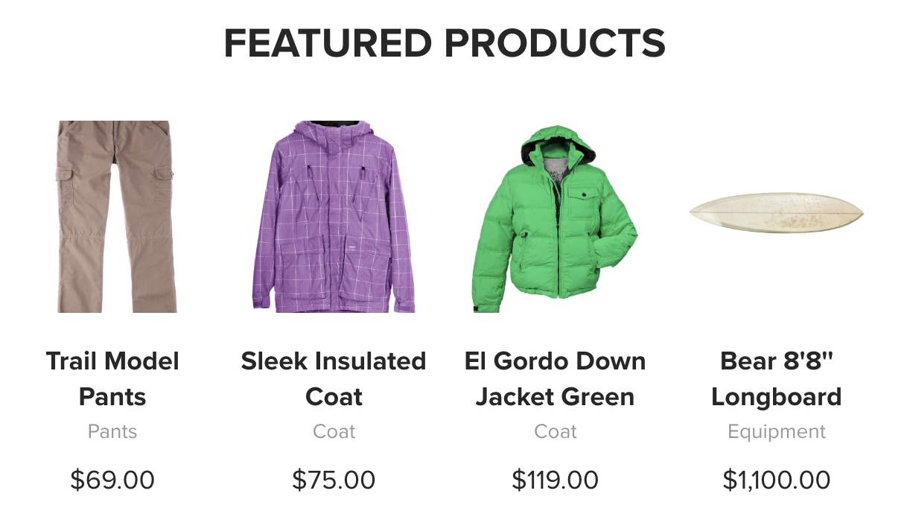

**Extra Credit Exercise:** Confirm these items match to the CSV file by opening these items and comparing their SKUs to the SKUs of the items recommended in the CSV.

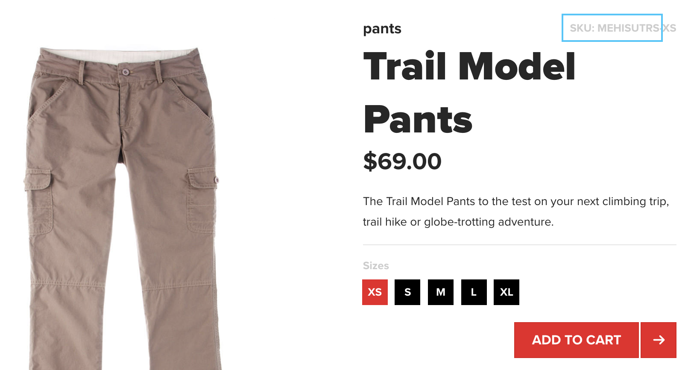

**Extra Credit Exercise:** You can also become a “new visitor” by clearing the “mbox” cookie for this page which contains the session identifier. Prove that this resets the recently viewed items and subsequent browsing again reveals the recently viewed items.

Congratulations on completing Section 3! You’ve learned:

- How to create a Recommendations Activity
- How to QA test recommendations before putting them on your live site
- How to show personalized recommendations to targeted audiences