# Recommend products on a Product Page

In this lesson, you will learn effective techniques to recommend products on a Product Page

## Learning Objectives

At the end of this lesson, you will be able to:

1. do this

## Prerequisites

You should have already completed the lessons in .

## First thing

## Exercise 4.2 – Use Criteria on a Product Detail Page

We now need to put this Criteria into action on your product detail page! In order to make the most of our limited time in this lab, we’ve pre-created an Activity for you which contains an identical criteria to the one you just created. Find the activity titled **Lab Solution - Lesson 4.2 PDP Recs** and open the Activity Overview.

Note the activity location includes any URL that matches the string `https://aem.enablementadobe.com/content/we-retail/us/en/products.html` which means the recommendations will be displayed on all Product Detail Pages:

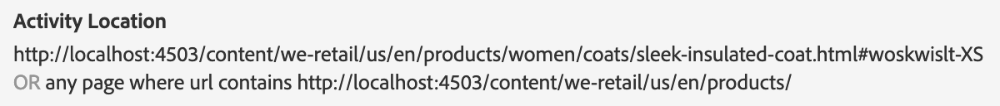

Note that the Criteria is selected and has results ready:

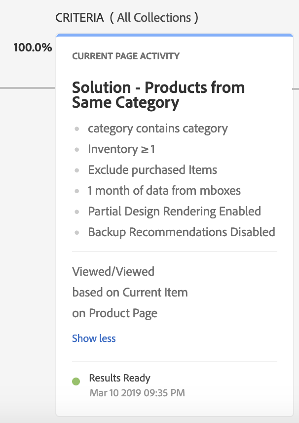

Use the **Download data** option and note that different recommendations have been produced per product SKU:

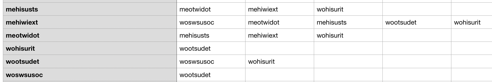

Once the activity has been activated, you will see recommendations that differ on each product detail page:

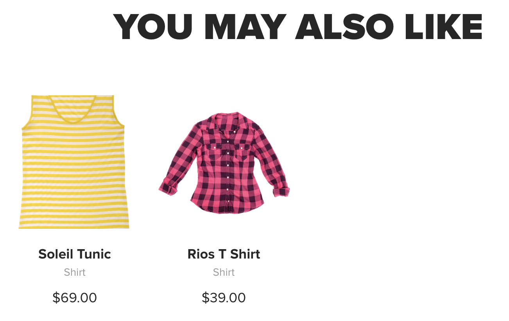

Note the following:

1. Recommended items differ by product viewed.
2. The recommended items are in the same category as the viewed item.
3. Not all slots in the design template are filled with recommended items.
4. Not all items have recommended items.

Items 3 & 4 are true because we did not enable backup recommendations and because we used a restrictive filtering rule (category equals current item’s category) to narrow down the recommended items. In the next exercise, we will see how we can use multiple sets of recommendations to fill in the rest of the slots.

### Creating a Sequence

We will create a sequence for our product detail page that displays in order of descending preference:

- People Who Viewed This, Viewed That (in the same category)
- People Who Viewed This, Viewed That (no category restriction)
- Backup items from Most Viewed across the site

1. Return to the **Recommendations > Criteria** library screen.

2. Click **Create Criteria** and select **Create Criteria Sequence**.

    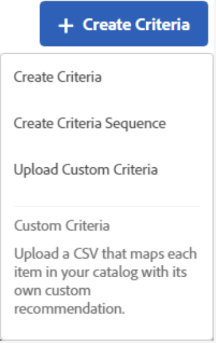

3. The first several steps are identical to those we did in Lesson 4.1 to create a Criteria.

    1. **Criteria Name:** This identifies the criteria in the Adobe Target application. Enter **YOURNUMBER – PDP Criteria Sequence**.

    2. **Display Title:** This public-facing display text can be returned in the recommendations template on pages using this criteria and can be used in troubleshooting. For this lab, enter the same title as above (**YOURNUMBER – PDP Criteria Sequence**).

    3. **Description:** An optional description detailing the purpose and/or selected settings of the algorithm.

    4. **Industry Vertical:** Our site is a web retailer, so leave the default option of **Retail / Ecommerce** selected.

    5. **Page Type:** We are creating recommendations for a **Product Page** so clear the **Home Page** selection, search for, and select **Product Page**.

        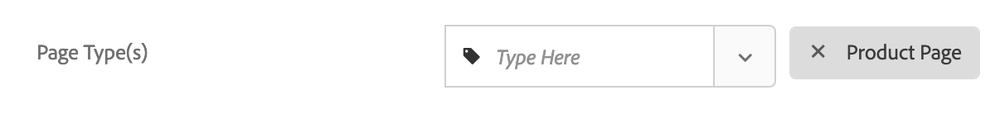

4. Adjust the **Content** settings. When you create a criteria sequence, backup recommendation and partial design rendering settings are ignored for the individual criteria the make up the sequence. To use backup recommendations and partial design rendering you must enable them for the sequence. If you choose to allow backup recommendations, you can also choose whether to apply inclusion rules to the backups. Select the appropriate toggles to ensure we have a full tray of recommendations for every product in our catalog.

    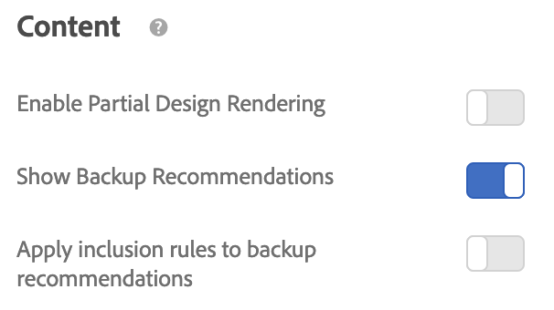

5. Add the criteria to the sequence under **Sequence Order:**

    1. Start by adding the **YOURNUMBER – Products from Same Category** criteria.

        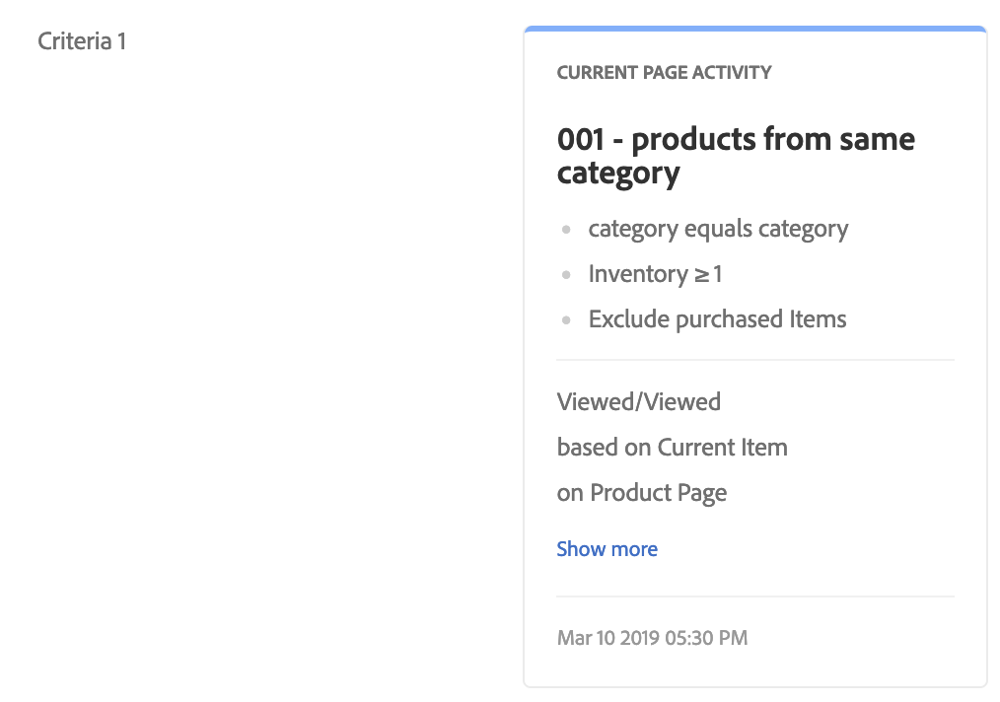

    1. Then add the **Solution - Products from Other Categories** criteria.

        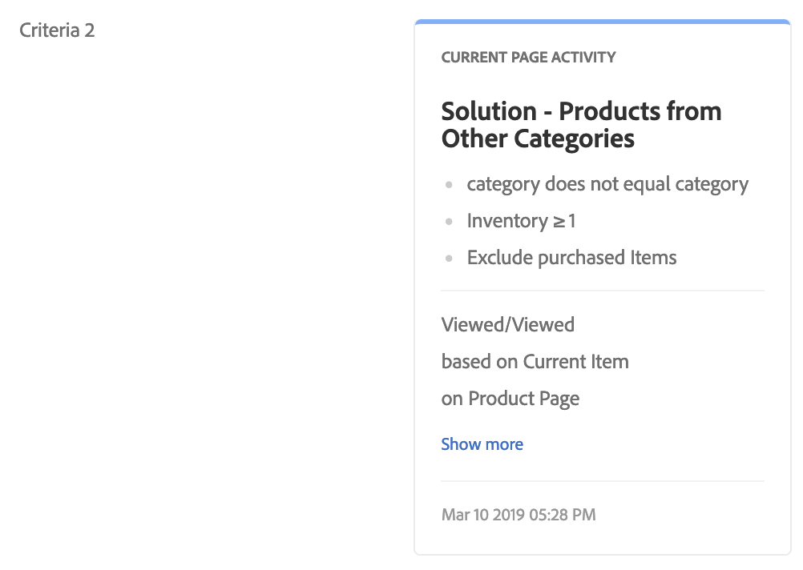

6. **Save and Close** the Criteria Sequence.

### Using the Sequence on the Product Detail Page

We now need to put this Criteria Sequence into action on your product detail page. In order to make the most of our limited time in this lab, we’ve pre-created an Activity for you which contains an identical criteria sequence to the one you just created. Find the activity titled **Lab Solution - Lesson 4.3 PDP Criteria Sequence** and open the Activity Overview.

As you did in Lesson 4.2, explore the configuration of this activity and examine the data download. Once the activity has been activated, you will see recommendations that differ on each product detail page. Note these similarities and differences from Lesson 4.2:

1. Recommended items still differ by product viewed.
2. The recommended items are no longer all in the same category as the viewed item.
3. Now, all slots in the design template are filled with recommended items.
4. Now, all items have recommended items.

## Exercise 4.4 - Troubleshooting with mboxTrace

mboxTrace enables you to receive trace information attached to mbox replies. Trace information reflects the outcome of an mbox call (for example, a conversion or an impression) and any additional data that may help in determining why this particular outcome happened, such as a set of available branches among which the selection was made in a campaign. Use this information to debug content delivery.

Because mboxTrace can expose campaign data and profile data to external parties, an authorization token is required. The authorization token can be retrieved in the Target UI. The token is valid for six hours.

To use the authorization token:

1. Click Setup > Implementation.
2. Click Generate Authentication Token.
3. Add the generated token as a parameter to your URL to enable one of the advanced debugging tools.

The following parameters are available:

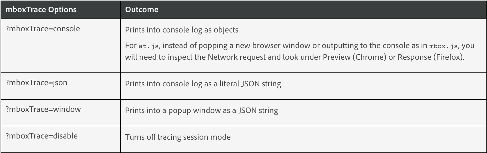

### mboxTrace with the Experience Cloud Debugger

- Ensure you are still logged into Experience Cloud
- Navigate to the Target server call, then select “Target Trace”
- Toggle the switch for “Enable Target Traces”

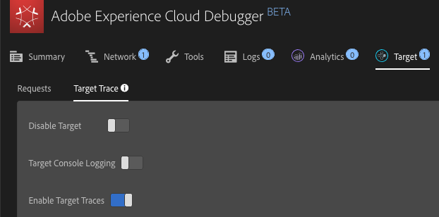

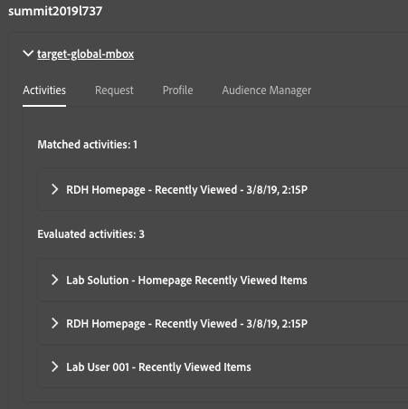

When applying mboxTrace, the Recommendations area will contain “embedded” code that can be extracted to a text editor for further evaluation:

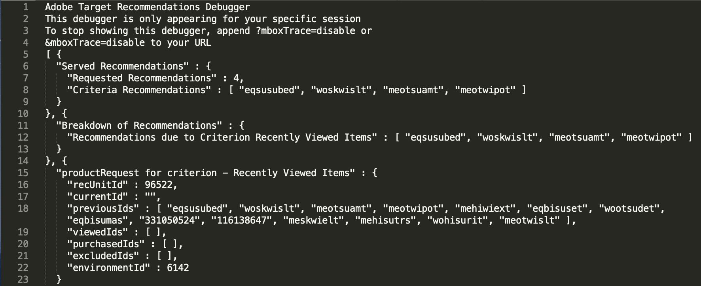

In the browser console, you can access mboxTrace by searching for “mbox” in the network call and finding “trace” in the preview of the global mbox request:

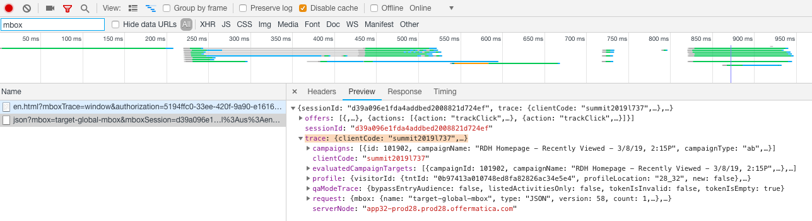
