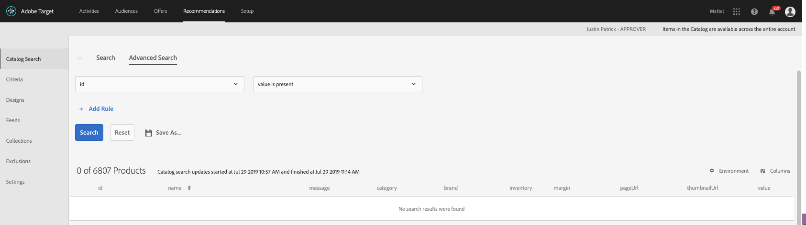
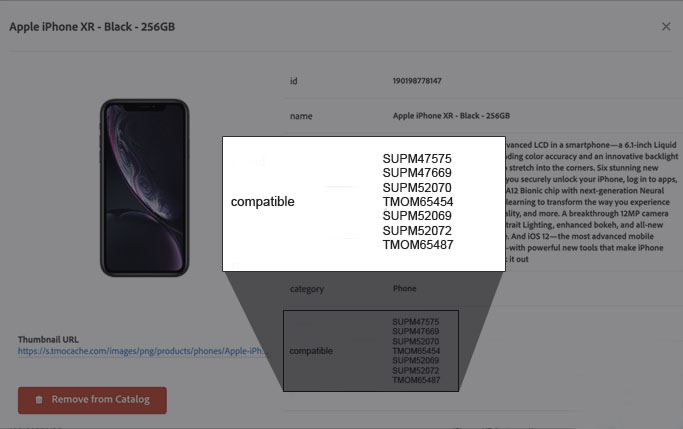
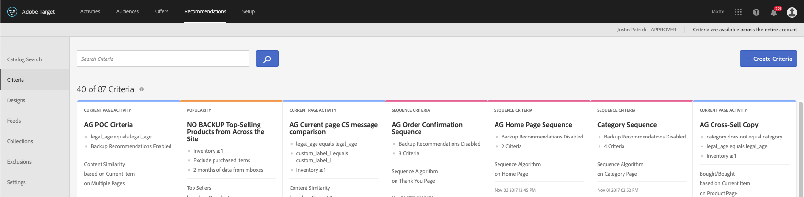
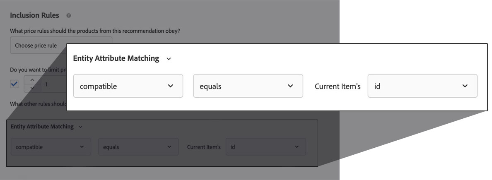
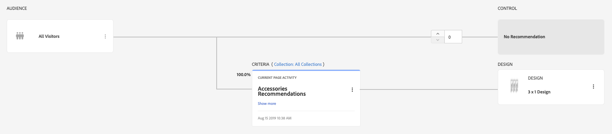

# Recommend Accessories

Recommending accessories is an easy and scalable way to increase the Average Order Value on your retail site. For example, pretend you are an outdoor sports retailer and a visitor is on your site shopping for bicycles. You can use Target Recommendations to recommend a tire pump, cycling gloves, and helmets.

In this guide, we will review the implementation and activity configuration steps so you can recommend accessories effectively in your website. We will demonstrate accessory recommendations, using our demo brand [We.Retail](https://aem.enablementadobe.com/content/we-retail/us/en.html), a fake outdoor sports retailer.

<!--show a screenshot of the final result-->
## Examples

Before we dive in further, you might want to take a moment to consider what types of accessory recommendations might be appropriate for your business.

### Examples by Industry

* A mobile phone retailer could recommend compatible chargers, cases, headphones, etcetera that are compatible with the specific phone the customer is researching, about to purchase, or just purchased.
* A toy retailer could recommend compatible batteries for a toy that does not include them
* An airline could recommend seat upgrade options for the specific plane or airplane the passenger is booking

### Examples by Page Type

* Product page&mdash;show required accessories (e.g. batteries for a gadget that does not include them)
* Product page&mdash;show compatible accessories
* Recommend compatible accessories for the items the customer just added to their shopping cart
* Order confirmation page&mdash;show compatible accessories for the product that was just purchased
* Homepage&mdash;show compatible accessories for return visitors who have recently purchased products
* Product Configurator&mdash;show compatible accessories upon completion of product configurator (e.g. color coordinated floor mats after configuring vehicle options on a car site)
* Shopping Cart page or Add to Cart modal&mdash;show compatible accessories

<!--
This feature gives you the ability to filter criteria results based on compatible, required and/or optional accessories attributes. If a value within these attributes matches the criteria key, the accessory will be displayed. This functionality will work with the following out of the box criteria keys:

* Current Item
* Most Viewed Item
* Last Viewed Item
* Last Purchased Item
* Custom Key
-->

<!--need to fix bike image. need to report up multiple categories-->
## Implementation

### Specify the Product to Accessory Relationship

In order to recommend accessories for a given product, Target needs to understand the relationship between the primary product and its relevant accessories. This is done in the Target Recommendations Collection. Each primary product (entity.id) is required to have a custom, multi-value entity field (e.g. `entity.accessories`) that lists the accessory `entity.id`s that are compatible. For example, in the case of cell phones, each phone would have a list of accessory skus in the same format as the entity.id.
<!--is it okay if i just call it entity.accessories or does that not work for some reason? seems like a good idea just to reinforce the concept-->
<!--diagram would be good here-->

This data can be added through the Target request that collects data on the product page, an API call, or through a new or current product feed. For more information see the [guide to uploading multi-value custom attributes](
https://docs.adobe.com/content/help/en/target/using/recommendations/entities/custom-entity-attributes.html#section_80FEFE49E8AF415D99B739AA3CBA2A14).
<!--what is meant by a "new or current product feed". this seems like a giant PITA to do on the page, at least with We.Retail. It required the delivery of all of those accessory skus to the page for no reason other than for Target. Should we strongly recommend Feeds?-->

### Specify the Product to Use as the Key

Accessory recommendations need to be keyed off of a single product specified as the `entity.id` parameter in the Target request. On some pages, the `entity.id`  will be obvious&mdash;on a Product Detail page it will just be the SKU of the current page&mdash;and you've probably already implemented it (or are planning on doing so). On other pages, you might have multiple products to choose from and need to make a decision about which one to use. For example, on the Shopping Cart page, you might need to add logic to your implementation to define which product in cart should be passed as the `entity.id` for accessory recommendations. For example, you might choose to recommend accessories for the highest priced item, most recently added item, etc. For Order Confirmation page or Homepage recommendations based on a recently purchased product, the last product reported to Target in the `productPurchasedId` parameter of the order confirmation request will be used.
<!-- is this true for order confirmation and homepage?-->

### Make an Additional Target Request

In most cases, you will be able to deliver your accessory recommendations via the page load request (or `target-global-mbox`). In some cases, such as with an Add to Cart modal, you will need to make an additional Target request with the `entity.id` parameter of the newly added product in order to deliver a new recommendation. This is usally a straightforward task with a tag manager, such as Adobe Experience Platform Launch.
<!--what should the request name be? A4T implications? Probably an Analytics call here already-->
<!--Can triggerView be used? -->
<!-- how do recs work in SPA-->

## Steps to Deploy

Steps are applicable to all use cases. Any variation based on use case will be detailed within the step outline.

1. Confirm that each applicable entity within your product catalog contains an attribute that lists the compatable accessories `entity.id`.

   1. Go to the Recommendations Catalog Search within Target.
    

   1. Search for an applicable `entity.id` and view the details. It should look something like this:
    
    <!--Scrub out TMO stuff-->

1. Create a new Criteria that filters your recommended products using this new product attribute
   1. Go to Criteria page within Target 
    

   1. Click 'Create Criteria'
    
   1. Set Name, Title, Description, Industry and Page Type as desired
   1. Set Recommendations Key and Logic: (See matrix to determine settings for your use case). For example, on a Product or Add to Cart Modal page you would key off of the "Current Item" and use "View this/View that" logic. For Order Confirmation and Home Page use cases you would key off of the Last Purchased Item and use "View this/Bought that" logic.
   <!-- i don't understand the logic selections-->
    
	 
    1. Set an Entity Attribute Matching inclusion rule to filter any product IDs that do not have matching values within the 'entity.compatible' attribute.
     

1. Include this newly created Criteria within your new or existing Recommendations activity.
     

 1. This new Criteria will need to fetch algorithmic results based of behavioral data captured from your site's visitors. You can monitor the status of this on the Criteria card within the Activity Summary Screen.
    

## Considerations

* Works well within a Criteria Sequence. Setup the first criteria with specific filters to limit the results  to your preference. Create the second criteria with less filters in order to broaden the results to additional products. Repeat this process at each criteria level, making the results more broad as the sequence progresses.
<!--could use an example here and link to the documentation-->
* Custom Criteria may be needed to display accessories for new products or products with limited accessories.
<!--could use an example here and link to the documentation-->