# Understand Key Recommendations Concepts

Before you begin creating Recommendations activities, it's important to understand some key concepts and capabilities with Adobe Target

## Learning Objectives

At the end of this lesson, you will be able to:

1. do this

## Prerequisites

You should have already completed the lessons in .

### Using Audiences in Recommendations Activities

In many cases, you will want to show different types of recommendations to different types of site visitors. For example, a hotelier may wish to showcase different properties for individuals identified as Vacationers vs. those identified as Business Travelers.

In these cases, Audience Targeting is a useful way to ensure the right recommendations are shown to the right groups of users.

In our e-commerce store, we know that users who are visiting our store for the first time won’t have any Recently Viewed Items. Let’s suppose that we believe it makes the most sense to show the **Most Viewed Items** from across our site to visitors **on the** **first pageview** of their session, and show **Recently Viewed Items** to users **on subsequent pageviews.**

> **Tip:** The Audience Targeting techniques we’ll explore in this lesson are not the only ways to solve the problems described above. For example, a “Most Viewed from Favorite Category” algorithm might solve the hotel use case, and a Criteria Sequence or Backup Recommendations might solve our retail use case. These techniques are explored in in Section 4.

### Edit your First Activity

Let’s first restrict our original **Recently Viewed Items** campaign to show to only on **subsequent pageviews**.

Click the dropdown arrow next to Edit Activity in the upper-right hand corner and choose **Edit Targeting.**

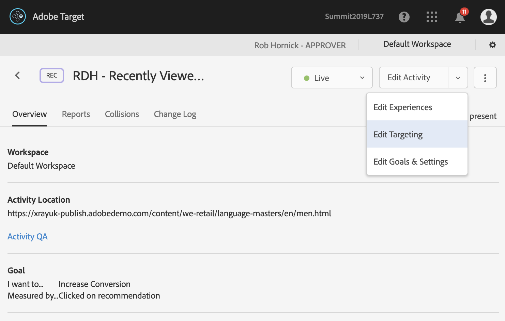

Click the menu icon next to the **Lab User YOURNUMBER** audience and select **Replace Audience**.

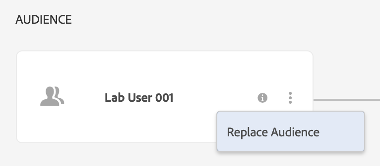

Click **Combine Multiple Audiences** in the upper right hand corner. In the window that appears, combine the **Lab User YOURNUMBER** audience with the **Not First Pageview** audience using an **AND** rule so that users must be in both audiences to see the content, by selecting the audiences in turn and clicking **Add to Rules**. Name the custom audience **YOURNUMBER Repeat Visitors**, then click **Save**.

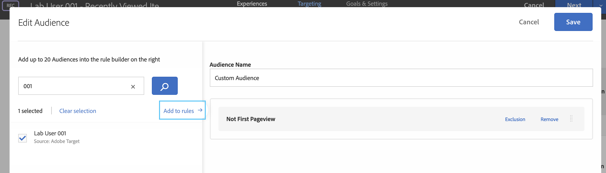

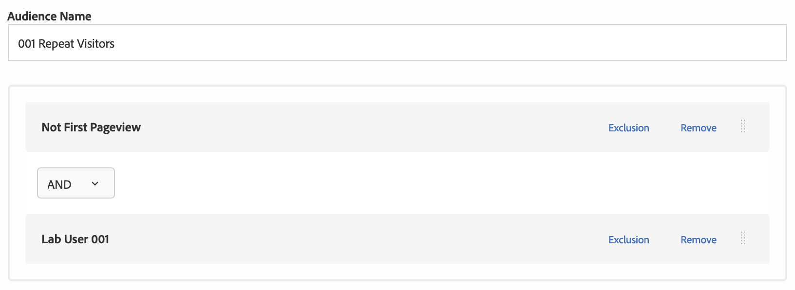

Select the new custom audience and click **Done**.

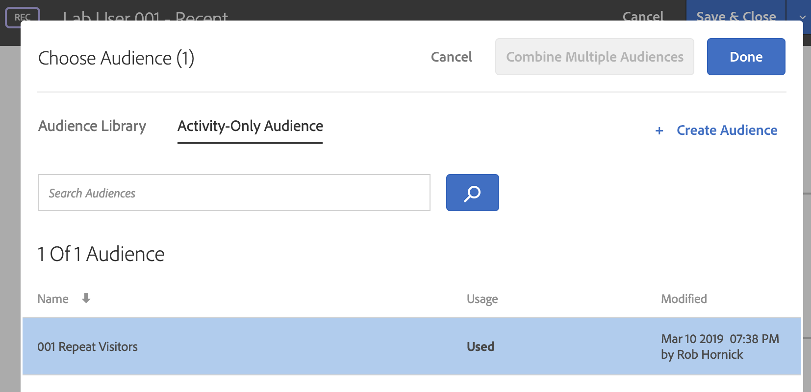

> [!TIP] You can also create custom audiences here based on any profile attribute by using the + Create Audience link. More information on audiences is available at <https://docs.adobe.com/content/help/en/target/using/audiences/target.html>.

Observe that the selected **Audience** for the activity has been changed to **YOURNUMBER Repeat Visitors**. Click **Save & Close**.

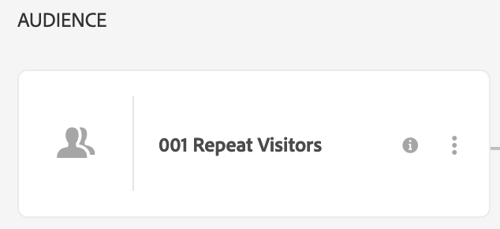

Note that the Activity status changes to **Syncing** as the changes are published to your site:

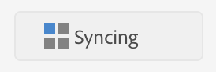

> [!TIP] In a real-world scenario, we usually wouldn’t recommend make changes to a live activity on the fly without any testing (to avoid a mistake causing a disruption to your site) – but this is acceptable for the purposes of a lab. If you are willing to have reporting on the activity start from scratch after your changes and want to avoid any period of time without active recommendations, the most foolproof method is to copy the activity (we cover this topic below), edit the copy, QA the copy, deactivate the original activity, and activate the copy. Alternatively, if you need to retain historical reporting information in the activity and are willing to accept a brief period without active recommendations, then deactivate the activity, make the changes, QA the changes, and then re-activate the activity.

## Lesson 4: Creating Advanced Algorithms and Criteria Sequences {#lesson-4}

## Objectives

In this section, we will cover how you can create advanced algorithms to control recommendations. You will learn:

- How to create algorithms
- How to customize and personalize algorithms with business rules
- How to combine multiple algorithms using criteria sequences

## Exercise 4.1 - Creating Criteria

In Adobe Target Recommendations, Criteria are algorithms and rules that determine which items to recommend. In this lesson, we will build customized recommendations for our product detail page. We want to recommend related items that the customer viewing the PDP might be interested in as alternatives to the current item. (Research and practice indicate that this greatly boosts overall conversion rate.) To accomplish this, we will use a **People Who Viewed This, Viewed That** algorithm and we will additionally apply a restriction to show only **products in the same category.**

### Viewing Criteria

Navigate to the Criteria library by clicking Recommendations in the top navigation bar, then Criteria in the left navigation bar. The criteria library appears.

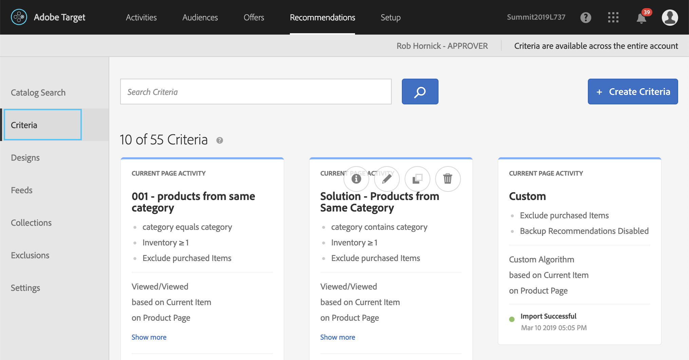

By default, Adobe Target includes several “out-of-the-box” criteria. You can customize these criteria or create your own. Browse these criteria to see what exists already; when you are done, return to begin creating your own criteria.

### Creating a Criteria

1. Click the blue **+ Create Criteria** button to start a new criteria and choose **Create Criteria** from the submenu.

    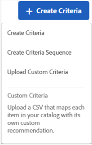

1. Enter the **Basic Information**: name, title, & description.

    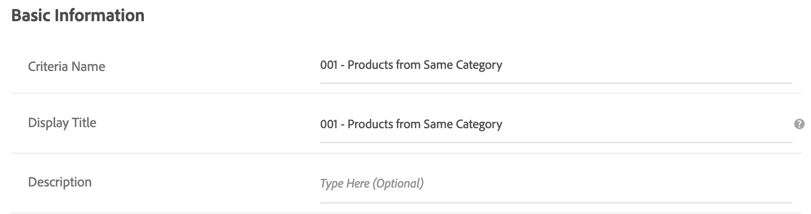

    **Criteria Name:** This identifies the criteria in the Adobe Target application. Enter **YOURNUMBER – Products from Same Category**.

    **Display Title:** This public-facing display text can be returned in the recommendations template on pages using this criteria and can be used in troubleshooting. (For example, you might use “People Also Viewed These Products” or “Related Items”.) For this lab, enter the same title as above (**YOURNUMBER – Products from Same Category**).

    **Description:** An optional description detailing the purpose and/or selected settings of the algorithm.

1. **Industry Vertical:** This is used in Target to help narrow down the available choices of Criteria in your Activities and the available choices of Recommendation Logic in your Criteria. Generally, this can be set once in your default settings and left alone. Our site is a web retailer, so leave the default option of **Retail / Ecommerce** selected.

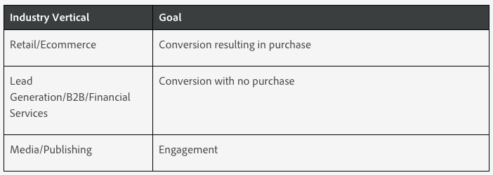

1. **Page Type:** Like Industry Vertical, Page Type is used in Target to help narrow down the available choices of Criteria in your Activities and the available choices of Recommendation Logic and Key in your Criteria. By default, new criteria start with **Home Page** selected. We are creating recommendations for a **Product Page** so clear the **Home Page** selection, search for, and select **Product Page**.

    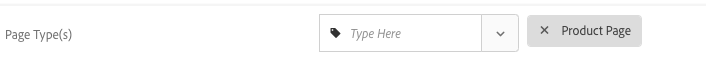

### Choosing a Recommendation Key and Logic

The **Recommendation** **Key** acts as the **basis** for the Recommendation Logic and determines the available logic options. A unique set of recommendations are produced for each unique value of the selected key. The key you select will depend on the type of recommendations you want.

The **Recommendation Logic** determines **how** the unique set of recommendations is produced for each value of the selected key.

### Recommendation Key Options

|Key|Description|Logic Available|
|--- |--- |--- |
|Current Item|The recommendation is determined by the item the visitor is currently viewing. Recommendations display other items that might interest visitors who are interested in the specified item.  When this option is selected, the entity.id value must be passed as a parameter in the display mbox.  Commonly used on product detail pages, article view pages, etc.|Items with Similar Attributes People Who Viewed This, Viewed That People Who Viewed This, Bought That People Who Bought This, Bought That Site Affinity|
|Current Category|The recommendation is determined by the product category that the visitor is currently viewing. Recommendations display items in the specified product category. When this option is selected, the entity.categoryId value must be passed as a parameter to the display mbox. Commonly used on category view pages.|Top Sellers Most Viewed|
|Last Purchased Item|The recommendation is determined by the last item that was purchased by each unique visitor. This is captured automatically, so no values need to be passed on the page. Commonly used on home pages or order confirmation pages. Do not use on product detail pages or earlier checkout flow pages.|Items with Similar Attributes  People Who Viewed This, Viewed That PeopleWho Viewed This, Bought That People Who Bought This, Bought That Site Affinity|
|Last Viewed Item|The recommendation is determined by the last item that was viewed by each unique visitor. This is captured automatically, so no values need to be passed on the page. Commonly used on home pages, “my account” page, etc. Do not use on product detail pages or checkout flow pages.|Items with Similar Attributes People Who Viewed This, Viewed That People Who Viewed This, Bought That People Who Bought This, Bought That Site Affinity|
|Most Viewed Item|The recommendation is determined by the item that has been viewed most often, using a weighting formula. Useful when users may view items more than once (e.g. media/content use cases.)|Items with Similar Attributes People Who Viewed This, Viewed That People Who Viewed This, Bought That People Who Bought This, Bought That Site Affinity|
|Favorite Category|The recommendation is determined by the category that has been viewed most often, using a weighting formula.  Useful when category is predictive of subsequent behavior.|Top Sellers Most Viewed|
|Popularity|The recommendation is determined by the popularity of items on your site. Popularity includes top sellers and top viewed by mbox data and, if you use Adobe Analytics, all of the metrics available in the product report. Items are ranked based on the Recommendation Logic you select.|Top Sellers Most Viewed Product report metrics (if using Adobe Analytics)|
|Recently Viewed Items|Uses the visitor's history (spanning sessions) to present the last x items the visitor has viewed, based on the number of slots in the design.|None|
|Custom Key|Recommendation is determined by an custom key that is stored in a visitor's profile.|People Who Viewed This, Viewed That People Who Viewed This, Bought That People Who Bought This, Bought That Site Affinity Most Viewed Top Sellers|

#### Recommendation Logic Options

|Logic|Description|
|--- |--- |
|Items/Media with Similar Attributes|Recommends items or media similar to items or media based on current page activity or past visitor behavior.  **Note:** If you select **Items/Media with Similar Attributes**, you will have the option to set [content similarity rules.](https://docs.adobe.com/content/help/en/target/using/recommendations/criteria/create-new-algorithm.html#concept_5402DAFA279C4E46A9A449526889A0CB)|
|People Who Viewed This, Viewed That|Recommends items that are most often viewed in the same session that the specified item is viewed.|
|People Who Viewed This, Bought That|Recommends items that are most often purchased in the same session that the specified item is viewed. This criteria returns other products people purchased after viewing this one, the specified product is not included in the results set.|
|People Who Bought This, Bought That|Recommends items that are most often purchased by customers at the same time as the specified item.|
|Site Affinity|Recommends items based on the certainty of a relationship between items. You can configure this criteria to determine how much data is required before a recommendation is presented using the Inclusion Rules slider. For example, if you select very strong, the products with the strongest certainty of a match are recommended.  For example, if you set a very strong affinity and your design includes five items, three of which meet the strength of connection threshold, the two items that do not meet the minimum strength requirements are not displayed in your recommendations and are replaced by your defined backup items. The items with the strongest affinity display first.  Some customers with diverse product collections and diverse site behaviors might get the best results if they set a weak site affinity.|
|Top Sellers|The items that are included in the most completed orders. Multiple units of the same item in a single order are counted as one order.|
|Most Viewed|The items or media that are viewed most often.|
|Recently Viewed Items/Media|Items that have been viewed recently by the visitor. When using this criteria, you should update the Target design to handle cases where blank recommendations would show when there are not enough previously viewed items to display.|

1. Select **Current Item** as the **Recommendation Key** and **People Who Viewed This, Viewed That** as the **Recommendation Logic**..

    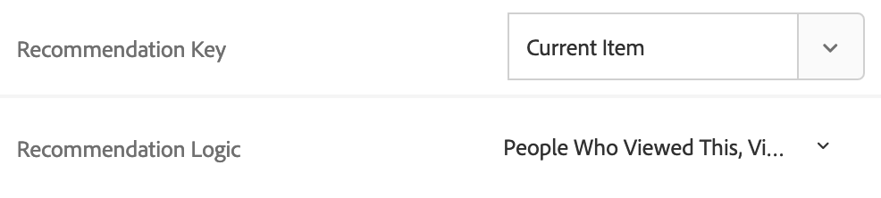

### Data Source and Content Rules

1. Set the **Data Range** to determine the time range of available historical user behavior data to use when determining which recommendations to show. If your site has a lot of traffic and behaviors change frequently, choose a shorter data window. A shorter window enables Recommendations to be more responsive to changes in the market and in your business. For example, a shorter window means that Recommendations will detect changes in visitor behavior as your visitors begin seasonal shopping, such as back-to-school shopping or Christmas, and will recommend items appropriate to those shopping seasons.

    If you don't have a lot of data, or visitor behavior does not change frequently, you might select a longer window. However, for many sites, a shorter window results in better recommendations.

    The available data ranges are:

    - 2 days
    - 1 week
    - 2 weeks
    - 1 month
    - 2 months

    Our demo site has little traffic, so select **1 month** as the Data Range.

    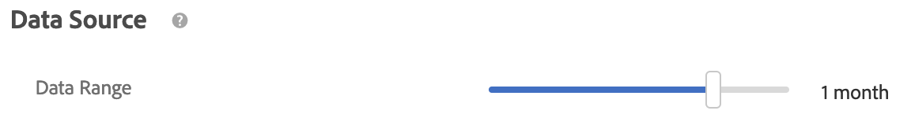

1. **Behavioral Data Source:** Target Recommendations can use page events (i.e. views and purchases) from Adobe Analytics to determine the popularity of items or use page events from Adobe Target (i.e., mboxes). Leave the default selection of **mboxes** selected.

    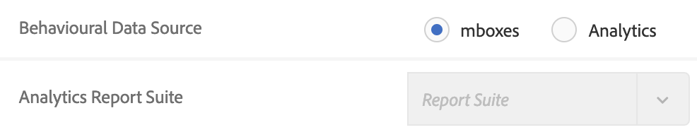

    > **Tip:** If you choose Adobe Analytics, you must choose the appropriate report suite to use for behavioral data.

1. **Content Rules**: Content rules determine what happens if the number of recommended items does not fill your design. For example, if your design has space for five items, but your criteria causes only three items to be recommended, you can leave the remaining space empty, or you can use backup recommendations to fill the extra space.

    - **Enable Partial Design Rendering** determines whether Target Recommendations is allowed to display a design that is only partially filled. Turn this setting **On**. If this setting is turned Off and Target does not have enough recommendations to completely fill the template, default content will be displayed.

    - **Show Backup Recommendations** determines whether Target Recommendations will return backup recommendations from the site’s top viewed items if not enough items are available to fill the template.. Backup recommendations are randomly chosen from the top 500 most-viewed products across the entire site. For more information, view <https://marketing.adobe.com/resources/help/en_US/target/recs/c_backup_recs.html>. Leave this setting **Off**.

    - **Recommend Previously Purchased Items** determines whether Target Recommendations will filter out previously purchased items from the recommendations. This setting is useful if you mostly sell items that people don’t repurchase frequently (e.g.: home appliances like dishwashers refrigerators.) If you sell items that people come back to purchase again, such as shampoo or other personal items, you should disable this option. Leave this setting **Off**.

    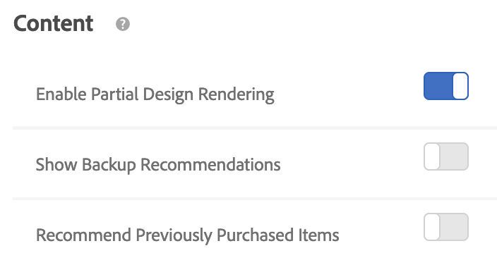

### Inclusion Rules, Advanced Filtering Rules and Attribute Weighting

1. **Inclusion Rules** allow you to filter items out of your computed recommendations. Inclusion rule filtering is performed in real-time when a visitor views the page, so it always reflects the latest price/inventory updates. The options available depend on the selected industry vertical. For Retail / Ecommerce, price rules and inventory will display:

    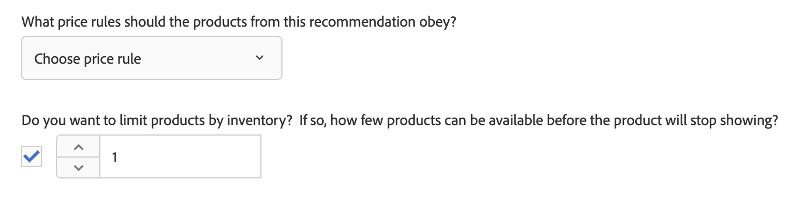

Leave these default values selected.

1. **Filtering Rules** allow you to create custom filters to dynamically exclude items based on the user’s behavior or profile. Four options are available:

    - **Entity Attribute Matching:** Filter dynamically by comparing a pool of potential recommendations items to a specific item that the users has interacted with. (For example, only recommend items that match the current item’s brand.)

    - **Profile Attribute Matching:** Filter dynamically by comparing items (entities) against a value in the user's profile. (For example, only recommend items that match the visitor’s favorite category.)

    - **Parameter Matching:** Filter dynamically by comparing items (entities) against a value in the request (API or mbox). (For example, only recommend content that matches the "industry" page parameter.)

    - **Static Filter:** Manually enter one or more static values to filter. (For example, only recommend content with an MPAA rating of "G" or "PG.")

    Add an **entity matching** rule to recommend only items that match the **current item’s category**:

    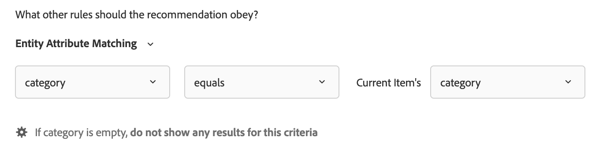

1. **Attribute Weighting**: You can add multiple rules to "nudge" the algorithm based on important description or metadata about the content catalog. For example, you can apply a higher weighting to on-sale items so they appear more often in recommendations. For this exercise, Attribute Weighting is not required.

1. When finished, click **Save**.

## Lesson 5: Customizing Recommendations with Design Templates {#lesson-5}

## Objectives

In this section, we will cover how you can customize the display of recommendations from Adobe Target Recommendations. You will learn:

- How to edit design templates
- How to use Velocity scripting to customize design templates

## Viewing Designs

With the **Recommendations** tab selected from the top nav bar, navigate to the **Designs** page in the left-hand navigation menu:

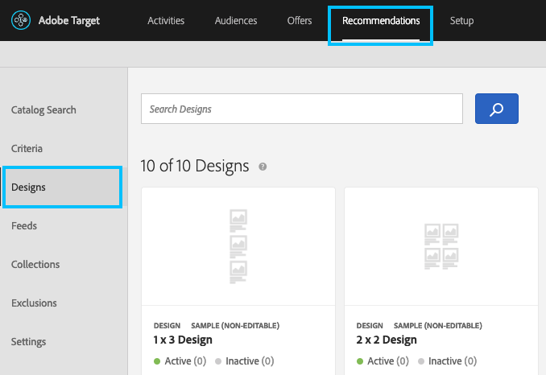

You will see a list of all currently available Recommendations **Design** templates.

Design templates are the way Recommendations specifies the format of the response to return to the browser or other requesting application.

Target Recommendations can return either **JSON** or **HTML**-formatted responses.

Let’s examine the format of a design template. Type **Lesson 5** into the **Search Designs** box and press **Enter** or click the magnifying glass icon.

### Create a Design

Mouse over the design template titled **Lesson 5 Starter Design** and click the **Copy** button () that appears on mouseover. The **Create Design** window opens with a copy of the Design:

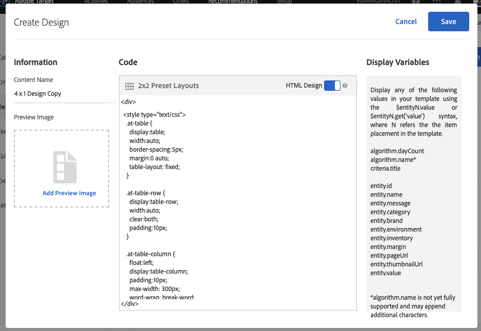

Start by renaming your design template **YOURNUMBER – 4 x 1 Design**:

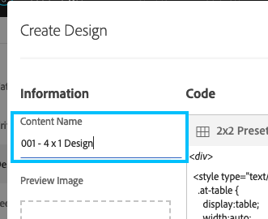

Note that you can upload a preview image if desired. This is useful to easily distinguish multiple designs in your library:

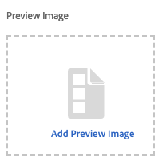

In the **Code** editor, you can specify the HTML, CSS, and/or JSON content of the design. Note that the current design contains HTML and CSS. Examine the current design contents.

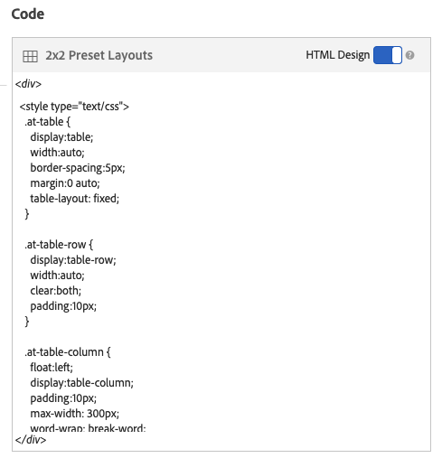

At the top of the **Code** editor, note the **HTML Design** toggle. Leaving this toggle on instructs Target Recommendations that the content should be returned as HTML. If left on, Target Recommendations will also wrap the contents in a `
` tag that allows Target to track clicks on the returned recommendations. Turning the toggle off instructs Target Recommendations that the content should be returned as JSON, and the content will not be wrapped in a `
` tag.

For now, click **Save** in the upper right corner to save your new design.

### Using Velocity Scripting to Customize Designs

Search for your Design by typing **YOURNUMBER** into the search box, mouse over your newly created design (titled **YOURNUMBER - 4 x 1 Design**), and click the **Edit** icon ().

Scroll down in the design and notice that the design contains placeholder text for many of the product attributes we want to display on our page:

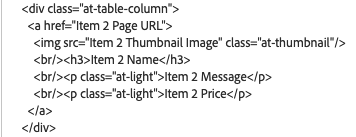

We need to replace this placeholder text with the correct variables to ensure the right product attributes are shown on our page.

To do this, we will use Velocity scripting syntax. Velocity is an open-source scripting language that allows web developers to insert variables into HTML or JSON. (For more information, visit: <http://velocity.apache.org/engine/1.7/user-guide.html>)

Note that the current template is intended to do the following for each of 4 products:

- Link to the product detail page
- Display the product thumbnail image
- Display the product name
- Display the product description
- Display the product price

To do this, we must replace each placeholder for products 2-4. Using Product 1 as a guideline:

- Insert $entityN.pageUrl for products 2-4 (replacing N with 2, 3, and 4)
- Insert $entityN.thumbnailUrl
- Insert $entityN.name
- Insert $entityN.message
- Insert $entityN.value

When you have finished, click **Save** to save your updated template. Then, return to your **Recently Viewed Items** activity from **Lesson 3.1** and swap in the design template. Validate that the template displays correctly. (You may have to wait a few minutes for the displayed template to update.)

**Extra Credit:** Use Velocity scripting and conditional logic to changing the color of the item’s price to green if the price is less than or equal to $40.00 and red if the price is greater than $40.00.

**Extra Credit:** Add a 5th item to the display template.

> [!TIP] If you change the number of items displayed in a design template, Target Recommendations needs to re-compute the algorithm to ensure a sufficient number recommendations are available, and Criteria status will change from Results Ready to Results Not Ready.