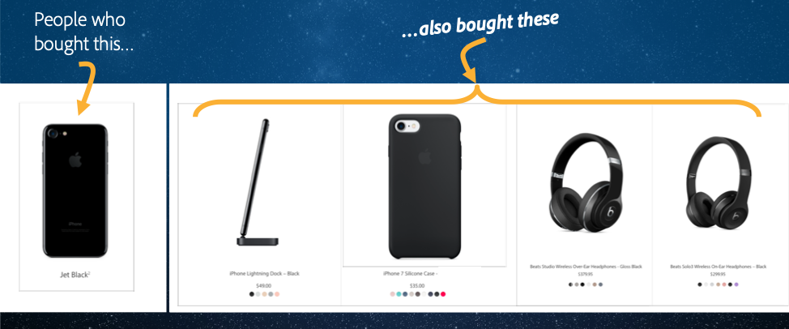
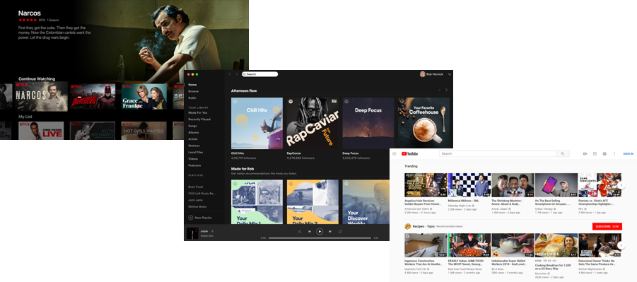
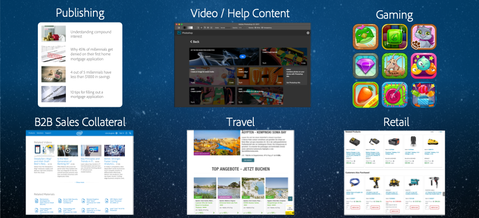

# Lesson 1: Intro to Recommendations

## Why Recommendations?

**Customers expect recommendations.**

Most of us are familiar with recommendations in retail. Increasingly, customers expect recommendations and use them as a jumping off point to explore the available options.

And if you think about your own shopping behavior, these kinds of recommendations work!

Nearly everyone among us has bought a product we saw first in a recommendation somewhere.

### Digital-first experiences are raising the bar for personalization

Increasingly, the way we consume media and content is driven by personalized recommendations.

Think about the first thing you see when you open up Netflix, Spotify or YouTube.

In a world where more alternatives are available than ever, it’s critical that you can identify the most relevant content for your customer at the point of interaction.

### Adobe Target delivers recommendations for any use case or channel

Marketers use Adobe Target to drive personalized experiences across a wide variety of industries, customer types and channels:

- Publishing: Web publishers use Adobe Target Recommendations to recommend articles to site visitors and drive increased engagement.
- Video Tutorials: Adobe Creative Cloud uses Target to recommend video tutorials to Photoshop users in-app.
- Gaming: Gaming companies use Target to recommend games and content to users on their consoles.
- B2B Sales: [Intel uses Target to recommend videos, whitepapers and blog posts to B2B prospects and driver downloads and help to existing customers](https://theblog.adobe.com/testing-shifts-high-gear-intel)
- Travel: [Der Touristik, a German travel booker, uses Target to recommend hotels and more to travelers](https://2017.summit.adobe.com/na/sessions/summit-online/online-2017/#17608)
- Retail: [Grainger, a leading B2B retailer, uses Target to recommend top categories and products to return visitors in the browser and in their mobile app](https://theblog.adobe.com/optimization-personalization-b2b-powerhouse-grainger/)

### Adobe Target powers personalized recommendations

Great recommendations should be relevant and personalized. This means you need these three things:

1. Marketer controls to help drive relevance of the items that are recommended. As a marketer you bring valuable context to the table and you know what attributes of your products or content are relevant for a recommendations model to consider. If you’re running a video site, you know that users might be interested in seeing movies from the same director, but probably don’t care about seeing movies that were produced by the same studio. Adobe Target empowers you with controls that allow you to enhance your algorithms with this domain knowledge.

2. Sophisticated models to make sense of millions of items in your catalog and interaction events. Adobe Target has sophisticated machine learning capabilities built over a decade of experience and we handle billions of recommendations per year.

3. User context to ensure that recommendations are timely and relevant to your users. You don’t want to recommend the video that someone just watched or the shirt that someone just added to their cart. Adobe Target’s rich user profile can be used in recommendations to ensure personalization.

## Defining a recommendations strategy

First, think about what you want to recommend – this could be products, videos, content.

Next, think about where you want to make recommendations. Broadly what channels – web, mobile, in-store, other? What parts of the customer journey? What pages on your site?

Then, suppose that you have an experience without recommendations and an experience with recommendations, or you have two different types of recommendations. How would you determine which experience was a better experience for your customers? Some metrics may be more difficult than others to measure. For example, the impact of recommendations on Customer Lifetime Value is often difficult to directly get to. So it is often easier to get to a less abstract metric and one that is more concrete – for example, revenue per visit, average order value, or number of clicks. In some cases you may be looking to minimize a metric – for example, the number of support calls.

## Sample recommendations strategy

| Recommendation Type  | Examples |  Location  | Purpose  |
|---|---|---|---|
| Similar Items | &middot; People who viewed this viewed that &middot; Last product you viewed/purchased | &middot; Product page &middot; Article page | &middot; Related &middot;  Similar &middot;  Publisher &middot;  Helpful Articles  |
| Alternative Items | &middot; People who viewed this bought that | &middot; Product page &middot; Article page &middot; Email  |  &middot; Alternatives substitution &middot;  Similar &middot;  Selection/Decision |
| Complementary Items | &middot; People who bought this bought that  | &middot; Shopping cart &middot;  Checkout (funnel) &middot;  Email  | &middot; Cross-sell  |
| High Affinity Items | &middot; May we suggest &middot; Suggested products  | &middot; Product page &middot; Article page &middot;  Checkout  | &middot; Conversion-focused &middot;  Expert  |
| Searched Items | &middot; People who searched for this bought that  | &middot; Search results page  | &middot; Cross-sell &middot;  Related &middot;  Complementary  |
| Most Popular Items | &middot; Best-selling products &middot; Top viewed  | &middot; Homepage &middot;  Product page &middot;  Email  | &middot; Engagement &middot;  Cross-sell |