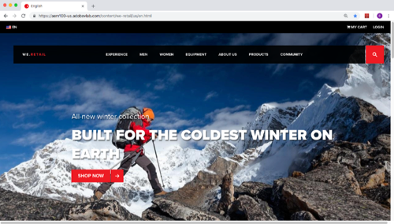

# Overview

Recommendations are everywhere—and they aren't just for products anymore. With Adobe Target Recommendations, you can deliver personalized products, articles, videos, downloads, songs, content, and more with sophisticated algorithms and complete marketer control.

_Implementing and Using Adobe Target Recommendations in a Website_ is the perfect starting point for marketers who want to learn how to implement and use the Adobe Target Recommendations in their website.

Each lesson contains how-to exercises and foundational information to help you implement and use Adobe Target Recommendations.

A demo site is provided for you to complete the tutorial, so you can learn the underlying techniques in a safe environment. After completing this tutorial, you should be ready to start implementing all of your marketing solutions through Launch on your own website.

After completing this you will be able to:

* Implement Adobe Target for Recommendations

* Build Recommendations Activities in the Target interface leveraging

## Prerequisites

In these lessons, it is assumed that you have an Adobe Id and the required permissions to complete the exercises. If not, you may need to reach out to your Experience Cloud Administrator to request access.

* For Launch, you must have permission to Develop, Approve, and Publish. For more information on Launch permissions, see [the documentation](https://docs.adobelaunch.com/administration/user-permissions).
* For Target, you must be an Approver in order to setup and Launch activities.
  
This tutorial uses Launch as the deployment mechanism for Adobe Target and assumes you have already completed the Configuring Launch and Add Adobe Target sections of the [Implementing the Experience Cloud in Websites with Launch](https://docs.adobe.com/content/help/en/experience-cloud/implementing-in-websites-with-launch/index.html) tutorial.

Also, for the Implementation portion, it is assumed that you are familiar with front-end development languages like HTML and JavaScript. You do not need to be a master of these languages to complete the lessons, but you will get more out of them if you can comfortably read and understand code.

## About the Lessons

In these lessons, you will implement Adobe Target Recommendations into a fake retail website called We.Retail. The [We.Retail site](https://aem.enablementadobe.com/content/we-retail/us/en.html) has a rich data layer and functionality that will allow you to build a realistic Recommendations implementation that you will use to build activities. You should have already completed the Configuring Launch and Add Adobe Target sections of the [Implementing the Experience Cloud in Websites with Launch](https://docs.adobe.com/content/help/en/experience-cloud/implementing-in-websites-with-launch/index.html) tutorial before you begin. You will be able to map the We.Retail site to your own Launch property and use your own Target account using the Experience Cloud Debugger.

## Get the Tools

1. Because you will be using some browser-specific extensions, we recommend completing the tutorial using the [Chrome Web Browser](https://www.google.com/chrome/)
1. Add the [Adobe Experience Cloud Debugger](https://chrome.google.com/webstore/detail/adobe-experience-cloud-de/ocdmogmohccmeicdhlhhgepeaijenapj) extension to your Chrome browser
1. Bookmark the [We.Retail site](https://aem.enablementadobe.com/content/we-retail/us/en.html)

>[!NOTE] You might find it easier to complete this tutorial with the We.Retail site open in Chrome, while you read this tutorial and complete the Launch interface steps in a different browser.

Let's get started!

<!-- 
Notes:
Recommending categories
Recommending accessories
Homepage new vs return sequence criteria
Profile attribute matching and custom criteria
  Recommend categories based on industry
  Recommend products based on customer profile
Rawbox email Recommendations

Cross-device recommendations
-->