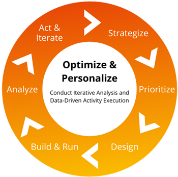

# Best practices for optimization with Adobe Target

Learn Adobe's six essentials of optimization and how to apply them.

When it comes to building a strong digital presence, there are a number of challenges your team will face. Not only are you tasked with engaging hundreds, even thousands of customers, on top of that, your customers display a variety of unique behaviors and preferences that will change over time and it is up to you to not only keep up with those changes, but anticipate them and execute your strategies efficiently and accurately. It is a race against competitors in a perpetual content marathon, requiring constant iteration and best-in-class technology.

A solution to this multifaceted challenge is optimization with Adobe Target, which ensures that you have an evolving digital presence that is relevant, valuable and free of friction. The technical architecture and the channels in which you deploy [!DNL Target] will dramatically vary across customers, however we have curated a list of best practices and optimization strategies every team can use to harness the full capabilities of this powerful tool.

## Understanding optimization

Optimization is defined as, "the action of making the best or most effective use of a situation or resource." It is the most efficient way to ensure that you have qualitative data that will prove that the changes you are making are valuable. To truly optimize, you must be able to measure the impact and value of your efforts. Otherwise, the changes you make will result in higher cost, with minimal gain. In order to achieve this effectively and efficiently, you must begin with strategic planning. Without including a strategic plan in your optimization, you would simply be guessing.

### Six essentials of optimization

1. **Strategize**: Identify opportunities for activities that are aligned with business objectives and which are based on data.
1. **Prioritize**: Rank and schedule activities based on business alignment, level of effort and potential impact.
1. **Design**: Create finalized visuals of activity experiences and develop activity plans with detailed criteria.
1. **Build and run**: Develop activity including [!DNL Target] set-up, code development, and QA testing.
1. **Analyze**: Launch [!DNL Target] activity to production and monitor performance for the duration of the activity.
1. **Act and iterate**:  Develop recommendations based on test or personalization activity performance.

Knowing that change is a constant, our optimization strategy should be an iterative execution cycle to meet the ever-changing needs of your customers (See Figure 1 below).

_Figure 1 - Optimization Iterative Cycle_

## Building an optimization strategy

The process of developing an optimization strategy can be broken down into: (1) Build a Test Activity Plan and (2) Understand Optimization Basics.

1: The Test Activity Plan should be documented. This ensures that you have a minimal standard of quality when it comes to your test activity application. Your Test Activity Plan should include:

* **Name & Description:** Intuitive activity name and description of what the experiment is focused on. "How? What? When? Where? Why?"

* **Objective:** Purpose of the activity and aligned business objective it is being designed to impact.

* **Hypothesis:** A hypothesis is a prediction you create prior to running an experiment. It clearly states what is being tested, what you believe the outcome will be and why you think that's the case. Running the experiment will either prove or disprove your hypothesis.

A complete hypothesis has three parts:

* If _variable_
* Then _result_
* Because _rationale_

* **Location:** URL, page section, and device type.
* **Goal Metric:** How will success be measured?
* **Secondary Metrics:** Other valuable key performance indicators (KPIs) to evaluate with the purpose of further understanding impact &amp; planning iterations.
* **Activity Audience:** Description of required test exposure filtering.
* **Reporting Audiences:** List of descriptions of visitor subsets to be used for analysis.
* **Experience Concepts:** Mockups, examples wireframes, and descriptions.

**General Note:** Any element of a webpage that can drive business value or give valuable insight into visitor behavior can be tested. Some common types of test activities include:

* Headline text
* Content text
* Button text
* Page layout
* Photography
* Button color
* Element layout
* Removal and addition of elements
* Navigation ordering
* Navigation taxonomy
* Search emphasis

2: The second stage of strategy is to Understand the Optimization Basics, which includes the understanding of testing elements themselves. The testing elements of Optimization include:

    A. Element Value

    This is achieved by taking a step back to ask, why a certain element exists on your site, and does the content serve a specific purpose? These questions are a good place to start if your site just concluded a redesign, or if a new feature was recently rolled out. The tactic used to determine element value is referred to as Inclusion/Exclusion Testing. Inclusion/Exclusion Testing provides a good read of value on the page where the element is displayed.

    B. Element Presentation

    This is where you would think about the overall look and feel of the element and how that affects the overall page presentation. The tactic used for presentation is to focus on making impactful content and element page changes.

    C. Element Function

    Here we ask, is the element on the page doing what it is supposed to do? Is the interaction successful and working as intended? Is the interaction natural, or a point of friction? The tactic used for function is to build experiences that are focused on easy-to-use functionality without additional cost impact.

## Optimization vs. personalization

Now that we have analyzed and listed the components of strategy, it is important to draw a distinction between Optimization efforts and Personalization efforts. Optimization is the action of making the best or most effective use of a situation or resource, while Personalization is the action of designing or producing something to meet someone's individual requirements.

At a high level:

* Optimization is focused on testing to find what is most efficient and best performing for ALL who interact with your digital presence.
* Personalization is testing to find what is most efficient and best performing for SOME of those who interact with your digital presence.

When focusing on Optimization, the most common test activities are:

* **A/B testing:** Real time testing of two or more pages or page elements against each other to gain quantitative insight into customer preference.
* **Multivariate testing:** Comparing combinations of offers among elements on a page to see which combination performs the best. In addition, the multivariate test will identify which element of the page best improves conversions.

When focusing on Personalization you are likely to see the same testing activities as in Optimization, but they are geared to more specific audiences. For example, in A/B testing, you will likely add pages and audiences within the experiences to further your Personalization.

Personalization also includes the Experience Targeting test activity type, which delivers content to specific audiences based on a set of defined rules and criteria. As you start to grow and deepen into Personalization, this is also where you will leverage some of Target's premium features like:

* Automated Personalization Activities Type
* Recommendation Activities Type

## Optimization before personalization

Given the above understanding, Adobe recommends that you Optimize before you Personalize, and advance Personalization from broad to granular. To mature Personalization Activities from broad to granular, you will begin using a one-to-many personalization (broad) style (using A/B testing), then move into one-to-one personalization (granular) style (using Automated personalization activities).

For more information, please listen to [webinar on understanding and optimizing your Adobe Target implementation](https://adobecustomersuccess.adobeconnect.com/pkfafpzd9yarmp4/), with Business Consultant, Katie Cozby.

Learn more about strategy and thought leadership at the [Customer Success](https://experienceleague.adobe.com/docs/customer-success/customer-success/overview.html) hub.
