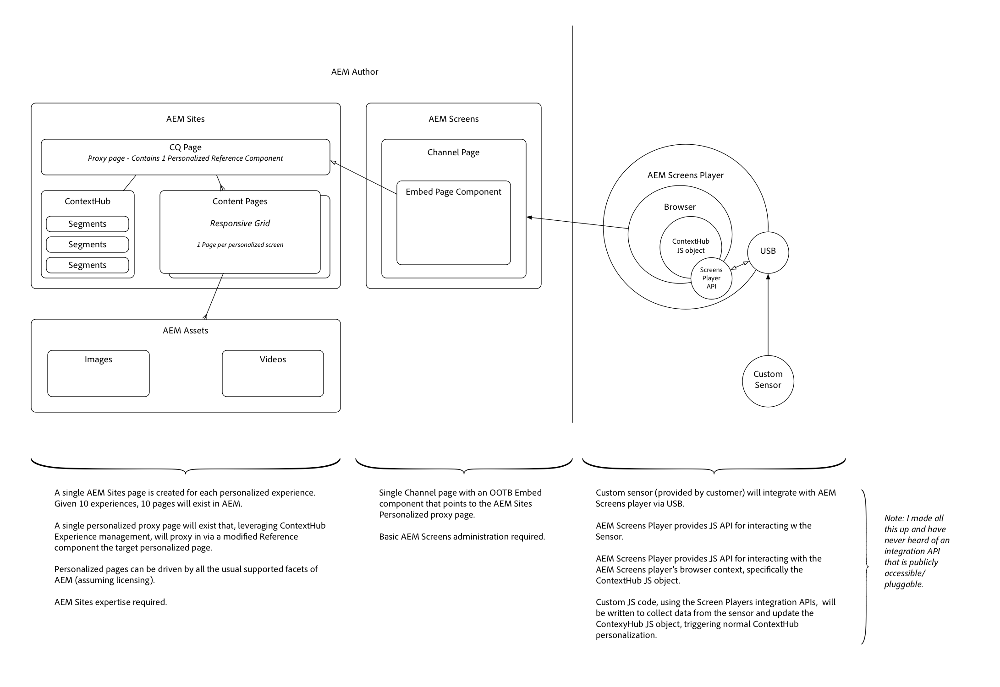

# Diagram Page{#diagram-page}

 

Click to download

AEM's provides 3 scopes OOTB

* Profile
* Offline access
* Replicate

AEM 6.3's extensible OAuth scopes allow other custom scopes to be defined.

For example, a custom scope can be developed and deployed to AEM that allows a mobile app authorized via OAuth to be restricted to reading, but not writing assets.

OAuth is the preferred method of authorizing a client application since it uses an access token instead of requiring an AEM user's credentials to be provided to that application.

## Supporting materials {#supporting-materials}

* [Download diagram in hi-res](/templates--do-not-publish-/diagram-page/_jcr_content/main-pars/image.img.png/Screens%20-%20Example%20Solution%20Arch.png)

>[!MORE_LIKE_THIS]
>
>* [Sizing AEM Assets Deployments](https://helpx.adobe.com/experience-manager/kt/assets/internal/deployment-sizing-calculator-tutorial-use.html)
>* [AEM Assets Brand Portal Enablement Sessions](https://helpx.adobe.com/experience-manager/kt/assets/internal/enablement-sessions-brand-portal-video.html)
>* [Using Desktop App with AEM Assets](https://helpx.adobe.com/experience-manager/kt/assets/using/aem-desktop-app-sync-status-technical-video-use.html)
>* [Set up Asset Insights with AEM Assets](https://helpx.adobe.com/experience-manager/kt/assets/using/asset-insights-tutorial-setup.html)
>* [Set up Smart Tags with AEM Assets](https://helpx.adobe.com/experience-manager/kt/assets/using/smart-tags-technical-video-setup.html)
>* [Set up Asset Templates with AEM Assets and InDesign Server](https://helpx.adobe.com/experience-manager/kt/assets/using/asset-templates-technical-video-setup.html)
>* [Understanding Brand Portal with AEM Assets](https://helpx.adobe.com/experience-manager/kt/assets/using/brand-portal-article-understand.html)
>* [Using 3D with AEM Assets](https://helpx.adobe.com/experience-manager/kt/assets/using/3d-assets-feature-video-use.html)
>* [Developing for Brand Portal with AEM Assets](https://helpx.adobe.com/experience-manager/kt/assets/using/brand-portal-technical-video-develop.html)
>* [Understanding Asset Share Commons](https://helpx.adobe.com/experience-manager/kt/assets/using/asset-share-commons-article-understand.html)
>* [Using Brand Portal with AEM Assets](https://helpx.adobe.com/experience-manager/kt/assets/using/brand-portal-improvements-feature-video-use.html)
>* [Set up Smart Translation Search with AEM Assets](https://helpx.adobe.com/experience-manager/kt/assets/using/smart-translation-search-technical-video-setup.html)
>* [Understanding Adobe Asset Link authentication with AEM Assets](https://helpx.adobe.com/experience-manager/kt/assets/using/adobe-asset-link-authentication-article-understand.html)
>* [Understanding Check-in/Check-out in AEM Assets](https://helpx.adobe.com/experience-manager/kt/assets/using/checkin-checkout-technical-video-understand.html)
>* [AEM Assets Remote DAM](https://helpx.adobe.com/experience-manager/kt/assets/beta/remote-dam-feature-video-understand.html)
>* [Understanding Architecture of Demandware Integration in AEM](https://helpx.adobe.com/experience-manager/kt/commerce/using/demandware-technical-video-understand.html)
>* [Understanding Demandware Integration in AEM](https://helpx.adobe.com/experience-manager/kt/commerce/using/demandware-feature-video-understand.html)
>* [Set up Data Integration with AEM Forms](https://helpx.adobe.com/experience-manager/kt/forms/using/data-integration-technical-video-setup.html)
>* [Using User Profile Data Integration with AEM Forms](https://helpx.adobe.com/experience-manager/kt/forms/using/user-profile-data-integration-feature-video-use.html)
>* [Using JDBC-based Form Data Models with AEM Forms](https://helpx.adobe.com/experience-manager/kt/forms/using/jdbc-data-model-technical-video-use.html)
>* [Using Association Data Models with AEM Forms](https://helpx.adobe.com/experience-manager/kt/forms/using/association-data-model-technical-video-use.html)
>* [Using Service Data Models with AEM Forms](https://helpx.adobe.com/experience-manager/kt/forms/using/service-data-model-technical-video-use.html)
>* [Using CAPTCHAs with AEM Adaptive Forms](https://helpx.adobe.com/experience-manager/kt/forms/using/forms-captcha-feature-video-use.html)
>* [Using Automated Tests with AEM Adaptive Forms](https://helpx.adobe.com/experience-manager/kt/forms/using/calvin-sdk-test-adaptive-forms-article-use.html)
>* [Using Adobe Sign with AEM Forms](https://helpx.adobe.com/experience-manager/kt/forms/using/adobe-sign-integration-feature-video.html)
>* [Developing with Service Users in AEM Forms](https://helpx.adobe.com/experience-manager/kt/forms/using/service-user-tutorial-develop.html)
>* [Configure Adobe Sign for AEM](https://helpx.adobe.com/experience-manager/kt/forms/using/adobe-sign-technical-video-setup.html)
>* [Restricting the Rule Editor to specific groups in AEM Forms](https://helpx.adobe.com/experience-manager/kt/forms/using/restricting-rule-editor-aem-forms-technical-video-use.html)
>* [Theme Editor Improvements in AEM Forms](https://helpx.adobe.com/experience-manager/kt/forms/using/theme-editor-improvements-feature-video-use.html)
>* [Configuring Microsoft Dynamics for AEM Forms](https://helpx.adobe.com/experience-manager/kt/forms/using/config-dynamics-for-aem-forms.html)
>* [Using Microsoft Dynamics with AEM Forms](https://helpx.adobe.com/experience-manager/kt/forms/using/using-ms-dynamics-with-aem-forms.html)
>* [Integrate AEM Forms with Microsoft Dynamics 365](https://helpx.adobe.com/experience-manager/kt/forms/using/Integrate-AEM-Forms-With-Dynamics-365.html)
>* [Form Data Model Enhancements](https://helpx.adobe.com/experience-manager/kt/forms/beta/form-data-model-enhancements-feature-video-understand.html)
>* [Interactive Communication Enhancements](https://helpx.adobe.com/experience-manager/kt/forms/beta/interactive-communication-enhancements-feature-video-understand.html)
>* [Using Adobe Sign Cloud Signatures with Adaptive Forms](https://helpx.adobe.com/experience-manager/kt/forms/beta/adobe-sign-cloud-signatures-adaptive-forms-feature-video-understand.html)
>* [Dynamically Populate Adaptive Form Controls](https://helpx.adobe.com/experience-manager/kt/forms/beta/dynamic-population-adaptive-forms-controls-feature-video-understand.html)
>* [Workflow Enhancements](https://helpx.adobe.com/experience-manager/kt/forms/beta/workflow-enhancements-feature-video-understand.html)
>* [Developing for the OSGi HTTP Whiteboard in AEM](https://helpx.adobe.com/experience-manager/kt/platform-repository/using/osgi-http-whiteboard-code-sample-develop.html)
>* [Developing OAuth Scopes in AEM](https://helpx.adobe.com/experience-manager/kt/platform-repository/using/oauth-code-sample-develop.html)
>* [Developing Sling Model Exporters in AEM](https://helpx.adobe.com/experience-manager/kt/platform-repository/using/sling-model-exporter-tutorial-develop.html)
>* [Understanding Sling Model Exporters in AEM](https://helpx.adobe.com/experience-manager/kt/platform-repository/using/sling-model-exporter-tutorial-understand.html)
>* [Developing Projects in AEM - Part 1](https://helpx.adobe.com/experience-manager/kt/platform-repository/using/projects-part1-tutorial-develop.html)
>* [Developing Projects in AEM - Part 2](https://helpx.adobe.com/experience-manager/kt/platform-repository/using/projects-part2-tutorial-develop.html)
>* [Developing for Task Management in AEM](https://helpx.adobe.com/experience-manager/kt/platform-repository/using/task-management-api-code-sample-develop.html)
>* [Using Online Revision Clean-up in AEM](https://helpx.adobe.com/experience-manager/kt/platform-repository/using/revision-cleanup-technical-video-use.html)
>* [Set up AEM Dispatcher on macOS](https://helpx.adobe.com/experience-manager/kt/platform-repository/using/dispatcher-macos-technical-video-setup.html)
>* [Set up Sling Dynamic Include in AEM](https://helpx.adobe.com/experience-manager/kt/platform-repository/using/sling-dynamic-include-technical-video-setup.html)
>* [Understanding Content Fragments and Experience Fragments in AEM](https://helpx.adobe.com/experience-manager/kt/platform-repository/using/content-fragments-experience-fragments-article-understand.html)
>* [Using the SSL Wizard in AEM](https://helpx.adobe.com/experience-manager/kt/platform-repository/using/ssl-wizard-technical-video-use.html)
>* [Developing for AEM 6.3](https://helpx.adobe.com/experience-manager/kt/platform-repository/using/aem-6-3-article-develop.html)
>* [Developing for Cross-Origin Resource Sharing (CORS) with AEM](https://helpx.adobe.com/experience-manager/kt/platform-repository/using/cors-security-technical-video-develop.html)
>* [Understanding Cross-Origin Resource Sharing (CORS) with AEM](https://helpx.adobe.com/experience-manager/kt/platform-repository/using/cors-security-article-understand.html)
>* [Developing a new project in AEM](https://helpx.adobe.com/experience-manager/kt/platform-repository/using/new-aem-project-tutorial-develop.html)
>* [Using oak-run.jar to Manage Indexes in AEM](https://helpx.adobe.com/experience-manager/kt/platform-repository/using/oak-run-index-technical-video-use.html)
>* [Developing for AEM 6.4](https://helpx.adobe.com/experience-manager/kt/platform-repository/using/aem-article-develop.html)
>* [Developing for AEM 6.3](https://helpx.adobe.com/experience-manager/kt/platform-repository/using/aem-article-develop/aem-6-3-article-develop.html)
>* [Understanding AEM Content Fragment Delivery Considerations](https://helpx.adobe.com/experience-manager/kt/sites/using/content-fragments-delivery-considerations-article-understand.html)
>* [Set up Social Posting with AEM Experience Fragments](https://helpx.adobe.com/experience-manager/kt/sites/using/experience-fragments-social-technical-video-setup.html)
>* [Developing Component Icons in AEM Sites](https://helpx.adobe.com/experience-manager/kt/sites/using/component-icons-technical-video-develop.html)
>* [Using the Components Console with AEM Sites](https://helpx.adobe.com/experience-manager/kt/sites/using/components-console-feature-video-use.html)
>* [Set up Adobe Analytics Activity Map with AEM Sites](https://helpx.adobe.com/experience-manager/kt/sites/using/activity-map-feature-video-setup.html)
>* [Troubleshooting Adobe Analytics Activity Map with AEM Sites](https://helpx.adobe.com/experience-manager/kt/sites/using/activity-map-feature-video-troubleshoot.html)
>* [Simple search implementation guide](https://helpx.adobe.com/experience-manager/kt/sites/using/search-tutorial-develop.html)
>* [Developing Resource Statuses in AEM Sites](https://helpx.adobe.com/experience-manager/kt/sites/using/resource-status-tutorial-develop.html)
>* [Developing for Page Difference in AEM Sites](https://helpx.adobe.com/experience-manager/kt/sites/using/page-diff-technical-video-develop.html)
>* [Using Social Media Sharing in AEM Sites](https://helpx.adobe.com/experience-manager/kt/sites/using/social-media-sharing-feature-video-use.html)
>* [Understanding Core Components](https://helpx.adobe.com/experience-manager/kt/sites/using/core-components-feature-video-understand.html)
>* [Using the Simple project with AEM](https://helpx.adobe.com/experience-manager/kt/sites/using/simple-code-use.html)
>* [Using the Simple Plus PJAX project with AEM](https://helpx.adobe.com/experience-manager/kt/sites/using/simple-code-use/simple-plus-pjax-code-use.html)
>* [Using the Simple Plus Bootstrap 3 project with AEM](https://helpx.adobe.com/experience-manager/kt/sites/using/simple-code-use/simple-plus-bootstrap-3-code-use.html)
>* [Getting Started with AEM Content Services](https://helpx.adobe.com/experience-manager/kt/sites/using/content-services-tutorial-use.html)
>* [Understanding how to code for the AEM Style System](https://helpx.adobe.com/experience-manager/kt/sites/using/style-system-technical-video-understand.html)
>* [Overview of AEM Sites](https://helpx.adobe.com/experience-manager/kt/sites/using/overview-feature-video-understand.html)
>* [Architecture of the AEM Style System](https://helpx.adobe.com/experience-manager/kt/sites/beta/style-system-architecture-technical-video-understand.html)
>* [How to Customize Component Element Names in the AEM Style System](https://helpx.adobe.com/experience-manager/kt/sites/beta/style-system-overview-feature-video-understand.html)
>* [Overview of Style System Authoring Workflow](https://helpx.adobe.com/experience-manager/kt/sites/beta/style-system-workflow-feature-video-understand.html)
>* [Overview of the AEM Style System](https://helpx.adobe.com/experience-manager/kt/sites/beta/style-system-customize-element-names-feature-video-understand.html)
>* [Using Core Components with the AEM Style System](https://helpx.adobe.com/experience-manager/kt/sites/beta/style-system-component-requirements-technical-video-understand.html)
>* [Overview of Content Fragments and Content Services](https://helpx.adobe.com/experience-manager/kt/sites/beta/content-fragments-content-services-overview-feature-video-understand.html)
>* [Summary of Content Fragments and Content Services Enhancements](https://helpx.adobe.com/experience-manager/kt/sites/beta/content-fragments-content-services-enhancements-feature-video-understand.html)
>* [Authoring Experience Using Structured Content Fragments](https://helpx.adobe.com/experience-manager/kt/sites/beta/content-fragments-authoring-feature-video-use.html)
>* [Creating Content Fragment Models](https://helpx.adobe.com/experience-manager/kt/sites/beta/content-fragments-create-models-technical-video-use.html)
>* [Extracting Data Using Content Services](https://helpx.adobe.com/experience-manager/kt/sites/beta/content-fragments-content-services-output-technical-video-use.html)
>* [Understand Content Services Data Output](https://helpx.adobe.com/experience-manager/kt/sites/beta/content-fragments-output-scenarios-technical-video-understand.html)
>* [Content Fragment Enhancements](https://helpx.adobe.com/experience-manager/kt/sites/beta/content-fragment-enhancements-feature-video-understand.html)
>* [Experience Fragment Enhancements](https://helpx.adobe.com/experience-manager/kt/sites/beta/experience-fragments-enhancements-feature-video-understand.html)
>* [Translation Enhancements](https://helpx.adobe.com/experience-manager/kt/sites/beta/translation-enhancements-feature-video-understand.html)
>* [Diagram Page](https://helpx.adobe.com/experience-manager/kt/templates--do-not-publish-/diagram-page.html)
>* [Code Page](https://helpx.adobe.com/experience-manager/kt/templates--do-not-publish-/code-page.html)
>* [Tutorial Page](https://helpx.adobe.com/experience-manager/kt/templates--do-not-publish-/tutorial-page.html)
>* [Understanding AEM Integration with DTM, Analytics and Target](https://helpx.adobe.com/experience-manager/kt/integration/using/aem-dtm-integration-tutorial-understand.html)
>* [Understanding AEM Integration with Launch By Adobe, Analytics and Target](https://helpx.adobe.com/experience-manager/kt/integration/using/aem-launch-integration-tutorial-understand.html)
>* [AEM 6.3 Tutorials and Videos](https://helpx.adobe.com/experience-manager/kt/index/aem-6-3-videos.html)
>* [AEM 6.4 Tutorials and Videos](https://helpx.adobe.com/experience-manager/kt/index/aem-6-4-videos.html)
>* [A collection of tutorials focused on using, developing and integrating AEM with other Adobe products.](https://helpx.adobe.com/experience-manager/kt/index/aem-tutorials.html)
>* [AEM 6.5 Tutorials and Videos](https://helpx.adobe.com/experience-manager/kt/index/aem-6-5-videos.html)
>* [Adobe Experience Manager: Desktop App](https://helpx.adobe.com/experience-manager/kt/eseminars/ccoo-aem-desktop-app.html)
>* [Adobe Experience Manager: Desktop App Advanced Tips](https://helpx.adobe.com/experience-manager/kt/eseminars/cc00-aem-desktop-app-advanced.html)
>* [Adobe Analytics: Marketing Cloud ID Recording](https://helpx.adobe.com/experience-manager/kt/eseminars/ccoo-analytics-marketing-cloud-id.html)
>* [Adobe Campaign: Messaging Center Recording](https://helpx.adobe.com/experience-manager/kt/eseminars/ccoo-campaign-message-center-recording.html)
>* [Adobe Experience Manager: Indexing](https://helpx.adobe.com/experience-manager/kt/eseminars/ccoo-aem-indexing-recording.html)
>* [AEM SPA Editor](https://helpx.adobe.com/experience-manager/kt/eseminars/gems/jcr:content/aem-spa-editor.html)
>* [AEM Indexing and JCR Query](https://helpx.adobe.com/experience-manager/kt/eseminars/gems/aem-indexing-jcr-query.html)
>* [Building Health Checks for AEM](https://helpx.adobe.com/experience-manager/kt/eseminars/gems/aem-building-health-checks-for-aem.html)
>* [Toughday2 - A new and improved stress testing and benchmarking tool](https://helpx.adobe.com/experience-manager/kt/eseminars/gems/aem-toughday2-stress-testing-benchmarking-tool.html)
>* [AEM Sustenance - Best Practices for deploying AEM Maintenance Releases](https://helpx.adobe.com/experience-manager/kt/eseminars/gems/aem-sustenance-best-practices-deploying-maintenance-releases.html)
>* [Search forms made easy with the AEM querybuilder](https://helpx.adobe.com/experience-manager/kt/eseminars/gems/aem-search-forms-using-querybuilder.html)
>* [Into the tar pit: a TarMK deep dive](https://helpx.adobe.com/experience-manager/kt/eseminars/gems/aem-tarmk-deepdive.html)
>* [Tools to use for testing Adobe Experience Manager applications](https://helpx.adobe.com/experience-manager/kt/eseminars/gems/aem-testing-tools-for-aem-apps.html)
>* [Introduction to AEM Screens](https://helpx.adobe.com/experience-manager/kt/eseminars/gems/aem-introduction-to-aem-screens.html)
>* [Configuring the DAM for Enterprise](https://helpx.adobe.com/experience-manager/kt/eseminars/gems/aem-configuring-dam-for-enterprise.html)
>* [Managing your content with the template editor of Adobe Experience Manager](https://helpx.adobe.com/experience-manager/kt/eseminars/gems/aem-managing-content-with-template-editor.html)
>* [Setup and Configure AEM Dynamic Media](https://helpx.adobe.com/experience-manager/kt/eseminars/gems/aem-setup-and-configure-aem-dynamic-media.html)
>* [Utilizing SAML in Adobe Experience Manager deployments](https://helpx.adobe.com/experience-manager/kt/eseminars/gems/aem-utilizing-saml-in-aem-deployments.html)
>* [AEM Web Performance](https://helpx.adobe.com/experience-manager/kt/eseminars/gems/aem-web-performance.html)
>* [Technical Sneak Peek](https://helpx.adobe.com/experience-manager/kt/eseminars/gems/aem-technical-sneak-peek.html)
>* [Running AEM on MongoDB](https://helpx.adobe.com/experience-manager/kt/eseminars/gems/aem-running-aem-on-mongodb.html)
>* [Oak Lucene Indexes](https://helpx.adobe.com/experience-manager/kt/eseminars/gems/aem-oak-lucene-indexes.html)
>* [Track quality metrics of your Javascript project](https://helpx.adobe.com/experience-manager/kt/eseminars/gems/aem-track-quality-metrics-of-your-javascript-project.html)
>* [Deep dive into AEM upgrade process](https://helpx.adobe.com/experience-manager/kt/eseminars/gems/aem-deep-dive-into-aem-upgrade-process.html)
>* [Customizing Dialog Fields in Touch UI](https://helpx.adobe.com/experience-manager/kt/eseminars/gems/aem-customizing-dialog-fields-in-touch-ui.html)
>* [AEM 6.1 Translation Integration & Best Practices](https://helpx.adobe.com/experience-manager/kt/eseminars/gems/aem-6_1-translation-integration-and-best-practices.html)
>* [IBM WebSphere Commerce Integration for AEM](https://helpx.adobe.com/experience-manager/kt/eseminars/gems/aem-ibm-websphere-commerce-integration-for-aem.html)
>* [Inside ACS AEM Commons & Tools](https://helpx.adobe.com/experience-manager/kt/eseminars/gems/aem-inside-acs-aem-commons-and-tools.html)
>* [Oak's External Login Module - Authenticating with LDAP and Beyond](https://helpx.adobe.com/experience-manager/kt/eseminars/gems/aem-oak-external-login-module-authenticating-with-ldap-and-beyond.html)
>* [Creating online Communities with AEM 6.1](https://helpx.adobe.com/experience-manager/kt/eseminars/gems/aem-creating-online-communities-with-aem-6_1.html)
>* [Tips and tricks for AEM Sites Touch UI](https://helpx.adobe.com/experience-manager/kt/eseminars/gems/aem-tips-and-tricks-for-aem-sites-touch-ui.html)
>* [Sonar - A key element to improve product quality](https://helpx.adobe.com/experience-manager/kt/eseminars/gems/aem-sonar-a-key-element-to-improve-product-quality.html)
>* [AEM Forms Feature Pack 1 introduction and technical samples](https://helpx.adobe.com/experience-manager/kt/eseminars/gems/aem-forms-feature-pack-1-introduction-and-technical-samples.html)
>* [Dispatcher Caching - New Features and Optimizations](https://helpx.adobe.com/experience-manager/kt/eseminars/gems/aem-dispatcher-caching-new-features-and-optimizations.html)
>* [AEM Tech Sneak Peek](https://helpx.adobe.com/experience-manager/kt/eseminars/gems/aem-tech-sneak-peek.html)
>* [Machine Translation in AEM](https://helpx.adobe.com/experience-manager/kt/eseminars/gems/aem-machine-translation-in-aem.html)
>* [AEM 6 Oak: MongoMK and Queries](https://helpx.adobe.com/experience-manager/kt/eseminars/gems/aem-oak-mongomk-and-queries.html)
>* [How to deploy Adobe Analytics on a local AEM instance by using the Dynamic Tag Management cloud service](https://helpx.adobe.com/experience-manager/kt/eseminars/gems/aem-adobe-analytics-dynamic-tag-management.html)
>* [AEM Developer Tools for Eclipse](https://helpx.adobe.com/experience-manager/kt/eseminars/gems/aem-developer-tools-for-eclipse.html)
>* [Delivering Managed Content to your Native Apps](https://helpx.adobe.com/experience-manager/kt/eseminars/gems/aem-delivering-managed-content-to-your-native-apps.html)
>* [OAuth Server functionality in AEM - Embrace Federation and unleash your REST APIs!](https://helpx.adobe.com/experience-manager/kt/eseminars/gems/aem-oauth-server-functionality-in-aem.html)
>* [Social Component Framework in AEM 6](https://helpx.adobe.com/experience-manager/kt/eseminars/gems/aem-social-component-framework-in-aem-6.html)
>* [AEM 6.0 Developer Mode](https://helpx.adobe.com/experience-manager/kt/eseminars/gems/aem-developer-mode.html)
>* [Efficiently Build Reusable Components](https://helpx.adobe.com/experience-manager/kt/eseminars/gems/aem-efficiently-build-reusable-components.html)
>* [Introduction to HTL](https://helpx.adobe.com/experience-manager/kt/eseminars/gems/aem-introduction-to-htl.html)
>* [Technical Deep Dive into the AEM 6 Platform](https://helpx.adobe.com/experience-manager/kt/eseminars/gems/aem-technical-deep-dive-into-the-aem-6-platform.html)
>* [Technical Overview of the AEM 6 Platform](https://helpx.adobe.com/experience-manager/kt/eseminars/gems/aem-technical-overview-of-the-aem-6-platform.html)
>* [User Interface Customization for AEM 6](https://helpx.adobe.com/experience-manager/kt/eseminars/gems/aem-user-interface-customization-for-aem6.html)
>* [How to get the most out of your DAM Feature Pack](https://helpx.adobe.com/experience-manager/kt/eseminars/gems/aem-dam-feature-pack.html)
>* [AEM Dynamic Media 6.3 Architecture](https://helpx.adobe.com/experience-manager/kt/eseminars/gems/aem-dynamic-media-architecture.html)
>* [SharePoint Connector - Setup and Configuration](https://helpx.adobe.com/experience-manager/kt/eseminars/gems/aem-sharepoint-connector-setup-and-configuration.html)
>* [Metadata Management in AEM DAM](https://helpx.adobe.com/experience-manager/kt/eseminars/gems/aem-metadata-management-in-aem-dam.html)
>* [Streamlining multilingual content process](https://helpx.adobe.com/experience-manager/kt/eseminars/gems/aem-streamlining-multilingual-content-process.html)
>* [CQ/AEM 5.6 Troubleshooting](https://helpx.adobe.com/experience-manager/kt/eseminars/gems/aem-cq-aem-5-6-troubleshooting.html)
>* [Mobile-First Development with CQ Made Easy](https://helpx.adobe.com/experience-manager/kt/eseminars/gems/aem-mobile-first-development-with-cq-made-easy.html)
>* [MSM and Translation: Best Practices](https://helpx.adobe.com/experience-manager/kt/eseminars/gems/aem-msm-and-translation-best-practices.html)
>* [Introduction of Job Handling and Offloading in AEM 5.6.1.](https://helpx.adobe.com/experience-manager/kt/eseminars/gems/aem-job-handling-and-offloading.html)
>* [Launches: concurrent preparation of multiple versions of a website (AEM 5.6)](https://helpx.adobe.com/experience-manager/kt/eseminars/gems/aem-launches.html)
>* [AEM 5.6 upgrade mechanisms](https://helpx.adobe.com/experience-manager/kt/eseminars/gems/aem-upgrade-mechanisms.html)
>* [hybris/AEM 5.6 eCommerce framework integration](https://helpx.adobe.com/experience-manager/kt/eseminars/gems/aem-hybris-ecommerce-framework-integration.html)
>* [Architecture of the AEM 5.6 Platform](https://helpx.adobe.com/experience-manager/kt/eseminars/gems/aem-architecture-of-the-aem-5-6-platform.html)
>* [AEM 5.6 Media Publisher Deep Dive](https://helpx.adobe.com/experience-manager/kt/eseminars/gems/aem-media-publisher-deep-dive.html)
>* [eCommerce Integration Framework](https://helpx.adobe.com/experience-manager/kt/eseminars/gems/aem-ecommerce-integration-framework.html)
>* [AEM Upgrade to major version - Backwards compatibility continued: Testing for BC compliance; Pattern detection](https://helpx.adobe.com/experience-manager/kt/eseminars/gems/granite-upgrade-major-version-pattern-detector-testing.html)
>* [Developing OSGi Bundles and Services for AEM](https://helpx.adobe.com/experience-manager/kt/eseminars/gems/aem-developing-osgi-bundles-services-for-aem.html)
>* [AEM Upgrade to major version - Backwards compatibility](https://helpx.adobe.com/experience-manager/kt/eseminars/gems/granite-upgrade-to-major-version-backwards-compatibility.html)
>* [Assuming the worst - AEM Customer orientation and long-term CritSit reduction](https://helpx.adobe.com/experience-manager/kt/eseminars/gems/granite-assuming-the-worst-aem-customer-orientation-and-long-term-critsit-reduction.html)
>* [Evergreen Sprouts - Make it green from the start](https://helpx.adobe.com/experience-manager/kt/eseminars/gems/granite-evergreen-sprouts-make-it-green-from-the-start.html)
>* [Content Package Validation Improvements](https://helpx.adobe.com/experience-manager/kt/eseminars/gems/granite-content-package-validation-improvements.html)
>* [AEM Cumulative Fix Pack process](https://helpx.adobe.com/experience-manager/kt/eseminars/gems/granite-cumulative-fix-pack-process.html)
>* [HTTP API Framework](https://helpx.adobe.com/experience-manager/kt/eseminars/gems/granite-http-api-framework.html)
>* [Project evergreen and how to un-ring a bell - a required process change coming with AEM 6.3 M3 (load 9)](https://helpx.adobe.com/experience-manager/kt/eseminars/gems/granite-project-evergreen.html)
>* [AEM Forms and Mobile Apps](https://helpx.adobe.com/experience-manager/kt/eseminars/gems/granite-aem-forms-and-mobile-apps.html)
>* [AEM 2016/2017 program and operation](https://helpx.adobe.com/experience-manager/kt/eseminars/gems/granite-program-and-operation.html)
>* [Snapshotting and Restoring AEM using Docker and CRIU](https://helpx.adobe.com/experience-manager/kt/eseminars/gems/granite-snapshotting-and-restoring-aem.html)
>* [AEM Integrations - a solid foundation goes a long way](https://helpx.adobe.com/experience-manager/kt/eseminars/gems/aem-integrations.html)
>* [Managing AEM DataStore](https://helpx.adobe.com/experience-manager/kt/eseminars/gems/aem-managing-aem-datastore.html)
>* [AEM Fluid Experiences for headless usecases](https://helpx.adobe.com/experience-manager/kt/eseminars/gems/aem-headless-usecases.html)
>* [AEM 6.3 Ready for the World - Translation Integration & Best Practices](https://helpx.adobe.com/experience-manager/kt/eseminars/gems/aem-translation-best-practices.html)
>* [Major Brand Portal Release and new reference implementation for Asset Share](https://helpx.adobe.com/experience-manager/kt/eseminars/gems/aem-brand-portal.html)
>* [Dispatcher - New features and best practices](https://helpx.adobe.com/experience-manager/kt/eseminars/gems/aem-dispatcher.html)
>* [Troubleshooting Sling Content Distribution](https://helpx.adobe.com/experience-manager/kt/eseminars/gems/aem-troubleshooting-sling.html)
>* [The Digital Asset Explosion & AEM Assets](https://helpx.adobe.com/experience-manager/kt/eseminars/gems/aem-digital-asset-explosion.html)
>* [Experiments in AEM Author Scalability](https://helpx.adobe.com/experience-manager/kt/eseminars/gems/aem-author-scalability1.html)
>* [Deep Dive into Adobe Experience Manager 6.4](https://helpx.adobe.com/experience-manager/kt/eseminars/gems/Deep-Dive-into-Adobe-Experience-Manager-6-4.html)
>* [AEM Managed Services IMS Integration: Architecture and Operation](https://helpx.adobe.com/experience-manager/kt/eseminars/gems/granite-ams-ms-ims-integration-1.html)
>* [Deep Dive into Adobe Experience Manager 6.4](https://helpx.adobe.com/experience-manager/kt/eseminars/gems/aem-6_4_technical_sneak_peek.html)
>* [Mapping AEM - automatic analysis of AEM and its usage - a possible help in your daily decision-making](https://helpx.adobe.com/experience-manager/kt/eseminars/gems/granite-mapping-aem.html)
>* [Cognifide's Zen Garden: What? Why? When?](https://helpx.adobe.com/experience-manager/kt/eseminars/gems/granite-cognifide-zen-garden.html)
>* [New Release Model for AEM 2018](https://helpx.adobe.com/experience-manager/kt/eseminars/gems/granite-new-release-model.html)
>* [How to improve your patent submission](https://helpx.adobe.com/experience-manager/kt/eseminars/gems/granite-patent-submission.html)
>* [Machine Learning in AEM: Enhanced Smart Tags, Smart Layout and more](https://helpx.adobe.com/experience-manager/kt/eseminars/gems/aem-machine-learning.html)
>* [AEM Managed Services IMS Integration - End to End Demo](https://helpx.adobe.com/experience-manager/kt/eseminars/gems/granite-ims-demo.html)
>* [Principles of the new AEM Engineering Operations Framework](https://helpx.adobe.com/experience-manager/kt/eseminars/gems/granite-aem-engineering-framework.html)
>* [Configuring AEM deployments for Adobe Asset Link (fka Project Europa)](https://helpx.adobe.com/experience-manager/kt/eseminars/gems/granite-asset-link.html)
>* [Real-time and lightweight: build event-driven integrations with AEM using I/O Events](https://helpx.adobe.com/experience-manager/kt/eseminars/gems/aem-adobe-io.html)
>* [Adobe I/O Events - Analytics Triggers](https://helpx.adobe.com/experience-manager/kt/eseminars/gems/aem-analytics-triggers.html)
>* [Solr as an Oak index for AEM](https://helpx.adobe.com/experience-manager/kt/eseminars/gems/Solr-as-an-Oak-index-for-AEM1.html)
>* [Adobe Cloud Platform - The Heart of Experience Cloud](https://helpx.adobe.com/experience-manager/kt/eseminars/gems/aem-acp.html)
>* [AEM Query and Index troubleshooting](https://helpx.adobe.com/experience-manager/kt/eseminars/gems/AEM-Query-and-Index-Troubleshooting.html)
>* [Best Practices for Test Automation with Selenium](https://helpx.adobe.com/experience-manager/kt/eseminars/gems/granite-selenium.html)
>* [Metrics reporter in AEM](https://helpx.adobe.com/experience-manager/kt/eseminars/gems/granite-metrics-reporter.html)
>* [Maintaining Open Source While Maintaining Your Sanity](https://helpx.adobe.com/experience-manager/kt/eseminars/gems/aem-maintaining-open-source.html)
>* [Introduction to ContextHub in AEM 6.4](https://helpx.adobe.com/experience-manager/kt/eseminars/gems/aem-intro-to-contexthub.html)
>* [AEM SPA Editor](https://helpx.adobe.com/experience-manager/kt/eseminars/gems/aem-spa-editor.html)
>* [AEM Dispatcher](https://helpx.adobe.com/experience-manager/kt/eseminars/ask-the-expert/aem-develop-with-dispatcher-in-mind.html)
>* [AEM Assets and Dynamic Media](https://helpx.adobe.com/experience-manager/kt/eseminars/ask-the-expert/aem-assets-and-dynamic-media.html)
>* [Using Lazybones and Editable template in AEM projects](https://helpx.adobe.com/experience-manager/kt/eseminars/ask-the-expert/aem-using-lazybones-and-editable-template-in-aem-projects.html)
>* [Building responsive layouts using Bootstrap and Angular JS in Experience Manager](https://helpx.adobe.com/experience-manager/kt/eseminars/ask-the-expert/aem-building-responsive-layouts-using-bootstrap-and-angular-js-in-aem.html)
>* [Getting the most out of digital interactions with AEM and Analytics](https://helpx.adobe.com/experience-manager/kt/eseminars/ask-the-expert/aem-getting-the-most-out-of-digital-interactions-with-aem-and-analytics.html)
>* [Best Practices for using Experience Manager and Adobe Campaign](https://helpx.adobe.com/experience-manager/kt/eseminars/ask-the-expert/aem-best-practices-for-using-experience-manager-and-adobe-campaign.html)
>* [Integrating Test and Target with Adobe Experience Manager for Personalization use cases](https://helpx.adobe.com/experience-manager/kt/eseminars/ask-the-expert/aem-integrating-test-and-target-with-aem-for-personalization-use-cases.html)
>* [Comparative Architecture Analysis of large scale Experience Manager Installations](https://helpx.adobe.com/experience-manager/kt/eseminars/ask-the-expert/aem-comparative-architecture-analysis-of-large-scale-experience-manager-installations.html)
>* [Best Practices for Experience Manager and AEM Assets](https://helpx.adobe.com/experience-manager/kt/eseminars/ask-the-expert/aem-best-practices-for-experience-manager-and-aem-assets.html)
>* [Working with Experience Manager and eCommerce](https://helpx.adobe.com/experience-manager/kt/eseminars/ask-the-expert/aem-working-with-experience-manager-and-ecommerce.html)
>* [Preparing for Adobe Experience Manager Developer Exam](https://helpx.adobe.com/experience-manager/kt/eseminars/ask-the-expert/aem-preparing-for-adobe-experience-manager-developer-exam.html)
>* [AEM Forms dive into Document Services](https://helpx.adobe.com/experience-manager/kt/eseminars/ask-the-expert/aem-forms-dive-into-document-services.html)
>* [Deep Dive into AEM Communities](https://helpx.adobe.com/experience-manager/kt/eseminars/ask-the-expert/aem-deep-dive-into-aem-communities.html)
>* [Working with AEM Forms](https://helpx.adobe.com/experience-manager/kt/eseminars/ask-the-expert/aem-working-with-aem-forms.html)
>* [Deep Dive into developing AEM components using HTL](https://helpx.adobe.com/experience-manager/kt/eseminars/ask-the-expert/aem-deep-dive-into-developing-aem-components-using-htl.html)
>* [Developing AEM Sling Components using Brackets](https://helpx.adobe.com/experience-manager/kt/eseminars/ask-the-expert/aem-developing-aem-sling-components-using-brackets.html)
>* [Deep Dive into AEM and translations](https://helpx.adobe.com/experience-manager/kt/eseminars/ask-the-expert/aem-deep-dive-into-aem-and-translations.html)
>* [AEM Apps Deep Dive](https://helpx.adobe.com/experience-manager/kt/eseminars/ask-the-expert/aem-apps-deep-dive.html)
>* [AEM & integration with other Digital Marketing products](https://helpx.adobe.com/experience-manager/kt/eseminars/ask-the-expert/aem-integration-with-other-digital-marketing-products.html)
>* [Personalization & segmentation with AEM & Adobe Campaign](https://helpx.adobe.com/experience-manager/kt/eseminars/ask-the-expert/aem-personalization-and-segmentation-with-aem-and-adobe-campaign.html)
>* [Adobe Experience Manager Technical Documentation](https://helpx.adobe.com/experience-manager/kt/eseminars/ask-the-expert/aem-technical-documentation.html)
>* [Adobe Experience Manager & Sling](https://helpx.adobe.com/experience-manager/kt/eseminars/ask-the-expert/aem-adobe-experience-manager-and-sling.html)
>* [AEM & Dispatcher](https://helpx.adobe.com/experience-manager/kt/eseminars/ask-the-expert/aem-dispatcher.html)
>* [Advanced AEM component development](https://helpx.adobe.com/experience-manager/kt/eseminars/ask-the-expert/aem-advanced-aem-component-development.html)
>* [Touch UI components](https://helpx.adobe.com/experience-manager/kt/eseminars/ask-the-expert/aem-touch-ui-components.html)
>* [AEM Workflows](https://helpx.adobe.com/experience-manager/kt/eseminars/ask-the-expert/aem-workflows.html)
>* [Building login-based sites in AEM](https://helpx.adobe.com/experience-manager/kt/eseminars/ask-the-expert/aem-building-login-based-sites-in-aem.html)
>* [Replication](https://helpx.adobe.com/experience-manager/kt/eseminars/ask-the-expert/aem-replication.html)
>* [Getting Started with AEM Apps](https://helpx.adobe.com/experience-manager/kt/eseminars/ask-the-expert/aem-getting-started-with-aem-apps.html)
>* [Testing AEM Applications with ease](https://helpx.adobe.com/experience-manager/kt/eseminars/ask-the-expert/aem-testing-aem-applications-with-ease.html)
>* [Developing custom services to customize AEM](https://helpx.adobe.com/experience-manager/kt/eseminars/ask-the-expert/aem-developing-custom-services-to-customize-aem.html)
>* [Working with Experience Manager Core Components](https://helpx.adobe.com/experience-manager/kt/eseminars/ask-the-expert/aem-working-with-experience-manager-core-components1.html)
>* [Working with Experience Manager Core Components](https://helpx.adobe.com/experience-manager/kt/eseminars/ask-the-expert/aem-contexthub.html)
>* [AEM Component Development Strategies](https://helpx.adobe.com/experience-manager/kt/eseminars/ask-the-expert/aem-component-development-strategies.html)
>* [Understanding AEM Communities](https://helpx.adobe.com/experience-manager/kt/eseminars/ask-the-expert/aem-understanding-communities.html)
>* [AEM Component Development Strategies](https://helpx.adobe.com/experience-manager/kt/eseminars/ask-the-expert/aem-multi-site-management1.html)
>* [Working with AEM Workflows and Workflow API's](https://helpx.adobe.com/experience-manager/kt/eseminars/ask-the-expert/aem-workflows1.html)
>* [AEM Content Services: What, Why, and How?](https://helpx.adobe.com/experience-manager/kt/eseminars/ask-the-expert/aem-content-services.html)
>* [Easy Access to Critical Information: Content Reports in Adobe Experience Manager](https://helpx.adobe.com/experience-manager/kt/eseminars/ask-the-expert/aem-content-reports.html)
>* [Adobe Experience Manager and Audience Manager](https://helpx.adobe.com/experience-manager/kt/eseminars/ask-the-expert/aem-audience-manager1.html)
>* [Adobe Experience Manager and Creative Cloud](https://helpx.adobe.com/experience-manager/kt/eseminars/ask-the-expert/aem-creative-cloud.html)
>* [Explore AEM Assets and Tags by their APIs](https://helpx.adobe.com/experience-manager/kt/eseminars/ask-the-expert/aem-assets-tags.html)
>* [Adobe Experience Manager and Adobe Sensei](https://helpx.adobe.com/experience-manager/kt/eseminars/ask-the-expert/aem-sensei.html)
>* [Developing AEM component using Vue.js](https://helpx.adobe.com/experience-manager/kt/eseminars/ask-the-expert/aem-vue.html)
>* [Creating a site structure to support your global business](https://helpx.adobe.com/experience-manager/kt/eseminars/ask-the-expert/aem-site-structure.html)
>* [Adobe Experience Manager: AEM 6.x Maintenance Tasks](https://helpx.adobe.com/experience-manager/kt/eseminars/ccoo-aem-Aug-recording.html)
>* [Adobe Analytics: Data Availability & Latency](https://helpx.adobe.com/experience-manager/kt/eseminars/ccoo-analytics-Nov-register.html)
>* [Adobe Campaign Standard: Technical Workflows, Branding , Notification, Monitoring and Reports](https://helpx.adobe.com/experience-manager/kt/eseminars/ccoo-campaign-Nov-register.html)
>* [Adobe Target: Visual Experience Composer](https://helpx.adobe.com/experience-manager/kt/eseminars/ccoo-target-Nov-register.html)
>* [Adobe Primetime: TVE Dashboard User Interface](https://helpx.adobe.com/experience-manager/kt/eseminars/ccoo-primetime-Nov-register.html)
>* [Adobe Experience Manager: AEM 6.x Performance Tuning and Best Practices](https://helpx.adobe.com/experience-manager/kt/eseminars/ccoo-aem-nov-recording.html)
>* [Adobe Primetime: TVE Dashboard User Interface](https://helpx.adobe.com/experience-manager/kt/eseminars/ccoo-primetime-nov-recording.html)
>* [Adobe Target: Visual Experience Composer](https://helpx.adobe.com/experience-manager/kt/eseminars/ccoo-target-nov-recording.html)
>* [Adobe Analytics: Using Raw Data](https://helpx.adobe.com/experience-manager/kt/eseminars/ccoo-analytics-jan-register.html)
>* [What’s New in AEM6.4](https://helpx.adobe.com/experience-manager/kt/eseminars/experience-insider/whats-new-aem-6_4.html)
>* [AEM Assets Part 1: Dynamic Media Best Practices](https://helpx.adobe.com/experience-manager/kt/eseminars/experience-insider/exp-dynamic-media.html)
>* [AEM Sites: Best Practices for Organizational Readiness](https://helpx.adobe.com/experience-manager/kt/eseminars/experience-insider/exp-aem-sites.html)
>* [Mobile Best Practices](https://helpx.adobe.com/experience-manager/kt/eseminars/experience-insider/exp-mobile-best-practices.html)
>* [AEM Assets Part 2: DAM Implementation Best Practices](https://helpx.adobe.com/experience-manager/kt/eseminars/experience-insider/exp-dam-best-practices.html)
>* [AEM Sites 6.3 What’s New and Best Practices](https://helpx.adobe.com/experience-manager/kt/eseminars/experience-insider/exp-aem-sites-6-3.html)
>* [AEM Assets 6.3 What’s New and Best Practices](https://helpx.adobe.com/experience-manager/kt/eseminars/experience-insider/exp-aem-assets-6-3.html)
>* [AEM Assets 6.3 Dynamic Media: What’s New and Best Practices](https://helpx.adobe.com/experience-manager/kt/eseminars/experience-insider/exp-aem-dynamic-media-6-3.html)
>* [AEM Forms 6.3: What’s New and Best Practices](https://helpx.adobe.com/experience-manager/kt/eseminars/experience-insider/exp-aem-forms-6-3.html)
>* [AEM 6.3 What’s New for Integrations](https://helpx.adobe.com/experience-manager/kt/eseminars/experience-insider/exp-aem-integrations-6-3.html)
>* [Need for Speed - Accelerate time to value with new Cloud Manager](https://helpx.adobe.com/experience-manager/kt/eseminars/experience-insider/exp-cloud-manager.html)
>* [Insider tips to empower your omnichannel business](https://helpx.adobe.com/experience-manager/kt/eseminars/experience-insider/exp-sites-64.html)
>* [Unlocking More Powerful Asset Analytics With AEM 6.4](https://helpx.adobe.com/experience-manager/kt/eseminars/experience-insider/exp-asset-analytics-64.html)
>* [GDPR - An opportunity to provide outstanding customer experiences](https://helpx.adobe.com/experience-manager/kt/eseminars/experience-insider/exp-gdpr-customer-experience.html)
>* [Optimizing Creative Operations with AEM Assets](https://helpx.adobe.com/experience-manager/kt/eseminars/experience-insider/exp-creative-ops-assets1.html)
>* [Adobe Target: Visual Experience Composer](https://helpx.adobe.com/experience-manager/kt/eseminars/ccoo-target-Jan-recording.html)
>* [Adobe Experience Manager: Adaptive Forms - Authoring and Processing](https://helpx.adobe.com/experience-manager/kt/eseminars/ccoo-aem-Jan-recording.html)
>* [AEM 6.3 Feature Videos](https://helpx.adobe.com/experience-manager/kt/playground/max-foo-videos.html)
